## 复杂度分析

### 大O复杂度表示法

这里有段非常简单的代码，求1,2,3…n的累加和。现在，我就带你一块来估算一下这段代码的执行时间。

```
int cal(int n) {
   int sum = 0;
   int i = 1;
   for (; i <= n; ++i) {
     sum = sum + i;
   }
   return sum;
 }
```

第2、3行代码分别需要1个unit_time的执行时间，第4、5行都运行了n遍，所以需要2n x unit_time的执行时间，所以这段代码总的执行时间就是(2n+2) x unit_time。可以看出来，**所有代码的执行时间T(n)与每行代码的执行次数成正比**。

```
int cal(int n) {
   int sum = 0;
   int i = 1;
   int j = 1;
   for (; i <= n; ++i) {
     j = 1;
     for (; j <= n; ++j) {
       sum = sum +  i * j;
     }
   }
 }
```

第2、3、4行代码，每行都需要1个unit_time的执行时间，第5、6行代码循环执行了n遍，需要2n * unit_time的执行时间，第7、8行代码循环执行了n^2^遍，所以需要2n^2^ * unit_time的执行时间。所以，整段代码总的执行时间T(n) = (2n^2^+2n+3)*unit_time。

尽管我们不知道unit_time的具体值，但是通过这两段代码执行时间的推导过程，我们可以得到一个非常重要的规律，那就是，**所有代码的执行时间T(n)与每行代码的执行次数n成正比**。


其中，T(n)我们已经讲过了，它表示代码执行的时间；n表示数据规模的大小；f(n)表示每行代码执行的次数总和。因为这是一个公式，所以用f(n)来表示。公式中的O，表示代码的执行时间T(n)与f(n)表达式成正比。

所以，第一个例子中的T(n) = O(2n+2)，第二个例子中的T(n) = O(2n^2^+2n+3)。这就是**大O时间复杂度表示法**。大O时间复杂度实际上并不具体表示代码真正的执行时间，而是表示**代码执行时间随数据规模增长的变化趋势**，所以，也叫作**渐进时间复杂度**（asymptotic time complexity），简称**时间复杂度**。

如果用大O表示法表示刚讲的那两段代码的时间复杂度，就可以记为：T(n) = O(n)； T(n) = O(n^2^)。

### 时间复杂度分析

**1.只关注循环执行次数最多的一段代码**

大O这种复杂度表示方法只是表示一种变化趋势。我们通常会忽略掉公式中的常量、低阶、系数，只需要记录一个最大阶的量级就可以了。所以，**我们在分析一个算法、一段代码的时间复杂度的时候，也只关注循环执行次数最多的那一段代码就可以了**。这段核心代码执行次数的n的量级，就是整段要分析代码的时间复杂度。

```
int cal(int n) {
   int sum = 0;
   int i = 1;
   for (; i <= n; ++i) {
     sum = sum + i;
   }
   return sum;
 }
```

其中第2、3行代码都是常量级的执行时间，与n的大小无关，所以对于复杂度并没有影响。循环执行次数最多的是第4、5行代码，所以这块代码要重点分析。前面我们也讲过，这两行代码被执行了n次，所以总的时间复杂度就是O(n)。

**2.加法法则：总复杂度等于量级最大的那段代码的复杂度**

```
int cal(int n) {
   int sum_1 = 0;
   int p = 1;
   for (; p < 100; ++p) {
     sum_1 = sum_1 + p;
   }

   int sum_2 = 0;
   int q = 1;
   for (; q < n; ++q) {
     sum_2 = sum_2 + q;
   }
 
   int sum_3 = 0;
   int i = 1;
   int j = 1;
   for (; i <= n; ++i) {
     j = 1; 
     for (; j <= n; ++j) {
       sum_3 = sum_3 +  i * j;
     }
   }
 
   return sum_1 + sum_2 + sum_3;
 }
```

这段代码的时间复杂度就为O(n^2^)。也就是说：**总的时间复杂度就等于量级最大的那段代码的时间复杂度**。

**3.乘法法则：嵌套代码的复杂度等于嵌套内外代码复杂度的乘积**

落实到具体的代码上，我们可以把乘法法则看成是**嵌套循环**。

```
int cal(int n) {
   int ret = 0; 
   int i = 1;
   for (; i < n; ++i) {
     ret = ret + f(i);
   } 
 } 
 
 int f(int n) {
  int sum = 0;
  int i = 1;
  for (; i < n; ++i) {
    sum = sum + i;
  } 
  return sum;
 }
```

我们单独看cal()函数。假设f()只是一个普通的操作，那第4～6行的时间复杂度就是，T1(n) = O(n)。但f()函数本身不是一个简单的操作，它的时间复杂度是T2(n) = O(n)，所以，整个cal()函数的时间复杂度就是，T(n) = T1(n) * T2(n) = O(n*n) = O(n^2^)。

### 几种常见时间复杂度实例分析

**1. O(1)**

首先你必须明确一个概念，O(1)只是常量级时间复杂度的一种表示方法，并不是指只执行了一行代码。比如这段代码，即便有3行，它的时间复杂度也是O(1），而不是O(3)。

```
int i = 8;
int j = 6;
int sum = i + j;
```

**一般情况下，只要算法中不存在循环语句、递归语句，即使有成千上万行的代码，其时间复杂度也是Ο(1)**。

**2. O(logn)、O(nlogn)**

对数阶时间复杂度非常常见，同时也是最难分析的一种时间复杂度。

```
i=1;
while (i <= n)  {
   i = i * 2;
 }
```

从代码中可以看出，变量i的值从1开始取，每循环一次就乘以2。当大于n时，循环结束。实际上，变量i的取值就是一个等比数列。如果我把它一个一个列出来，就应该是这个样子的：


所以，我们只要知道x值是多少，就知道这行代码执行的次数了。通过2^x^=n求解x。x=logn，所以，这段代码的时间复杂度就是O(logn)

在对数阶时间复杂度的表示方法里，我们忽略对数的“底”，统一表示为O(logn)。

如果你理解了我前面讲的O(logn)，那O(nlogn)就很容易理解了。还记得我们刚讲的乘法法则吗？如果一段代码的时间复杂度是O(logn)，我们循环执行n遍，时间复杂度就是O(nlogn)了。而且，O(nlogn)也是一种非常常见的算法时间复杂度。比如，归并排序、快速排序的时间复杂度都是O(nlogn)。

**3. O(m+n)、O(m\*n)**

我们再来讲一种跟前面都不一样的时间复杂度，代码的复杂度**由两个数据的规模**来决定。老规矩，先看代码！

```
int cal(int m, int n) {
  int sum_1 = 0;
  int i = 1;
  for (; i < m; ++i) {
    sum_1 = sum_1 + i;
  }

  int sum_2 = 0;
  int j = 1;
  for (; j < n; ++j) {
    sum_2 = sum_2 + j;
  }

  return sum_1 + sum_2;
}
```

从代码中可以看出，m和n是表示两个数据规模。我们无法事先评估m和n谁的量级大，所以我们在表示复杂度的时候，就不能简单地利用加法法则，省略掉其中一个。所以，上面代码的时间复杂度就是O(m+n)。

### 空间复杂度分析

时间复杂度的全称是**渐进时间复杂度**，**表示算法的执行时间与数据规模之间的增长关系**。类比一下，空间复杂度全称就是**渐进空间复杂度**（asymptotic space complexity），**表示算法的存储空间与数据规模之间的增长关系**。

```
void print(int n) {
  int i = 0;
  int[] a = new int[n];
  for (i; i <n; ++i) {
    a[i] = i * i;
  }

  for (i = n-1; i >= 0; --i) {
    print out a[i]
  }
}
```

跟时间复杂度分析一样，我们可以看到，第2行代码中，我们申请了一个空间存储变量i，但是它是常量阶的，跟数据规模n没有关系，所以我们可以忽略。第3行申请了一个大小为n的int类型数组，除此之外，剩下的代码都没有占用更多的空间，所以整段代码的空间复杂度就是O(n)。

我们常见的空间复杂度就是O(1)、O(n)、O(n^2^ )，像O(logn)、O(nlogn)这样的对数阶复杂度平时都用不到。而且，空间复杂度分析比时间复杂度分析要简单很多。所以，对于空间复杂度，掌握刚我说的这些内容已经足够了。

### 最好、最坏情况时间复杂度

```
// n表示数组array的长度
int find(int[] array, int n, int x) {
  int i = 0;
  int pos = -1;
  for (; i < n; ++i) {
    if (array[i] == x) {
       pos = i;
       break;
    }
  }
  return pos;
}
```

因为，要查找的变量x可能出现在数组的任意位置。如果数组中第一个元素正好是要查找的变量x，那就不需要继续遍历剩下的n-1个数据了，那时间复杂度就是O(1)。但如果数组中不存在变量x，那我们就需要把整个数组都遍历一遍，时间复杂度就成了O(n)。所以，不同的情况下，这段代码的时间复杂度是不一样的。

为了表示代码在不同情况下的不同时间复杂度，我们需要引入三个概念：最好情况时间复杂度、最坏情况时间复杂度和平均情况时间复杂度。

顾名思义，**最好情况时间复杂度就是，在最理想的情况下，执行这段代码的时间复杂度**。就像我们刚刚讲到的，在最理想的情况下，要查找的变量x正好是数组的第一个元素，这个时候对应的时间复杂度就是最好情况时间复杂度。

同理，**最坏情况时间复杂度就是，在最糟糕的情况下，执行这段代码的时间复杂度**。就像刚举的那个例子，如果数组中没有要查找的变量x，我们需要把整个数组都遍历一遍才行，所以这种最糟糕情况下对应的时间复杂度就是最坏情况时间复杂度。

### 平均情况时间复杂度

我们都知道，最好情况时间复杂度和最坏情况时间复杂度对应的都是极端情况下的代码复杂度，发生的概率其实并不大。为了更好地表示平均情况下的复杂度，我们需要引入另一个概念：平均情况时间复杂度，后面我简称为平均时间复杂度。

平均时间复杂度又该怎么分析呢？我还是借助刚才查找变量x的例子来给你解释。

要查找的变量x在数组中的位置，有n+1种情况：**在数组的0～n-1位置中**和**不在数组中**。我们把每种情况下，查找需要遍历的元素个数累加起来，然后再除以n+1，就可以得到需要遍历的元素个数的平均值，即：


时间复杂度的大O标记法中，可以省略掉系数、低阶、常量，所以，咱们把刚刚这个公式简化之后，得到的平均时间复杂度就是O(n)。

这个结论虽然是正确的，但是计算过程稍微有点儿问题。究竟是什么问题呢？我们刚讲的这n+1种情况，出现的概率并不是一样的。

我们知道，要查找的变量x，要么在数组里，要么就不在数组里。这两种情况对应的概率统计起来很麻烦，为了方便你理解，我们假设在数组中与不在数组中的概率都为1/2。另外，要查找的数据出现在0～n-1这n个位置的概率也是一样的，为1/n。所以，根据概率乘法法则，要查找的数据出现在0～n-1中任意位置的概率就是1/(2n)。

因此，前面的推导过程中存在的最大问题就是，没有将各种情况发生的概率考虑进去。如果我们把每种情况发生的概率也考虑进去，那平均时间复杂度的计算过程就变成了这样：


这个值就是概率论中的**加权平均值**，也叫作**期望值**，所以平均时间复杂度的全称应该叫**加权平均时间复杂度**或者**期望时间复杂度**。

引入概率之后，前面那段代码的加权平均值为(3n+1)/4。用大O表示法来表示，去掉系数和常量，这段代码的加权平均时间复杂度仍然是O(n)。

### 均摊时间复杂度

到此为止，你应该已经掌握了算法复杂度分析的大部分内容了。下面我要给你讲一个更加高级的概念，均摊时间复杂度，以及它对应的分析方法，摊还分析（或者叫平摊分析）。

均摊时间复杂度，听起来跟平均时间复杂度有点儿像。对于初学者来说，这两个概念确实非常容易弄混。我前面说了，大部分情况下，我们并不需要区分最好、最坏、平均三种复杂度。平均复杂度只在某些特殊情况下才会用到，而均摊时间复杂度应用的场景比它更加特殊、更加有限。

```
// array表示一个长度为n的数组
 // 代码中的array.length就等于n
 int[] array = new int[n];
 int count = 0;
 
 void insert(int val) {
    if (count == array.length) {
       int sum = 0;
       for (int i = 0; i < array.length; ++i) {
          sum = sum + array[i];
       }
       array[0] = sum;
       count = 1;
    }

    array[count] = val;
    ++count;
 }
```

这段代码实现了一个往数组中插入数据的功能。当数组满了之后，也就是代码中的count == array.length时，我们用for循环遍历数组求和，并清空数组，将求和之后的sum值放到数组的第一个位置，然后再将新的数据插入。但如果数组一开始就有空闲空间，则直接将数据插入数组。

那这段代码的时间复杂度是多少呢？

最理想的情况下，数组中有空闲空间，我们只需要将数据插入到数组下标为count的位置就可以了，所以最好情况时间复杂度为O(1)。最坏的情况下，数组中没有空闲空间了，我们需要先做一次数组的遍历求和，然后再将数据插入，所以最坏情况时间复杂度为O(n)。

那平均时间复杂度是多少呢？答案是O(1)。我们还是可以通过前面讲的概率论的方法来分析。

假设数组的长度是n，根据数据插入的位置的不同，我们可以分为n种情况，每种情况的时间复杂度是O(1)。除此之外，还有一种“额外”的情况，就是在数组没有空闲空间时插入一个数据，这个时候的时间复杂度是O(n)。而且，这n+1种情况发生的概率一样，都是1/(n+1)。所以，根据加权平均的计算方法，我们求得的平均时间复杂度就是：


前面的最好、最坏、平均时间复杂度的计算，理解起来应该都没有问题。但是这个例子里的平均复杂度分析其实并不需要这么复杂，不需要引入概率论的知识。这是为什么呢？我们先来对比一下这个insert()的例子和前面那个find()的例子，你就会发现这两者有很大差别。

首先，find()函数在极端情况下，复杂度才为O(1)。但insert()在大部分情况下，时间复杂度都为O(1)。只有个别情况下，复杂度才比较高，为O(n)。这是insert()**第一个**区别于find()的地方。

我们再来看**第二个**不同的地方。对于insert()函数来说，O(1)时间复杂度的插入和O(n)时间复杂度的插入，出现的频率是非常有规律的，而且有一定的前后时序关系，一般都是一个O(n)插入之后，紧跟着n-1个O(1)的插入操作，循环往复。

所以，针对这样一种特殊场景的复杂度分析，我们并不需要像之前讲平均复杂度分析方法那样，找出所有的输入情况及相应的发生概率，然后再计算加权平均值。

针对这种特殊的场景，我们引入了一种更加简单的分析方法：**摊还分析法**，通过摊还分析得到的时间复杂度我们起了一个名字，叫**均摊时间复杂度**。

我们还是继续看在数组中插入数据的这个例子。每一次O(n)的插入操作，都会跟着n-1次O(1)的插入操作，所以把耗时多的那次操作均摊到接下来的n-1次耗时少的操作上，均摊下来，这一组连续的操作的均摊时间复杂度就是O(1)。这就是均摊分析的大致思路。你都理解了吗？

对一个数据结构进行一组连续操作中，大部分情况下时间复杂度都很低，只有个别情况下时间复杂度比较高，而且这些操作之间存在前后连贯的时序关系，这个时候，我们就可以将这一组操作放在一块儿分析，看是否能将较高时间复杂度那次操作的耗时，平摊到其他那些时间复杂度比较低的操作上。而且，在能够应用均摊时间复杂度分析的场合，一般均摊时间复杂度就等于最好情况时间复杂度。

## 数组

**数组（Array）是一种线性表数据结构。它用一组连续的内存空间，来存储一组具有相同类型的数据。**

第一是**线性表**（Linear List）。顾名思义，线性表就是数据排成像一条线一样的结构。每个线性表上的数据最多只有前和后两个方向。其实除了数组，链表、队列、栈等也是线性表结构。


与它相对立的概念是**非线性表**，比如二叉树、堆、图等。之所以叫非线性，是因为，在非线性表中，数据之间并不是简单的前后关系。


第二个是**连续的内存空间和相同类型的数据**。正是因为这两个限制，它才有了一个堪称“杀手锏”的特性：“随机访问”。但有利就有弊，这两个限制也让数组的很多操作变得非常低效，比如要想在数组中删除、插入一个数据，为了保证连续性，就需要做大量的数据搬移工作。

数组是如何实现根据下标随机访问数组元素的吗？

我们拿一个长度为10的int类型的数组int[] a = new int[10]来举例。在我画的这个图中，计算机给数组a[10]，分配了一块连续内存空间1000～1039，其中，内存块的首地址为base_address = 1000。


计算机会给每个内存单元分配一个地址，计算机通过地址来访问内存中的数据。当计算机需要随机访问数组中的某个元素时，它会首先通过下面的寻址公式，计算出该元素存储的内存地址：

```
a[i]_address = base_address + i * data_type_size
```

其中data_type_size表示数组中每个元素的大小。我们举的这个例子里，数组中存储的是int类型数据，所以data_type_size就为4个字节。

这里我要特别纠正一个“错误”。面试的时候，常常会问数组和链表的区别，很多人都回答说，“链表适合插入、删除，时间复杂度O(1)；数组适合查找，查找时间复杂度为O(1)”。

实际上，这种表述是不准确的。数组是适合查找操作，但是查找的时间复杂度并不为O(1)。即便是排好序的数组，你用二分查找，时间复杂度也是O(logn)。所以，正确的表述应该是，数组支持随机访问，根据下标随机访问的时间复杂度为O(1)。

### 低效的“插入”和“删除”

数组为了保持内存数据的连续性，会导致插入、删除这两个操作比较低效。

先来看**插入操作**。

假设数组的长度为n，现在，如果我们需要将一个数据插入到数组中的第k个位置。为了把第k个位置腾出来，给新来的数据，我们需要将第k～n这部分的元素都顺序地往后挪一位。

如果在数组的末尾插入元素，那就不需要移动数据了，这时的时间复杂度为O(1)。但如果在数组的开头插入元素，那所有的数据都需要依次往后移动一位，所以最坏时间复杂度是O(n)。 因为我们在每个位置插入元素的概率是一样的，所以平均情况时间复杂度为(1+2+…n)/n=O(n)。

如果数组中的数据是有序的，我们在某个位置插入一个新的元素时，就必须按照刚才的方法搬移k之后的数据。但是，如果数组中存储的数据并没有任何规律，数组只是被当作一个存储数据的集合。在这种情况下，如果要将某个数组插入到第k个位置，为了避免大规模的数据搬移，我们还有一个简单的办法就是，直接将第k位的数据搬移到数组元素的最后，把新的元素直接放入第k个位置。

利用这种处理技巧，在特定场景下，在第k个位置插入一个元素的时间复杂度就会降为O(1)。这个处理思想在快排中也会用到。

再来看**删除操作**。

跟插入数据类似，如果我们要删除第k个位置的数据，为了内存的连续性，也需要搬移数据，不然中间就会出现空洞，内存就不连续了。

和插入类似，如果删除数组末尾的数据，则最好情况时间复杂度为O(1)；如果删除开头的数据，则最坏情况时间复杂度为O(n)；平均情况时间复杂度也为O(n)。

实际上，在某些特殊场景下，我们并不一定非得追求数组中数据的连续性。如果我们将多次删除操作集中在一起执行，删除的效率是不是会提高很多呢？

我们继续来看例子。数组a[10]中存储了8个元素：a，b，c，d，e，f，g，h。现在，我们要依次删除a，b，c三个元素。

为了避免d，e，f，g，h这几个数据会被搬移三次，我们可以先记录下已经删除的数据。每次的删除操作并不是真正地搬移数据，只是记录数据已经被删除。当数组没有更多空间存储数据时，我们再触发执行一次真正的删除操作，这样就大大减少了删除操作导致的数据搬移。

### 警惕数组的访问越界问题

```
int main(int argc, char* argv[]){
    int i = 0;
    int arr[3] = {0};
    for(; i<=3; i++){
        arr[i] = 0;
        printf("hello world\n");
    }
    return 0;
}
```

这段代码的运行结果并非是打印三行“hello word”，而是会无限打印“hello world”，这是为什么呢？

因为，数组大小为3，a[0]，a[1]，a[2]，而我们的代码因为书写错误，导致for循环的结束条件错写为了i<=3而非i<3，所以当i=3时，数组a[3]访问越界。

我们知道，在C语言中，只要不是访问受限的内存，所有的内存空间都是可以自由访问的。根据我们前面讲的数组寻址公式，a[3]也会被定位到某块不属于数组的内存地址上，而这个地址正好是存储变量i的内存地址，那么a[3]=0就相当于i=0，所以就会导致代码无限循环。

数组越界在C语言中是一种未决行为，并没有规定数组访问越界时编译器应该如何处理。因为，访问数组的本质就是访问一段连续内存，只要数组通过偏移计算得到的内存地址是可用的，那么程序就可能不会报任何错误。

例子中死循环的问题跟编译器分配内存和字节对齐有关 数组3个元素 加上一个变量a 。4个整数刚好能满足8字节对齐 所以i的地址恰好跟着a2后面 导致死循环。如果数组本身有4个元素 则这里不会出现死循环。。因为编译器64位操作系统下 默认会进行8字节对齐 变量i的地址就不紧跟着数组后面了。

这种情况下，一般都会出现莫名其妙的逻辑错误，就像我们刚刚举的那个例子，debug的难度非常的大。而且，很多计算机病毒也正是利用到了代码中的数组越界可以访问非法地址的漏洞，来攻击系统，所以写代码的时候一定要警惕数组越界。

但并非所有的语言都像C一样，把数组越界检查的工作丢给程序员来做，像Java本身就会做越界检查，就会抛出java.lang.ArrayIndexOutOfBoundsException。

### 容器能否完全替代数组？

针对数组类型，很多语言都提供了容器类，比如Java中的ArrayList、C++ STL中的vector。在项目开发中，什么时候适合用数组，什么时候适合用容器呢？

ArrayList最大的优势就是**可以将很多数组操作的细节封装起来**。比如前面提到的数组插入、删除数据时需要搬移其他数据等。另外，它还有一个优势，就是**支持动态扩容**。

数组本身在定义的时候需要预先指定大小，因为需要分配连续的内存空间。如果我们申请了大小为10的数组，当第11个数据需要存储到数组中时，我们就需要重新分配一块更大的空间，将原来的数据复制过去，然后再将新的数据插入。

如果使用ArrayList，我们就完全不需要关心底层的扩容逻辑，ArrayList已经帮我们实现好了。每次存储空间不够的时候，它都会将空间自动扩容为1.5倍大小。

不过，这里需要注意一点，因为扩容操作涉及内存申请和数据搬移，是比较耗时的。所以，如果事先能确定需要存储的数据大小，最好**在创建ArrayList的时候事先指定数据大小**。

作为高级语言编程者，是不是数组就无用武之地了呢？当然不是，有些时候，用数组会更合适些。

1.Java ArrayList无法存储基本类型，比如int、long，需要封装为Integer、Long类，而Autoboxing、Unboxing则有一定的性能消耗，所以如果特别关注性能，或者希望使用基本类型，就可以选用数组。

2.如果数据大小事先已知，并且对数据的操作非常简单，用不到ArrayList提供的大部分方法，也可以直接使用数组。

3.还有一个是我个人的喜好，当要表示多维数组时，用数组往往会更加直观。比如Object[][] array；而用容器的话则需要这样定义：ArrayList<ArrayList > array。我总结一下，对于业务开发，直接使用容器就足够了，省时省力。毕竟损耗一丢丢性能，完全不会影响到系统整体的性能。但如果你是做一些非常底层的开发，比如开发网络框架，性能的优化需要做到极致，这个时候数组就会优于容器，成为首选。

### 为什么大多数编程语言中，数组要从0开始编号，而不是从1开始呢？

从数组存储的内存模型上来看，“下标”最确切的定义应该是“偏移（offset）”。前面也讲到，如果用a来表示数组的首地址，a[0]就是偏移为0的位置，也就是首地址，a[k]就表示偏移k个type_size的位置，所以计算a[k]的内存地址只需要用这个公式：

```
a[k]_address = base_address + k * type_size
```

如果数组从1开始计数，那我们计算数组元素a[k]的内存地址就会变为：

```
a[k]_address = base_address + (k-1)*type_size
```

对比两个公式，我们不难发现，从1开始编号，每次随机访问数组元素都多了一次减法运算，对于CPU来说，就是多了一次减法指令。

数组作为非常基础的数据结构，通过下标随机访问数组元素又是其非常基础的编程操作，效率的优化就要尽可能做到极致。所以为了减少一次减法操作，数组选择了从0开始编号，而不是从1开始。

上面解释得再多其实都算不上压倒性的证明，说数组起始编号非0开始不可。所以我觉得最主要的原因可能是历史原因。

C语言设计者用0开始计数数组下标，之后的Java、JavaScript等高级语言都效仿了C语言，或者说，为了在一定程度上减少C语言程序员学习Java的学习成本，因此继续沿用了从0开始计数的习惯。实际上，很多语言中数组也并不是从0开始计数的，比如Matlab。甚至还有一些语言支持负数下标，比如Python。

## 链表

先来讨论一个经典的链表应用场景，那就是LRU缓存淘汰算法。

缓存是一种提高数据读取性能的技术，在硬件设计、软件开发中都有着非常广泛的应用，比如常见的CPU缓存、数据库缓存、浏览器缓存等等。

缓存的大小有限，当缓存被用满时，哪些数据应该被清理出去，哪些数据应该被保留？这就需要缓存淘汰策略来决定。常见的策略有三种：先进先出策略FIFO（First In，First Out）、最少使用策略LFU（Least Frequently Used）、最近最少使用策略LRU（Least Recently Used）。

好了，回到正题，我们今天的开篇问题就是：**如何用链表来实现LRU缓存淘汰策略呢？** 带着这个问题，我们开始今天的内容吧！

### 五花八门的链表结构

先从**底层的存储结构**上来看一看。

为了直观地对比，我画了一张图。从图中我们看到，数组需要一块**连续的内存空间**来存储，对内存的要求比较高。如果我们申请一个100MB大小的数组，当内存中没有连续的、足够大的存储空间时，即便内存的剩余总可用空间大于100MB，仍然会申请失败。

而链表恰恰相反，它并不需要一块连续的内存空间，它通过“指针”将一组**零散的内存块**串联起来使用，所以如果我们申请的是100MB大小的链表，根本不会有问题。


三种最常见的链表结构，它们分别是：单链表、双向链表和循环链表。

我们刚刚讲到，链表通过指针将一组零散的内存块串联在一起。其中，我们把内存块称为链表的“**结点**”。为了将所有的结点串起来，每个链表的结点除了存储数据之外，还需要记录链上的下一个结点的地址。如图所示，我们把这个记录下个结点地址的指针叫作**后继指针next**。


其中有两个结点是比较特殊的，它们分别是第一个结点和最后一个结点。我们习惯性地把第一个结点叫作**头结点**，把最后一个结点叫作**尾结点**。其中，头结点用来记录链表的基地址。有了它，我们就可以遍历得到整条链表。而尾结点特殊的地方是：指针不是指向下一个结点，而是指向一个**空地址NULL**，表示这是链表上最后一个结点。

在进行数组的插入、删除操作时，为了保持内存数据的连续性，需要做大量的数据搬移，所以时间复杂度是O(n)。而在链表中插入或者删除一个数据，我们并不需要为了保持内存的连续性而搬移结点，因为链表的存储空间本身就不是连续的。所以，在链表中插入和删除一个数据是非常快速的。

为了方便你理解，我画了一张图，从图中我们可以看出，针对链表的插入和删除操作，我们只需要考虑相邻结点的指针改变，所以对应的时间复杂度是O(1)。

但是，有利就有弊。链表要想随机访问第k个元素，就没有数组那么高效了。因为链表中的数据并非连续存储的，所以无法像数组那样，根据首地址和下标，通过寻址公式就能直接计算出对应的内存地址，而是需要根据指针一个结点一个结点地依次遍历，直到找到相应的结点。

所以，链表随机访问的性能没有数组好，需要O(n)的时间复杂度。

好了，单链表我们就简单介绍完了，接着来看另外两个复杂的升级版，**循环链表**和**双向链表**。

**循环链表是一种特殊的单链表**。实际上，循环链表也很简单。它跟单链表唯一的区别就在尾结点。我们知道，单链表的尾结点指针指向空地址，表示这就是最后的结点了。而循环链表的尾结点指针是指向链表的头结点。从我画的循环链表图中，你应该可以看出来，它像一个环一样首尾相连，所以叫作“循环”链表。


和单链表相比，**循环链表**的优点是从链尾到链头比较方便。当要处理的数据具有环型结构特点时，就特别适合采用循环链表。比如著名的[约瑟夫问题](https://zh.wikipedia.org/wiki/约瑟夫斯问题)。尽管用单链表也可以实现，但是用循环链表实现的话，代码就会简洁很多。

再来看一个稍微复杂的，在实际的软件开发中，也更加常用的链表结构：**双向链表**。

单向链表只有一个方向，结点只有一个后继指针next指向后面的结点。而双向链表，顾名思义，它支持两个方向，每个结点不止有一个后继指针next指向后面的结点，还有一个前驱指针prev指向前面的结点。


双向链表需要额外的两个空间来存储后继结点和前驱结点的地址。所以，如果存储同样多的数据，双向链表要比单链表占用更多的内存空间。虽然两个指针比较浪费存储空间，但可以支持双向遍历，这样也带来了双向链表操作的灵活性。那相比单链表，双向链表适合解决哪种问题呢？

从结构上来看，双向链表可以支持O(1)时间复杂度的情况下找到前驱结点，正是这样的特点，也使双向链表在某些情况下的插入、删除等操作都要比单链表简单、高效。

你可能会说，我刚讲到单链表的插入、删除操作的时间复杂度已经是O(1)了，双向链表还能再怎么高效呢？别着急，刚刚的分析比较偏理论，很多数据结构和算法书籍中都会这么讲，但是这种说法实际上是不准确的，或者说是有先决条件的。分析一下链表的两个操作。

我们先来看**删除操作**。

在实际的软件开发中，从链表中删除一个数据无外乎这两种情况：

- 删除结点中“值等于某个给定值”的结点；
- 删除给定指针指向的结点。

对于第一种情况，不管是单链表还是双向链表，为了查找到值等于给定值的结点，都需要从头结点开始一个一个依次遍历对比，直到找到值等于给定值的结点，然后再将其删除。

尽管单纯的删除操作时间复杂度是O(1)，但遍历查找的时间是主要的耗时点，对应的时间复杂度为O(n)。根据时间复杂度分析中的加法法则，删除值等于给定值的结点对应的链表操作的总时间复杂度为O(n)。

对于第二种情况，我们已经找到了要删除的结点，但是删除某个结点q需要知道其前驱结点，而单链表并不支持直接获取前驱结点，所以，为了找到前驱结点，我们还是要从头结点开始遍历链表，直到p->next=q，说明p是q的前驱结点。

但是对于双向链表来说，这种情况就比较有优势了。因为双向链表中的结点已经保存了前驱结点的指针，不需要像单链表那样遍历。所以，针对第二种情况，单链表删除操作需要O(n)的时间复杂度，而双向链表只需要在O(1)的时间复杂度内就搞定了！

同理，如果我们希望在链表的某个指定结点前面插入一个结点，双向链表比单链表有很大的优势。双向链表可以在O(1)时间复杂度搞定，而单向链表需要O(n)的时间复杂度。

除了插入、删除操作有优势之外，对于一个有序链表，双向链表的按值查询的效率也要比单链表高一些。因为，我们可以记录上次查找的位置p，每次查询时，根据要查找的值与p的大小关系，决定是往前还是往后查找，所以平均只需要查找一半的数据。

现在，你有没有觉得双向链表要比单链表更加高效呢？这就是为什么在实际的软件开发中，双向链表尽管比较费内存，但还是比单链表的应用更加广泛的原因。如果你熟悉Java语言，你肯定用过LinkedHashMap这个容器。如果你深入研究LinkedHashMap的实现原理，就会发现其中就用到了双向链表这种数据结构。

实际上，这里有一个更加重要的知识点需要你掌握，那就是**用空间换时间**的设计思想。当内存空间充足的时候，如果我们更加追求代码的执行速度，我们就可以选择空间复杂度相对较高、但时间复杂度相对很低的算法或者数据结构。相反，如果内存比较紧缺，比如代码跑在手机或者单片机上，这个时候，就要反过来用时间换空间的设计思路。

还是开篇缓存的例子。缓存实际上就是利用了空间换时间的设计思想。如果我们把数据存储在硬盘上，会比较节省内存，但每次查找数据都要询问一次硬盘，会比较慢。但如果我们通过缓存技术，事先将数据加载在内存中，虽然会比较耗费内存空间，但是每次数据查询的速度就大大提高了。

了解了循环链表和双向链表，如果把这两种链表整合在一起就是一个新的版本：**双向循环链表**。


### 链表VS数组性能大比拼


不过，数组和链表的对比，并不能局限于时间复杂度。而且，在实际的软件开发中，不能仅仅利用复杂度分析就决定使用哪个数据结构来存储数据。

数组简单易用，在实现上使用的是连续的内存空间，可以借助CPU的缓存机制，预读数组中的数据，所以访问效率更高。而链表在内存中并不是连续存储，所以对CPU缓存不友好，没办法有效预读。

数组的缺点是大小固定，一经声明就要占用整块连续内存空间。如果声明的数组过大，系统可能没有足够的连续内存空间分配给它，导致“内存不足（out of memory）”。如果声明的数组过小，则可能出现不够用的情况。这时只能再申请一个更大的内存空间，把原数组拷贝进去，非常费时。链表本身没有大小的限制，天然地支持动态扩容，我觉得这也是它与数组最大的区别。

你可能会说，我们Java中的ArrayList容器，也可以支持动态扩容啊？我们上一节课讲过，当我们往支持动态扩容的数组中插入一个数据时，如果数组中没有空闲空间了，就会申请一个更大的空间，将数据拷贝过去，而数据拷贝的操作是非常耗时的。

我举一个稍微极端的例子。如果我们用ArrayList存储了了1GB大小的数据，这个时候已经没有空闲空间了，当我们再插入数据的时候，ArrayList会申请一个1.5GB大小的存储空间，并且把原来那1GB的数据拷贝到新申请的空间上。听起来是不是就很耗时？

除此之外，如果你的代码对内存的使用非常苛刻，那数组就更适合你。因为链表中的每个结点都需要消耗额外的存储空间去存储一份指向下一个结点的指针，所以内存消耗会翻倍。而且，对链表进行频繁的插入、删除操作，还会导致频繁的内存申请和释放，容易造成内存碎片，如果是Java语言，就有可能会导致频繁的GC（Garbage Collection，垃圾回收）。

### 练习：

#### 如何基于链表实现LRU缓存淘汰算法？

我的思路是这样的：我们维护一个有序单链表，越靠近链表尾部的结点是越早之前访问的。当有一个新的数据被访问时，我们从链表头开始顺序遍历链表。

1.如果此数据之前已经被缓存在链表中了，我们遍历得到这个数据对应的结点，并将其从原来的位置删除，然后再插入到链表的头部。

2.如果此数据没有在缓存链表中，又可以分为两种情况：

- 如果此时缓存未满，则将此结点直接插入到链表的头部；
- 如果此时缓存已满，则链表尾结点删除，将新的数据结点插入链表的头部。

这样我们就用链表实现了一个LRU缓存，是不是很简单？

现在我们来看下m缓存访问的时间复杂度是多少。因为不管缓存有没有满，我们都需要遍历一遍链表，所以这种基于链表的实现思路，缓存访问的时间复杂度为O(n)。

实际上，我们可以继续优化这个实现思路，比如引入**散列表**（Hash table）来记录每个数据的位置，将缓存访问的时间复杂度降到O(1)。

#### 数组实现LRU缓存淘汰策略

方式一：首位置保存最新访问数据，末尾位置优先清理

当访问的数据未存在于缓存的数组中时，直接将数据插入数组第一个元素位置，此时数组所有元素需要向后移动1个位置，时间复杂度为O(n)；当访问的数据存在于缓存的数组中时，查找到数据并将其插入数组的第一个位置，此时亦需移动数组元素，时间复杂度为O(n)。缓存用满时，则清理掉末尾的数据，时间复杂度为O(1)。

方式二：首位置优先清理，末尾位置保存最新访问数据

当访问的数据未存在于缓存的数组中时，直接将数据添加进数组作为当前最有一个元素时间复杂度为O(1)；当访问的数据存在于缓存的数组中时，查找到数据并将其插入当前数组最后一个元素的位置，此时亦需移动数组元素，时间复杂度为O(n)。缓存用满时，则清理掉数组首位置的元素，且剩余数组元素需整体前移一位，时间复杂度为O(n)。（优化：清理的时候可以考虑一次性清理一定数量，从而降低清理次数，提高性能。）

#### 如何判断一个字符串是否是回文字符串的问题

1 快慢指针定位中间节点

2 从中间节点对后半部分逆序

3 前后半部分比较，判断是否为回文

https://github.com/andavid/leetcode-java/blob/master/note/234/README.md

时间复杂度：O(n)
 空间复杂度：O(1) 我们要看额外的内存消耗，不是看链表本身存储需要多少空间。

### **几个写链表代码技巧**。

#### 技巧一：理解指针或引用的含义

不管是“指针”还是“引用”，实际上，它们的意思都是一样的，都是存储所指对象的内存地址。

实际上，对于指针的理解，你只需要记住下面这句话就可以了：

**将某个变量赋值给指针，实际上就是将这个变量的地址赋值给指针，或者反过来说，指针中存储了这个变量的内存地址，指向了这个变量，通过指针就能找到这个变量。**

这句话听起来还挺拗口的，你可以先记住。我们回到链表代码的编写过程中，我来慢慢给你解释。

在编写链表代码的时候，我们经常会有这样的代码：p->next=q。这行代码是说，p结点中的next指针存储了q结点的内存地址。

还有一个更复杂的，也是我们写链表代码经常会用到的：p->next=p->next->next。这行代码表示，p结点的next指针存储了p结点的下下一个结点的内存地址。

#### 技巧二：警惕指针丢失和内存泄漏

不知道你有没有这样的感觉，写链表代码的时候，指针指来指去，一会儿就不知道指到哪里了。所以，我们在写的时候，一定注意不要弄丢了指针。

指针往往都是怎么弄丢的呢？我拿单链表的插入操作为例来给你分析一下。

我们希望在结点a和相邻的结点b之间插入结点x，假设当前指针p指向结点a。如果我们将代码实现变成下面这个样子，就会发生指针丢失和内存泄露。

```
p->next = x;  // 将p的next指针指向x结点；
x->next = p->next;  // 将x的结点的next指针指向b结点；
```

初学者经常会在这儿犯错。p->next指针在完成第一步操作之后，已经不再指向结点b了，而是指向结点x。第2行代码相当于将x赋值给x->next，自己指向自己。因此，整个链表也就断成了两半，从结点b往后的所有结点都无法访问到了。

我们**插入结点时，一定要注意操作的顺序**，要先将结点x的next指针指向结点b，再把结点a的next指针指向结点x，这样才不会丢失指针，导致内存泄漏。所以，对于刚刚的插入代码，我们只需要把第1行和第2行代码的顺序颠倒一下就可以了。

同理，**删除链表结点时，也一定要记得手动释放内存空间**，否则，也会出现内存泄漏的问题。当然，对于像Java这种虚拟机自动管理内存的编程语言来说，就不需要考虑这么多了。

#### 技巧三：利用哨兵简化实现难度

首先，我们先来回顾一下单链表的插入和删除操作。如果我们在结点p后面插入一个新的结点，只需要下面两行代码就可以搞定。

```
new_node->next = p->next;
p->next = new_node;
```

但是，当我们要向一个空链表中插入第一个结点，刚刚的逻辑就不能用了。我们需要进行下面这样的特殊处理，其中head表示链表的头结点。所以，从这段代码，我们可以发现，对于单链表的插入操作，第一个结点和其他结点的插入逻辑是不一样的。

```
if (head == null) {
  head = new_node;
}
```

我们再来看单链表结点删除操作。如果要删除结点p的后继结点，我们只需要一行代码就可以搞定。

```
p->next = p->next->next;
```

但是，如果我们要删除链表中的最后一个结点，前面的删除代码就不work了。跟插入类似，我们也需要对于这种情况特殊处理。写成代码是这样子的：

```
if (head->next == null) {
   head = null;
}
```

从前面的一步一步分析，我们可以看出，**针对链表的插入、删除操作，需要对插入第一个结点和删除最后一个结点的情况进行特殊处理**。这样代码实现起来就会很繁琐，不简洁，而且也容易因为考虑不全而出错。如何来解决这个问题呢？

技巧三中提到的哨兵就要登场了。哨兵，解决的是国家之间的边界问题。同理，这里说的哨兵也是解决“边界问题”的，不直接参与业务逻辑。

还记得如何表示一个空链表吗？head=null表示链表中没有结点了。其中head表示头结点指针，指向链表中的第一个结点。

如果我们引入哨兵结点，在任何时候，不管链表是不是空，head指针都会一直指向这个哨兵结点。我们也把这种有哨兵结点的链表叫**带头链表**。相反，没有哨兵结点的链表就叫作**不带头链表**。

我画了一个带头链表，你可以发现，哨兵结点是不存储数据的。因为哨兵结点一直存在，所以插入第一个结点和插入其他结点，删除最后一个结点和删除其他结点，都可以统一为相同的代码实现逻辑了。

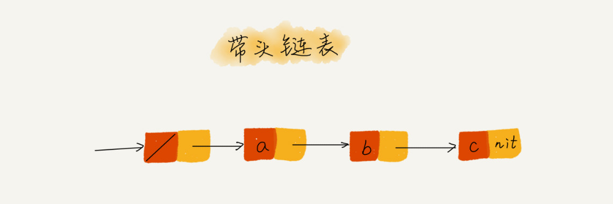

实际上，这种利用哨兵简化编程难度的技巧，在很多代码实现中都有用到，比如插入排序、归并排序、动态规划等。

代码一：

```
// 在数组a中，查找key，返回key所在的位置
// 其中，n表示数组a的长度
int find(char* a, int n, char key) {
  // 边界条件处理，如果a为空，或者n<=0，说明数组中没有数据，就不用while循环比较了
  if(a == null || n <= 0) {
    return -1;
  }
  
  int i = 0;
  // 这里有两个比较操作：i<n和a[i]==key.
  while (i < n) {
    if (a[i] == key) {
      return i;
    }
    ++i;
  }
  
  return -1;
}
```

代码二：

```
// 在数组a中，查找key，返回key所在的位置
// 其中，n表示数组a的长度
// 我举2个例子，你可以拿例子走一下代码
// a = {4, 2, 3, 5, 9, 6}  n=6 key = 7
// a = {4, 2, 3, 5, 9, 6}  n=6 key = 6
int find(char* a, int n, char key) {
  if(a == null || n <= 0) {
    return -1;
  }
  
  // 这里因为要将a[n-1]的值替换成key，所以要特殊处理这个值
  if (a[n-1] == key) {
    return n-1;
  }
  
  // 把a[n-1]的值临时保存在变量tmp中，以便之后恢复。tmp=6。
  // 之所以这样做的目的是：希望find()代码不要改变a数组中的内容
  char tmp = a[n-1];
  // 把key的值放到a[n-1]中，此时a = {4, 2, 3, 5, 9, 7}
  a[n-1] = key;
  
  int i = 0;
  // while 循环比起代码一，少了i<n这个比较操作
  while (a[i] != key) {
    ++i;
  }
  
  // 恢复a[n-1]原来的值,此时a= {4, 2, 3, 5, 9, 6}
  a[n-1] = tmp;
  
  if (i == n-1) {
    // 如果i == n-1说明，在0...n-2之间都没有key，所以返回-1
    return -1;
  } else {
    // 否则，返回i，就是等于key值的元素的下标
    return i;
  }
}
```

对比两段代码，在字符串a很长的时候，比如几万、几十万，你觉得哪段代码运行得更快点呢？答案是代码二，因为两段代码中执行次数最多就是while循环那一部分。第二段代码中，我们通过一个哨兵a[n-1] = key，成功省掉了一个比较语句i<n，不要小看这一条语句，当累积执行万次、几十万次时，累积的时间就很明显了。

当然，这只是为了举例说明哨兵的作用，你写代码的时候千万不要写第二段那样的代码，因为可读性太差了。大部分情况下，我们并不需要如此追求极致的性能。

#### 技巧四：重点留意边界条件处理

软件开发中，代码在一些边界或者异常情况下，最容易产生Bug。链表代码也不例外。要实现没有Bug的链表代码，一定要在编写的过程中以及编写完成之后，检查边界条件是否考虑全面，以及代码在边界条件下是否能正确运行。

我经常用来检查链表代码是否正确的边界条件有这样几个：

- 如果链表为空时，代码是否能正常工作？
- 如果链表只包含一个结点时，代码是否能正常工作？
- 如果链表只包含两个结点时，代码是否能正常工作？
- 代码逻辑在处理头结点和尾结点的时候，是否能正常工作？

当你写完链表代码之后，除了看下你写的代码在正常的情况下能否工作，还要看下在上面我列举的几个边界条件下，代码仍然能否正确工作。如果这些边界条件下都没有问题，那基本上可以认为没有问题了。

当然，边界条件不止我列举的那些。针对不同的场景，可能还有特定的边界条件，这个需要你自己去思考，不过套路都是一样的。

### 5个常见的链表操作

- 单链表反转
- 链表中环的检测
- 两个有序的链表合并
- 删除链表倒数第n个结点
- 求链表的中间结点

练习题LeetCode对应编号：206，141，21，19，876

## 栈

**后进者先出，先进者后出，这就是典型的“栈”结构。**

从栈的操作特性上来看，**栈是一种“操作受限”的线性表**，只允许在一端插入和删除数据。

事实上，从功能上来说，数组或链表确实可以替代栈，但你要知道，特定的数据结构是对特定场景的抽象，而且，数组或链表暴露了太多的操作接口，操作上的确灵活自由，但使用时就比较不可控，自然也就更容易出错。

**当某个数据集合只涉及在一端插入和删除数据，并且满足后进先出、先进后出的特性，我们就应该首选“栈”这种数据结构**。

### 如何实现一个“栈”？

实际上，栈既可以用数组来实现，也可以用链表来实现。用数组实现的栈，我们叫作**顺序栈**，用链表实现的栈，我们叫作**链式栈**。

```
// 基于数组实现的顺序栈
public class ArrayStack {
  private String[] items;  // 数组
  private int count;       // 栈中元素个数
  private int n;           //栈的大小

  // 初始化数组，申请一个大小为n的数组空间
  public ArrayStack(int n) {
    this.items = new String[n];
    this.n = n;
    this.count = 0;
  }

  // 入栈操作
  public boolean push(String item) {
    // 数组空间不够了，直接返回false，入栈失败。
    if (count == n) return false;
    // 将item放到下标为count的位置，并且count加一
    items[count] = item;
    ++count;
    return true;
  }
  
  // 出栈操作
  public String pop() {
    // 栈为空，则直接返回null
    if (count == 0) return null;
    // 返回下标为count-1的数组元素，并且栈中元素个数count减一
    String tmp = items[count-1];
    --count;
    return tmp;
  }
}
```

不管是顺序栈还是链式栈，我们存储数据只需要一个大小为n的数组就够了。在入栈和出栈过程中，只需要一两个临时变量存储空间，所以空间复杂度是O(1)。

注意，这里存储数据需要一个大小为n的数组，并不是说空间复杂度就是O(n)。因为，这n个空间是必须的，无法省掉。所以我们说空间复杂度的时候，是指除了原本的数据存储空间外，算法运行还需要额外的存储空间。

不管是顺序栈还是链式栈，入栈、出栈只涉及栈顶个别数据的操作，所以时间复杂度都是O(1)。

### 支持动态扩容的顺序栈

刚才那个基于数组实现的栈，是一个固定大小的栈，也就是说，在初始化栈时需要事先指定栈的大小。当栈满之后，就无法再往栈里添加数据了。尽管链式栈的大小不受限，但要存储next指针，内存消耗相对较多。

所以，如果要实现一个支持动态扩容的栈，我们只需要底层依赖一个支持动态扩容的数组就可以了。当栈满了之后，我们就申请一个更大的数组，将原来的数据搬移到新数组中。

实际上，支持动态扩容的顺序栈，我们平时开发中并不常用到。

对于出栈操作来说，我们不会涉及内存的重新申请和数据的搬移，所以出栈的时间复杂度仍然是O(1)。但是，对于入栈操作来说，情况就不一样了。当栈中有空闲空间时，入栈操作的时间复杂度为O(1)。但当空间不够时，就需要重新申请内存和数据搬移，所以时间复杂度就变成了O(n)。

也就是说，对于入栈操作来说，最好情况时间复杂度是O(1)，最坏情况时间复杂度是O(n)。这个入栈操作的平均情况下的时间复杂度可以用摊还分析法来分析。

为了分析的方便，我们需要事先做一些假设和定义：

- 栈空间不够时，我们重新申请一个是原来大小两倍的数组；
- 为了简化分析，假设只有入栈操作没有出栈操作；
- 定义不涉及内存搬移的入栈操作为simple-push操作，时间复杂度为O(1)。

如果当前栈大小为K，并且已满，当再有新的数据要入栈时，就需要重新申请2倍大小的内存，并且做K个数据的搬移操作，然后再入栈。但是，接下来的K-1次入栈操作，我们都不需要再重新申请内存和搬移数据，所以这K-1次入栈操作都只需要一个simple-push操作就可以完成。为了让你更加直观地理解这个过程，我画了一张图。

这K次入栈操作，总共涉及了K个数据的搬移，以及K次simple-push操作。将K个数据搬移均摊到K次入栈操作，那每个入栈操作只需要一个数据搬移和一个simple-push操作。以此类推，入栈操作的均摊时间复杂度就为O(1)。

通过这个例子的实战分析，也印证了前面讲到的，均摊时间复杂度一般都等于最好情况时间复杂度。因为在大部分情况下，入栈操作的时间复杂度O都是O(1)，只有在个别时刻才会退化为O(n)，所以把耗时多的入栈操作的时间均摊到其他入栈操作上，平均情况下的耗时就接近O(1)。

### 栈在函数调用中的应用

栈作为一个比较基础的数据结构，应用场景还是蛮多的。其中，比较经典的一个应用场景就是**函数调用栈**。

我们知道，操作系统给每个线程分配了一块独立的内存空间，这块内存被组织成“栈”这种结构,用来存储函数调用时的临时变量。每进入一个函数，就会将临时变量作为一个栈帧入栈，当被调用函数执行完成，返回之后，将这个函数对应的栈帧出栈。

### 栈在表达式求值中的应用

栈的另一个常见的应用场景，编译器如何利用栈来实现**表达式求值**。

实际上，编译器就是通过两个栈来实现的。其中一个保存操作数的栈，另一个是保存运算符的栈。我们从左向右遍历表达式，当遇到数字，我们就直接压入操作数栈；当遇到运算符，就与运算符栈的栈顶元素进行比较。

如果比运算符栈顶元素的优先级高，就将当前运算符压入栈；如果比运算符栈顶元素的优先级低或者相同，从运算符栈中取栈顶运算符，从操作数栈的栈顶取2个操作数，然后进行计算，再把计算完的结果压入操作数栈，继续比较。

我将3+5*8-6这个表达式的计算过程画成了一张图，可以结合图来理解我刚讲的计算过程。


## 队列

**先进者先出，这就是典型的“队列”**。

我们知道，栈只支持两个基本操作：**入栈push()和出栈pop()**。队列跟栈非常相似，支持的操作也很有限，最基本的操作也是两个：**入队enqueue()**，放一个数据到队列尾部；**出队dequeue()**，从队列头部取一个元素。

队列跟栈一样，也是一种**操作受限的线性表数据结构**。

队列的概念很好理解，基本操作也很容易掌握。作为一种非常基础的数据结构，队列的应用也非常广泛，特别是一些具有某些额外特性的队列，比如循环队列、阻塞队列、并发队列。它们在很多偏底层系统、框架、中间件的开发中，起着关键性的作用。比如高性能队列Disruptor、Linux环形缓存，都用到了循环并发队列；Java concurrent并发包利用ArrayBlockingQueue来实现公平锁等。

### 顺序队列和链式队列

跟栈一样，队列可以用数组来实现，也可以用链表来实现。用数组实现的栈叫作顺序栈，用链表实现的栈叫作链式栈。同样，用数组实现的队列叫作**顺序队列**，用链表实现的队列叫作**链式队列**。

```
// 用数组实现的队列
public class ArrayQueue {
  // 数组：items，数组大小：n
  private String[] items;
  private int n = 0;
  // head表示队头下标，tail表示队尾下标
  private int head = 0;
  private int tail = 0;

  // 申请一个大小为capacity的数组
  public ArrayQueue(int capacity) {
    items = new String[capacity];
    n = capacity;
  }

  // 入队操作，将item放入队尾
  public boolean enqueue(String item) {
    // tail == n表示队列末尾没有空间了
    if (tail == n) {
      // tail ==n && head==0，表示整个队列都占满了
      if (head == 0) return false;
      // 数据搬移
      for (int i = head; i < tail; ++i) {
        items[i-head] = items[i];
      }
      // 搬移完之后重新更新head和tail
      tail -= head;
      head = 0;
    }
    
    items[tail] = item;
    ++tail;
    return true;
  }

  // 出队
  public String dequeue() {
    // 如果head == tail 表示队列为空
    if (head == tail) return null;
    // 为了让其他语言的同学看的更加明确，把--操作放到单独一行来写了
    String ret = items[head];
    ++head;
    return ret;
  }
}
```

再来看下**基于链表的队列实现方法**。

基于链表的实现，我们同样需要两个指针：head指针和tail指针。它们分别指向链表的第一个结点和最后一个结点。如图所示，入队时，tail->next= new_node, tail = tail->next；出队时，head = head->next。


```
public class LinkedQueue {
	//定义一个节点类
	private class Node{
		String value;
		Node next;
	}
	//记录队列元素个数
	private int size = 0;
	//head指向队头结点，tail指向队尾节点
	private Node head;
	private Node tail;
	//申请一个队列
	public LinkedQueue(){}
	//入队
	public boolean enqueue(String item){
		Node newNode = new Node();
		newNode.value = item;
		if (size == 0) head = newNode;
			else tail.next = newNode;
			tail = newNode;
			size++;
		return true;
	}
	//出队
	public String dequeue(){
		String res = null;
		if(size == 0) return res;
		if(size == 1) tail = null;
		res = head.value;
		head = head.next;
		size--;
		return res;
	}
}
```


### 循环队列

我们刚才用数组来实现队列的时候，在tail==n时，会有数据搬移操作，这样入队操作性能就会受到影响。那有没有办法能够避免数据搬移呢？我们来看看循环队列的解决思路。

循环队列，顾名思义，它长得像一个环。原本数组是有头有尾的，是一条直线。现在我们把首尾相连，扳成了一个环。


图中这个队列的大小为8，当前head=4，tail=7。当有一个新的元素a入队时，我们放入下标为7的位置。但这个时候，我们并不把tail更新为8，而是将其在环中后移一位，到下标为0的位置。当再有一个元素b入队时，我们将b放入下标为0的位置，然后tail加1更新为1。所以，在a，b依次入队之后，循环队列中的元素就变成了下面的样子：


通过这样的方法，我们成功避免了数据搬移操作。看起来不难理解，但是循环队列的代码实现难度要比前面讲的非循环队列难多了。要想写出没有bug的循环队列的实现代码，关键的是，**确定好队空和队满的判定条件**。

在用数组实现的非循环队列中，队满的判断条件是tail == n，队空的判断条件是head == tail。那针对循环队列，如何判断队空和队满呢？

队列为空的判断条件仍然是head == tail。但队列满的判断条件就稍微有点复杂了。画了一张队列满的图


就像我图中画的队满的情况，tail=3，head=4，n=8，所以总结一下规律就是：(3+1)%8=4。多画几张队满的图，你就会发现，当队满时，**(tail+1)%n=head**。

当队列满时，图中的tail指向的位置实际上是没有存储数据的。所以，循环队列会浪费一个数组的存储空间。

```
public class CircularQueue {
  // 数组：items，数组大小：n
  private String[] items;
  private int n = 0;
  // head表示队头下标，tail表示队尾下标
  private int head = 0;
  private int tail = 0;

  // 申请一个大小为capacity的数组
  public CircularQueue(int capacity) {
    items = new String[capacity];
    n = capacity;
  }

  // 入队
  public boolean enqueue(String item) {
    // 队列满了
    if ((tail + 1) % n == head) return false;
    items[tail] = item;
    tail = (tail + 1) % n;
    return true;
  }

  // 出队
  public String dequeue() {
    // 如果head == tail 表示队列为空
    if (head == tail) return null;
    String ret = items[head];
    head = (head + 1) % n;
    return ret;
  }
}
```

### 阻塞队列和并发队列

**阻塞队列**其实就是在队列基础上增加了阻塞操作。简单来说，就是在队列为空的时候，从队头取数据会被阻塞。因为此时还没有数据可取，直到队列中有了数据才能返回；如果队列已经满了，那么插入数据的操作就会被阻塞，直到队列中有空闲位置后再插入数据，然后再返回。


你应该已经发现了，上述的定义就是一个“生产者-消费者模型”！

这种基于阻塞队列实现的“生产者-消费者模型”，可以有效地协调生产和消费的速度。当“生产者”生产数据的速度过快，“消费者”来不及消费时，存储数据的队列很快就会满了。这个时候，生产者就阻塞等待，直到“消费者”消费了数据，“生产者”才会被唤醒继续“生产”。

而且不仅如此，基于阻塞队列，我们还可以通过协调“生产者”和“消费者”的个数，来提高数据的处理效率。比如前面的例子，我们可以多配置几个“消费者”，来应对一个“生产者”。


前面我们讲了阻塞队列，在多线程情况下，会有多个线程同时操作队列，这个时候就会存在线程安全问题，那如何实现一个线程安全的队列呢？

线程安全的队列我们叫作**并发队列**。最简单直接的实现方式是直接在enqueue()、dequeue()方法上加锁，但是锁粒度大并发度会比较低，同一时刻仅允许一个存或者取操作。实际上，基于数组的循环队列，利用CAS原子操作，可以实现非常高效的并发队列。这也是循环队列比链式队列应用更加广泛的原因。

### 练习

#### 线程池没有空闲线程时，新的任务请求线程资源时，线程池该如何处理？各种处理策略又是如何实现的呢？

我们一般有两种处理策略。第一种是非阻塞的处理方式，直接拒绝任务请求；另一种是阻塞的处理方式，将请求排队，等到有空闲线程时，取出排队的请求继续处理。那如何存储排队的请求呢？

我们希望公平地处理每个排队的请求，先进者先服务，所以队列这种数据结构很适合来存储排队请求。我们前面说过，队列有基于链表和基于数组这两种实现方式。这两种实现方式对于排队请求又有什么区别呢？

基于链表的实现方式，可以实现一个支持无限排队的无界队列（unbounded queue），但是可能会导致过多的请求排队等待，请求处理的响应时间过长。所以，针对响应时间比较敏感的系统，基于链表实现的无限排队的线程池是不合适的。

而基于数组实现的有界队列（bounded queue），队列的大小有限，所以线程池中排队的请求超过队列大小时，接下来的请求就会被拒绝，这种方式对响应时间敏感的系统来说，就相对更加合理。不过，设置一个合理的队列大小，也是非常有讲究的。队列太大导致等待的请求太多，队列太小会导致无法充分利用系统资源、发挥最大性能。

除了前面讲到队列应用在线程池请求排队的场景之外，队列可以应用在任何有限资源池中，用于排队请求，比如数据库连接池等。**实际上，对于大部分资源有限的场景，当没有空闲资源时，基本上都可以通过“队列”这种数据结构来实现请求排队**

## 递归

递归是一种应用非常广泛的算法（或者编程技巧）。之后我们要讲的很多数据结构和算法的编码实现都要用到递归，比如DFS深度优先搜索、前中后序二叉树遍历等等。所以，搞懂递归非常重要，否则，后面复杂一些的数据结构和算法学起来就会比较吃力。

### 递归需要满足的三个条件

只要同时满足以下三个条件，就可以用递归来解决。

**1.一个问题的解可以分解为几个子问题的解**

何为子问题？子问题就是数据规模更小的问题。比如，前面讲的电影院的例子，你要知道，“自己在哪一排”的问题，可以分解为“前一排的人在哪一排”这样一个子问题。

**2.这个问题与分解之后的子问题，除了数据规模不同，求解思路完全一样**

比如电影院那个例子，你求解“自己在哪一排”的思路，和前面一排人求解“自己在哪一排”的思路，是一模一样的。

**3.存在递归终止条件**

把问题分解为子问题，把子问题再分解为子子问题，一层一层分解下去，不能存在无限循环，这就需要有终止条件。

还是电影院的例子，第一排的人不需要再继续询问任何人，就知道自己在哪一排，也就是f(1)=1，这就是递归的终止条件。

**写递归代码的关键就是找到如何将大问题分解为小问题的规律，并且基于此写出递推公式，然后再推敲终止条件，最后将递推公式和终止条件翻译成代码**。

**编写递归代码的关键是，只要遇到递归，我们就把它抽象成一个递推公式，不用想一层层的调用关系，不要试图用人脑去分解递归的每个步骤**。

### 递归代码要警惕堆栈溢出

在实际的软件开发中，编写递归代码时，我们会遇到很多问题，比如堆栈溢出。而堆栈溢出会造成系统性崩溃，后果会非常严重。为什么递归代码容易造成堆栈溢出呢？我们又该如何预防堆栈溢出呢？

函数调用会使用栈来保存临时变量。每调用一个函数，都会将临时变量封装为栈帧压入内存栈，等函数执行完成返回时，才出栈。系统栈或者虚拟机栈空间一般都不大。如果递归求解的数据规模很大，调用层次很深，一直压入栈，就会有堆栈溢出的风险。

### 递归代码要警惕重复计算

除此之外，使用递归时还会出现重复计算的问题。如下图求解f(n) = f(n-1)+f(n-2)


为了避免重复计算，我们可以通过一个数据结构（比如散列表）来保存已经求解过的f(k)。当递归调用到f(k)时，先看下是否已经求解过了。如果是，则直接从散列表中取值返回，不需要重复计算，这样就能避免刚讲的问题了。

按照上面的思路，我们来改造一下代码：

```
public int f(int n) {
  if (n == 1) return 1;
  if (n == 2) return 2;
  
  // hasSolvedList可以理解成一个Map，key是n，value是f(n)
  if (hasSolvedList.containsKey(n)) {
    return hasSovledList.get(n);
  }
  
  int ret = f(n-1) + f(n-2);
  hasSovledList.put(n, ret);
  return ret;
}
```

在时间效率上，递归代码里多了很多函数调用，当这些函数调用的数量较大时，就会积聚成一个可观的时间成本。在空间复杂度上，因为递归调用一次就会在内存栈中保存一次现场数据，所以在分析递归代码空间复杂度时，需要额外考虑这部分的开销，比如我们前面讲到的电影院递归代码，空间复杂度并不是O(1)，而是O(n)。

### 怎么将递归代码改写为非递归代码？

我们刚说了，递归有利有弊，利是递归代码的表达力很强，写起来非常简洁；而弊就是空间复杂度高、有堆栈溢出的风险、存在重复计算、过多的函数调用会耗时较多等问题。所以，在开发过程中，我们要根据实际情况来选择是否需要用递归的方式来实现。

那我们是否可以把递归代码改写为非递归代码呢？比如刚才那个电影院的例子，我们抛开场景，只看f(x) =f(x-1)+1这个递推公式。我们这样改写看看：

```
int f(int n) {
  int ret = 1;
  for (int i = 2; i <= n; ++i) {
    ret = ret + 1;
  }
  return ret;
}
```

### 调试递归

1.打印日志发现，递归值。
2.结合条件断点进行调试。

## 排序

排序算法太多了，有很多可能你连名字都没听说过，比如猴子排序、睡眠排序、面条排序等。我只讲众多排序算法中的一小撮，也是最经典的、最常用的：冒泡排序、插入排序、选择排序、归并排序、快速排序、计数排序、基数排序、桶排序。我按照时间复杂度把它们分成了三类。


### 如何分析一个“排序算法”？

#### 排序算法的执行效率

对于排序算法执行效率的分析，我们一般会从这几个方面来衡量：

**1.最好情况、最坏情况、平均情况时间复杂度**

我们在分析排序算法的时间复杂度时，要分别给出最好情况、最坏情况、平均情况下的时间复杂度。除此之外，你还要说出最好、最坏时间复杂度对应的要排序的原始数据是什么样的。

为什么要区分这三种时间复杂度呢？第一，有些排序算法会区分，为了好对比，所以我们最好都做一下区分。第二，对于要排序的数据，有的接近有序，有的完全无序。有序度不同的数据，对于排序的执行时间肯定是有影响的，我们要知道排序算法在不同数据下的性能表现。

**2.时间复杂度的系数、常数 、低阶**

我们知道，时间复杂度反应的是数据规模n很大的时候的一个增长趋势，所以它表示的时候会忽略系数、常数、低阶。但是实际的软件开发中，我们排序的可能是10个、100个、1000个这样规模很小的数据，所以，在对同一阶时间复杂度的排序算法性能对比的时候，我们就要把系数、常数、低阶也考虑进来。

**3.比较次数和交换（或移动）次数**

基于比较的排序算法的执行过程，会涉及两种操作，一种是元素比较大小，另一种是元素交换或移动。所以，如果我们在分析排序算法的执行效率的时候，应该把比较次数和交换（或移动）次数也考虑进去。

#### 排序算法的内存消耗

我们前面讲过，算法的内存消耗可以通过空间复杂度来衡量，排序算法也不例外。不过，针对排序算法的空间复杂度，我们还引入了一个新的概念，**原地排序**（Sorted in place）。原地排序算法，就是特指空间复杂度是O(1)的排序算法。

#### 排序算法的稳定性

仅仅用执行效率和内存消耗来衡量排序算法的好坏是不够的。针对排序算法，我们还有一个重要的度量指标，**稳定性**。这个概念是说，如果待排序的序列中存在值相等的元素，经过排序之后，相等元素之间原有的先后顺序不变。

我通过一个例子来解释一下。比如我们有一组数据2，9，3，4，8，3，按照大小排序之后就是2，3，3，4，8，9。

这组数据里有两个3。经过某种排序算法排序之后，如果两个3的前后顺序没有改变，那我们就把这种排序算法叫作**稳定的排序算法**；如果前后顺序发生变化，那对应的排序算法就叫作**不稳定的排序算法**。

你可能要问了，两个3哪个在前，哪个在后有什么关系啊，稳不稳定又有什么关系呢？为什么要考察排序算法的稳定性呢？

很多数据结构和算法课程，在讲排序的时候，都是用整数来举例，但在真正软件开发中，我们要排序的往往不是单纯的整数，而是一组对象，我们需要按照对象的某个key来排序。

比如说，我们现在要给电商交易系统中的“订单”排序。订单有两个属性，一个是下单时间，另一个是订单金额。如果我们现在有10万条订单数据，我们希望按照金额从小到大对订单数据排序。对于金额相同的订单，我们希望按照下单时间从早到晚有序。对于这样一个排序需求，我们怎么来做呢？

最先想到的方法是：我们先按照金额对订单数据进行排序，然后，再遍历排序之后的订单数据，对于每个金额相同的小区间再按照下单时间排序。这种排序思路理解起来不难，但是实现起来会很复杂。

借助稳定排序算法，这个问题可以非常简洁地解决。解决思路是这样的：我们先按照下单时间给订单排序，注意是按照下单时间，不是金额。排序完成之后，我们用稳定排序算法，按照订单金额重新排序。两遍排序之后，我们得到的订单数据就是按照金额从小到大排序，金额相同的订单按照下单时间从早到晚排序的。为什么呢？

**稳定排序算法可以保持金额相同的两个对象，在排序之后的前后顺序不变**。第一次排序之后，所有的订单按照下单时间从早到晚有序了。在第二次排序中，我们用的是稳定的排序算法，所以经过第二次排序之后，相同金额的订单仍然保持下单时间从早到晚有序。

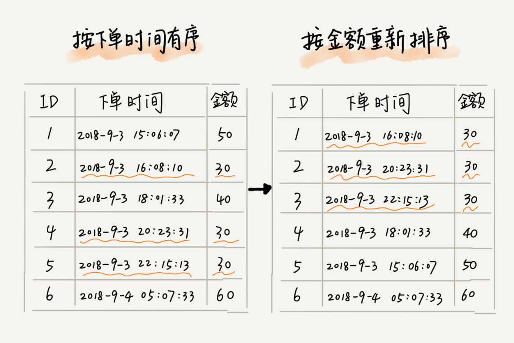

### 冒泡排序（Bubble Sort）

冒泡排序只会操作相邻的两个数据。每次冒泡操作都会对相邻的两个元素进行比较，看是否满足大小关系要求。如果不满足就让它俩互换。一次冒泡会让至少一个元素移动到它应该在的位置，重复n次，就完成了n个数据的排序工作。

我们要对一组数据4，5，6，3，2，1，从小到到大进行排序。第一次冒泡操作的详细过程就是这样：


冒泡过程还可以优化。当某次冒泡操作已经没有数据交换时，说明已经达到完全有序，不用再继续执行后续的冒泡操作。


```
// 冒泡排序，a表示数组，n表示数组大小
public void bubbleSort(int[] a, int n) {
  if (n <= 1) return;
 
 for (int i = 0; i < n; ++i) {
    // 提前退出冒泡循环的标志位
    boolean flag = false;
    for (int j = 0; j < n - i - 1; ++j) {
      if (a[j] > a[j+1]) { // 交换
        int tmp = a[j];
        a[j] = a[j+1];
        a[j+1] = tmp;
        flag = true;  // 表示有数据交换      
      }
    }
    if (!flag) break;  // 没有数据交换，提前退出
  }
}
```

**第一，冒泡排序是原地排序算法吗？**

冒泡的过程只涉及相邻数据的交换操作，只需要常量级的临时空间，所以它的空间复杂度为O(1)，是一个原地排序算法。

**第二，冒泡排序是稳定的排序算法吗？**

在冒泡排序中，只有交换才可以改变两个元素的前后顺序。为了保证冒泡排序算法的稳定性，当有相邻的两个元素大小相等的时候，我们不做交换，相同大小的数据在排序前后不会改变顺序，所以冒泡排序是稳定的排序算法。

**第三，冒泡排序的时间复杂度是多少？**

最好情况下，要排序的数据已经是有序的了，我们只需要进行一次冒泡操作，就可以结束了，所以最好情况时间复杂度是O(n)。而最坏的情况是，要排序的数据刚好是倒序排列的，我们需要进行n次冒泡操作，所以最坏情况时间复杂度为O(n^2^)。

最好、最坏情况下的时间复杂度很容易分析，那平均情况下的时间复杂是多少呢？我们前面讲过，平均时间复杂度就是加权平均期望时间复杂度，分析的时候要结合概率论的知识。

对于包含n个数据的数组，这n个数据就有n!种排列方式。不同的排列方式，冒泡排序执行的时间肯定是不同的。比如我们前面举的那两个例子，其中一个要进行6次冒泡，而另一个只需要4次。如果用概率论方法定量分析平均时间复杂度，涉及的数学推理和计算就会很复杂。我这里还有一种思路，通过“**有序度**”和“**逆序度**”这两个概念来进行分析。

**有序度**是数组中具有有序关系的元素对的个数。有序元素对用数学表达式表示就是这样：

```
有序元素对：a[i] <= a[j], 如果i < j。
```


同理，对于一个倒序排列的数组，比如6，5，4，3，2，1，有序度是0；对于一个完全有序的数组，比如1，2，3，4，5，6，有序度就是**n\*(n-1)/2**，也就是15。我们把这种完全有序的数组的有序度叫作**满有序度**。

逆序度的定义正好跟有序度相反（默认从小到大为有序）

```
逆序元素对：a[i] > a[j], 如果i < j。
```

我们还可以得到一个公式：**逆序度=满有序度-有序度**。我们排序的过程就是一种增加有序度，减少逆序度的过程，最后达到满有序度，就说明排序完成了。

我还是拿前面举的那个冒泡排序的例子来说明。要排序的数组的初始状态是4，5，6，3，2，1 ，其中，有序元素对有(4，5) (4，6)(5，6)，所以有序度是3。n=6，所以排序完成之后终态的满有序度为n*(n-1)/2=15。


冒泡排序包含两个操作原子，**比较**和**交换**。每交换一次，有序度就加1。不管算法怎么改进，交换次数总是确定的，即为**逆序度，也就是n*(n-1)/2–初始有序度**。此例中就是15–3=12，要进行12次交换操作。

对于包含n个数据的数组进行冒泡排序，平均交换次数是多少呢？最坏情况下，初始状态的有序度是0，所以要进行n(n-1)/2次交换。最好情况下，初始状态的有序度是n(n-1)/2，就不需要进行交换。我们可以取个中间值n*(n-1)/4，来表示初始有序度既不是很高也不是很低的平均情况。

换句话说，平均情况下，需要n*(n-1)/4次交换操作，比较操作肯定要比交换操作多，而复杂度的上限是O(n^2^)，所以平均情况下的时间复杂度就是O(n^2^)。

### 插入排序（Insertion Sort）

我们先来看一个问题。一个有序的数组，我们往里面添加一个新的数据后，如何继续保持数据有序呢？很简单，我们只要遍历数组，找到数据应该插入的位置将其插入即可。

这是一个动态排序的过程，即动态地往有序集合中添加数据，我们可以通过这种方法保持集合中的数据一直有序。而对于一组静态数据，我们也可以借鉴上面讲的插入方法，来进行排序，于是就有了插入排序算法。

那**插入排序具体是如何借助上面的思想来实现排序的呢**？

首先，我们将数组中的数据分为两个区间，**已排序区间**和**未排序区间**。初始已排序区间只有一个元素，就是数组的第一个元素。插入算法的核心思想是取未排序区间中的元素，在已排序区间中找到合适的插入位置将其插入，并保证已排序区间数据一直有序。重复这个过程，直到未排序区间中元素为空，算法结束。

如图所示，要排序的数据是4，5，6，1，3，2，其中左侧为已排序区间，右侧是未排序区间。


插入排序也包含两种操作，一种是**元素的比较**，一种是**元素的移动**。当我们需要将一个数据a插入到已排序区间时，需要拿a与已排序区间的元素依次比较大小，找到合适的插入位置。找到插入点之后，我们还需要将插入点之后的元素顺序往后移动一位，这样才能腾出位置给元素a插入。

对于不同的查找插入点方法（从头到尾、从尾到头），元素的比较次数是有区别的。但对于一个给定的初始序列，移动操作的次数总是固定的，就等于逆序度。

为什么说移动次数就等于逆序度呢？我拿刚才的例子画了一个图表，你一看就明白了。满有序度是n*(n-1)/2=15，初始序列的有序度是5，所以逆序度是10。插入排序中，数据移动的个数总和也等于10=3+3+4。


```
// 插入排序，a表示数组，n表示数组大小
public void insertionSort(int[] a, int n) {
  if (n <= 1) return;

  for (int i = 1; i < n; ++i) {
    int value = a[i];
    int j = i - 1;
    // 查找插入的位置
    for (; j >= 0; --j) {
      if (a[j] > value) {
        a[j+1] = a[j];  // 数据移动
      } else {
        break;
      }
    }
    a[j+1] = value; // 插入数据
  }
}
```

**第一，插入排序是原地排序算法吗？**

从实现过程可以很明显地看出，插入排序算法的运行并不需要额外的存储空间，所以空间复杂度是O(1)，也就是说，这是一个原地排序算法。

**第二，插入排序是稳定的排序算法吗？**

在插入排序中，对于值相同的元素，我们可以选择将后面出现的元素，插入到前面出现元素的后面，这样就可以保持原有的前后顺序不变，所以插入排序是稳定的排序算法。

**第三，插入排序的时间复杂度是多少？**

如果要排序的数据已经是有序的，我们并不需要搬移任何数据。如果我们从尾到头在有序数据组里面查找插入位置，每次只需要比较一个数据就能确定插入的位置。所以这种情况下，最好是时间复杂度为O(n)。注意，这里是**从尾到头遍历已经有序的数据**。

如果数组是倒序的，每次插入都相当于在数组的第一个位置插入新的数据，所以需要移动大量的数据，所以最坏情况时间复杂度为O(n^2^)。

还记得我们在数组中插入一个数据的平均时间复杂度是多少吗？没错，是O(n)。所以，对于插入排序来说，每次插入操作都相当于在数组中插入一个数据，循环执行n次插入操作，所以平均时间复杂度为O(n^2^)。

### 选择排序（Selection Sort）

选择排序算法的实现思路有点类似插入排序，也分已排序区间和未排序区间。但是选择排序每次会从未排序区间中找到最小的元素，将其放到已排序区间的末尾。


首先，选择排序空间复杂度为O(1)，是一种原地排序算法。选择排序的最好情况时间复杂度、最坏情况和平均情况时间复杂度都为O(n^2^)。你可以自己来分析看看。

那选择排序是稳定的排序算法吗？

答案是否定的，选择排序是一种不稳定的排序算法。从我前面画的那张图中，你可以看出来，选择排序每次都要找剩余未排序元素中的最小值，并和前面的元素交换位置，这样破坏了稳定性。

比如5，8，5，2，9这样一组数据，使用选择排序算法来排序的话，第一次找到最小元素2，与第一个5交换位置，那第一个5和中间的5顺序就变了，所以就不稳定了。正是因此，相对于冒泡排序和插入排序，选择排序就稍微逊色了。

### 为什么插入排序要比冒泡排序更受欢迎呢？

冒泡排序和插入排序的时间复杂度都是O(n^2^)，都是原地排序算法

我们前面分析冒泡排序和插入排序的时候讲到，冒泡排序不管怎么优化，元素交换的次数是一个固定值，是原始数据的逆序度。插入排序是同样的，不管怎么优化，元素移动的次数也等于原始数据的逆序度。

但是，从代码实现上来看，冒泡排序的数据交换要比插入排序的数据移动要复杂，冒泡排序需要3个赋值操作，而插入排序只需要1个。我们来看这段操作：

```
冒泡排序中数据的交换操作：
if (a[j] > a[j+1]) { // 交换
   int tmp = a[j];
   a[j] = a[j+1];
   a[j+1] = tmp;
   flag = true;
}

插入排序中数据的移动操作：
if (a[j] > value) {
  a[j+1] = a[j];  // 数据移动
} else {
  break;
}
```

我们把执行一个赋值语句的时间粗略地计为单位时间（unit_time），然后分别用冒泡排序和插入排序对同一个逆序度是K的数组进行排序。用冒泡排序，需要K次交换操作，每次需要3个赋值语句，所以交换操作总耗时就是3*K单位时间。而插入排序中数据移动操作只需要K个单位时间。

这个只是我们非常理论的分析，为了实验，针对上面的冒泡排序和插入排序的Java代码，我写了一个性能对比测试程序，随机生成10000个数组，每个数组中包含200个数据，然后在我的机器上分别用冒泡和插入排序算法来排序，冒泡排序算法大约700ms才能执行完成，而插入排序只需要100ms左右就能搞定！

所以，虽然冒泡排序和插入排序在时间复杂度上是一样的，都是O(n^2^)，但是如果我们希望把性能优化做到极致，那肯定首选插入排序。插入排序的算法思路也有很大的优化空间，我们只是讲了最基础的一种。如果你对插入排序的优化感兴趣，可以自行学习一下[希尔排序](https://zh.wikipedia.org/wiki/希尔排序)。


### 练习

#### 如果数据存储在链表中，冒泡，选择，插入排序算法还能工作吗？如果能，那相应的时间、空间复杂度又是多少呢？

有个前提，是否允许修改链表的节点value值，还是只能改变节点的位置。一般而言，考虑只能改变节点位置，冒泡排序相比于数组实现，比较次数一致，但交换时操作更复杂；插入排序，比较次数一致，不需要再有后移操作，找到位置后可以直接插入，但排序完毕后可能需要倒置链表；选择排序比较次数一致，交换操作同样比较麻烦。综上，时间复杂度和空间复杂度并无明显变化，若追求极致性能，冒泡排序的时间复杂度系数会变大，插入排序系数会减小，选择排序无明显变化。

### 归并排序

归并排序的核心思想还是蛮简单的。如果要排序一个数组，我们先把数组从中间分成前后两部分，然后对前后两部分分别排序，再将排好序的两部分合并在一起，这样整个数组就都有序了。


归并排序使用的就是**分治思想**。分治，顾名思义，就是分而治之，将一个大问题分解成小的子问题来解决。小的子问题解决了，大问题也就解决了。

分治算法一般都是用递归来实现的。**分治是一种解决问题的处理思想，递归是一种编程技巧**，这两者并不冲突。

```
递推公式：
merge_sort(p…r) = merge(merge_sort(p…q), merge_sort(q+1…r))

终止条件：
p >= r 不用再继续分解
```

merge_sort(p…r)表示，给下标从p到r之间的数组排序。我们将这个排序问题转化为了两个子问题，merge_sort(p…q)和merge_sort(q+1…r)，其中下标q等于p和r的中间位置，也就是(p+r)/2。当下标从p到q和从q+1到r这两个子数组都排好序之后，我们再将两个有序的子数组合并在一起，这样下标从p到r之间的数据就也排好序了。

伪代码如下：

```
// 归并排序算法, A是数组，n表示数组大小
merge_sort(A, n) {
  merge_sort_c(A, 0, n-1)
}

// 递归调用函数
merge_sort_c(A, p, r) {
  // 递归终止条件
  if p >= r  then return

  // 取p到r之间的中间位置q
  q = (p+r) / 2
  // 分治递归
  merge_sort_c(A, p, q)
  merge_sort_c(A, q+1, r)
  // 将A[p...q]和A[q+1...r]合并为A[p...r]
  merge(A[p...r], A[p...q], A[q+1...r])
}

merge(A[p...r], A[p...q], A[q+1...r]) {
  var i := p，j := q+1，k := 0 // 初始化变量i, j, k
  var tmp := new array[0...r-p] // 申请一个大小跟A[p...r]一样的临时数组
  while i<=q AND j<=r do {
    if A[i] <= A[j] {
      tmp[k++] = A[i++] // i++等于i:=i+1
    } else {
      tmp[k++] = A[j++]
    }
  }
  
  
  // 判断哪个子数组中有剩余的数据
  var start := i，end := q
  if j<=r then start := j, end:=r
  
  // 将剩余的数据拷贝到临时数组tmp
  while start <= end do {
    tmp[k++] = A[start++]
  }
  
  // 将tmp中的数组拷贝回A[p...r]
  for i:=0 to r-p do {
    A[p+i] = tmp[i]
  }
}
```

merge(A[p…r], A[p…q], A[q+1…r])这个函数的作用就是，将已经有序的A[p…q]和A[q+1…r]合并成一个有序的数组，并且放入A[p…r]。那这个过程具体该如何做呢？

如图所示，我们申请一个临时数组tmp，大小与A[p…r]相同。我们用两个游标i和j，分别指向A[p…q]和A[q+1…r]的第一个元素。比较这两个元素A[i]和A[j]，如果A[i]<=A[j]，我们就把A[i]放入到临时数组tmp，并且i后移一位，否则将A[j]放入到数组tmp，j后移一位。

继续上述比较过程，直到其中一个子数组中的所有数据都放入临时数组中，再把另一个数组中的数据依次加入到临时数组的末尾，这个时候，临时数组中存储的就是两个子数组合并之后的结果了。最后再把临时数组tmp中的数据拷贝到原数组A[p…r]中。


#### 归并排序的性能分析

**第一，归并排序是稳定的排序算法吗？**

结合我前面画的那张图和归并排序的伪代码，你应该能发现，归并排序稳不稳定关键要看merge()函数，也就是两个有序子数组合并成一个有序数组的那部分代码。

在合并的过程中，如果A[p…q]和A[q+1…r]之间有值相同的元素，那我们可以像伪代码中那样，先把A[p…q]中的元素放入tmp数组。这样就保证了值相同的元素，在合并前后的先后顺序不变。所以，归并排序是一个稳定的排序算法。

**第二，归并排序的时间复杂度是多少？**

在递归那一节我们讲过，递归的适用场景是，一个问题a可以分解为多个子问题b、c，那求解问题a就可以分解为求解问题b、c。问题b、c解决之后，我们再把b、c的结果合并成a的结果。

如果我们定义求解问题a的时间是T(a)，求解问题b、c的时间分别是T(b)和 T( c)，那我们就可以得到这样的递推关系式：

```
T(a) = T(b) + T(c) + K
```

其中K等于将两个子问题b、c的结果合并成问题a的结果所消耗的时间。

从刚刚的分析，我们可以得到一个重要的结论：**不仅递归求解的问题可以写成递推公式，递归代码的时间复杂度也可以写成递推公式。**

套用这个公式，我们来分析一下归并排序的时间复杂度。

我们假设对n个元素进行归并排序需要的时间是T(n)，那分解成两个子数组排序的时间都是T(n/2)。我们知道，merge()函数合并两个有序子数组的时间复杂度是O(n)。所以，套用前面的公式，归并排序的时间复杂度的计算公式就是：

```
T(1) = C；   n=1时，只需要常量级的执行时间，所以表示为C。
T(n) = 2*T(n/2) + n； n>1

T(n) = 2*T(n/2) + n
     = 2*(2*T(n/4) + n/2) + n = 4*T(n/4) + 2*n
     = 4*(2*T(n/8) + n/4) + 2*n = 8*T(n/8) + 3*n
     = 8*(2*T(n/16) + n/8) + 3*n = 16*T(n/16) + 4*n
     ......
     = 2^k * T(n/2^k) + k * n
     ......
```

当T(n/2^k^)=T(1)时，也就是n/2^k^=1，我们得到k=log2n 。我们将k值代入上面的公式，得到T(n)=Cn+n*log2n 。如果我们用大O标记法来表示的话，T(n)就等于O(nlogn)。所以归并排序的时间复杂度是O(nlogn)。

从我们的原理分析和伪代码可以看出，归并排序的执行效率与要排序的原始数组的有序程度无关，所以其时间复杂度是非常稳定的，不管是最好情况、最坏情况，还是平均情况，时间复杂度都是O(nlogn)。

**第三，归并排序的空间复杂度是多少？**

归并排序的时间复杂度任何情况下都是O(nlogn)，看起来非常优秀。（待会儿你会发现，即便是快速排序，最坏情况下，时间复杂度也是O(n^2^)。）但是，归并排序并没有像快排那样，应用广泛，这是为什么呢？因为它有一个致命的“弱点”，那就是归并排序不是原地排序算法。

这是因为归并排序的合并函数，在合并两个有序数组为一个有序数组时，需要借助额外的存储空间。这一点你应该很容易理解。

实际上，递归代码的空间复杂度并不能像时间复杂度那样累加。刚刚我们忘记了最重要的一点，那就是，尽管每次合并操作都需要申请额外的内存空间，但在合并完成之后，临时开辟的内存空间就被释放掉了。在任意时刻，CPU只会有一个函数在执行，也就只会有一个临时的内存空间在使用。临时内存空间最大也不会超过n个数据的大小，所以空间复杂度是O(n)。

### 快速排序

快排的思想是这样的：如果要排序数组中下标从p到r之间的一组数据，我们选择p到r之间的任意一个数据作为pivot（分区点）。

我们遍历p到r之间的数据，将小于pivot的放到左边，将大于pivot的放到右边，将pivot放到中间。经过这一步骤之后，数组p到r之间的数据就被分成了三个部分，前面p到q-1之间都是小于pivot的，中间是pivot，后面的q+1到r之间是大于pivot的。


根据分治、递归的处理思想，我们可以用递归排序下标从p到q-1之间的数据和下标从q+1到r之间的数据，直到区间缩小为1，就说明所有的数据都有序了。

如果我们用递推公式来将上面的过程写出来的话，就是这样：

```
递推公式：
quick_sort(p…r) = quick_sort(p…q-1) + quick_sort(q+1, r)

终止条件：
p >= r
```

伪代码

```
// 快速排序，A是数组，n表示数组的大小
quick_sort(A, n) {
  quick_sort_c(A, 0, n-1)
}
// 快速排序递归函数，p,r为下标
quick_sort_c(A, p, r) {
  if p >= r then return
  
  q = partition(A, p, r) // 获取分区点
  quick_sort_c(A, p, q-1)
  quick_sort_c(A, q+1, r)
}
```

归并排序中有一个merge()合并函数，我们这里有一个partition()分区函数。partition()分区函数实际上我们前面已经讲过了，就是随机选择一个元素作为pivot（一般情况下，可以选择p到r区间的最后一个元素），然后对A[p…r]分区，函数返回pivot的下标。

原地分区函数的实现思路非常巧妙，伪代码如下：

```
partition(A, p, r) {
  pivot := A[r]
  i := p
  for j := p to r-1 do {
    if A[j] < pivot {
      swap A[i] with A[j]
      i := i+1
    }
  }
  swap A[i] with A[r]
  return i

```

这里的处理有点类似选择排序。我们通过游标i把A[p…r-1]分成两部分。A[p…i-1]的元素都是小于pivot的，我们暂且叫它“已处理区间”，A[i…r-1]是“未处理区间”。我们每次都从未处理的区间A[i…r-1]中取一个元素A[j]，与pivot对比，如果小于pivot，则将其加入到已处理区间的尾部，也就是A[i]的位置。


因为分区的过程涉及交换操作，如果数组中有两个相同的元素，比如序列6，8，7，6，3，5，9，4，在经过第一次分区操作之后，两个6的相对先后顺序就会改变。所以，快速排序并不是一个稳定的排序算法。

快排和归并用的都是分治思想，递推公式和递归代码也非常相似，那它们的区别在哪里呢？


可以发现，归并排序的处理过程是**由下到上**的，先处理子问题，然后再合并。而快排正好相反，它的处理过程是**由上到下**的，先分区，然后再处理子问题。归并排序虽然是稳定的、时间复杂度为O(nlogn)的排序算法，但是它是非原地排序算法。我们前面讲过，归并之所以是非原地排序算法，主要原因是合并函数无法在原地执行。快速排序通过设计巧妙的原地分区函数，可以实现原地排序，解决了归并排序占用太多内存的问题。

#### 快速排序的性能分析

快排是一种原地、不稳定的排序算法。

快排也是用递归来实现的。对于递归代码的时间复杂度，我前面总结的公式，这里也还是适用的。如果每次分区操作，都能正好把数组分成大小接近相等的两个小区间，那快排的时间复杂度递推求解公式跟归并是相同的。所以，快排的时间复杂度也是O(nlogn)。

```
T(1) = C；   n=1时，只需要常量级的执行时间，所以表示为C。
T(n) = 2*T(n/2) + n； n>1
```

但是，公式成立的前提是每次分区操作，我们选择的pivot都很合适，正好能将大区间对等地一分为二。但实际上这种情况是很难实现的。

我举一个比较极端的例子。如果数组中的数据原来已经是有序的了，比如1，3，5，6，8。如果我们每次选择最后一个元素作为pivot，那每次分区得到的两个区间都是不均等的。我们需要进行大约n次分区操作，才能完成快排的整个过程。每次分区我们平均要扫描大约n/2个元素，这种情况下，快排的时间复杂度就从O(nlogn)退化成了O(n^2^)。

我们刚刚讲了两个极端情况下的时间复杂度，一个是分区极其均衡，一个是分区极其不均衡。它们分别对应快排的最好情况时间复杂度和最坏情况时间复杂度。那快排的平均情况时间复杂度是多少呢？

我们假设每次分区操作都将区间分成大小为9:1的两个小区间。我们继续套用递归时间复杂度的递推公式，就会变成这样：

```
T(1) = C；   n=1时，只需要常量级的执行时间，所以表示为C。

T(n) = T(n/10) + T(9*n/10) + n； n>1
```

这个公式的递推求解的过程非常复杂，虽然可以求解，但我不推荐用这种方法。实际上，递归的时间复杂度的求解方法除了递推公式之外，还有递归树。我这里直接给你结论：T(n)在大部分情况下的时间复杂度都可以做到O(nlogn)，只有在极端情况下，才会退化到O(n^2^)。而且，我们也有很多方法将这个概率降到很低。

### 练习：

#### O(n)时间复杂度内求无序数组中的第K大元素

比如，4， 2， 5， 12， 3这样一组数据，第3大元素就是4。

我们选择数组区间A[0…n-1]的最后一个元素A[n-1]作为pivot，对数组A[0…n-1]原地分区，这样数组就分成了三部分，A[0…p-1]、A[p]、A[p+1…n-1]。

如果p+1=K，那A[p]就是要求解的元素；如果K>p+1, 说明第K大元素出现在A[p+1…n-1]区间，我们再按照上面的思路递归地在A[p+1…n-1]这个区间内查找。同理，如果K<p+1，那我们就在A[0…p-1]区间查找。

为什么上述解决思路的时间复杂度是O(n)？

第一次分区查找，我们需要对大小为n的数组执行分区操作，需要遍历n个元素。第二次分区查找，我们只需要对大小为n/2的数组执行分区操作，需要遍历n/2个元素。依次类推，分区遍历元素的个数分别为、n/2、n/4、n/8、n/16.……直到区间缩小为1。

如果我们把每次分区遍历的元素个数加起来，就是：n+n/2+n/4+n/8+…+1。这是一个等比数列求和，最后的和等于2n-1。所以，上述解决思路的时间复杂度就为O(n)。

你可能会说，我有个很笨的办法，每次取数组中的最小值，将其移动到数组的最前面，然后在剩下的数组中继续找最小值，以此类推，执行K次，找到的数据不就是第K大元素了吗？

不过，时间复杂度就并不是O(n)了，而是O(K * n)。你可能会说，时间复杂度前面的系数不是可以忽略吗？O(K * n)不就等于O(n)吗？

这个可不能这么简单地划等号。当K是比较小的常量时，比如1、2，那最好时间复杂度确实是O(n)；但当K等于n/2或者n时，这种最坏情况下的时间复杂度就是O(n^2^)了。


#### 现在你有10个接口访问日志文件，每个日志文件大小约300MB，每个文件里的日志都是按照时间戳从小到大排序的。你希望将这10个较小的日志文件，合并为1个日志文件，合并之后的日志仍然按照时间戳从小到大排列。如果处理上述排序任务的机器内存只有1GB，你有什么好的解决思路，能“快速”地将这10个日志文件合并吗？

先取得十个文件时间戳的最小值数组的最小值a，和最大值数组的最大值b。然后取mid=(a+b)/2，然后把每个文件按照mid分割，取所有前面部分之和，如果小于1g就可以读入内存快排生成中间文件，否则继续取时间戳的中间值分割文件，直到区间内文件之和小于1g。同理对所有区间都做同样处理。最终把生成的中间文件按照分割的时间区间的次序直接连起来即可。

或

1.申请10个40M的数组和一个400M的数组。

2.每个文件都读40M，取各数组中最大时间戳中的最小值。

3.然后利用二分查找，在其他数组中快速定位到小于/等于该时间戳的位置，并做标记。

4.再把各数组中标记位置之前的数据全部放在申请的400M内存中，

5.在原来的40M数组中清除已参加排序的数据。[可优化成不挪动数据，只是用两个索引标记有效数据的起始和截止位置]

6.对400M内存中的有效数据[没装满]做快排。
将排好序的直接写文件。
7.再把每个数组尽量填充满。从第2步开始继续，知道各个文件都读区完毕。

这么做的好处有：
1.每个文件的内容只读区一次，且是批量读区。比每次只取一条快得多。
2.充分利用了读区到内存中的数据。曹源 同学在文件中查找那个中间数是会比较困难的。
3.每个拷贝到400M大数组中参加快排的数据都被写到了文件中，这样每个数只参加了一次快排。

### **线性排序**

三种时间复杂度是O(n)的排序算法：桶排序、计数排序、基数排序。因为这些排序算法的时间复杂度是线性的，所以我们把这类排序算法叫作**线性排序**（Linear sort）。之所以能做到线性的时间复杂度，主要原因是，这三个算法是非基于比较的排序算法，都不涉及元素之间的比较操作。

### 桶排序（Bucket sort）

核心思想是将要排序的数据分到几个有序的桶里，每个桶里的数据再单独进行排序。桶内排完序之后，再把每个桶里的数据按照顺序依次取出，组成的序列就是有序的了。


桶排序的时间复杂度为什么是O(n)呢？

如果要排序的数据有n个，我们把它们均匀地划分到m个桶内，每个桶里就有k=n/m个元素。每个桶内部使用快速排序，时间复杂度为O(k * logk)。m个桶排序的时间复杂度就是O(m * k * logk)，因为k=n/m，所以整个桶排序的时间复杂度就是O(n*log(n/m))。当桶的个数m接近数据个数n时，log(n/m)就是一个非常小的常量，这个时候桶排序的时间复杂度接近O(n)。

**桶排序看起来很优秀，那它是不是可以替代我们之前讲的排序算法呢？**

答案当然是否定的。实际上，桶排序对要排序数据的要求是非常苛刻的。

首先，要排序的数据需要很容易就能划分成m个桶，并且，桶与桶之间有着天然的大小顺序。这样每个桶内的数据都排序完之后，桶与桶之间的数据不需要再进行排序。

其次，数据在各个桶之间的分布是比较均匀的。如果数据经过桶的划分之后，有些桶里的数据非常多，有些非常少，很不平均，那桶内数据排序的时间复杂度就不是常量级了。在极端情况下，如果数据都被划分到一个桶里，那就退化为O(nlogn)的排序算法了。

**桶排序比较适合用在外部排序中**。所谓的外部排序就是数据存储在外部磁盘中，数据量比较大，内存有限，无法将数据全部加载到内存中。

比如说我们有10GB的订单数据，我们希望按订单金额（假设金额都是正整数）进行排序，但是我们的内存有限，只有几百MB，没办法一次性把10GB的数据都加载到内存中。这个时候该怎么办呢？

我们可以先扫描一遍文件，看订单金额所处的数据范围。假设经过扫描之后我们得到，订单金额最小是1元，最大是10万元。我们将所有订单根据金额划分到100个桶里，第一个桶我们存储金额在1元到1000元之内的订单，第二桶存储金额在1001元到2000元之内的订单，以此类推。每一个桶对应一个文件，并且按照金额范围的大小顺序编号命名（00，01，02…99）。

理想的情况下，如果订单金额在1到10万之间均匀分布，那订单会被均匀划分到100个文件中，每个小文件中存储大约100MB的订单数据，我们就可以将这100个小文件依次放到内存中，用快排来排序。等所有文件都排好序之后，我们只需要按照文件编号，从小到大依次读取每个小文件中的订单数据，并将其写入到一个文件中，那这个文件中存储的就是按照金额从小到大排序的订单数据了。

不过，你可能也发现了，订单按照金额在1元到10万元之间并不一定是均匀分布的 ，所以10GB订单数据是无法均匀地被划分到100个文件中的。有可能某个金额区间的数据特别多，划分之后对应的文件就会很大，没法一次性读入内存。这又该怎么办呢？

针对这些划分之后还是比较大的文件，我们可以继续划分，比如，订单金额在1元到1000元之间的比较多，我们就将这个区间继续划分为10个小区间，1元到100元，101元到200元，201元到300元…901元到1000元。如果划分之后，101元到200元之间的订单还是太多，无法一次性读入内存，那就继续再划分，直到所有的文件都能读入内存为止。

### 计数排序（Counting sort）

**计数排序其实是桶排序的一种特殊情况**。当要排序的n个数据，所处的范围并不大的时候，比如最大值是k，我们就可以把数据划分成k个桶。每个桶内的数据值都是相同的，省掉了桶内排序的时间。

因为只涉及扫描遍历操作，所以时间复杂度是O(n)。

计数排序的算法思想就是这么简单，跟桶排序非常类似，只是桶的大小粒度不一样。**不过，为什么这个排序算法叫“计数”排序呢？“计数”的含义来自哪里呢？**

想弄明白这个问题，我们就要来看计数排序算法的实现方法。假设只有8个考生，分数在0到5分之间。这8个考生的成绩我们放在一个数组A[8]中，它们分别是：2，5，3，0，2，3，0，3。

考生的成绩从0到5分，我们使用大小为6的数组C[6]表示桶，其中下标对应分数。不过，C[6]内存储的并不是考生，而是对应的考生个数。像我刚刚举的那个例子，我们只需要遍历一遍考生分数，就可以得到C[6]的值。

从图中可以看出，分数为3分的考生有3个，小于3分的考生有4个，所以，成绩为3分的考生在排序之后的有序数组R[8]中，会保存下标4，5，6的位置。

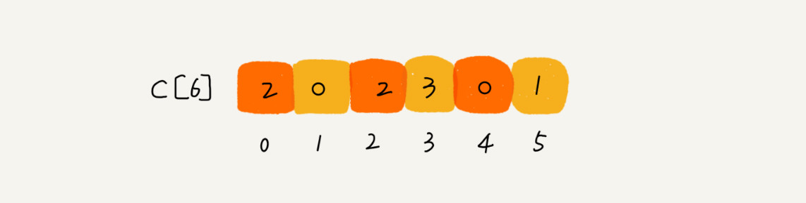


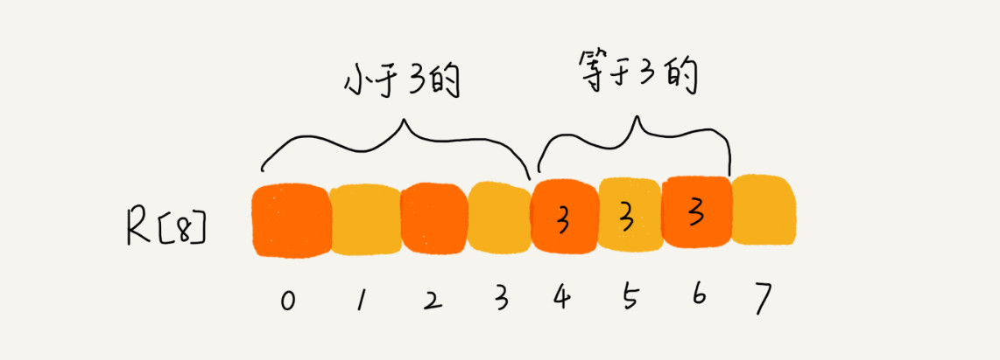

那我们如何快速计算出，每个分数的考生在有序数组中对应的存储位置呢？

思路是这样的：我们对C[6]数组顺序求和，C[6]存储的数据就变成了下面这样子。C[k]里存储小于等于分数k的考生个数。


我们从后到前依次扫描数组A。比如，当扫描到3时，我们可以从数组C中取出下标为3的值7，也就是说，到目前为止，包括自己在内，分数小于等于3的考生有7个，也就是说3是数组R中的第7个元素（也就是数组R中下标为6的位置）。当3放入到数组R中后，小于等于3的元素就只剩下了6个了，所以相应的C[3]要减1，变成6。

以此类推，当我们扫描到第2个分数为3的考生的时候，就会把它放入数组R中的第6个元素的位置（也就是下标为5的位置）。当我们扫描完整个数组A后，数组R内的数据就是按照分数从小到大有序排列的了。


```
// 计数排序，a是数组，n是数组大小。假设数组中存储的都是非负整数。
public void countingSort(int[] a, int n) {
  if (n <= 1) return;

  // 查找数组中数据的范围
  int max = a[0];
  for (int i = 1; i < n; ++i) {
    if (max < a[i]) {
      max = a[i];
    }
  }

  int[] c = new int[max + 1]; // 申请一个计数数组c，下标大小[0,max]
  for (int i = 0; i <= max; ++i) {
    c[i] = 0;
  }

  // 计算每个元素的个数，放入c中
  for (int i = 0; i < n; ++i) {
    c[a[i]]++;
  }

  // 依次累加
  for (int i = 1; i <= max; ++i) {
    c[i] = c[i-1] + c[i];
  }

  // 临时数组r，存储排序之后的结果
  int[] r = new int[n];
  // 计算排序的关键步骤，有点难理解
  for (int i = n - 1; i >= 0; --i) {
    int index = c[a[i]]-1;
    r[index] = a[i];
    c[a[i]]--;
  }

  // 将结果拷贝给a数组
  for (int i = 0; i < n; ++i) {
    a[i] = r[i];
  }
}
```

我总结一下，**计数排序只能用在数据范围不大的场景中，如果数据范围k比要排序的数据n大很多，就不适合用计数排序了。而且，计数排序只能给非负整数排序，如果要排序的数据是其他类型的，要将其在不改变相对大小的情况下，转化为非负整数。**

比如，如果考生成绩精确到小数后一位，我们就需要将所有的分数都先乘以10，转化成整数，然后再放到9010个桶内。再比如，如果要排序的数据中有负数，数据的范围是[-1000, 1000]，那我们就需要先对每个数据都加1000，转化成非负整数。

### 基数排序（Radix sort）

我们再来看这样一个排序问题。假设我们有10万个手机号码，希望将这10万个手机号码从小到大排序，你有什么比较快速的排序方法呢？

我们之前讲的快排，时间复杂度可以做到O(nlogn)，还有更高效的排序算法吗？桶排序、计数排序能派上用场吗？手机号码有11位，范围太大，显然不适合用这两种排序算法。针对这个排序问题，有没有时间复杂度是O(n)的算法呢？现在我就来介绍一种新的排序算法，基数排序。

刚刚这个问题里有这样的规律：假设要比较两个手机号码a，b的大小，如果在前面几位中，a手机号码已经比b手机号码大了，那后面的几位就不用看了。

借助稳定排序算法，这里有一个巧妙的实现思路。还记得我们第11节中，在阐述排序算法的稳定性的时候举的订单的例子吗？我们这里也可以借助相同的处理思路，先按照最后一位来排序手机号码，然后，再按照倒数第二位重新排序，以此类推，最后按照第一位重新排序。经过11次排序之后，手机号码就都有序了。

手机号码稍微有点长，画图比较不容易看清楚，我用字符串排序的例子，画了一张基数排序的过程分解图，你可以看下。


注意，这里按照每位来排序的排序算法要是稳定的，否则这个实现思路就是不正确的。因为如果是非稳定排序算法，那最后一次排序只会考虑最高位的大小顺序，完全不管其他位的大小关系，那么低位的排序就完全没有意义了。

根据每一位来排序，我们可以用刚讲过的桶排序或者计数排序，它们的时间复杂度可以做到O(n)。如果要排序的数据有k位，那我们就需要k次桶排序或者计数排序，总的时间复杂度是O(k*n)。当k不大的时候，比如手机号码排序的例子，k最大就是11，所以基数排序的时间复杂度就近似于O(n)。

实际上，有时候要排序的数据并不都是等长的，比如我们排序牛津字典中的20万个英文单词，最短的只有1个字母，最长的我特意去查了下，有45个字母，中文翻译是尘肺病。对于这种不等长的数据，基数排序还适用吗？

实际上，**我们可以把所有的单词补齐到相同长度，位数不够的可以在后面补“0”**，因为根据ASCII值，所有字母都大于“0”，所以补“0”不会影响到原有的大小顺序。这样就可以继续用基数排序了。

我来总结一下，**基数排序对要排序的数据是有要求的，需要可以分割出独立的“位”来比较，而且位之间有递进的关系，如果a数据的高位比b数据大，那剩下的低位就不用比较了。除此之外，每一位的数据范围不能太大，要可以用线性排序算法来排序，否则，基数排序的时间复杂度就无法做到O(n)了**。

### 练习

#### 如何根据年龄给100万用户排序？

实际上，根据年龄给100万用户排序，就类似按照成绩给50万考生排序。我们假设年龄的范围最小1岁，最大不超过120岁。我们可以遍历这100万用户，根据年龄将其划分到这120个桶里，然后依次顺序遍历这120个桶中的元素。这样就得到了按照年龄排序的100万用户数据。

#### 假设我们现在需要对D，a，F，B，c，A，z这个字符串进行排序，要求将其中所有小写字母都排在大写字母的前面，但小写字母内部和大写字母内部不要求有序。比如经过排序之后为a，c，z，D，F，B，A，这个如何来实现呢？如果字符串中存储的不仅有大小写字母，还有数字。要将小写字母的放到前面，大写字母放在最后，数字放在中间，不用排序算法，又该怎么解决呢？

利用桶排序思想，弄小写，大写，数字三个桶，遍历一遍，都放进去，然后再从桶中取出来就行了。相当于遍历了两遍，复杂度O(n)

### 如何选择合适的排序算法？

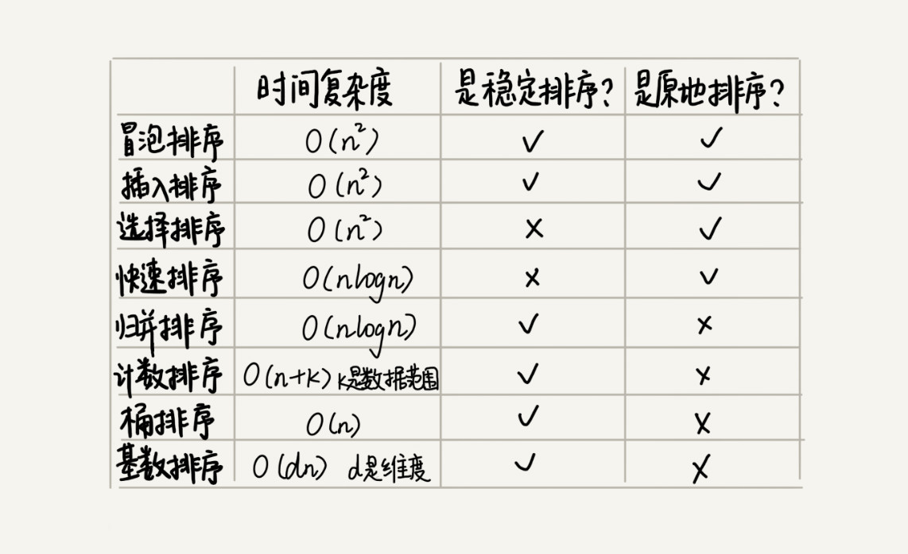

线性排序算法的时间复杂度比较低，适用场景比较特殊。所以如果要写一个通用的排序函数，不能选择线性排序算法。

如果对小规模数据进行排序，可以选择时间复杂度是O(n^2^)的算法；如果对大规模数据进行排序，时间复杂度是O(nlogn)的算法更加高效。所以，为了兼顾任意规模数据的排序，一般都会首选时间复杂度是O(nlogn)的排序算法来实现排序函数。

时间复杂度是O(nlogn)的排序算法不止一个，我们已经讲过的有归并排序、快速排序，堆排序。堆排序和快速排序都有比较多的应用，比如Java语言采用堆排序实现排序函数，C语言使用快速排序实现排序函数。

不知道你有没有发现，使用归并排序的情况其实并不多。我们知道，快排在最坏情况下的时间复杂度是O(n^2^)，而归并排序可以做到平均情况、最坏情况下的时间复杂度都是O(nlogn)，从这点上看起来很诱人，那为什么它还是没能得到“宠信”呢？

归并排序并不是原地排序算法，空间复杂度是O(n)。所以，粗略点、夸张点讲，如果要排序100MB的数据，除了数据本身占用的内存之外，排序算法还要额外再占用100MB的内存空间，空间耗费就翻倍了。

前面我们讲到，快速排序比较适合来实现排序函数，但是，我们也知道，快速排序在最坏情况下的时间复杂度是O(n^2^)，如何来解决这个“复杂度恶化”的问题呢？

#### 如何优化快速排序？

我们先来看下，为什么最坏情况下快速排序的时间复杂度是O(n^2^)呢？我们前面讲过，如果数据原来就是有序的或者接近有序的，每次分区点都选择最后一个数据，那快速排序算法就会变得非常糟糕，时间复杂度就会退化为O(n^2^)。实际上，**这种O(n^2^)时间复杂度出现的主要原因还是因为我们分区点选的不够合理**。

最理想的分区点是：**被分区点分开的两个分区中，数据的数量差不多**。

如果很粗暴地直接选择第一个或者最后一个数据作为分区点，不考虑数据的特点，肯定会出现之前讲的那样，在某些情况下，排序的最坏情况时间复杂度是O(n^2^)。为了提高排序算法的性能，我们也要尽可能地让每次分区都比较平均。

这里介绍两个比较常用、比较简单的分区算法。

##### 1.三数取中法

我们从区间的首、尾、中间，分别取出一个数，然后对比大小，取这3个数的中间值作为分区点。这样每间隔某个固定的长度，取数据出来比较，将中间值作为分区点的分区算法，肯定要比单纯取某一个数据更好。但是，如果要排序的数组比较大，那“三数取中”可能就不够了，可能要“五数取中”或者“十数取中”。

##### 2.随机法

随机法就是每次从要排序的区间中，随机选择一个元素作为分区点。这种方法并不能保证每次分区点都选的比较好，但是从概率的角度来看，也不大可能会出现每次分区点都选的很差的情况，所以平均情况下，这样选的分区点是比较好的。时间复杂度退化为最糟糕的O(n^2^)的情况，出现的可能性不大。

我们知道，快速排序是用递归来实现的。我们在递归那一节讲过，递归要警惕堆栈溢出。为了避免快速排序里，递归过深而堆栈过小，导致堆栈溢出，我们有两种解决办法：第一种是限制递归深度。一旦递归过深，超过了我们事先设定的阈值，就停止递归。第二种是通过在堆上模拟实现一个函数调用栈，手动模拟递归压栈、出栈的过程，这样就没有了系统栈大小的限制。

#### 举例分析排序函数

为了让你对如何实现一个排序函数有一个更直观的感受，我拿Glibc中的qsort()函数举例说明一下。虽说qsort()从名字上看，很像是基于快速排序算法实现的，实际上它并不仅仅用了快排这一种算法。

如果你去看源码，你就会发现，**qsort()会优先使用归并排序来排序输入数据**，因为归并排序的空间复杂度是O(n)，所以对于小数据量的排序，比如1KB、2KB等，归并排序额外需要1KB、2KB的内存空间，这个问题不大。现在计算机的内存都挺大的，我们很多时候追求的是速度。还记得我们前面讲过的用空间换时间的技巧吗？这就是一个典型的应用。

但如果数据量太大，就跟我们前面提到的，排序100MB的数据，这个时候我们再用归并排序就不合适了。所以，**要排序的数据量比较大的时候，qsort()会改为用快速排序算法来排序**。

那qsort()是如何选择快速排序算法的分区点的呢？如果去看源码，你就会发现，qsort()选择分区点的方法就是“三数取中法”。是不是也并不复杂？

还有我们前面提到的递归太深会导致堆栈溢出的问题，qsort()是通过自己实现一个堆上的栈，手动模拟递归来解决的。即将递归调用，改写为循环非递归方式

实际上，qsort()并不仅仅用到了归并排序和快速排序，它还用到了插入排序。在快速排序的过程中，当要排序的区间中，元素的个数小于等于4时，qsort()就退化为插入排序，不再继续用递归来做快速排序，因为我们前面也讲过，在小规模数据面前，**O(n^2^)时间复杂度的算法并不一定比O(nlogn)的算法执行时间长**。我们现在就来分析下这个说法。

我们在讲复杂度分析的时候讲过，算法的性能可以通过时间复杂度来分析，但是，这种复杂度分析是比较偏理论的，如果我们深究的话，实际上时间复杂度并不等于代码实际的运行时间。

时间复杂度代表的是一个增长趋势，如果画成增长曲线图，你会发现O(n^2^)比O(nlogn)要陡峭，也就是说增长趋势要更猛一些。但是，我们前面讲过，在大O复杂度表示法中，我们会省略低阶、系数和常数，也就是说，O(nlogn)在没有省略低阶、系数、常数之前可能是O(knlogn + c)，而且k和c有可能还是一个比较大的数。

假设k=1000，c=200，当我们对小规模数据（比如n=100）排序时，n^2^的值实际上比knlogn+c还要小。

```
knlogn+c = 1000 * 100 * log100 + 200 远大于10000

n^2 = 100*100 = 10000
```

所以，对于小规模数据的排序，O(n^2^)的排序算法并不一定比O(nlogn)排序算法执行的时间长。对于小数据量的排序，我们选择比较简单、不需要递归的插入排序算法。

还记得我们之前讲到的哨兵来简化代码，提高执行效率吗？在qsort()插入排序的算法实现中，也利用了这种编程技巧。虽然哨兵可能只是少做一次判断，但是毕竟排序函数是非常常用、非常基础的函数，性能的优化要做到极致。

## 二分查找

**二分查找针对的是一个有序的数据集合，查找思想有点类似分治思想。每次都通过跟区间的中间元素对比，将待查找的区间缩小为之前的一半，直到找到要查找的元素，或者区间被缩小为0**。

### O(logn)惊人的查找速度

二分查找是一种非常高效的查找算法，高效到什么程度呢？我们来分析一下它的时间复杂度。

我们假设数据大小是n，每次查找后数据都会缩小为原来的一半，也就是会除以2。最坏情况下，直到查找区间被缩小为空，才停止。


可以看出来，这是一个等比数列。其中n/2^k^=1时，k的值就是总共缩小的次数。而每一次缩小操作只涉及两个数据的大小比较，所以，经过了k次区间缩小操作，时间复杂度就是O(k)。通过n/2^k^=1，我们可以求得k=log2n，所以时间复杂度就是O(logn)。

二分查找是我们目前为止遇到的第一个时间复杂度为O(logn)的算法。堆、二叉树它们的时间复杂度也是O(logn)。再深入地讲讲O(logn)这种**对数时间复杂度**。这是一种极其高效的时间复杂度，有的时候甚至比时间复杂度是常量级O(1)的算法还要高效。为什么这么说呢？

因为logn是一个非常“恐怖”的数量级，即便n非常非常大，对应的logn也很小。比如n等于2的32次方，这个数很大了吧？大约是42亿。也就是说，如果我们在42亿个数据中用二分查找一个数据，最多需要比较32次。

我们前面讲过，用大O标记法表示时间复杂度的时候，会省略掉常数、系数和低阶。对于常量级时间复杂度的算法来说，O(1)有可能表示的是一个非常大的常量值，比如O(1000)、O(10000)。所以，常量级时间复杂度的算法有时候可能还没有O(logn)的算法执行效率高。

### 二分查找的递归与非递归实现

**最简单的情况**就是**有序数组中不存在重复元素**，我们在其中用二分查找值等于给定值的数据。用Java代码实现了一个最简单的二分查找算法。

```
public int bsearch(int[] a, int n, int value) {
  int low = 0;
  int high = n - 1;

  while (low <= high) {
    int mid = (low + high) / 2;
    if (a[mid] == value) {
      return mid;
    } else if (a[mid] < value) {
      low = mid + 1;
    } else {
      high = mid - 1;
    }
  }

  return -1;
}
```

这个代码我稍微解释一下，low、high、mid都是指数组下标，其中low和high表示当前查找的区间范围，初始low=0， high=n-1。mid表示[low, high]的中间位置。我们通过对比a[mid]与value的大小，来更新接下来要查找的区间范围，直到找到或者区间缩小为0，就退出。如果你有一些编程基础，看懂这些应该不成问题。现在，我就着重强调一下**容易出错的3个地方**。

#### 1.循环退出条件

注意是low<=high，而不是low<high。

#### 2.mid的取值

实际上，mid=(low+high)/2这种写法是有问题的。因为如果low和high比较大的话，两者之和就有可能会溢出。改进的方法是将mid的计算方式写成low+(high-low)/2。更进一步，如果要将性能优化到极致的话，我们可以将这里的除以2操作转化成位运算low+((high-low)>>1)。因为相比除法运算来说，计算机处理位运算要快得多。

#### 3.low和high的更新

low=mid+1，high=mid-1。注意这里的+1和-1，如果直接写成low=mid或者high=mid，就可能会发生死循环。比如，当high=3，low=3时，如果a[3]不等于value，就会导致一直循环不退出。

**实际上，二分查找除了用循环来实现，还可以用递归来实现**，过程也非常简单。

```
// 二分查找的递归实现
public int bsearch(int[] a, int n, int val) {
  return bsearchInternally(a, 0, n - 1, val);
}

private int bsearchInternally(int[] a, int low, int high, int value) {
  if (low > high) return -1;

  int mid =  low + ((high - low) >> 1);
  if (a[mid] == value) {
    return mid;
  } else if (a[mid] < value) {
    return bsearchInternally(a, mid+1, high, value);
  } else {
    return bsearchInternally(a, low, mid-1, value);
  }
}
```

### 二分查找应用场景的局限性

前面我们分析过，二分查找的时间复杂度是O(logn)，查找数据的效率非常高。不过，并不是什么情况下都可以用二分查找，它的应用场景是有很大局限性的。那什么情况下适合用二分查找，什么情况下不适合呢？

**首先，二分查找依赖的是顺序表结构，简单点说就是数组。**

那二分查找能否依赖其他数据结构呢？比如链表。答案是不可以的，主要原因是二分查找算法需要按照下标随机访问元素。我们在数组和链表那两节讲过，数组按照下标随机访问数据的时间复杂度是O(1)，而链表随机访问的时间复杂度是O(n)。所以，如果数据使用链表存储，二分查找的时间复杂就会变得很高。

二分查找只能用在数据是通过顺序表来存储的数据结构上。如果你的数据是通过其他数据结构存储的，则无法应用二分查找。

**其次，二分查找针对的是有序数据。**

二分查找对这一点的要求比较苛刻，数据必须是有序的。如果数据没有序，我们需要先排序。前面章节里我们讲到，排序的时间复杂度最低是O(nlogn)。所以，如果我们针对的是一组静态的数据，没有频繁地插入、删除，我们可以进行一次排序，多次二分查找。这样排序的成本可被均摊，二分查找的边际成本就会比较低。

但是，如果我们的数据集合有频繁的插入和删除操作，要想用二分查找，要么每次插入、删除操作之后保证数据仍然有序，要么在每次二分查找之前都先进行排序。针对这种动态数据集合，无论哪种方法，维护有序的成本都是很高的。

所以，二分查找只能用在插入、删除操作不频繁，一次排序多次查找的场景中。针对动态变化的数据集合，二分查找将不再适用。

**再次，数据量太小不适合二分查找。**

如果要处理的数据量很小，完全没有必要用二分查找，顺序遍历就足够了。比如我们在一个大小为10的数组中查找一个元素，不管用二分查找还是顺序遍历，查找速度都差不多。只有数据量比较大的时候，二分查找的优势才会比较明显。

不过，这里有一个例外。如果数据之间的比较操作非常耗时，不管数据量大小，我都推荐使用二分查找。比如，数组中存储的都是长度超过300的字符串，如此长的两个字符串之间比对大小，就会非常耗时。我们需要尽可能地减少比较次数，而比较次数的减少会大大提高性能，这个时候二分查找就比顺序遍历更有优势。

**最后，数据量太大也不适合二分查找。**

二分查找的底层需要依赖数组这种数据结构，而数组为了支持随机访问的特性，要求内存空间连续，对内存的要求比较苛刻。比如，我们有1GB大小的数据，如果希望用数组来存储，那就需要1GB的连续内存空间。

注意这里的“连续”二字，也就是说，即便有2GB的内存空间剩余，但是如果这剩余的2GB内存空间都是零散的，没有连续的1GB大小的内存空间，那照样无法申请一个1GB大小的数组。而我们的二分查找是作用在数组这种数据结构之上的，所以太大的数据用数组存储就比较吃力了，也就不能用二分查找了。

### 练习：

#### 如何在1000万个整数中快速查找某个整数？

我们的内存限制是100MB，每个数据大小是8字节，最简单的办法就是将数据存储在数组中，内存占用差不多是80MB，符合内存的限制。我们可以先对这1000万数据从小到大排序，然后再利用二分查找算法，就可以快速地查找想要的数据了。

看起来这个问题并不难，很轻松就能解决。实际上，它暗藏了“玄机”。如果你对数据结构和算法有一定了解，知道散列表、二叉树这些支持快速查找的动态数据结构。你可能会觉得，用散列表和二叉树也可以解决这个问题。实际上是不行的。

虽然大部分情况下，用二分查找可以解决的问题，用散列表、二叉树都可以解决。但是，我们后面会讲，不管是散列表还是二叉树，都会需要比较多的额外的内存空间。如果用散列表或者二叉树来存储这1000万的数据，用100MB的内存肯定是存不下的。而二分查找底层依赖的是数组，除了数据本身之外，不需要额外存储其他信息，是最省内存空间的存储方式，所以刚好能在限定的内存大小下解决这个问题。

#### 如何编程实现“求一个数的平方根”？要求精确到小数点后6位。

 求平方根可以用二分查找或牛顿迭代法

#### 如果数据使用链表存储，二分查找的时间复杂就会变得很高，那查找的时间复杂度究竟是多少呢？如果你自己推导一下，你就会深刻地认识到，为何我们会选择用数组而不是链表来实现二分查找了。

假设链表长度为n，二分查找每次都要找到中间点(计算中忽略奇偶数差异):
第一次查找中间点，需要移动指针n/2次；
第二次，需要移动指针n/4次；
第三次需要移动指针n/8次；
......
以此类推，一直到1次为值

总共指针移动次数(查找次数) = n/2 + n/4 + n/8 + ...+ 1，这显然是个等比数列，根据等比数列求和公式：Sum = n - 1.

最后算法时间复杂度是：O(n-1)，忽略常数，记为O(n)，时间复杂度和顺序查找时间复杂度相同

但是稍微思考下，在二分查找的时候，由于要进行多余的运算，严格来说，会比顺序查找时间慢

### 二分查找变形问题


#### 变体一：查找第一个值等于给定值的元素

比如下面这样一个有序数组，其中，a[5]，a[6]，a[7]的值都等于8，是重复的数据。我们希望查找第一个等于8的数据，也就是下标是5的元素。


如果我们用前面的二分查找的代码实现，首先拿8与区间的中间值a[4]比较，8比6大，于是在下标5到9之间继续查找。下标5和9的中间位置是下标7，a[7]正好等于8，所以代码就返回了。

尽管a[7]也等于8，但它并不是我们想要找的第一个等于8的元素，因为第一个值等于8的元素是数组下标为5的元素。我们上一节讲的二分查找代码就无法处理这种情况了。

```
public int bsearch(int[] a, int n, int value) {
  int low = 0;
  int high = n - 1;
  while (low <= high) {
    int mid =  low + ((high - low) >> 1);
    if (a[mid] > value) {
      high = mid - 1;
    } else if (a[mid] < value) {
      low = mid + 1;
    } else {
      if ((mid == 0) || (a[mid - 1] != value)) return mid;
      else high = mid - 1;
    }
  }
  return -1;
}
```

我来稍微解释一下这段代码。a[mid]跟要查找的value的大小关系有三种情况：大于、小于、等于。对于a[mid]>value的情况，我们需要更新high= mid-1；对于a[mid]<value的情况，我们需要更新low=mid+1。这两点都很好理解。那当a[mid]=value的时候应该如何处理呢？

如果我们查找的是任意一个值等于给定值的元素，当a[mid]等于要查找的值时，a[mid]就是我们要找的元素。但是，如果我们求解的是第一个值等于给定值的元素，当a[mid]等于要查找的值时，我们就需要确认一下这个a[mid]是不是第一个值等于给定值的元素。

我们重点看第11行代码。如果mid等于0，那这个元素已经是数组的第一个元素，那它肯定是我们要找的；如果mid不等于0，但a[mid]的前一个元素a[mid-1]不等于value，那也说明a[mid]就是我们要找的第一个值等于给定值的元素。

如果经过检查之后发现a[mid]前面的一个元素a[mid-1]也等于value，那说明此时的a[mid]肯定不是我们要查找的第一个值等于给定值的元素。那我们就更新high=mid-1，因为要找的元素肯定出现在[low, mid-1]之间。

#### 变体二：查找最后一个值等于给定值的元素

```
public int bsearch(int[] a, int n, int value) {
  int low = 0;
  int high = n - 1;
  while (low <= high) {
    int mid =  low + ((high - low) >> 1);
    if (a[mid] > value) {
      high = mid - 1;
    } else if (a[mid] < value) {
      low = mid + 1;
    } else {
      if ((mid == n - 1) || (a[mid + 1] != value)) return mid;
      else low = mid + 1;
    }
  }
  return -1;
}
```

我们还是重点看第11行代码。如果a[mid]这个元素已经是数组中的最后一个元素了，那它肯定是我们要找的；如果a[mid]的后一个元素a[mid+1]不等于value，那也说明a[mid]就是我们要找的最后一个值等于给定值的元素。

如果我们经过检查之后，发现a[mid]后面的一个元素a[mid+1]也等于value，那说明当前的这个a[mid]并不是最后一个值等于给定值的元素。我们就更新low=mid+1，因为要找的元素肯定出现在[mid+1, high]之间。

#### 变体三：查找第一个大于等于给定值的元素

在有序数组中，查找第一个大于等于给定值的元素。比如，数组中存储的这样一个序列：3，4，6，7，10。如果查找第一个大于等于5的元素，那就是6。

```
public int bsearch(int[] a, int n, int value) {
  int low = 0;
  int high = n - 1;
  while (low <= high) {
    int mid =  low + ((high - low) >> 1);
    if (a[mid] >= value) {
      if ((mid == 0) || (a[mid - 1] < value)) return mid;
      else high = mid - 1;
    } else {
      low = mid + 1;
    }
  }
  return -1;
}
```

如果a[mid]小于要查找的值value，那要查找的值肯定在[mid+1, high]之间，所以，我们更新low=mid+1。

对于a[mid]大于等于给定值value的情况，我们要先看下这个a[mid]是不是我们要找的第一个值大于等于给定值的元素。如果a[mid]前面已经没有元素，或者前面一个元素小于要查找的值value，那a[mid]就是我们要找的元素。这段逻辑对应的代码是第7行。

如果a[mid-1]也大于等于要查找的值value，那说明要查找的元素在[low, mid-1]之间，所以，我们将high更新为mid-1。

#### 变体四：查找最后一个小于等于给定值的元素

比如，数组中存储了这样一组数据：3，5，6，8，9，10。最后一个小于等于7的元素就是6。是不是有点类似上面那一种？实际上，实现思路也是一样的。

```
public int bsearch7(int[] a, int n, int value) {
  int low = 0;
  int high = n - 1;
  while (low <= high) {
    int mid =  low + ((high - low) >> 1);
    if (a[mid] > value) {
      high = mid - 1;
    } else {
      if ((mid == n - 1) || (a[mid + 1] > value)) return mid;
      else low = mid + 1;
    }
  }
  return -1;
}
```

### 练习

#### 如何快速定位出一个IP地址的归属地？

如果IP区间与归属地的对应关系不经常更新，我们可以先预处理这12万条数据，让其按照起始IP从小到大排序。如何来排序呢？我们知道，IP地址可以转化为32位的整型数。所以，我们可以将起始地址，按照对应的整型值的大小关系，从小到大进行排序。

然后，这个问题就可以转化为我刚讲的第四种变形问题“在有序数组中，查找最后一个小于等于某个给定值的元素”了。

当我们要查询某个IP归属地时，我们可以先通过二分查找，找到最后一个起始IP小于等于这个IP的IP区间，然后，检查这个IP是否在这个IP区间内，如果在，我们就取出对应的归属地显示；如果不在，就返回未查找到。

#### 如果有序数组是一个循环有序数组，比如4，5，6，1，2，3。针对这种情况，如何实现一个求“值等于给定值”的二分查找算法呢？

有三种方法查找循环有序数组

方法一：

1. 找到分界下标，分成两个有序数组

   判断目标值在哪个有序数据范围内，做二分查找

方法二：

1. 到最大值的下标 x;
2. 所有元素下标 +x 偏移，超过数组范围值的取模;
3. 利用偏移后的下标做二分查找；
4. 如果找到目标下标，再作 -x 偏移，就是目标值实际下标。

两种情况最高时耗都在查找分界点上，所以时间复杂度是 O(N）。

方法三：

我们发现循环数组存在一个性质：以数组中间点为分区，会将数组分成一个有序数组和一个循环有序数组。

如果首元素小于 mid，说明前半部分是有序的，后半部分是循环有序数组；
如果首元素大于 mid，说明后半部分是有序的，前半部分是循环有序的数组；
如果目标元素在有序数组范围中，使用二分查找；
如果目标元素在循环有序数组中，设定数组边界后，使用以上方法继续查找。

时间复杂度为 O(logN)。

## 跳表

它确实是一种各方面性能都比较优秀的**动态数据结构**，可以支持快速的插入、删除、查找操作，写起来也不复杂，甚至可以替代红黑树（Red-black tree）。

Redis中的有序集合（Sorted Set）就是用跳表来实现的。

对于一个单链表来讲，即便链表中存储的数据是有序的，如果我们要想在其中查找某个数据，也只能从头到尾遍历链表。这样查找效率就会很低，时间复杂度会很高，是O(n)。

那怎么来提高查找效率呢？如果像图中那样，对链表建立一级“索引”，查找起来是不是就会更快一些呢？每两个结点提取一个结点到上一级，我们把抽出来的那一级叫作**索引**或**索引层**。你可以看我画的图。图中的down表示down指针，指向下一级结点。


如果我们现在要查找某个结点，比如16。我们可以先在索引层遍历，当遍历到索引层中值为13的结点时，我们发现下一个结点是17，那要查找的结点16肯定就在这两个结点之间。然后我们通过索引层结点的down指针，下降到原始链表这一层，继续遍历。这个时候，我们只需要再遍历2个结点，就可以找到值等于16的这个结点了。这样，原来如果要查找16，需要遍历10个结点，现在只需要遍历7个结点。

跟前面建立第一级索引的方式相似，我们在第一级索引的基础之上，每两个结点就抽出一个结点到第二级索引。现在我们再来查找16，只需要遍历6个结点了，需要遍历的结点数量又减少了。

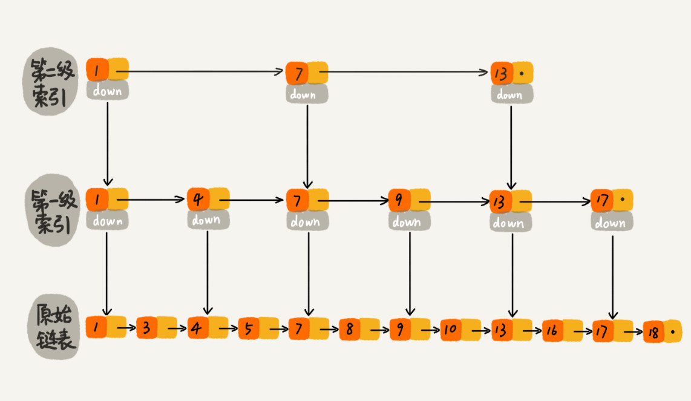

我举的例子数据量不大，所以即便加了两级索引，查找效率的提升也并不明显。为了让你能真切地感受索引提升查询效率。我画了一个包含64个结点的链表，按照前面讲的这种思路，建立了五级索引。


从图中我们可以看出，原来没有索引的时候，查找62需要遍历62个结点，现在只需要遍历11个结点，速度是不是提高了很多？所以，当链表的长度n比较大时，比如1000、10000的时候，在构建索引之后，查找效率的提升就会非常明显。

前面讲的**这种链表加多级索引的结构，就是跳表**。

### 用跳表查询到底有多快？

在一个具有多级索引的跳表中，查询某个数据的时间复杂度是多少呢？

按照我们刚才讲的，每两个结点会抽出一个结点作为上一级索引的结点，那第一级索引的结点个数大约就是n/2，第二级索引的结点个数大约就是n/4，第三级索引的结点个数大约就是n/8，依次类推，也就是说，**第k级索引的结点个数是第k-1级索引的结点个数的1/2，那第k级索引结点的个数就是n/(2^k^)。**

假设索引有h级，最高级的索引有2个结点。通过上面的公式，我们可以得到n/(2^h^)=2，从而求得h=log~2~n-1。如果包含原始链表这一层，整个跳表的高度就是log~2~n。我们在跳表中查询某个数据的时候，如果每一层都要遍历m个结点，那在跳表中查询一个数据的时间复杂度就是O(m*logn)。

那这个m的值是多少呢？按照前面这种索引结构，我们每一级索引都最多只需要遍历3个结点，也就是说m=3，为什么是3呢？我来解释一下。

假设我们要查找的数据是x，在第k级索引中，我们遍历到y结点之后，发现x大于y，小于后面的结点z，所以我们通过y的down指针，从第k级索引下降到第k-1级索引。在第k-1级索引中，y和z之间只有3个结点（包含y和z），所以，我们在K-1级索引中最多只需要遍历3个结点，依次类推，每一级索引都最多只需要遍历3个结点。

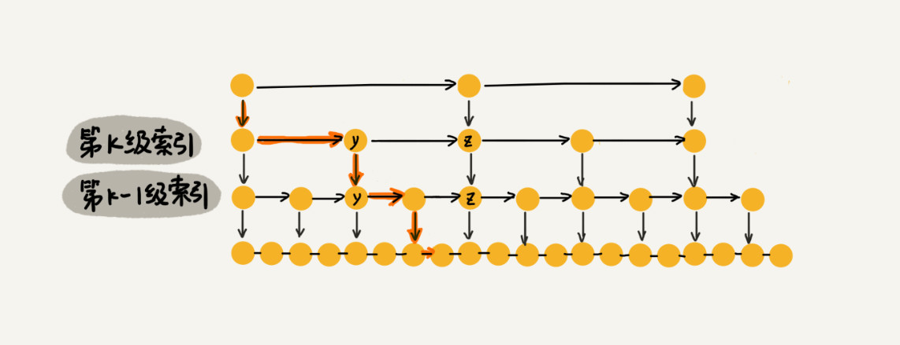

通过上面的分析，我们得到m=3，所以在跳表中查询任意数据的时间复杂度就是O(logn)。这个查找的时间复杂度跟二分查找是一样的。换句话说，我们其实是基于单链表实现了二分查找，是不是很神奇？不过，天下没有免费的午餐，这种查询效率的提升，前提是建立了很多级索引，也就是空间换时间的设计思路。

### 跳表是不是很浪费内存？

假设原始链表大小为n，那第一级索引大约有n/2个结点，第二级索引大约有n/4个结点，以此类推，每上升一级就减少一半，直到剩下2个结点。如果我们把每层索引的结点数写出来，就是一个等比数列。


这几级索引的结点总和就是n/2+n/4+n/8…+8+4+2=n-2。所以，跳表的空间复杂度是O(n)。也就是说，如果将包含n个结点的单链表构造成跳表，我们需要额外再用接近n个结点的存储空间。那我们有没有办法降低索引占用的内存空间呢？

我们前面都是每两个结点抽一个结点到上级索引，如果我们每三个结点或五个结点，抽一个结点到上级索引，是不是就不用那么多索引结点了呢？我画了一个每三个结点抽一个的示意图，你可以看下。


从图中可以看出，第一级索引需要大约n/3个结点，第二级索引需要大约n/9个结点。每往上一级，索引结点个数都除以3。为了方便计算，我们假设最高一级的索引结点个数是1。我们把每级索引的结点个数都写下来，也是一个等比数列。


通过等比数列求和公式，总的索引结点大约就是n/3+n/9+n/27+…+9+3+1=n/2。尽管空间复杂度还是O(n)，但比上面的每两个结点抽一个结点的索引构建方法，要减少了一半的索引结点存储空间。

实际上，在软件开发中，我们不必太在意索引占用的额外空间。在讲数据结构和算法时，我们习惯性地把要处理的数据看成整数，但是在实际的软件开发中，原始链表中存储的有可能是很大的对象，而索引结点只需要存储关键值和几个指针，并不需要存储对象，所以当对象比索引结点大很多时，那索引占用的额外空间就可以忽略了。

### 高效的动态插入和删除

实际上，跳表这个动态数据结构，不仅支持查找操作，还支持动态的插入、删除操作，而且插入、删除操作的时间复杂度也是O(logn)。

我们现在来看下， 如何在跳表中插入一个数据，以及它是如何做到O(logn)的时间复杂度的？

在单链表中，一旦定位好要插入的位置，插入结点的时间复杂度是很低的，就是O(1)。但是，这里为了保证原始链表中数据的有序性，我们需要先找到要插入的位置，这个查找操作就会比较耗时。

对于纯粹的单链表，需要遍历每个结点，来找到插入的位置。但是，对于跳表来说，我们讲过查找某个结点的的时间复杂度是O(logn)，所以这里查找某个数据应该插入的位置，方法也是类似的，时间复杂度也是O(logn)。我画了一张图，你可以很清晰地看到插入的过程。


好了，我们再来看删除操作。

如果这个结点在索引中也有出现，我们除了要删除原始链表中的结点，还要删除索引中的。因为单链表中的删除操作需要拿到要删除结点的前驱结点，然后通过指针操作完成删除。所以在查找要删除的结点的时候，一定要获取前驱结点。当然，如果我们用的是双向链表，就不需要考虑这个问题了。

### 跳表索引动态更新

当我们不停地往跳表中插入数据时，如果我们不更新索引，就有可能出现某2个索引结点之间数据非常多的情况。极端情况下，跳表还会退化成单链表。

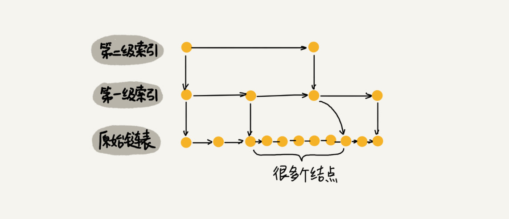

作为一种动态数据结构，我们需要某种手段来维护索引与原始链表大小之间的平衡，也就是说，如果链表中结点多了，索引结点就相应地增加一些，避免复杂度退化，以及查找、插入、删除操作性能下降。

如果你了解红黑树、AVL树这样平衡二叉树，你就知道它们是通过左右旋的方式保持左右子树的大小平衡，而跳表是通过随机函数来维护前面提到的“平衡性”。

当我们往跳表中插入数据的时候，我们可以选择同时将这个数据插入到部分索引层中。如何选择加入哪些索引层呢？

我们通过一个随机函数，来决定将这个结点插入到哪几级索引中，比如随机函数生成了值K，那我们就将这个结点添加到第一级到第K级这K级索引中。


随机函数的选择很有讲究，从概率上来讲，能够保证跳表的索引大小和数据大小平衡性，不至于性能过度退化。

### 练习

#### 为什么Redis要用跳表来实现有序集合，而不是红黑树？

Redis中的有序集合是通过跳表来实现的，严格点讲，其实还用到了散列表。如果你去查看Redis的开发手册，就会发现，Redis中的有序集合支持的核心操作主要有下面这几个：

- 插入一个数据；
- 删除一个数据；
- 查找一个数据；
- 按照区间查找数据（比如查找值在[100, 356]之间的数据）；
- 迭代输出有序序列。

其中，插入、删除、查找以及迭代输出有序序列这几个操作，红黑树也可以完成，时间复杂度跟跳表是一样的。但是，按照区间来查找数据这个操作，红黑树的效率没有跳表高。

对于按照区间查找数据这个操作，跳表可以做到O(logn)的时间复杂度定位区间的起点，然后在原始链表中顺序往后遍历就可以了。这样做非常高效。

当然，Redis之所以用跳表来实现有序集合，还有其他原因，比如，跳表更容易代码实现。虽然跳表的实现也不简单，但比起红黑树来说还是好懂、好写多了，而简单就意味着可读性好，不容易出错。还有，跳表更加灵活，它可以通过改变索引构建策略，有效平衡执行效率和内存消耗。

不过，跳表也不能完全替代红黑树。因为红黑树比跳表的出现要早一些，很多编程语言中的Map类型都是通过红黑树来实现的。我们做业务开发的时候，直接拿来用就可以了，不用费劲自己去实现一个红黑树，但是跳表并没有一个现成的实现，所以在开发中，如果你想使用跳表，必须要自己实现。

跳表实现：https://github.com/wangzheng0822/algo/blob/master/java/17_skiplist/SkipList.java

#### 对于跳表的时间复杂度分析，如果每三个或者五个结点提取一个结点作为上级索引，对应的在跳表中查询数据的时间复杂度是多少呢？

如果每三个或者五个节点提取一个节点作为上级索引，那么对应的查询数据时间复杂度，应该也还是 O(logn)。

假设每 5 个节点提取，那么最高一层有 5 个节点，而跳表高度为 log~5~n，每层最多需要查找 5 个节点，即 O(mlogn) 中的 m = 5，最终，时间复杂度为 O(logn)。

空间复杂度也还是 O(logn)，虽然省去了一部分索引节点，但是似乎意义不大。

## 散列表

### 散列思想

**散列表用的是数组支持按照下标随机访问数据的特性，所以散列表其实就是数组的一种扩展，由数组演化而来。可以说，如果没有数组，就没有散列表。**

如何存储选手信息，才能够支持通过编号来快速查找选手信息呢？

参赛选手的编号我们叫作**键**（key）或者**关键字**。我们用它来标识一个选手。我们把参赛编号转化为数组下标的映射方法就叫作**散列函数**（或“Hash函数”“哈希函数”），而散列函数计算得到的值就叫作**散列值**（或“Hash值”“哈希值”）。


通过这个例子，我们可以总结出这样的规律：散列表用的就是数组支持按照下标随机访问的时候，时间复杂度是O(1)的特性。我们通过散列函数把元素的键值映射为下标，然后将数据存储在数组中对应下标的位置。当我们按照键值查询元素时，我们用同样的散列函数，将键值转化数组下标，从对应的数组下标的位置取数据。

### 散列函数

散列函数，顾名思义，它是一个函数。我们可以把它定义成**hash(key)**，其中key表示元素的键值，hash(key)的值表示经过散列函数计算得到的散列值。

那第一个例子中，编号就是数组下标，所以hash(key)就等于key。改造后的例子，写成散列函数稍微有点复杂。我用伪代码将它写成函数就是下面这样：

```
int hash(String key) {
  // 获取后两位字符
  string lastTwoChars = key.substr(length-2, length);
  // 将后两位字符转换为整数
  int hashValue = convert lastTwoChas to int-type;
  return hashValue;
}
```

**该如何构造散列函数呢？我总结了三点散列函数设计的基本要求**：

1. 散列函数计算得到的散列值是一个非负整数；
2. 如果key1 = key2，那hash(key1) == hash(key2)；
3. 如果key1 ≠ key2，那hash(key1) ≠ hash(key2)。

其中，第一点理解起来应该没有任何问题。因为数组下标是从0开始的，所以散列函数生成的散列值也要是非负整数。第二点也很好理解。相同的key，经过散列函数得到的散列值也应该是相同的。

第三点理解起来可能会有问题，我着重说一下。这个要求看起来合情合理，但是在真实的情况下，要想找到一个不同的key对应的散列值都不一样的散列函数，几乎是不可能的。即便像业界著名的[MD5](https://zh.wikipedia.org/wiki/MD5)、[SHA](https://zh.wikipedia.org/wiki/SHA家族)、[CRC](https://zh.wikipedia.org/wiki/循環冗餘校驗)等哈希算法，也无法完全避免这种**散列冲突**。而且，因为数组的存储空间有限，也会加大散列冲突的概率。

所以我们几乎无法找到一个完美的无冲突的散列函数，即便能找到，付出的时间成本、计算成本也是很大的，所以针对散列冲突问题，我们需要通过其他途径来解决。

### 散列冲突

我们常用的散列冲突解决方法有两类，开放寻址法（open addressing）和链表法（chaining）。

#### 1.开放寻址法

开放寻址法的核心思想是，如果出现了散列冲突，我们就重新探测一个空闲位置，将其插入。那如何重新探测新的位置呢？一个比较简单的探测方法，**线性探测**（Linear Probing）。

当我们往散列表中插入数据时，如果某个数据经过散列函数散列之后，存储位置已经被占用了，我们就从当前位置开始，依次往后查找，看是否有空闲位置，直到找到为止。

我说的可能比较抽象，我举一个例子具体给你说明一下。这里面黄色的色块表示空闲位置，橙色的色块表示已经存储了数据。


从图中可以看出，散列表的大小为10，在元素x插入散列表之前，已经6个元素插入到散列表中。x经过Hash算法之后，被散列到位置下标为7的位置，但是这个位置已经有数据了，所以就产生了冲突。于是我们就顺序地往后一个一个找，看有没有空闲的位置，遍历到尾部都没有找到空闲的位置，于是我们再从表头开始找，直到找到空闲位置2，于是将其插入到这个位置。

在散列表中查找元素的过程有点儿类似插入过程。我们通过散列函数求出要查找元素的键值对应的散列值，然后比较数组中下标为散列值的元素和要查找的元素。如果相等，则说明就是我们要找的元素；否则就顺序往后依次查找。如果遍历到数组中的空闲位置，还没有找到，就说明要查找的元素并没有在散列表中。

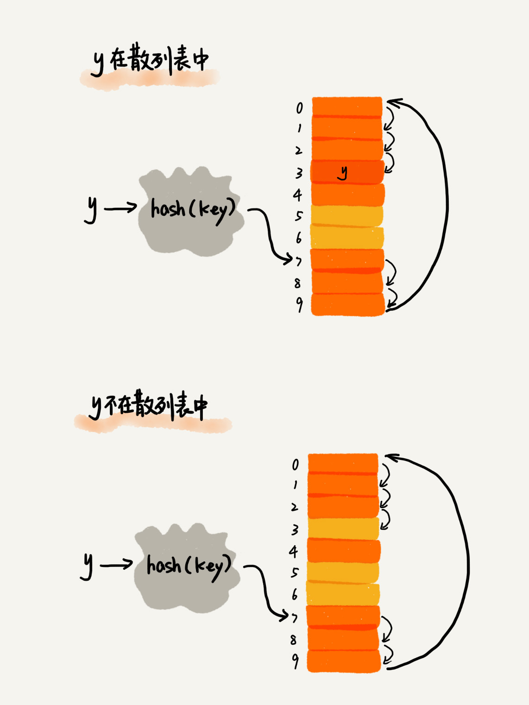

散列表跟数组一样，不仅支持插入、查找操作，还支持删除操作。对于使用线性探测法解决冲突的散列表，删除操作稍微有些特别。我们不能单纯地把要删除的元素设置为空。这是为什么呢？

还记得我们刚讲的查找操作吗？在查找的时候，一旦我们通过线性探测方法，找到一个空闲位置，我们就可以认定散列表中不存在这个数据。但是，如果这个空闲位置是我们后来删除的，就会导致原来的查找算法失效。本来存在的数据，会被认定为不存在。这个问题如何解决呢？

我们可以将删除的元素，特殊标记为deleted。当线性探测查找的时候，遇到标记为deleted的空间，并不是停下来，而是继续往下探测。

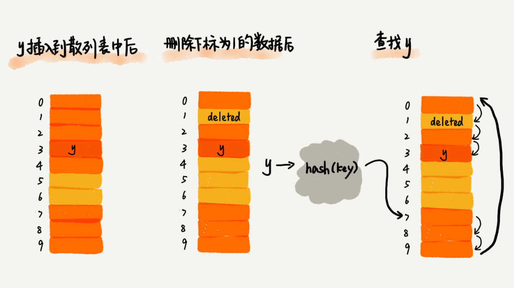

你可能已经发现了，线性探测法其实存在很大问题。当散列表中插入的数据越来越多时，散列冲突发生的可能性就会越来越大，空闲位置会越来越少，线性探测的时间就会越来越久。极端情况下，我们可能需要探测整个散列表，所以最坏情况下的时间复杂度为O(n)。同理，在删除和查找时，也有可能会线性探测整张散列表，才能找到要查找或者删除的数据。

对于开放寻址冲突解决方法，除了线性探测方法之外，还有另外两种比较经典的探测方法，**二次探测**（Quadratic probing）和**双重散列**（Double hashing）。

所谓二次探测，跟线性探测很像，线性探测每次探测的步长是1，那它探测的下标序列就是hash(key)+0，hash(key)+1，hash(key)+2……而二次探测探测的步长就变成了原来的“二次方”，也就是说，它探测的下标序列就是hash(key)+0，hash(key)+1^2^，hash(key)+2^2^……

所谓双重散列，意思就是不仅要使用一个散列函数。我们使用一组散列函数hash1(key)，hash2(key)，hash3(key)……我们先用第一个散列函数，如果计算得到的存储位置已经被占用，再用第二个散列函数，依次类推，直到找到空闲的存储位置。

不管采用哪种探测方法，当散列表中空闲位置不多的时候，散列冲突的概率就会大大提高。为了尽可能保证散列表的操作效率，一般情况下，我们会尽可能保证散列表中有一定比例的空闲槽位。我们用**装载因子**（load factor）来表示空位的多少。

装载因子的计算公式是：散列表的装载因子=填入表中的元素个数/散列表的长度

装载因子越大，说明空闲位置越少，冲突越多，散列表的性能会下降。

#### 2.链表法

链表法是一种更加常用的散列冲突解决办法，相比开放寻址法，它要简单很多。我们来看这个图，在散列表中，每个“桶（bucket）”或者“槽（slot）”会对应一条链表，所有散列值相同的元素我们都放到相同槽位对应的链表中。


当插入的时候，我们只需要通过散列函数计算出对应的散列槽位，将其插入到对应链表中即可，所以插入的时间复杂度是O(1)。当查找、删除一个元素时，我们同样通过散列函数计算出对应的槽，然后遍历链表查找或者删除。那查找或删除操作的时间复杂度是多少呢？

实际上，这两个操作的时间复杂度跟链表的长度k成正比，也就是O(k)。对于散列比较均匀的散列函数来说，理论上讲，k=n/m，其中n表示散列中数据的个数，m表示散列表中“槽”的个数。

### 练习

#### Word文档中单词拼写检查功能是如何实现的？

常用的英文单词有20万个左右，假设单词的平均长度是10个字母，平均一个单词占用10个字节的内存空间，那20万英文单词大约占2MB的存储空间，就算放大10倍也就是20MB。对于现在的计算机来说，这个大小完全可以放在内存里面。所以我们可以用散列表来存储整个英文单词词典。

当用户输入某个英文单词时，我们拿用户输入的单词去散列表中查找。如果查到，则说明拼写正确；如果没有查到，则说明拼写可能有误，给予提示。借助散列表这种数据结构，我们就可以轻松实现快速判断是否存在拼写错误。

#### 假设我们有10万条URL访问日志，如何按照访问次数给URL排序？

遍历 10 万条数据，以 URL 为 key，访问次数为 value，存入散列表，同时记录下访问次数的最大值 K，时间复杂度 O(N)。

如果 K 不是很大，可以使用桶排序，时间复杂度 O(N)。如果 K 非常大（比如大于 10 万），就使用快速排序，复杂度 O(NlogN)。

#### 有两个字符串数组，每个数组大约有10万条字符串，如何快速找出两个数组中相同的字符串？

以第一个字符串数组构建散列表，key 为字符串，value 为出现次数。再遍历第二个字符串数组，以字符串为 key 在散列表中查找，如果 value 大于零，说明存在相同字符串。时间复杂度 O(N)。

### 散列表的查询效率真的为O（1）么？

散列表的查询效率并不能笼统地说成是O(1)。它跟散列函数、装载因子、散列冲突等都有关系。如果散列函数设计得不好，或者装载因子过高，都可能导致散列冲突发生的概率升高，查询效率下降。

在极端情况下，有些恶意的攻击者，还有可能通过精心构造的数据，使得所有的数据经过散列函数之后，都散列到同一个槽里。如果我们使用的是基于链表的冲突解决方法，那这个时候，散列表就会退化为链表，查询的时间复杂度就从O(1)急剧退化为O(n)。

如果散列表中有10万个数据，退化后的散列表查询的效率就下降了10万倍。更直接点说，如果之前运行100次查询只需要0.1秒，那现在就需要1万秒。这样就有可能因为查询操作消耗大量CPU或者线程资源，导致系统无法响应其他请求，从而达到拒绝服务攻击（DoS）的目的。这也就是散列表碰撞攻击的基本原理。

### 如何设计散列函数？

散列函数设计的好坏，决定了散列表冲突的概率大小，也直接决定了散列表的性能。那什么才是好的散列函数呢？

首先，**散列函数的设计不能太复杂**。过于复杂的散列函数，势必会消耗很多计算时间，也就间接的影响到散列表的性能。其次，**散列函数生成的值要尽可能随机并且均匀分布**，这样才能避免或者最小化散列冲突，而且即便出现冲突，散列到每个槽里的数据也会比较平均，不会出现某个槽内数据特别多的情况。

实际工作中，我们还需要综合考虑各种因素。这些因素有关键字的长度、特点、分布、还有散列表的大小等。

因为手机号码前几位重复的可能性很大，但是后面几位就比较随机，我们可以取手机号的后四位作为散列值。这种散列函数的设计方法，我们一般叫作“数据分析法”。

第二个例子就是上一节的练习题，如何实现Word拼写检查功能。这里面的散列函数，我们就可以这样设计：将单词中每个字母的ASCll码值“进位”相加，然后再跟散列表的大小求余、取模，作为散列值。比如，英文单词nice，我们转化出来的散列值就是下面这样：

```
hash("nice")=(("n" - "a") * 26*26*26 + ("i" - "a")*26*26 + ("c" - "a")*26+ ("e"-"a")) / 78978
```

实际上，散列函数的设计方法还有很多，比如直接寻址法、平方取中法、折叠法、随机数法等、

### 装载因子过大了怎么办？

我们上一节讲到散列表的装载因子的时候说过，装载因子越大，说明散列表中的元素越多，空闲位置越少，散列冲突的概率就越大。不仅插入数据的过程要多次寻址或者拉很长的链，查找的过程也会因此变得很慢。

对于没有频繁插入和删除的静态数据集合来说，我们很容易根据数据的特点、分布等，设计出完美的、极少冲突的散列函数，因为毕竟之前数据都是已知的。

对于动态散列表来说，数据集合是频繁变动的，我们事先无法预估将要加入的数据个数，所以我们也无法事先申请一个足够大的散列表。随着数据慢慢加入，装载因子就会慢慢变大。当装载因子大到一定程度之后，散列冲突就会变得不可接受。这个时候，我们该如何处理呢？

针对散列表，当装载因子过大时，我们也可以进行动态扩容，重新申请一个更大的散列表，将数据搬移到这个新散列表中。假设每次扩容我们都申请一个原来散列表大小两倍的空间。如果原来散列表的装载因子是0.8，那经过扩容之后，新散列表的装载因子就下降为原来的一半，变成了0.4。

针对数组的扩容，数据搬移操作比较简单。但是，针对散列表的扩容，数据搬移操作要复杂很多。因为散列表的大小变了，数据的存储位置也变了，所以我们需要通过散列函数重新计算每个数据的存储位置。

你可以看我图里这个例子。在原来的散列表中，21这个元素原来存储在下标为0的位置，搬移到新的散列表中，存储在下标为7的位置。


插入一个数据，最好情况下，不需要扩容，最好时间复杂度是O(1)。最坏情况下，散列表装载因子过高，启动扩容，我们需要重新申请内存空间，重新计算哈希位置，并且搬移数据，所以时间复杂度是O(n)。用摊还分析法，均摊情况下，时间复杂度接近最好情况，就是O(1)。

实际上，对于动态散列表，随着数据的删除，散列表中的数据会越来越少，空闲空间会越来越多。如果我们对空间消耗非常敏感，我们可以在装载因子小于某个值之后，启动动态缩容。当然，如果我们更加在意执行效率，能够容忍多消耗一点内存空间，那就可以不用费劲来缩容了。

我们前面讲到，当散列表的装载因子超过某个阈值时，就需要进行扩容。装载因子阈值需要选择得当。如果太大，会导致冲突过多；如果太小，会导致内存浪费严重。

装载因子阈值的设置要权衡时间、空间复杂度。如果内存空间不紧张，对执行效率要求很高，可以降低负载因子的阈值；相反，如果内存空间紧张，对执行效率要求又不高，可以增加负载因子的值，甚至可以大于1。

### 如何避免低效地扩容？

我们刚刚分析得到，大部分情况下，动态扩容的散列表插入一个数据都很快，但是在特殊情况下，当装载因子已经到达阈值，需要先进行扩容，再插入数据。这个时候，插入数据就会变得很慢，甚至会无法接受。

我举一个极端的例子，如果散列表当前大小为1GB，要想扩容为原来的两倍大小，那就需要对1GB的数据重新计算哈希值，并且从原来的散列表搬移到新的散列表，听起来就很耗时，是不是？

如果我们的业务代码直接服务于用户，尽管大部分情况下，插入一个数据的操作都很快，但是，极个别非常慢的插入操作，也会让用户崩溃。这个时候，“一次性”扩容的机制就不合适了。

为了解决一次性扩容耗时过多的情况，我们可以将扩容操作穿插在插入操作的过程中，分批完成。当装载因子触达阈值之后，我们只申请新空间，但并不将老的数据搬移到新散列表中。

当有新数据要插入时，我们将新数据插入新散列表中，并且从老的散列表中拿出一个数据放入到新散列表。每次插入一个数据到散列表，我们都重复上面的过程。经过多次插入操作之后，老的散列表中的数据就一点一点全部搬移到新散列表中了。这样没有了集中的一次性数据搬移，插入操作就都变得很快了。


这期间的查询操作怎么来做呢？对于查询操作，为了兼容了新、老散列表中的数据，我们先从新散列表中查找，如果没有找到，再去老的散列表中查找。

通过这样均摊的方法，将一次性扩容的代价，均摊到多次插入操作中，就避免了一次性扩容耗时过多的情况。这种实现方式，任何情况下，插入一个数据的时间复杂度都是O(1)。

### 如何选择冲突解决方法？

上一节我们讲了两种主要的散列冲突的解决办法，开放寻址法和链表法。这两种冲突解决办法在实际的软件开发中都非常常用。比如，Java中LinkedHashMap就采用了链表法解决冲突，ThreadLocalMap是通过线性探测的开放寻址法来解决冲突。那你知道，这两种冲突解决方法各有什么优势和劣势，又各自适用哪些场景吗？

#### 1.开放寻址法

我们先来看看，开放寻址法的优点有哪些。

开放寻址法不像链表法，需要拉很多链表。散列表中的数据都存储在数组中，可以有效地利用CPU缓存加快查询速度。而且，这种方法实现的散列表，序列化起来比较简单。链表法包含指针，序列化起来就没那么容易。你可不要小看序列化，很多场合都会用到的。

我们再来看下，开放寻址法有哪些缺点。

上一节我们讲到，用开放寻址法解决冲突的散列表，删除数据的时候比较麻烦，需要特殊标记已经删除掉的数据。而且，在开放寻址法中，所有的数据都存储在一个数组中，比起链表法来说，冲突的代价更高。所以，使用开放寻址法解决冲突的散列表，装载因子的上限不能太大。这也导致这种方法比链表法更浪费内存空间。

所以，**我总结一下，当数据量比较小、装载因子小的时候，适合采用开放寻址法。这也是Java中的ThreadLocalMap使用开放寻址法解决散列冲突的原因**。

#### 2.链表法

首先，链表法对内存的利用率比开放寻址法要高。因为链表结点可以在需要的时候再创建，并不需要像开放寻址法那样事先申请好。实际上，这一点也是我们前面讲过的链表优于数组的地方。

链表法比起开放寻址法，对大装载因子的容忍度更高。开放寻址法只能适用装载因子小于1的情况。接近1时，就可能会有大量的散列冲突，导致大量的探测、再散列等，性能会下降很多。但是对于链表法来说，只要散列函数的值随机均匀，即便装载因子变成10，也就是链表的长度变长了而已，虽然查找效率有所下降，但是比起顺序查找还是快很多。

链表因为要存储指针，所以对于比较小的对象的存储，是比较消耗内存的，还有可能会让内存的消耗翻倍。而且，因为链表中的结点是零散分布在内存中的，不是连续的，所以对CPU缓存是不友好的，这方面对于执行效率也有一定的影响。

当然，如果我们存储的是大对象，也就是说要存储的对象的大小远远大于一个指针的大小（4个字节或者8个字节），那链表中指针的内存消耗在大对象面前就可以忽略了。

实际上，我们对链表法稍加改造，可以实现一个更加高效的散列表。那就是，我们将链表法中的链表改造为其他高效的动态数据结构，比如跳表、红黑树。这样，即便出现散列冲突，极端情况下，所有的数据都散列到同一个桶内，那最终退化成的散列表的查找时间也只不过是O(logn)。这样也就有效避免了前面讲到的散列碰撞攻击。


所以，**我总结一下，基于链表的散列冲突处理方法比较适合存储大对象、大数据量的散列表，而且，比起开放寻址法，它更加灵活，支持更多的优化策略，比如用红黑树代替链表**。

### 工业级散列表举例分析

刚刚我讲了实现一个工业级散列表需要涉及的一些关键技术，Java中的HashMap这样一个工业级的散列表，来具体看下，这些技术是怎么应用的。

#### 1.初始大小

HashMap默认的初始大小是16，当然这个默认值是可以设置的，如果事先知道大概的数据量有多大，可以通过修改默认初始大小，减少动态扩容的次数，这样会大大提高HashMap的性能。

#### 2.装载因子和动态扩容

最大装载因子默认是0.75，当HashMap中元素个数超过0.75*capacity（capacity表示散列表的容量）的时候，就会启动扩容，每次扩容都会扩容为原来的两倍大小。

#### 3.散列冲突解决方法

HashMap底层采用链表法来解决冲突。即使负载因子和散列函数设计得再合理，也免不了会出现拉链过长的情况，一旦出现拉链过长，则会严重影响HashMap的性能。

于是，在JDK1.8版本中，为了对HashMap做进一步优化，我们引入了红黑树。而当链表长度太长（默认超过8）时，链表就转换为红黑树。我们可以利用红黑树快速增删改查的特点，提高HashMap的性能。当红黑树结点个数少于8个的时候，又会将红黑树转化为链表。因为在数据量较小的情况下，红黑树要维护平衡，比起链表来，性能上的优势并不明显。

#### 4.散列函数

散列函数的设计并不复杂，追求的是简单高效、分布均匀。我把它摘抄出来，你可以看看。

```
int hash(Object key) {
    int h = key.hashCode()；
    return (h ^ (h >>> 16)) & (capitity -1); //capicity表示散列表的大小
}
```

其中，hashCode()返回的是Java对象的hash code。比如String类型的对象的hashCode()就是下面这样：

```
public int hashCode() {
  int var1 = this.hash;
  if(var1 == 0 && this.value.length > 0) {
    char[] var2 = this.value;
    for(int var3 = 0; var3 < this.value.length; ++var3) {
      var1 = 31 * var1 + var2[var3];
    }
    this.hash = var1;
  }
  return var1;
}
```

JDK HashMap中hash函数的设计，确实很巧妙：

重写equals必须重写hashcode的原因是：java中有很多集合类是基于散列工作的，如果不重写hashcode， 两只值相等的对象就无法相等，因为object的hashcode是32位内存地址。

获取对象的hashcode以后，先进行移位运算，然后再和自己做异或运算，即：hashcode ^ (hashcode >>> 16)，这一步甚是巧妙，是将高16位移到低16位，这样计算出来的整型值将“具有”高位和低位的性质。

最后，用hash表当前的容量减去一，再和刚刚计算出来的整型值做位与运算。进行位与运算，很好理解，是为了计算出数组中的位置。但这里有个问题：
为什么要用容量减去一？
因为 A % B = A & (B - 1)，所以，(h ^ (h >>> 16)) & (capacity -1) = (h ^ (h >>> 16)) % capacity，可以看出这里本质上是使用了「除留余数法」

综上，可以看出，hashcode的随机性，加上移位异或算法，得到一个非常随机的hash值，再通过「除留余数法」，得到index，整体的设计过程与前面所说的“散列函数”设计原则非常吻合！

### 练习

#### 如何设计的一个工业级的散列函数？

首先，我会思考，**何为一个工业级的散列表？工业级的散列表应该具有哪些特性？**

结合已经学习过的散列知识，我觉得应该有这样几点要求：

- 支持快速的查询、插入、删除操作；
- 内存占用合理，不能浪费过多的内存空间；
- 性能稳定，极端情况下，散列表的性能也不会退化到无法接受的情况。

**如何实现这样一个散列表呢？**根据前面讲到的知识，我会从这三个方面来考虑设计思路：

- 设计一个合适的散列函数；
- 定义装载因子阈值，并且设计动态扩容策略；
- 选择合适的散列冲突解决方法。

关于散列函数、装载因子、动态扩容策略，还有散列冲突的解决办法，我们前面都讲过了，具体如何选择，还要结合具体的业务场景、具体的业务数据来具体分析。

### 散列表和链表都是如何组合起来使用的

#### LRU缓存淘汰算法

链表借助散列表，我们可以把LRU缓存淘汰算法的时间复杂度降低为O(1)。现在，我们就来看看它是如何做到的。

首先，我们来回顾一下当时我们是如何通过链表实现LRU缓存淘汰算法的。

我们需要维护一个按照访问时间从大到小有序排列的链表结构。因为缓存大小有限，当缓存空间不够，需要淘汰一个数据的时候，我们就直接将链表头部的结点删除。

当要缓存某个数据的时候，先在链表中查找这个数据。如果没有找到，则直接将数据放到链表的尾部；如果找到了，我们就把它移动到链表的尾部。因为查找数据需要遍历链表，所以单纯用链表实现的LRU缓存淘汰算法的时间复杂很高，是O(n)。

实际上，我总结一下，一个缓存（cache）系统主要包含下面这几个操作：

- 往缓存中添加一个数据；
- 从缓存中删除一个数据；
- 在缓存中查找一个数据。

这三个操作都要涉及“查找”操作，如果单纯地采用链表的话，时间复杂度只能是O(n)。如果我们将散列表和链表两种数据结构组合使用，可以将这三个操作的时间复杂度都降低到O(1)。具体的结构就是下面这个样子：


我们使用双向链表存储数据，链表中的每个结点处理存储数据（data）、前驱指针（prev）、后继指针（next）之外，还新增了一个特殊的字段hnext。这个hnext有什么作用呢？

因为我们的散列表是通过链表法解决散列冲突的，所以每个结点会在两条链中。一个链是刚刚我们提到的**双向链表**，另一个链是散列表中的**拉链**。**前驱和后继指针是为了将结点串在双向链表中，hnext指针是为了将结点串在散列表的拉链中**。

了解了这个散列表和双向链表的组合存储结构之后，我们再来看，前面讲到的缓存的三个操作，是如何做到时间复杂度是O(1)的？

首先，我们来看**如何查找一个数据**。我们前面讲过，散列表中查找数据的时间复杂度接近O(1)，所以通过散列表，我们可以很快地在缓存中找到一个数据。当找到数据之后，我们还需要将它移动到双向链表的尾部。

其次，我们来看**如何删除一个数据**。我们需要找到数据所在的结点，然后将结点删除。借助散列表，我们可以在O(1)时间复杂度里找到要删除的结点。因为我们的链表是双向链表，双向链表可以通过前驱指针O(1)时间复杂度获取前驱结点，所以在双向链表中，删除结点只需要O(1)的时间复杂度。

最后，我们来看**如何添加一个数据**。添加数据到缓存稍微有点麻烦，我们需要先看这个数据是否已经在缓存中。如果已经在其中，需要将其移动到双向链表的尾部；如果不在其中，还要看缓存有没有满。如果满了，则将双向链表头部的结点删除，然后再将数据放到链表的尾部；如果没有满，就直接将数据放到链表的尾部。

这整个过程涉及的查找操作都可以通过散列表来完成。其他的操作，比如删除头结点、链表尾部插入数据等，都可以在O(1)的时间复杂度内完成。所以，这三个操作的时间复杂度都是O(1)。至此，我们就通过散列表和双向链表的组合使用，实现了一个高效的、支持LRU缓存淘汰算法的缓存系统原型。

#### Redis有序集合

在有序集合中，每个成员对象有两个重要的属性，**key**（键值）和**score**（分值）。我们不仅会通过score来查找数据，还会通过key来查找数据。

举个例子，比如用户积分排行榜有这样一个功能：我们可以通过用户的ID来查找积分信息，也可以通过积分区间来查找用户ID或者姓名信息。这里包含ID、姓名和积分的用户信息，就是成员对象，用户ID就是key，积分就是score。

所以，如果我们细化一下Redis有序集合的操作，那就是下面这样：

- 添加一个成员对象；
- 按照键值来删除一个成员对象；
- 按照键值来查找一个成员对象；
- 按照分值区间查找数据，比如查找积分在[100, 356]之间的成员对象；
- 按照分值从小到大排序成员变量；

如果我们仅仅按照分值将成员对象组织成跳表的结构，那按照键值来删除、查询成员对象就会很慢，解决方法与LRU缓存淘汰算法的解决方法类似。我们可以再按照键值构建一个散列表，这样按照key来删除、查找一个成员对象的时间复杂度就变成了O(1)。同时，借助跳表结构，其他操作也非常高效。

实际上，Redis有序集合的操作还有另外一类，也就是查找成员对象的排名（Rank）或者根据排名区间查找成员对象。这个功能单纯用刚刚讲的这种组合结构就无法高效实现了。

#### Java LinkedHashMap

前面我们讲了两个散列表和链表结合的例子，现在我们再来看另外一个，Java中的LinkedHashMap这种容器。

HashMap底层是通过散列表这种数据结构实现的。而LinkedHashMap前面比HashMap多了一个“Linked”，这里的“Linked”是不是说，LinkedHashMap是一个通过链表法解决散列冲突的散列表呢？

实际上，LinkedHashMap并没有这么简单，其中的“Linked”也并不仅仅代表它是通过链表法解决散列冲突的。

我们先来看一段代码。你觉得这段代码会以什么样的顺序打印3，1，5，2这几个key呢？原因又是什么呢？

```
HashMap<Integer, Integer> m = new LinkedHashMap<>();
m.put(3, 11);
m.put(1, 12);
m.put(5, 23);
m.put(2, 22);

for (Map.Entry e : m.entrySet()) {
  System.out.println(e.getKey());
}
```

上面的代码会按照数据插入的顺序依次来打印，也就是说，打印的顺序就是3，1，5，2。你有没有觉得奇怪？散列表中数据是经过散列函数打乱之后无规律存储的，这里是如何实现按照数据的插入顺序来遍历打印的呢？

你可能已经猜到了，LinkedHashMap也是通过散列表和链表组合在一起实现的。实际上，它不仅支持按照插入顺序遍历数据，还支持按照访问顺序来遍历数据。你可以看下面这段代码：

```
// 10是初始大小，0.75是装载因子，true是表示按照访问时间排序
HashMap<Integer, Integer> m = new LinkedHashMap<>(10, 0.75f, true);
m.put(3, 11);
m.put(1, 12);
m.put(5, 23);
m.put(2, 22);

m.put(3, 26);
m.get(5);

for (Map.Entry e : m.entrySet()) {
  System.out.println(e.getKey());
}
```

这段代码打印的结果是1，2，3，5。

每次调用put()函数，往LinkedHashMap中添加数据的时候，都会将数据添加到链表的尾部，所以，在前四个操作完成之后，链表中的数据是下面这样：


在第8行代码中，再次将键值为3的数据放入到LinkedHashMap的时候，会先查找这个键值是否已经有了，然后，再将已经存在的(3,11)删除，并且将新的(3,26)放到链表的尾部。所以，这个时候链表中的数据就是下面这样：


当第9行代码访问到key为5的数据的时候，我们将被访问到的数据移动到链表的尾部。所以，第9行代码之后，链表中的数据是下面这样：


所以，最后打印出来的数据是1，2，3，5。从上面的分析，你有没有发现，按照访问时间排序的LinkedHashMap本身就是一个支持LRU缓存淘汰策略的缓存系统？实际上，它们两个的实现原理也是一模一样的。我也就不再啰嗦了。

我现在来总结一下，实际上，**LinkedHashMap是通过双向链表和散列表这两种数据结构组合实现的。LinkedHashMap中的“Linked”实际上是指的是双向链表，并非指用链表法解决散列冲突**。

### 为什么散列表和链表经常一块使用？

散列表这种数据结构虽然支持非常高效的数据插入、删除、查找操作，但是散列表中的数据都是通过散列函数打乱之后无规律存储的。也就说，它无法支持按照某种顺序快速地遍历数据。如果希望按照顺序遍历散列表中的数据，那我们需要将散列表中的数据拷贝到数组中，然后排序，再遍历。

因为散列表是动态数据结构，不停地有数据的插入、删除，所以每当我们希望按顺序遍历散列表中的数据的时候，都需要先排序，那效率势必会很低。为了解决这个问题，我们将散列表和链表（或者跳表）结合在一起使用。

### 练习

1. 今天讲的几个散列表和链表结合使用的例子里，我们用的都是双向链表。如果把双向链表改成单链表，还能否正常工作呢？为什么呢？

   在删除一个元素时，虽然能 O(1) 的找到目标结点，但是要删除该结点需要拿到前一个结点的指针，遍历到前一个结点复杂度会变为 O(N），所以用双链表实现比较合适。

2. 假设猎聘网有10万名猎头，每个猎头都可以通过做任务（比如发布职位）来积累积分，然后通过积分来下载简历。假设你是猎聘网的一名工程师，如何在内存中存储这10万个猎头ID和积分信息，让它能够支持这样几个操作：

- 根据猎头的ID快速查找、删除、更新这个猎头的积分信息；

- 查找积分在某个区间的猎头ID列表；

- 查找按照积分从小到大排名在第x位到第y位之间的猎头ID列表。

  以积分排序构建一个跳表，再以猎头 ID 构建一个散列表。

  1）ID 在散列表中所以可以 O(1) 查找到这个猎头；

  2）积分以跳表存储，跳表支持区间查询；

## 哈希算法

### 什么是哈希算法？

哈希算法的定义和原理非常简单，基本上一句话就可以概括了。将任意长度的二进制值串映射为固定长度的二进制值串，这个映射的规则就是**哈希算法**，而通过原始数据映射之后得到的二进制值串就是**哈希值**。但是，要想设计一个优秀的哈希算法并不容易，根据我的经验，我总结了需要满足的几点要求：

- 从哈希值不能反向推导出原始数据（所以哈希算法也叫单向哈希算法）；
- 对输入数据非常敏感，哪怕原始数据只修改了一个Bit，最后得到的哈希值也大不相同；
- 散列冲突的概率要很小，对于不同的原始数据，哈希值相同的概率非常小；
- 哈希算法的执行效率要尽量高效，针对较长的文本，也能快速地计算出哈希值。

拿MD5这种哈希算法来具体说明一下。

我们分别对“今天我来讲哈希算法”和“jiajia”这两个文本，计算MD5哈希值，得到两串看起来毫无规律的字符串（MD5的哈希值是128位的Bit长度，为了方便表示，我把它们转化成了16进制编码）。可以看出来，无论要哈希的文本有多长、多短，通过MD5哈希之后，得到的哈希值的长度都是相同的，而且得到的哈希值看起来像一堆随机数，完全没有规律。

```
MD5("今天我来讲哈希算法") = bb4767201ad42c74e650c1b6c03d78fa
MD5("jiajia") = cd611a31ea969b908932d44d126d195b
```

我们再来看两个非常相似的文本，“我今天讲哈希算法！”和“我今天讲哈希算法”。这两个文本只有一个感叹号的区别。如果用MD5哈希算法分别计算它们的哈希值，你会发现，尽管只有一字之差，得到的哈希值也是完全不同的。

```
MD5("我今天讲哈希算法！") = 425f0d5a917188d2c3c3dc85b5e4f2cb
MD5("我今天讲哈希算法") = a1fb91ac128e6aa37fe42c663971ac3d
```

我在前面也说了，通过哈希算法得到的哈希值，很难反向推导出原始数据。比如上面的例子中，我们就很难通过哈希值“a1fb91ac128e6aa37fe42c663971ac3d”反推出对应的文本“我今天讲哈希算法”。

哈希算法要处理的文本可能是各种各样的。比如，对于非常长的文本，如果哈希算法的计算时间很长，那就只能停留在理论研究的层面，很难应用到实际的软件开发中。比如，我们把今天这篇包含4000多个汉字的文章，用MD5计算哈希值，用不了1ms的时间。

哈希算法的应用非常非常多，我选了最常见的七个，分别是安全加密、唯一标识、数据校验、散列函数、负载均衡、数据分片、分布式存储。

### 应用一：安全加密

说到哈希算法的应用，最先想到的应该就是安全加密。最常用于加密的哈希算法是**MD5**（MD5 Message-Digest Algorithm，MD5消息摘要算法）和**SHA**（Secure Hash Algorithm，安全散列算法）。

除了这两个之外，当然还有很多其他加密算法，比如**DES**（Data Encryption Standard，数据加密标准）、**AES**（Advanced Encryption Standard，高级加密标准）。

前面我讲到的哈希算法四点要求，对用于加密的哈希算法来说，有两点格外重要。第一点是很难根据哈希值反向推导出原始数据，第二点是散列冲突的概率要很小。

第一点很好理解，加密的目的就是防止原始数据泄露，所以很难通过哈希值反向推导原始数据，这是一个最基本的要求。所以我着重讲一下第二点。实际上，不管是什么哈希算法，我们只能尽量减少碰撞冲突的概率，理论上是没办法做到完全不冲突的。为什么这么说呢？

这里就基于组合数学中一个非常基础的理论，鸽巢原理（也叫抽屉原理）。这个原理本身很简单，它是说，如果有10个鸽巢，有11只鸽子，那肯定有1个鸽巢中的鸽子数量多于1个，换句话说就是，肯定有2只鸽子在1个鸽巢内。

有了鸽巢原理的铺垫之后，我们再来看，**为什么哈希算法无法做到零冲突？**

我们知道，哈希算法产生的哈希值的长度是固定且有限的。比如前面举的MD5的例子，哈希值是固定的128位二进制串，能表示的数据是有限的，最多能表示2^128^个数据，而我们要哈希的数据是无穷的。基于鸽巢原理，如果我们对2^128^+1个数据求哈希值，就必然会存在哈希值相同的情况。这里你应该能想到，一般情况下，哈希值越长的哈希算法，散列冲突的概率越低。

```
2^128=340282366920938463463374607431768211456
```

为了让你能有个更加直观的感受，我找了两段字符串放在这里。这两段字符串经过MD5哈希算法加密之后，产生的哈希值是相同的。


不过，即便哈希算法存在散列冲突的情况，但是因为哈希值的范围很大，冲突的概率极低，所以相对来说还是很难破解的。像MD5，有2^128^个不同的哈希值，这个数据已经是一个天文数字了，所以散列冲突的概率要小于1/2^128。

如果我们拿到一个MD5哈希值，希望通过毫无规律的穷举的方法，找到跟这个MD5值相同的另一个数据，那耗费的时间应该是个天文数字。所以，即便哈希算法存在冲突，但是在有限的时间和资源下，哈希算法还是被很难破解的。

除此之外，没有绝对安全的加密。越复杂、越难破解的加密算法，需要的计算时间也越长。比如SHA-256比SHA-1要更复杂、更安全，相应的计算时间就会比较长。密码学界也一直致力于找到一种快速并且很难被破解的哈希算法。我们在实际的开发过程中，也需要权衡破解难度和计算时间，来决定究竟使用哪种加密算法。

### 应用二：唯一标识

我先来举一个例子。如果要在海量的图库中，搜索一张图是否存在，我们不能单纯地用图片的元信息（比如图片名称）来比对，因为有可能存在名称相同但图片内容不同，或者名称不同图片内容相同的情况。那我们该如何搜索呢？

我们知道，任何文件在计算中都可以表示成二进制码串，所以，比较笨的办法就是，拿要查找的图片的二进制码串与图库中所有图片的二进制码串一一比对。如果相同，则说明图片在图库中存在。但是，每个图片小则几十KB、大则几MB，转化成二进制是一个非常长的串，比对起来非常耗时。有没有比较快的方法呢？

我们可以给每一个图片取一个唯一标识，或者说信息摘要。比如，我们可以从图片的二进制码串开头取100个字节，从中间取100个字节，从最后再取100个字节，然后将这300个字节放到一块，通过哈希算法（比如MD5），得到一个哈希字符串，用它作为图片的唯一标识。通过这个唯一标识来判定图片是否在图库中，这样就可以减少很多工作量。

如果还想继续提高效率，我们可以把每个图片的唯一标识，和相应的图片文件在图库中的路径信息，都存储在散列表中。当要查看某个图片是不是在图库中的时候，我们先通过哈希算法对这个图片取唯一标识，然后在散列表中查找是否存在这个唯一标识。

如果不存在，那就说明这个图片不在图库中；如果存在，我们再通过散列表中存储的文件路径，获取到这个已经存在的图片，跟现在要插入的图片做全量的比对，看是否完全一样。如果一样，就说明已经存在；如果不一样，说明两张图片尽管唯一标识相同，但是并不是相同的图片。

### 应用三：数据校验

电驴这样的BT下载软件你肯定用过吧？我们知道，BT下载的原理是基于P2P协议的。我们从多个机器上并行下载一个2GB的电影，这个电影文件可能会被分割成很多文件块（比如可以分成100块，每块大约20MB）。等所有的文件块都下载完成之后，再组装成一个完整的电影文件就行了。

我们知道，网络传输是不安全的，下载的文件块有可能是被宿主机器恶意修改过的，又或者下载过程中出现了错误，所以下载的文件块可能不是完整的。如果我们没有能力检测这种恶意修改或者文件下载出错，就会导致最终合并后的电影无法观看，甚至导致电脑中毒。现在的问题是，如何来校验文件块的安全、正确、完整呢？

具体的BT协议很复杂，校验方法也有很多，我来说其中的一种思路。

我们通过哈希算法，对100个文件块分别取哈希值，并且保存在种子文件中。我们在前面讲过，哈希算法有一个特点，对数据很敏感。只要文件块的内容有一丁点儿的改变，最后计算出的哈希值就会完全不同。所以，当文件块下载完成之后，我们可以通过相同的哈希算法，对下载好的文件块逐一求哈希值，然后跟种子文件中保存的哈希值比对。如果不同，说明这个文件块不完整或者被篡改了，需要再重新从其他宿主机器上下载这个文件块。

### 应用四：散列函数

前面讲了很多哈希算法的应用，实际上，散列函数也是哈希算法的一种应用。

我们前两节讲到，散列函数是设计一个散列表的关键。它直接决定了散列冲突的概率和散列表的性能。不过，相对哈希算法的其他应用，散列函数对于散列算法冲突的要求要低很多。即便出现个别散列冲突，只要不是过于严重，我们都可以通过开放寻址法或者链表法解决。

不仅如此，散列函数对于散列算法计算得到的值，是否能反向解密也并不关心。散列函数中用到的散列算法，更加关注散列后的值是否能平均分布，也就是，一组数据是否能均匀地散列在各个槽中。除此之外，散列函数执行的快慢，也会影响散列表的性能，所以，散列函数用的散列算法一般都比较简单，比较追求效率。

### 练习：

#### 如何防止数据库中的用户信息被脱库

我们可以通过哈希算法，对用户密码进行加密之后再存储，不过最好选择相对安全的加密算法，比如SHA等（因为MD5已经号称被破解了）。不过仅仅这样加密之后存储就万事大吉了吗？

字典攻击你听说过吗？如果用户信息被“脱库”，黑客虽然拿到是加密之后的密文，但可以通过“猜”的方式来破解密码，这是因为，有些用户的密码太简单。比如很多人习惯用00000、123456这样的简单数字组合做密码，很容易就被猜中。

那我们就需要维护一个常用密码的字典表，把字典中的每个密码用哈希算法计算哈希值，然后拿哈希值跟脱库后的密文比对。如果相同，基本上就可以认为，这个加密之后的密码对应的明文就是字典中的这个密码。（注意，这里说是的是“基本上可以认为”，因为根据我们前面的学习，哈希算法存在散列冲突，也有可能出现，尽管密文一样，但是明文并不一样的情况。）

针对字典攻击，我们可以引入一个盐（salt），跟用户的密码组合在一起，增加密码的复杂度。我们拿组合之后的字符串来做哈希算法加密，将它存储到数据库中，进一步增加破解的难度。不过我这里想多说一句，我认为安全和攻击是一种博弈关系，不存在绝对的安全。所有的安全措施，只是增加攻击的成本而已。

#### 区块链使用的是哪种哈希算法吗？是为了解决什么问题而使用的呢？

区块链是一块块区块组成的，每个区块分为两部分：区块头和区块体。

区块头保存着 自己区块体 和 上一个区块头 的哈希值。

因为这种链式关系和哈希值的唯一性，只要区块链上任意一个区块被修改过，后面所有区块保存的哈希值就不对了。

区块链使用的是 SHA256 哈希算法，计算哈希值非常耗时，如果要篡改一个区块，就必须重新计算该区块后面所有的区块的哈希值，短时间内几乎不可能做到。

### 应用五：负载均衡

我们知道，负载均衡算法有很多，比如轮询、随机、加权轮询等。那如何才能实现一个会话粘滞（session sticky）的负载均衡算法呢？也就是说，我们需要在同一个客户端上，在一次会话中的所有请求都路由到同一个服务器上。

最直接的方法就是，维护一张映射关系表，这张表的内容是客户端IP地址或者会话ID与服务器编号的映射关系。客户端发出的每次请求，都要先在映射表中查找应该路由到的服务器编号，然后再请求编号对应的服务器。这种方法简单直观，但也有几个弊端：

- 如果客户端很多，映射表可能会很大，比较浪费内存空间；
- 客户端下线、上线，服务器扩容、缩容都会导致映射失效，这样维护映射表的成本就会很大；

**我们可以通过哈希算法，对客户端IP地址或者会话ID计算哈希值，将取得的哈希值与服务器列表的大小进行取模运算，最终得到的值就是应该被路由到的服务器编号。** 这样，我们就可以把同一个IP过来的所有请求，都路由到同一个后端服务器上。

### 应用六：数据分片

#### 1.如何统计“搜索关键词”出现的次数？

假如我们有1T的日志文件，这里面记录了用户的搜索关键词，我们想要快速统计出每个关键词被搜索的次数，该怎么做呢？

我们来分析一下。这个问题有两个难点，第一个是搜索日志很大，没办法放到一台机器的内存中。第二个难点是，如果只用一台机器来处理这么巨大的数据，处理时间会很长。

针对这两个难点，**我们可以先对数据进行分片，然后采用多台机器处理的方法，来提高处理速度**。具体的思路是这样的：为了提高处理的速度，我们用n台机器并行处理。我们从搜索记录的日志文件中，依次读出每个搜索关键词，并且通过哈希函数计算哈希值，然后再跟n取模，最终得到的值，就是应该被分配到的机器编号。

这样，哈希值相同的搜索关键词就被分配到了同一个机器上。也就是说，同一个搜索关键词会被分配到同一个机器上。每个机器会分别计算关键词出现的次数，最后合并起来就是最终的结果。

实际上，这里的处理过程也是MapReduce的基本设计思想。

#### 2.如何快速判断图片是否在图库中？

如何快速判断图片是否在图库中？上一节我们讲过这个例子，不知道你还记得吗？当时我介绍了一种方法，即给每个图片取唯一标识（或者信息摘要），然后构建散列表。

假设现在我们的图库中有1亿张图片，很显然，在单台机器上构建散列表是行不通的。因为单台机器的内存有限，而1亿张图片构建散列表显然远远超过了单台机器的内存上限。

我们同样可以对数据进行分片，然后采用多机处理。我们准备n台机器，让每台机器只维护某一部分图片对应的散列表。我们每次从图库中读取一个图片，计算唯一标识，然后与机器个数n求余取模，得到的值就对应要分配的机器编号，然后将这个图片的唯一标识和图片路径发往对应的机器构建散列表。

当我们要判断一个图片是否在图库中的时候，我们通过同样的哈希算法，计算这个图片的唯一标识，然后与机器个数n求余取模。假设得到的值是k，那就去编号k的机器构建的散列表中查找。

现在，我们来估算一下，给这1亿张图片构建散列表大约需要多少台机器。

散列表中每个数据单元包含两个信息，哈希值和图片文件的路径。假设我们通过MD5来计算哈希值，那长度就是128比特，也就是16字节。文件路径长度的上限是256字节，我们可以假设平均长度是128字节。如果我们用链表法来解决冲突，那还需要存储指针，指针只占用8字节。所以，散列表中每个数据单元就占用152字节（这里只是估算，并不准确）。

假设一台机器的内存大小为2GB，散列表的装载因子为0.75，那一台机器可以给大约1000万（2GB*0.75/152）张图片构建散列表。所以，如果要对1亿张图片构建索引，需要大约十几台机器。在工程中，这种估算还是很重要的，能让我们事先对需要投入的资源、资金有个大概的了解，能更好地评估解决方案的可行性。

实际上，针对这种海量数据的处理问题，我们都可以采用多机分布式处理。借助这种分片的思路，可以突破单机内存、CPU等资源的限制。

### 应用七：分布式存储

现在互联网面对的都是海量的数据、海量的用户。我们为了提高数据的读取、写入能力，一般都采用分布式的方式来存储数据，比如分布式缓存。我们有海量的数据需要缓存，所以一个缓存机器肯定是不够的。于是，我们就需要将数据分布在多台机器上。

该如何决定将哪个数据放到哪个机器上呢？我们可以借用前面数据分片的思想，即通过哈希算法对数据取哈希值，然后对机器个数取模，这个最终值就是应该存储的缓存机器编号。

但是，如果数据增多，原来的10个机器已经无法承受了，我们就需要扩容了，比如扩到11个机器，这时候麻烦就来了。因为，这里并不是简单地加个机器就可以了。

原来的数据是通过与10来取模的。比如13这个数据，存储在编号为3这台机器上。但是新加了一台机器中，我们对数据按照11取模，原来13这个数据就被分配到2号这台机器上了。


因此，所有的数据都要重新计算哈希值，然后重新搬移到正确的机器上。这样就相当于，缓存中的数据一下子就都失效了。所有的数据请求都会穿透缓存，直接去请求数据库。这样就可能发生雪崩效应，压垮数据库。

所以，我们需要一种方法，使得在新加入一个机器后，并不需要做大量的数据搬移。这时候，一**致性哈希算法**就要登场了。

假设我们有k个机器，数据的哈希值的范围是[0, MAX]。我们将整个范围划分成m个小区间（m远大于k），每个机器负责m/k个小区间。当有新机器加入的时候，我们就将某几个小区间的数据，从原来的机器中搬移到新的机器中。这样，既不用全部重新哈希、搬移数据，也保持了各个机器上数据数量的均衡。

一致性哈希算法的基本思想就是这么简单。除此之外，它还会借助一个虚拟的环和虚拟结点，更加优美地实现出来。这里我就不展开讲了，如果感兴趣，参考http://www.zsythink.net/archives/1182。

除了我们上面讲到的分布式缓存，实际上，一致性哈希算法的应用非常广泛，在很多分布式存储系统中，都可以见到一致性哈希算法的影子。

## 二叉树

### 树（Tree）

关于“树”，高度（Height）、深度（Depth）、层（Level）。它们的定义是这样的：


### 二叉树（Binary Tree）

二叉树，顾名思义，每个节点最多有两个“叉”，也就是两个子节点，分别是**左子节点**和**右子节点**。不过，二叉树并不要求每个节点都有两个子节点，有的节点只有左子节点，有的节点只有右子节点。我画的这几个都是二叉树。


其中，编号2的二叉树中，叶子节点全都在最底层，除了叶子节点之外，每个节点都有左右两个子节点，这种二叉树就叫作**满二叉树**。

编号3的二叉树中，叶子节点都在最底下两层，最后一层的叶子节点都靠左排列，并且除了最后一层，其他层的节点个数都要达到最大，这种二叉树叫作**完全二叉树**。


要理解完全二叉树定义的由来，我们需要先了解，**如何表示（或者存储）一棵二叉树？**

想要存储一棵二叉树，我们有两种方法，一种是基于指针或者引用的二叉链式存储法，一种是基于数组的顺序存储法。

我们先来看比较简单、直观的**链式存储法**。从图中你应该可以很清楚地看到，每个节点有三个字段，其中一个存储数据，另外两个是指向左右子节点的指针。我们只要拎住根节点，就可以通过左右子节点的指针，把整棵树都串起来。这种存储方式我们比较常用。大部分二叉树代码都是通过这种结构来实现的。


我们再来看，基于数组的**顺序存储法**。我们把根节点存储在下标i = 1的位置，那左子节点存储在下标2 * i = 2的位置，右子节点存储在2 * i + 1 = 3的位置。以此类推，B节点的左子节点存储在2 * i = 2 * 2 = 4的位置，右子节点存储在2 * i + 1 = 2 * 2 + 1 = 5的位置。


我来总结一下，如果节点X存储在数组中下标为i的位置，下标为2 * i 的位置存储的就是左子节点，下标为2 * i + 1的位置存储的就是右子节点。反过来，下标为i/2的位置存储就是它的父节点。通过这种方式，我们只要知道根节点存储的位置（一般情况下，为了方便计算子节点，根节点会存储在下标为1的位置），这样就可以通过下标计算，把整棵树都串起来。

不过，我刚刚举的例子是一棵完全二叉树，所以仅仅“浪费”了一个下标为0的存储位置。如果是非完全二叉树，其实会浪费比较多的数组存储空间。你可以看我举的下面这个例子。


所以，如果某棵二叉树是一棵完全二叉树，那用数组存储无疑是最节省内存的一种方式。因为数组的存储方式并不需要像链式存储法那样，要存储额外的左右子节点的指针。这也是为什么完全二叉树会单独拎出来的原因，也是为什么完全二叉树要求最后一层的子节点都靠左的原因。

堆其实就是一种完全二叉树，最常用的存储方式就是数组。

### 二叉树的遍历

如何将所有节点都遍历打印出来呢？经典的方法有三种，**前序遍历**、**中序遍历**和**后序遍历**。其中，前、中、后序，表示的是节点与它的左右子树节点遍历打印的先后顺序。

- 前序遍历是指，对于树中的任意节点来说，先打印这个节点，然后再打印它的左子树，最后打印它的右子树。
- 中序遍历是指，对于树中的任意节点来说，先打印它的左子树，然后再打印它本身，最后打印它的右子树。
- 后序遍历是指，对于树中的任意节点来说，先打印它的左子树，然后再打印它的右子树，最后打印这个节点本身。


**实际上，二叉树的前、中、后序遍历就是一个递归的过程**。比如，前序遍历，其实就是先打印根节点，然后再递归地打印左子树，最后递归地打印右子树。

```
前序遍历的递推公式：
preOrder(r) = print r->preOrder(r->left)->preOrder(r->right)

中序遍历的递推公式：
inOrder(r) = inOrder(r->left)->print r->inOrder(r->right)

后序遍历的递推公式：
postOrder(r) = postOrder(r->left)->postOrder(r->right)->print r
```

```
void preOrder(Node* root) {
  if (root == null) return;
  print root // 此处为伪代码，表示打印root节点
  preOrder(root->left);
  preOrder(root->right);
}

void inOrder(Node* root) {
  if (root == null) return;
  inOrder(root->left);
  print root // 此处为伪代码，表示打印root节点
  inOrder(root->right);
}

void postOrder(Node* root) {
  if (root == null) return;
  postOrder(root->left);
  postOrder(root->right);
  print root // 此处为伪代码，表示打印root节点
}
```

二叉树的前、中、后序遍历的递归实现是不是很简单？你知道**二叉树遍历的时间复杂度是多少**吗？

从我前面画的前、中、后序遍历的顺序图，可以看出来，每个节点最多会被访问两次，所以遍历操作的时间复杂度，跟节点的个数n成正比，也就是说二叉树遍历的时间复杂度是O(n)。

### 练习

#### 给定一组数据，比如1，3，5，6，9，10。你来算算，可以构建出多少种不同的二叉树？

如果是完全二叉树，老师说过可以放在数组里面，那么问题可以简化为数组内的元素有多少种组合方式，这样的话，就是 n!

递归地理解一下：按住根节点，如果有k个左节点，则有n-k-1个右节点，分步乘法，f(n) = f(k) * f(n - k - 1) ，k可能性从0 到 n - 1 ,分步加法： f(n) = f(0)f(n-1) + ... + f(n-1)f(0) ，怎么计算该递推公式呢？

此是卡特兰数，是种形状，c是组合数，节点的不同又是一个全排列，一共就是n!*C~n~个二叉树。

#### 我们讲了三种二叉树的遍历方式，前、中、后序。实际上，还有另外一种遍历方式，也就是按层遍历，你知道如何实现吗？

根节点先入队列，然后队列不空，取出队头元素，如果左孩子存在就入列队，否则什么也不做，右孩子同理。直到队列为空，则表示树层次遍历结束。树的层次遍历，其实也是一个广度优先的遍历算法。

https://leetcode.com/problems/binary-tree-level-order-traversal/

### 二叉查找树（Binary Search Tree）

二叉查找树是二叉树中最常用的一种类型，也叫二叉搜索树。顾名思义，二叉查找树是为了实现快速查找而生的。不过，它不仅仅支持快速查找一个数据，还支持快速插入、删除一个数据。它是怎么做到这些的呢？

这些都依赖于二叉查找树的特殊结构。**二叉查找树要求，在树中的任意一个节点，其左子树中的每个节点的值，都要小于这个节点的值，而右子树节点的值都大于这个节点的值。** 


#### 1.二叉查找树的查找操作

我们先取根节点，如果它等于我们要查找的数据，那就返回。如果要查找的数据比根节点的值小，那就在左子树中递归查找；如果要查找的数据比根节点的值大，那就在右子树中递归查找。


```
public class BinarySearchTree {
  private Node tree;

  public Node find(int data) {
    Node p = tree;
    while (p != null) {
      if (data < p.data) p = p.left;
      else if (data > p.data) p = p.right;
      else return p;
    }
    return null;
  }

  public static class Node {
    private int data;
    private Node left;
    private Node right;

    public Node(int data) {
      this.data = data;
    }
  }
}
```

#### 2.二叉查找树的插入操作

二叉查找树的插入过程有点类似查找操作。新插入的数据一般都是在叶子节点上，所以我们只需要从根节点开始，依次比较要插入的数据和节点的大小关系。

如果要插入的数据比节点的数据大，并且节点的右子树为空，就将新数据直接插到右子节点的位置；如果不为空，就再递归遍历右子树，查找插入位置。同理，如果要插入的数据比节点数值小，并且节点的左子树为空，就将新数据插入到左子节点的位置；如果不为空，就再递归遍历左子树，查找插入位置。


```
public void insert(int data) {
  if (tree == null) {
    tree = new Node(data);
    return;
  }

  Node p = tree;
  while (p != null) {
    if (data > p.data) {
      if (p.right == null) {
        p.right = new Node(data);
        return;
      }
      p = p.right;
    } else { // data < p.data
      if (p.left == null) {
        p.left = new Node(data);
        return;
      }
      p = p.left;
    }
  }
}
```

#### 3.二叉查找树的删除操作

二叉查找树的查找、插入操作都比较简单易懂，但是它的删除操作就比较复杂了 。针对要删除节点的子节点个数的不同，我们需要分三种情况来处理。

第一种情况是，如果要删除的节点没有子节点，我们只需要直接将父节点中，指向要删除节点的指针置为null。比如图中的删除节点55。

第二种情况是，如果要删除的节点只有一个子节点（只有左子节点或者右子节点），我们只需要更新父节点中，指向要删除节点的指针，让它指向要删除节点的子节点就可以了。比如图中的删除节点13。

第三种情况是，如果要删除的节点有两个子节点，这就比较复杂了。我们需要找到这个节点的右子树中的最小节点，把它替换到要删除的节点上。然后再删除掉这个最小节点，因为最小节点肯定没有左子节点（如果有左子结点，那就不是最小节点了），所以，我们可以应用上面两条规则来删除这个最小节点。比如图中的删除节点18。


```
public void delete(int data) {
  Node p = tree; // p指向要删除的节点，初始化指向根节点
  Node pp = null; // pp记录的是p的父节点
  while (p != null && p.data != data) {
    pp = p;
    if (data > p.data) p = p.right;
    else p = p.left;
  }
  if (p == null) return; // 没有找到

  // 要删除的节点有两个子节点
  if (p.left != null && p.right != null) { // 查找右子树中最小节点
    Node minP = p.right;
    Node minPP = p; // minPP表示minP的父节点
    while (minP.left != null) {
      minPP = minP;
      minP = minP.left;
    }
    p.data = minP.data; // 将minP的数据替换到p中
    p = minP; // 下面就变成了删除minP了
    pp = minPP;
  }

  // 删除节点是叶子节点或者仅有一个子节点
  Node child; // p的子节点
  if (p.left != null) child = p.left;
  else if (p.right != null) child = p.right;
  else child = null;

  if (pp == null) tree = child; // 删除的是根节点
  else if (pp.left == p) pp.left = child;
  else pp.right = child;
}
```

实际上，关于二叉查找树的删除操作，还有个非常简单、取巧的方法，就是单纯将要删除的节点标记为“已删除”，但是并不真正从树中将这个节点去掉。这样原本删除的节点还需要存储在内存中，比较浪费内存空间，但是删除操作就变得简单了很多。而且，这种处理方法也并没有增加插入、查找操作代码实现的难度。

#### 4.二叉查找树的其他操作

除了插入、删除、查找操作之外，二叉查找树中还可以支持**快速地查找最大节点和最小节点、前驱节点和后继节点**。

二叉查找树除了支持上面几个操作之外，还有一个重要的特性，就是**中序遍历二叉查找树，可以输出有序的数据序列，时间复杂度是O(n)，非常高效**。因此，二叉查找树也叫作二叉排序树。

#### 支持重复数据的二叉查找树

前面讲二叉查找树的时候，我们默认树中节点存储的都是数字。很多时候，在实际的软件开发中，我们在二叉查找树中存储的，是一个包含很多字段的对象。我们利用对象的某个字段作为键值（key）来构建二叉查找树。我们把对象中的其他字段叫作卫星数据。

前面我们讲的二叉查找树的操作，针对的都是不存在键值相同的情况。那如果存储的两个对象键值相同，这种情况该怎么处理呢？我这里有两种解决方法。

第一种方法比较容易。二叉查找树中每一个节点不仅会存储一个数据，因此我们通过链表和支持动态扩容的数组等数据结构，把值相同的数据都存储在同一个节点上。

第二种方法比较不好理解，不过更加优雅。

每个节点仍然只存储一个数据。在查找插入位置的过程中，如果碰到一个节点的值，与要插入数据的值相同，我们就将这个要插入的数据放到这个节点的右子树，也就是说，把这个新插入的数据当作大于这个节点的值来处理。

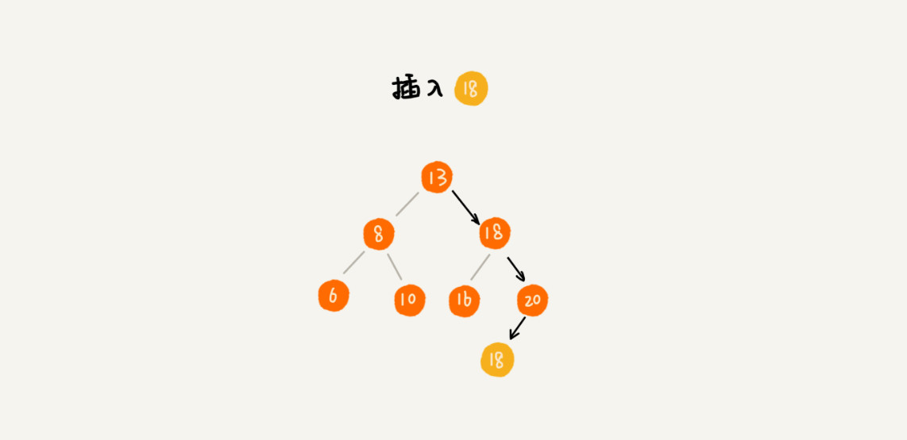

当要查找数据的时候，遇到值相同的节点，我们并不停止查找操作，而是继续在右子树中查找，直到遇到叶子节点，才停止。这样就可以把键值等于要查找值的所有节点都找出来。

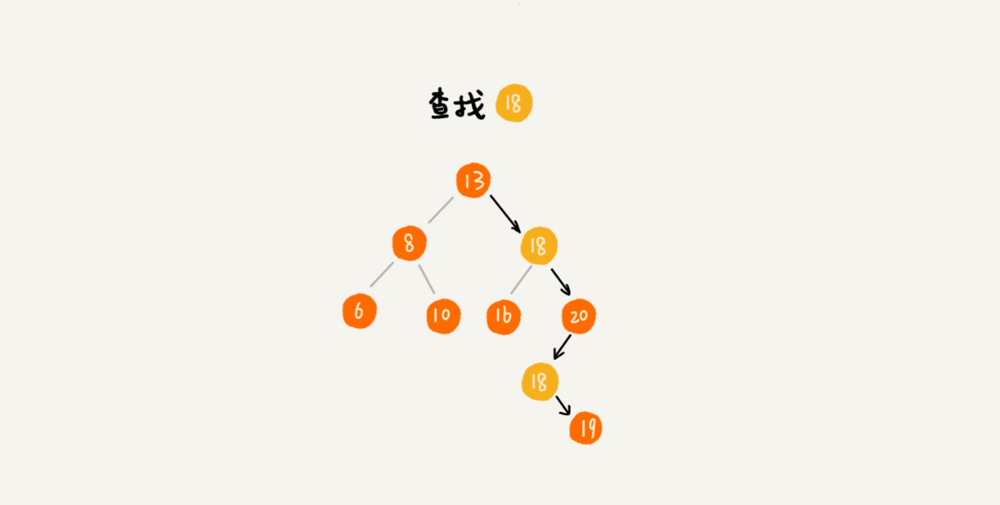

对于删除操作，我们也需要先查找到每个要删除的节点，然后再按前面讲的删除操作的方法，依次删除。


#### 二叉查找树的时间复杂度分析

实际上，二叉查找树的形态各式各样。比如这个图中，对于同一组数据，我们构造了三种二叉查找树。它们的查找、插入、删除操作的执行效率都是不一样的。图中第一种二叉查找树，根节点的左右子树极度不平衡，已经退化成了链表，所以查找的时间复杂度就变成了O(n)。


我刚刚其实分析了一种最糟糕的情况，我们现在来分析一个最理想的情况，二叉查找树是一棵完全二叉树（或满二叉树）。这个时候，插入、删除、查找的时间复杂度是多少呢？

从我前面的例子、图，以及还有代码来看，不管操作是插入、删除还是查找，**时间复杂度其实都跟树的高度成正比，也就是O(height)**。既然这样，现在问题就转变成另外一个了，也就是，如何求一棵包含n个节点的完全二叉树的高度？

树的高度就等于最大层数减一，为了方便计算，我们转换成层来表示。从图中可以看出，包含n个节点的完全二叉树中，第一层包含1个节点，第二层包含2个节点，第三层包含4个节点，依次类推，下面一层节点个数是上一层的2倍，第K层包含的节点个数就是2^(K-1)^。

不过，对于完全二叉树来说，最后一层的节点个数有点儿不遵守上面的规律了。它包含的节点个数在1个到2^(L-1)个之间（我们假设最大层数是L）。如果我们把每一层的节点个数加起来就是总的节点个数n。也就是说，如果节点的个数是n，那么n满足这样一个关系：

```
n >= 1+2+4+8+...+2^(L-2)+1
n <= 1+2+4+8+...+2^(L-2)+2^(L-1)
```

借助等比数列的求和公式，我们可以计算出，L的范围是[log~2~(n+1), log~2~n +1]。完全二叉树的层数小于等于log~2~n +1，也就是说，完全二叉树的高度小于等于log~2~n。

显然，极度不平衡的二叉查找树，它的查找性能肯定不能满足我们的需求。我们需要构建一种不管怎么删除、插入数据，在任何时候，都能保持任意节点左右子树都比较平衡的二叉查找树，这就是平衡二叉查找树。平衡二叉查找树的高度接近logn，所以插入、删除、查找操作的时间复杂度也比较稳定，是O(logn)。

### 练习

#### 散列表的插入、删除、查找操作的时间复杂度可以做到常量级的O(1)，非常高效。而二叉查找树在比较平衡的情况下，插入、删除、查找操作时间复杂度才是O(logn)，相对散列表，好像并没有什么优势，那我们为什么还要用二叉查找树呢？

我认为有下面几个原因：

第一，散列表中的数据是无序存储的，如果要输出有序的数据，需要先进行排序。而对于二叉查找树来说，我们只需要中序遍历，就可以在O(n)的时间复杂度内，输出有序的数据序列。

第二，散列表扩容耗时很多，而且当遇到散列冲突时，性能不稳定，尽管二叉查找树的性能不稳定，但是在工程中，我们最常用的平衡二叉查找树的性能非常稳定，时间复杂度稳定在O(logn)。

第三，笼统地来说，尽管散列表的查找等操作的时间复杂度是常量级的，但因为哈希冲突的存在，这个常量不一定比logn小，所以实际的查找速度可能不一定比O(logn)快。加上哈希函数的耗时，也不一定就比平衡二叉查找树的效率高。

第四，散列表的构造比二叉查找树要复杂，需要考虑的东西很多。比如散列函数的设计、冲突解决办法、扩容、缩容等。平衡二叉查找树只需要考虑平衡性这一个问题，而且这个问题的解决方案比较成熟、固定。

最后，为了避免过多的散列冲突，散列表装载因子不能太大，特别是基于开放寻址法解决冲突的散列表，不然会浪费一定的存储空间。

综合这几点，平衡二叉查找树在某些方面还是优于散列表的，所以，这两者的存在并不冲突。我们在实际的开发过程中，需要结合具体的需求来选择使用哪一个。

#### 如何通过编程，求出一棵给定二叉树的确切高度呢？

确定二叉树高度有两种思路：

第一种是深度优先思想的递归，分别求左右子树的高度。当前节点的高度就是左右子树中较大的那个+1；

第二种可以采用层次遍历的方式，每一层刚开始遍历的时候，树的高度+1。最后队列为空，就能得到树的高度。

## 红黑树

### 什么是“平衡二叉查找树”？

平衡二叉树的严格定义是这样的：二叉树中任意一个节点的左右子树的高度相差不能大于1。从这个定义来看，上一节我们讲的完全二叉树、满二叉树其实都是平衡二叉树，但是非完全二叉树也有可能是平衡二叉树。

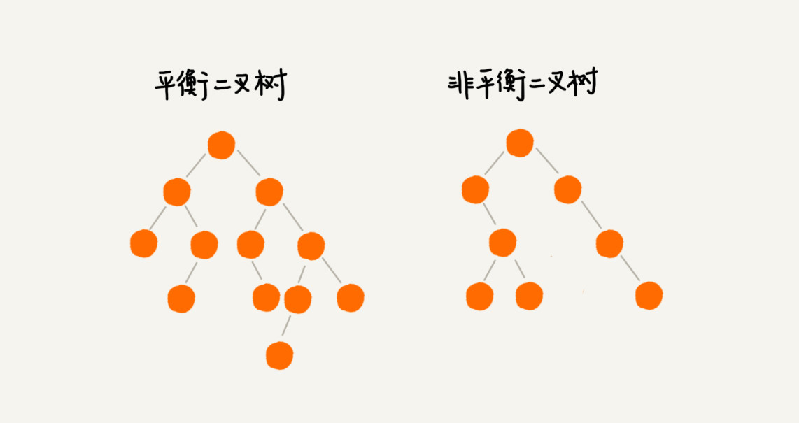

平衡二叉查找树不仅满足上面平衡二叉树的定义，还满足二叉查找树的特点。最先被发明的平衡二叉查找树是AVL树，它严格符合我刚讲到的平衡二叉查找树的定义，即任何节点的左右子树高度相差不超过1，是一种高度平衡的二叉查找树。

但是很多平衡二叉查找树其实并没有严格符合上面的定义（树中任意一个节点的左右子树的高度相差不能大于1），比如我们下面要讲的红黑树，它从根节点到各个叶子节点的最长路径，有可能会比最短路径大一倍。

发明平衡二叉查找树这类数据结构的初衷是，解决普通二叉查找树在频繁的插入、删除等动态更新的情况下，出现时间复杂度退化的问题。

所以，**平衡二叉查找树中“平衡”的意思，其实就是让整棵树左右看起来比较“对称”、比较“平衡”，不要出现左子树很高、右子树很矮的情况。这样就能让整棵树的高度相对来说低一些，相应的插入、删除、查找等操作的效率高一些。**

所以，如果我们现在设计一个新的平衡二叉查找树，只要树的高度不比log~2~n大很多（比如树的高度仍然是对数量级的），尽管它不符合我们前面讲的严格的平衡二叉查找树的定义，但我们仍然可以说，这是一个合格的平衡二叉查找树。

### 如何定义一棵“红黑树”？

平衡二叉查找树其实有很多，比如，Splay Tree（伸展树）、Treap（树堆）等，但是我们提到平衡二叉查找树，听到的基本都是红黑树。它的出镜率甚至要高于“平衡二叉查找树”这几个字，有时候，我们甚至默认平衡二叉查找树就是红黑树。

红黑树的英文是“Red-Black Tree”，简称R-B Tree。它是一种不严格的平衡二叉查找树，我前面说了，它的定义是不严格符合平衡二叉查找树的定义的。那红黑树究竟是怎么定义的呢？

顾名思义，红黑树中的节点，一类被标记为黑色，一类被标记为红色。除此之外，一棵红黑树还需要满足这样几个要求：

- 根节点是黑色的；
- 每个叶子节点都是黑色的空节点（NIL），也就是说，叶子节点不存储数据；
- 任何相邻的节点都不能同时为红色，也就是说，红色节点是被黑色节点隔开的；
- 每个节点，从该节点到达其可达叶子节点的所有路径，都包含相同数目的黑色节点；

这里的第二点要求“叶子节点都是黑色的空节点”，稍微有些奇怪，它主要是为了简化红黑树的代码实现而设置的，我们暂时不考虑这一点，所以，在画图和讲解的时候，我将黑色的、空的叶子节点都省略掉了。

为了让你更好地理解上面的定义，我画了两个红黑树的图例，你可以对照着看下。


### 为什么说红黑树是“近似平衡”的？

我们前面也讲到，平衡二叉查找树的初衷，是为了解决二叉查找树因为动态更新导致的性能退化问题。所以，**“平衡”的意思可以等价为性能不退化。“近似平衡”就等价为性能不会退化的太严重**。

我们在上一节讲过，二叉查找树很多操作的性能都跟树的高度成正比。一棵极其平衡的二叉树（满二叉树或完全二叉树）的高度大约是log~2~n，所以如果要证明红黑树是近似平衡的，我们只需要分析，红黑树的高度是否比较稳定地趋近log~2~n就好了。

红黑树的高度不是很好分析，我带你一步一步来推导。

**首先，我们来看，如果我们将红色节点从红黑树中去掉，那单纯包含黑色节点的红黑树的高度是多少呢？**

红色节点删除之后，有些节点就没有父节点了，它们会直接拿这些节点的祖父节点（父节点的父节点）作为父节点。所以，之前的二叉树就变成了四叉树。


前面红黑树的定义里有这么一条：从任意节点到可达的叶子节点的每个路径包含相同数目的黑色节点。我们从四叉树中取出某些节点，放到叶节点位置，四叉树就变成了完全二叉树。所以，仅包含黑色节点的四叉树的高度，比包含相同节点个数的完全二叉树的高度还要小。

上一节我们说，完全二叉树的高度近似log~2~n，这里的四叉“黑树”的高度要低于完全二叉树，所以去掉红色节点的“黑树”的高度也不会超过log~2~n。

**我们现在知道只包含黑色节点的“黑树”的高度，那我们现在把红色节点加回去，高度会变成多少呢？**

在红黑树中，红色节点不能相邻，也就是说，有一个红色节点就要至少有一个黑色节点，将它跟其他红色节点隔开。红黑树中包含最多黑色节点的路径不会超过log~2~n，所以加入红色节点之后，最长路径不会超过2log~2~n，也就是说，红黑树的高度近似2log~2~n。

所以，红黑树的高度只比高度平衡的AVL树的高度（log~2~n）仅仅大了一倍，在性能上，下降得并不多。这样推导出来的结果不够精确，实际上红黑树的性能更好。

### 练习

#### 为什么在工程中大家都喜欢用红黑树这种平衡二叉查找树？

我们前面提到Treap、Splay Tree，绝大部分情况下，它们操作的效率都很高，但是也无法避免极端情况下时间复杂度的退化。尽管这种情况出现的概率不大，但是对于单次操作时间非常敏感的场景来说，它们并不适用。

AVL树是一种高度平衡的二叉树，所以查找的效率非常高，但是，有利就有弊，AVL树为了维持这种高度的平衡，就要付出更多的代价。每次插入、删除都要做调整，就比较复杂、耗时。所以，对于有频繁的插入、删除操作的数据集合，使用AVL树的代价就有点高了。

红黑树只是做到了近似平衡，并不是严格的平衡，所以在维护平衡的成本上，要比AVL树要低。

所以，红黑树的插入、删除、查找各种操作性能都比较稳定。对于工程应用来说，要面对各种异常情况，为了支撑这种工业级的应用，我们更倾向于这种性能稳定的平衡二叉查找树。

#### 动态数据结构支持动态地数据插入、删除、查找操作，除了红黑树，我们前面还学习过哪些呢？能对比一下各自的优势、劣势，以及应用场景吗？

散列表：插入删除查找都是O(1), 是最常用的，但其缺点是不能顺序遍历以及扩容缩容的性能损耗。适用于那些不需要顺序遍历，数据更新不那么频繁的。

跳表：插入删除查找都是O(logn), 并且能顺序遍历。缺点是空间复杂度O(n)。适用于不那么在意内存空间的，其顺序遍历和区间查找非常方便。

红黑树：插入删除查找都是O(logn), 中序遍历即是顺序遍历，稳定。缺点是难以实现，去查找不方便。其实跳表更佳，但红黑树已经用于很多地方了。

### 实现红黑树的基本思想

实际上，红黑树的平衡过程跟魔方复原非常神似，大致过程就是：**遇到什么样的节点排布，我们就对应怎么去调整**。只要按照这些固定的调整规则来操作，就能将一个非平衡的红黑树调整成平衡的。

一棵合格的红黑树需要满足这样几个要求：

- 根节点是黑色的；
- 每个叶子节点都是黑色的空节点（NIL），也就是说，叶子节点不存储数据；
- 任何相邻的节点都不能同时为红色，也就是说，红色节点是被黑色节点隔开的；
- 每个节点，从该节点到达其可达叶子节点的所有路径，都包含相同数目的黑色节点。

在插入、删除节点的过程中，第三、第四点要求可能会被破坏，而我们今天要讲的“平衡调整”，实际上就是要把被破坏的第三、第四点恢复过来。

在正式开始之前，我先介绍两个非常重要的操作，**左旋（rotate left）**、**右旋（rotate right）**。左旋全称其实是叫**围绕某个节点的左旋**，那右旋的全称估计你已经猜到了，就叫**围绕某个节点的右旋**。

我们下面的平衡调整中，会一直用到这两个操作，所以我这里画了个示意图，帮助你彻底理解这两个操作。图中的a，b，r表示子树，可以为空。


### 插入操作的平衡调整

https://blog.csdn.net/fei33423/article/details/79132930（2-3查找树）

**红黑树规定，插入的节点必须是红色的。而且，二叉查找树中新插入的节点都是放在叶子节点上**。所以，关于插入操作的平衡调整，有这样两种特殊情况，但是也都非常好处理。

- 如果插入节点的父节点是黑色的，那我们什么都不用做，它仍然满足红黑树的定义。
- 如果插入的节点是根节点，那我们直接改变它的颜色，把它变成黑色就可以了。

除此之外，其他情况都会违背红黑树的定义，于是我们就需要进行调整，调整的过程包含两种基础的操作：**左右旋转**和**改变颜色**。

红黑树的平衡调整过程是一个迭代的过程。我们把正在处理的节点叫作**关注节点**。关注节点会随着不停地迭代处理，而不断发生变化。最开始的关注节点就是新插入的节点。

新节点插入之后，如果红黑树的平衡被打破，那一般会有下面三种情况。我们只需要根据每种情况的特点，不停地调整，就可以让红黑树继续符合定义，也就是继续保持平衡。

我们下面依次来看每种情况的调整过程。提醒你注意下，为了简化描述，我把父节点的兄弟节点叫作叔叔节点，父节点的父节点叫作祖父节点。

**CASE 1：如果关注节点是a，它的叔叔节点d是红色**，我们就依次执行下面的操作：

- 将关注节点a的父节点b、叔叔节点d的颜色都设置成黑色；
- 将关注节点a的祖父节点c的颜色设置成红色；
- 关注节点变成a的祖父节点c；
- 跳到CASE 2或者CASE 3。


**CASE 2：如果关注节点是a，它的叔叔节点d是黑色，关注节点a是其父节点b的右子节点**，我们就依次执行下面的操作：

- 关注节点变成节点a的父节点b；
- 围绕新的关注节点b左旋；
- 跳到CASE 3。


**CASE 3：如果关注节点是a，它的叔叔节点d是黑色，关注节点a是其父节点b的左子节点**，我们就依次执行下面的操作：

- 围绕关注节点a的祖父节点c右旋；
- 将关注节点a的父节点b、兄弟节点c的颜色互换。
- 调整结束。


### 删除操作的平衡调整

删除操作的平衡调整分为两步，第一步是**针对删除节点初步调整**。初步调整只是保证整棵红黑树在一个节点删除之后，仍然满足最后一条定义的要求，也就是说，每个节点，从该节点到达其可达叶子节点的所有路径，都包含相同数目的黑色节点；第二步是**针对关注节点进行二次调整**，让它满足红黑树的第三条定义，即不存在相邻的两个红色节点。

#### 1.针对删除节点初步调整

这里需要注意一下，红黑树的定义中“只包含红色节点和黑色节点”，经过初步调整之后，为了保证满足红黑树定义的最后一条要求，有些节点会被标记成两种颜色，“红-黑”或者“黑-黑”。如果一个节点被标记为了“黑-黑”，那在计算黑色节点个数的时候，要算成两个黑色节点。

在下面的讲解中，如果一个节点既可以是红色，也可以是黑色，在画图的时候，我会用一半红色一半黑色来表示。如果一个节点是“红-黑”或者“黑-黑”，我会用左上角的一个小黑点来表示额外的黑色。

**CASE 1：如果要删除的节点是a，它只有一个子节点b**，那我们就依次进行下面的操作：

- 删除节点a，并且把节点b替换到节点a的位置，这一部分操作跟普通的二叉查找树的删除操作一样；
- 节点a只能是黑色，节点b也只能是红色，其他情况均不符合红黑树的定义。这种情况下，我们把节点b改为黑色；
- 调整结束，不需要进行二次调整。


**CASE 2：如果要删除的节点a有两个非空子节点，并且它的后继节点就是节点a的右子节点c**。我们就依次进行下面的操作：

- 如果节点a的后继节点就是右子节点c，那右子节点c肯定没有左子树。我们把节点a删除，并且将节点c替换到节点a的位置。这一部分操作跟普通的二叉查找树的删除操作无异；
- 然后把节点c的颜色设置为跟节点a相同的颜色；
- 如果节点c是黑色，为了不违反红黑树的最后一条定义，我们给节点c的右子节点d多加一个黑色，这个时候节点d就成了“红-黑”或者“黑-黑”；
- 这个时候，关注节点变成了节点d，第二步的调整操作就会针对关注节点来做。


**CASE 3：如果要删除的是节点a，它有两个非空子节点，并且节点a的后继节点不是右子节点**，我们就依次进行下面的操作：

- 找到后继节点d，并将它删除，删除后继节点d的过程参照CASE 1；
- 将节点a替换成后继节点d；
- 把节点d的颜色设置为跟节点a相同的颜色；
- 如果节点d是黑色，为了不违反红黑树的最后一条定义，我们给节点d的右子节点c多加一个黑色，这个时候节点c就成了“红-黑”或者“黑-黑”；
- 这个时候，关注节点变成了节点c，第二步的调整操作就会针对关注节点来做。

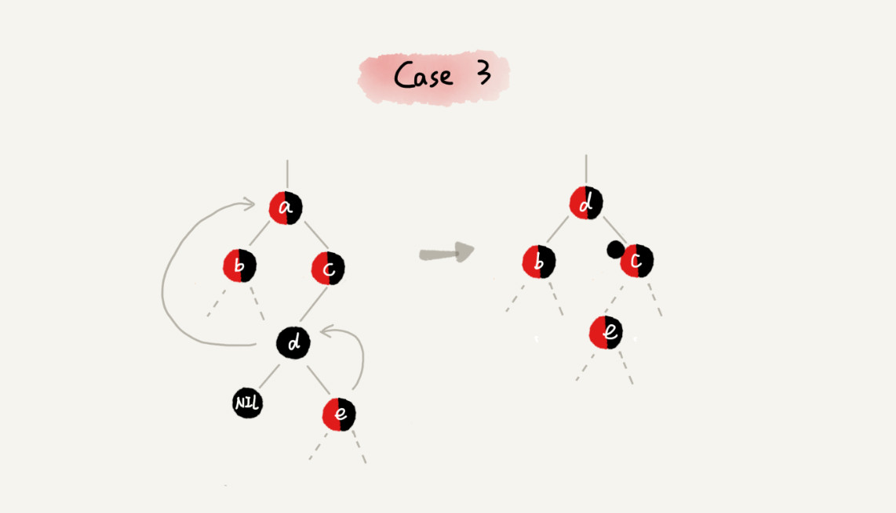

#### 2.针对关注节点进行二次调整

经过初步调整之后，关注节点变成了“红-黑”或者“黑-黑”节点。针对这个关注节点，我们再分四种情况来进行二次调整。二次调整是为了让红黑树中不存在相邻的红色节点。

**CASE 1：如果关注节点是a，它的兄弟节点c是红色的**，我们就依次进行下面的操作：

- 围绕关注节点a的父节点b左旋；
- 关注节点a的父节点b和祖父节点c交换颜色；
- 关注节点不变；
- 继续从四种情况中选择适合的规则来调整。


**CASE 2：如果关注节点是a，它的兄弟节点c是黑色的，并且节点c的左右子节点d、e都是黑色的**，我们就依次进行下面的操作：

- 将关注节点a的兄弟节点c的颜色变成红色；
- 从关注节点a中去掉一个黑色，这个时候节点a就是单纯的红色或者黑色；
- 给关注节点a的父节点b添加一个黑色，这个时候节点b就变成了“红-黑”或者“黑-黑”；
- 关注节点从a变成其父节点b；
- 继续从四种情况中选择符合的规则来调整。


**CASE 3：如果关注节点是a，它的兄弟节点c是黑色，c的左子节点d是红色，c的右子节点e是黑色**，我们就依次进行下面的操作：

- 围绕关注节点a的兄弟节点c右旋；
- 节点c和节点d交换颜色；
- 关注节点不变；
- 跳转到CASE 4，继续调整。

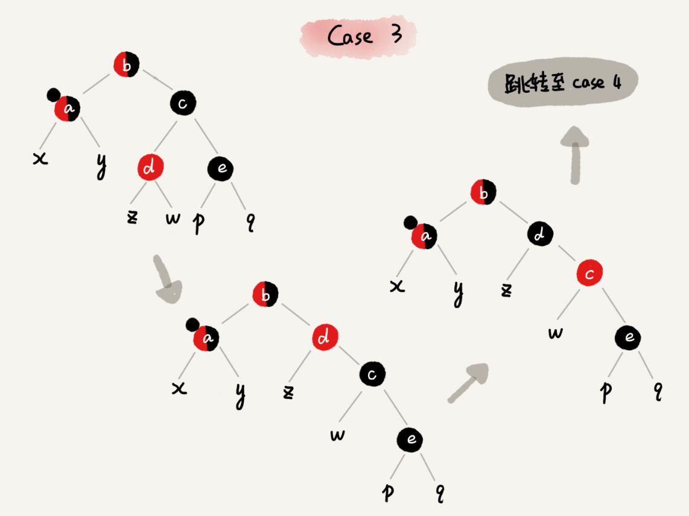

**CASE 4：如果关注节点a的兄弟节点c是黑色的，并且c的右子节点是红色的**，我们就依次进行下面的操作：

- 围绕关注节点a的父节点b左旋；
- 将关注节点a的兄弟节点c的颜色，跟关注节点a的父节点b设置成相同的颜色；
- 将关注节点a的父节点b的颜色设置为黑色；
- 从关注节点a中去掉一个黑色，节点a就变成了单纯的红色或者黑色；
- 将关注节点a的叔叔节点e设置为黑色；
- 调整结束。


### 练习

#### 为什么红黑树的定义中，要求叶子节点是黑色的空节点？

要我说，之所以有这么奇怪的要求，其实就是为了实现起来方便。只要满足这一条要求，那在任何时刻，红黑树的平衡操作都可以归结为我们刚刚讲的那几种情况。

还是有点不好理解，我通过一个例子来解释一下。假设红黑树的定义中不包含刚刚提到的那一条“叶子节点必须是黑色的空节点”，我们往一棵红黑树中插入一个数据，新插入节点的父节点也是红色的，两个红色的节点相邻，这个时候，红黑树的定义就被破坏了。那我们应该如何调整呢？


你会发现，这个时候，我们前面讲的插入时，三种情况下的平衡调整规则，没有一种是适用的。但是，如果我们把黑色的空节点都给它加上，变成下面这样，你会发现，它满足CASE 2了。


你可能会说，你可以调整一下平衡调整规则啊。比如把CASE 2改为“如果关注节点a的叔叔节点b是黑色或者不存在，a是父节点的右子节点，就进行某某操作”。当然可以，但是这样的话规则就没有原来简洁了。

你可能还会说，这样给红黑树添加黑色的空的叶子节点，会不会比较浪费存储空间呢？答案是不会的。虽然我们在讲解或者画图的时候，每个黑色的、空的叶子节点都是独立画出来的。实际上，在具体实现的时候，我们只需要像下面这样，共用一个黑色的、空的叶子节点就行了。


## 递归树

### 递归树与时间复杂度分析

递归的思想就是，将大问题分解为小问题来求解，然后再将小问题分解为小小问题。这样一层一层地分解，直到问题的数据规模被分解得足够小，不用继续递归分解为止。

如果我们把这个一层一层的分解过程画成图，它其实就是一棵树。我们给这棵树起一个名字，叫作**递归树**。我这里画了一棵斐波那契数列的递归树，你可以看看。节点里的数字表示数据的规模，一个节点的求解可以分解为左右子节点两个问题的求解。


**如何用递归树来求解时间复杂度**。

归并排序的递归实现代码非常简洁。现在我们就借助归并排序来看看，如何用递归树，来分析递归代码的时间复杂度。

我们把归并排序画成递归树，就是下面这个样子：


因为每次分解都是一分为二，所以代价很低，我们把时间上的消耗记作常量1。归并算法中比较耗时的是归并操作，也就是把两个子数组合并为大数组。从图中我们可以看出，每一层归并操作消耗的时间总和是一样的，跟要排序的数据规模有关。我们把每一层归并操作消耗的时间记作n。

现在，我们只需要知道这棵树的高度h，用高度h乘以每一层的时间消耗n，就可以得到总的时间复杂度O(n*h)。

从归并排序的原理和递归树，可以看出来，归并排序递归树是一棵满二叉树。我们前两节中讲到，满二叉树的高度大约是log~2~n，所以，归并排序递归实现的时间复杂度就是O(nlog n)。我这里的时间复杂度都是估算的，对树的高度的计算也没有那么精确，但是这并不影响复杂度的计算结果。

### 实战一：分析快速排序的时间复杂度

在用递归树推导之前，我们先来回忆一下用递推公式的分析方法。你可以回想一下，当时，我们为什么说用递推公式来求解平均时间复杂度非常复杂？

快速排序在最好情况下，每次分区都能一分为二，这个时候用递推公式T(n)=2*T(n/2)+n，很容易就能推导出时间复杂度是O(nlog n)。但是，我们并不可能每次分区都这么幸运，正好一分为二。

我们假设平均情况下，每次分区之后，两个分区的大小比例为1:k。当k=9时，如果用递推公式的方法来求解时间复杂度的话，递推公式就写成T(n)=T(n/10)+T(9*n/10)+n。

这个公式可以推导出时间复杂度，但是推导过程非常复杂。那我们来看看，**用递归树来分析快速排序的平均情况时间复杂度，是不是比较简单呢？**

我们还是取k等于9，也就是说，每次分区都很不平均，一个分区是另一个分区的9倍。如果我们把递归分解的过程画成递归树，就是下面这个样子：


快速排序的过程中，每次分区都要遍历待分区区间的所有数据，所以，每一层分区操作所遍历的数据的个数之和就是n。我们现在只要求出递归树的高度h，这个快排过程遍历的数据个数就是 h * n ，也就是说，时间复杂度就是O(h * n)。

因为每次分区并不是均匀地一分为二，所以递归树并不是满二叉树。这样一个递归树的高度是多少呢？

我们知道，快速排序结束的条件就是待排序的小区间，大小为1，也就是说叶子节点里的数据规模是1。从根节点n到叶子节点1，递归树中最短的一个路径每次都乘以1/10，最长的一个路径每次都乘以9/10。通过计算，我们可以得到，从根节点到叶子节点的最短路径是log~10~n，最长的路径是log~{10/9}~n。


所以，遍历数据的个数总和就介于nlog~10~n和nlog~{10/9}~n之间。根据复杂度的大O表示法，对数复杂度的底数不管是多少，我们统一写成log n，所以，当分区大小比例是1:9时，快速排序的时间复杂度仍然是O(nlog n)。

刚刚我们假设k=9，那如果k=99，也就是说，每次分区极其不平均，两个区间大小是1:99，这个时候的时间复杂度是多少呢？

我们可以类比上面k=9的分析过程。当k=99的时候，树的最短路径就是log~100~n，最长路径是log~{100/99}~n，所以总遍历数据个数介于nlog~100~n和nlog~{100/99}~n之间。尽管底数变了，但是时间复杂度也仍然是O(nlog n)。

也就是说，对于k等于9，99，甚至是999，9999……，只要k的值不随n变化，是一个事先确定的常量，那快排的时间复杂度就是O(nlog n)。所以，从概率论的角度来说，快排的平均时间复杂度就是O(nlog n)。

### 实战二：分析斐波那契数列的时间复杂度

在递归那一节中，我们举了一个跨台阶的例子，那个例子实际上就是一个斐波那契数列。它的代码实现在这。

```
int f(int n) {
  if (n == 1) return 1;
  if (n == 2) return 2;
  return f(n-1) + f(n-2);
}
```

我们先把上面的递归代码画成递归树，就是下面这个样子：

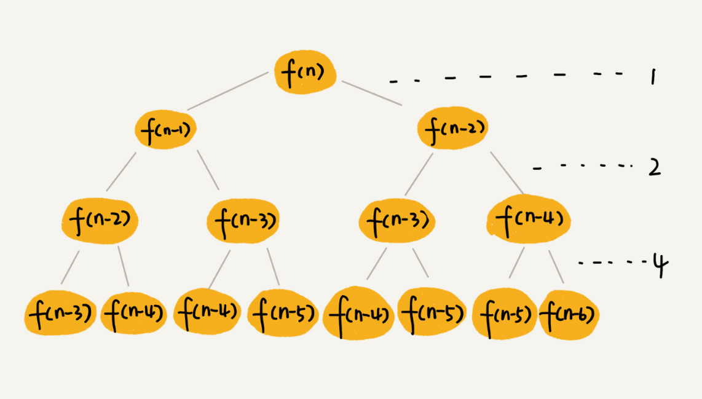

这棵递归树的高度是多少呢？

f(n)分解为f(n-1)和f(n-2)，每次数据规模都是-1或-2，叶子节点的数据规模是1或者2。所以，从根节点走到叶子节点，每条路径是长短不一的。如果每次都是-1，那最长路径大约就是n；如果每次都是-2，那最短路径大约就是n/2。

每次分解之后的合并操作只需要一次加法运算，我们把这次加法运算的时间消耗记作1。所以，从上往下，第一层的总时间消耗是1，第二层的总时间消耗是2，第三层的总时间消耗就是2^2^。依次类推，第k层的时间消耗就是2^{k-1}^，那整个算法的总的时间消耗就是每一层时间消耗之和。

如果路径长度都为n，那这个总和就是2^n^-1。


如果路径长度都是n/2 ，那整个算法的总的时间消耗就是2^n/2^-1。

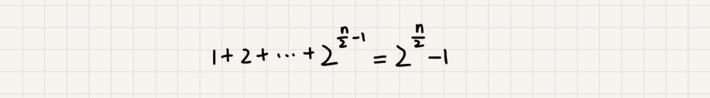

所以，这个算法的时间复杂度就介于O(2^n^)和O(2^n/2^)之间。虽然这样得到的结果还不够精确，只是一个范围，但是我们也基本上知道了上面算法的时间复杂度是指数级的，非常高。

### 实战三：分析全排列的时间复杂度

我们在高中的时候都学过排列组合。“如何把n个数据的所有排列都找出来”，这就是全排列的问题。

我来举个例子。比如，1， 2，3这样3个数据，有下面这几种不同的排列：

```
1, 2, 3
1, 3, 2
2, 1, 3
2, 3, 1
3, 1, 2
3, 2, 1
```

如何编程打印一组数据的所有排列呢？这里就可以用递归来实现。

如果我们确定了最后一位数据，那就变成了求解剩下n-1个数据的排列问题。而最后一位数据可以是n个数据中的任意一个，因此它的取值就有n种情况。所以，“n个数据的排列”问题，就可以分解成n个“n-1个数据的排列”的子问题。

如果我们把它写成递推公式，就是下面这个样子：

```
假设数组中存储的是1，2， 3...n。
        
f(1,2,...n) = {最后一位是1, f(n-1)} + {最后一位是2, f(n-1)} +...+{最后一位是n, f(n-1)}。
```

```
// 调用方式：
// int[]a = a={1, 2, 3, 4}; printPermutations(a, 4, 4);
// k表示要处理的子数组的数据个数
public void printPermutations(int[] data, int n, int k) {
  if (k == 1) {
    for (int i = 0; i < n; ++i) {
      System.out.print(data[i] + " ");
    }
    System.out.println();
  }

  for (int i = 0; i < k; ++i) {
    int tmp = data[i];
    data[i] = data[k-1];
    data[k-1] = tmp;

    printPermutations(data, n, k - 1);

    tmp = data[i];
    data[i] = data[k-1];
    data[k-1] = tmp;
  }
}
```

如果不用我前面讲的递归树分析方法，这个递归代码的时间复杂度会比较难分析。现在，我们来看下，如何借助递归树，轻松分析出这个代码的时间复杂度。

首先，我们还是画出递归树。不过，现在的递归树已经不是标准的二叉树了。


第一层分解有n次交换操作，第二层有n个节点，每个节点分解需要n-1次交换，所以第二层总的交换次数是n(n-1)。第三层有n(n-1)个节点，每个节点分解需要n-2次交换，所以第三层总的交换次数是n(n-1)(n-2)。

以此类推，第k层总的交换次数就是n * (n-1) * (n-2) * … * (n-k+1)。最后一层的交换次数就是n * (n-1) * (n-2) * … * 2 * 1。每一层的交换次数之和就是总的交换次数。

```
n + n*(n-1) + n*(n-1)*(n-2) +... + n*(n-1)*(n-2)*...*2*1
```

这个公式的求和比较复杂，我们看最后一个数，n * (n-1) * (n-2) * … * 2 * 1等于n!，而前面的n-1个数都小于最后一个数，所以，总和肯定小于n * n!，也就是说，全排列的递归算法的时间复杂度大于O(n!)，小于O(n * n!)，虽然我们没法知道非常精确的时间复杂度，但是这样一个范围已经让我们知道，全排列的时间复杂度是非常高的。

### 练习

1个细胞的生命周期是3小时，1小时分裂一次。求n小时后，容器内有多少细胞？请你用已经学过的递归时间复杂度的分析方法，分析一下这个递归问题的时间复杂度。

假设细胞到了第三个小时是先分裂完再死亡，那么递推公式就应该是：
f(n) = f(n-1)*2 - f(n-3)

一次乘法和一次减法一起看作一次基本操作消耗，那么情况和斐波那契数列很像。

最高的树应该有n层， 最短的是n/3层，每层操作数都是指数增长。
那么时间复杂度应该是在O(2^n)量级的。

## 堆和堆排序

### 如何理解“堆”？

只要满足这两点，它就是一个堆。

- 堆是一个完全二叉树；
- 堆中每一个节点的值都必须大于等于（或小于等于）其子树中每个节点的值。

第一点，堆必须是一个完全二叉树。完全二叉树要求，除了最后一层，其他层的节点个数都是满的，最后一层的节点都靠左排列。

第二点，堆中的每个节点的值必须大于等于（或者小于等于）其子树中每个节点的值。实际上，我们还可以换一种说法，堆中每个节点的值都大于等于（或者小于等于）其左右子节点的值。这两种表述是等价的。

对于每个节点的值都大于等于子树中每个节点值的堆，我们叫作“大顶堆”。对于每个节点的值都小于等于子树中每个节点值的堆，我们叫作“小顶堆”。

下面这几个二叉树是不是堆？

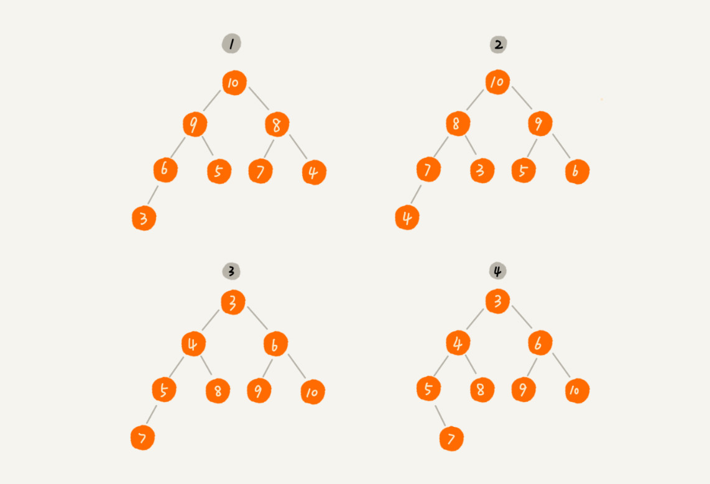

其中第1个和第2个是大顶堆，第3个是小顶堆，第4个不是堆。除此之外，从图中还可以看出来，对于同一组数据，我们可以构建多种不同形态的堆。

### 如何实现一个堆？

完全二叉树比较适合用数组来存储。用数组来存储完全二叉树是非常节省存储空间的。因为我们不需要存储左右子节点的指针，单纯地通过数组的下标，就可以找到一个节点的左右子节点和父节点。

我画了一个用数组存储堆的例子，你可以先看下。

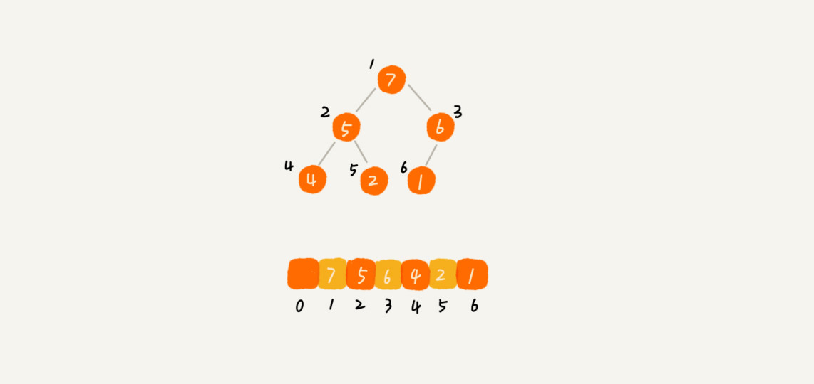

从图中我们可以看到，数组中下标为i的节点的左子节点，就是下标为i x 2的节点，右子节点就是下标为i*2+1的节点，父节点就是下标为i/2的节点。

如果没有特殊说明，我下面都是拿大顶堆来讲解。

#### 1.往堆中插入一个元素

往堆中插入一个元素后，我们需要继续满足堆的两个特性。

如果我们把新插入的元素放到堆的最后，你可以看我画的这个图，是不是不符合堆的特性了？于是，我们就需要进行调整，让其重新满足堆的特性，这个过程我们起了一个名字，就叫作**堆化**（heapify）。

堆化实际上有两种，从下往上和从上往下。这里我先讲**从下往上**的堆化方法。


堆化非常简单，就是顺着节点所在的路径，向上或者向下，对比，然后交换。

我这里画了一张堆化的过程分解图。我们可以让新插入的节点与父节点对比大小。如果不满足子节点小于等于父节点的大小关系，我们就互换两个节点。一直重复这个过程，直到父子节点之间满足刚说的那种大小关系。


```
public class Heap {
  private int[] a; // 数组，从下标1开始存储数据
  private int n;  // 堆可以存储的最大数据个数
  private int count; // 堆中已经存储的数据个数

  public Heap(int capacity) {
    a = new int[capacity + 1];
    n = capacity;
    count = 0;
  }

  public void insert(int data) {
    if (count >= n) return; // 堆满了
    ++count;
    a[count] = data;
    int i = count;
    while (i/2 > 0 && a[i] > a[i/2]) { // 自下往上堆化
      swap(a, i, i/2); // swap()函数作用：交换下标为i和i/2的两个元素
      i = i/2;
    }
  }
 }
```

#### 2.删除堆顶元素

从堆的定义的第二条中，任何节点的值都大于等于（或小于等于）子树节点的值，我们可以发现，堆顶元素存储的就是堆中数据的最大值或者最小值。

假设我们构造的是大顶堆，堆顶元素就是最大的元素。当我们删除堆顶元素之后，就需要把第二大的元素放到堆顶，那第二大元素肯定会出现在左右子节点中。然后我们再迭代地删除第二大节点，以此类推，直到叶子节点被删除。

这里我也画了一个分解图。不过这种方法有点问题，就是最后堆化出来的堆并不满足完全二叉树的特性。


实际上，我们稍微改变一下思路，就可以解决这个问题。你看我画的下面这幅图。我们把最后一个节点放到堆顶，然后利用同样的父子节点对比方法。对于不满足父子节点大小关系的，互换两个节点，并且重复进行这个过程，直到父子节点之间满足大小关系为止。这就是**从上往下的堆化方法**。

因为我们移除的是数组中的最后一个元素，而在堆化的过程中，都是交换操作，不会出现数组中的“空洞”，所以这种方法堆化之后的结果，肯定满足完全二叉树的特性。


```
public void removeMax() {
  if (count == 0) return -1; // 堆中没有数据
  a[1] = a[count];
  --count;
  heapify(a, count, 1);
}

private void heapify(int[] a, int n, int i) { // 自上往下堆化
  while (true) {
    int maxPos = i;
    if (i*2 <= n && a[i] < a[i*2]) maxPos = i*2;
    if (i*2+1 <= n && a[maxPos] < a[i*2+1]) maxPos = i*2+1;
    if (maxPos == i) break;
    swap(a, i, maxPos);
    i = maxPos;
  }
}
```

我们知道，一个包含n个节点的完全二叉树，树的高度不会超过log~2~n。堆化的过程是顺着节点所在路径比较交换的，所以堆化的时间复杂度跟树的高度成正比，也就是O(log n)。插入数据和删除堆顶元素的主要逻辑就是堆化，所以，往堆中插入一个元素和删除堆顶元素的时间复杂度都是O(log n)。

### 如何基于堆实现排序？

前面我们讲过好几种排序算法，我们再来回忆一下，有时间复杂度是O(n^2^)的冒泡排序、插入排序、选择排序，有时间复杂度是O(nlog n)的归并排序、快速排序，还有线性排序。

这里我们借助于堆这种数据结构实现的排序算法，就叫作堆排序。这种排序方法的时间复杂度非常稳定，是O(nlog n)，并且它还是原地排序算法。

我们可以把堆排序的过程大致分解成两个大的步骤，**建堆**和**排序**。

#### 1.建堆

我们首先将数组原地建成一个堆。所谓“原地”就是，不借助另一个数组，就在原数组上操作。建堆的过程，有两种思路。

第一种是借助我们前面讲的，在堆中插入一个元素的思路。尽管数组中包含n个数据，但是我们可以假设，起初堆中只包含一个数据，就是下标为1的数据。然后，我们调用前面讲的插入操作，将下标从2到n的数据依次插入到堆中。这样我们就将包含n个数据的数组，组织成了堆。

第二种实现思路，跟第一种截然相反，也是我这里要详细讲的。第一种建堆思路的处理过程是从前往后处理数组数据，并且每个数据插入堆中时，都是从下往上堆化。而第二种实现思路，是从后往前处理数组，并且每个数据都是从上往下堆化。

我举了一个例子，并且画了一个第二种实现思路的建堆分解步骤图，你可以看下。因为叶子节点往下堆化只能自己跟自己比较，所以我们直接从第一个非叶子节点开始，依次堆化就行了。


```
private static void buildHeap(int[] a, int n) {
  for (int i = n/2; i >= 1; --i) {
    heapify(a, n, i);
  }
}

private static void heapify(int[] a, int n, int i) {
  while (true) {
    int maxPos = i;
    if (i*2 <= n && a[i] < a[i*2]) maxPos = i*2;
    if (i*2+1 <= n && a[maxPos] < a[i*2+1]) maxPos = i*2+1;
    if (maxPos == i) break;
    swap(a, i, maxPos);
    i = maxPos;
  }
}
```

你可能已经发现了，在这段代码中，我们对下标从n/2 开始到1的数据进行堆化，下标是n/2+1到n的节点是叶子节点，我们不需要堆化。实际上，对于完全二叉树来说，下标从n/2+1到n的节点都是叶子节点。

现在，我们来看，建堆操作的时间复杂度是多少呢？

因为叶子节点不需要堆化，所以需要堆化的节点从倒数第二层开始。每个节点堆化的过程中，需要比较和交换的节点个数，跟这个节点的高度k成正比。

我把每一层的节点个数和对应的高度画了出来，你可以看看。我们只需要将每个节点的高度求和，得出的就是建堆的时间复杂度。

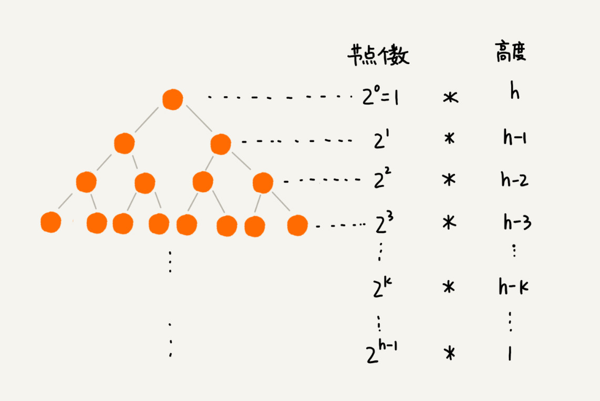

我们将每个非叶子节点的高度求和，就是下面这个公式：


这个公式的求解稍微有点技巧，不过我们高中应该都学过：把公式左右都乘以2，就得到另一个公式S2。我们将S2错位对齐，并且用S2减去S1，可以得到S。


S的中间部分是一个等比数列，所以最后可以用等比数列的求和公式来计算，最终的结果就是下面图中画的这个样子。


因为h=log~2~n，代入公式S，就能得到S=O(n)，所以，建堆的时间复杂度就是O(n)。

#### 2.排序

建堆结束之后，数组中的数据已经是按照大顶堆的特性来组织的。数组中的第一个元素就是堆顶，也就是最大的元素。我们把它跟最后一个元素交换，那最大元素就放到了下标为n的位置。

这个过程有点类似上面讲的“删除堆顶元素”的操作，当堆顶元素移除之后，我们把下标为n的元素放到堆顶，然后再通过堆化的方法，将剩下的n-1个元素重新构建成堆。堆化完成之后，我们再取堆顶的元素，放到下标是n-1的位置，一直重复这个过程，直到最后堆中只剩下标为1的一个元素，排序工作就完成了。

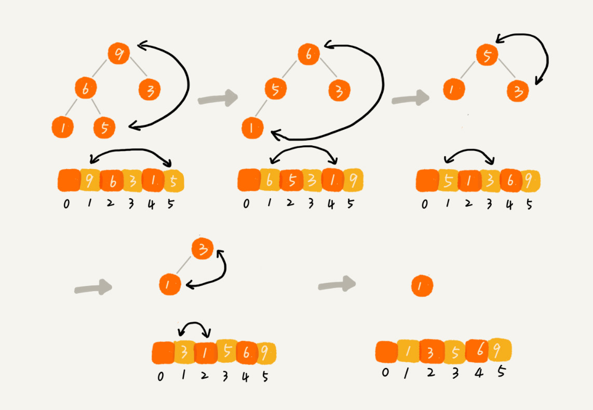

```
// n表示数据的个数，数组a中的数据从下标1到n的位置。
public static void sort(int[] a, int n) {
  buildHeap(a, n);
  int k = n;
  while (k > 1) {
    swap(a, 1, k);
    --k;
    heapify(a, k, 1);
  }
}
```

现在，我们再来分析一下堆排序的时间复杂度、空间复杂度以及稳定性。

整个堆排序的过程，都只需要极个别临时存储空间，所以堆排序是原地排序算法。堆排序包括建堆和排序两个操作，建堆过程的时间复杂度是O(n)，排序过程的时间复杂度是O(nlog n)，所以，堆排序整体的时间复杂度是O(nlog n)。

堆排序不是稳定的排序算法，因为在排序的过程，存在将堆的最后一个节点跟堆顶节点互换的操作，所以就有可能改变值相同数据的原始相对顺序。

### 练习

#### 为什么快速排序要比堆排序性能好？

我觉得主要有两方面的原因。

**第一点，堆排序数据访问的方式没有快速排序友好。**

对于快速排序来说，数据是顺序访问的。而对于堆排序来说，数据是跳着访问的。 比如，堆排序中，最重要的一个操作就是数据的堆化。比如下面这个例子，对堆顶节点进行堆化，会依次访问数组下标是1，2，4，8的元素，而不是像快速排序那样，局部顺序访问，所以，这样对CPU缓存是不友好的。


**第二点，对于同样的数据，在排序过程中，堆排序算法的数据交换次数要多于快速排序。**

我们在讲排序的时候，提过两个概念，有序度和逆序度。对于基于比较的排序算法来说，整个排序过程就是由两个基本的操作组成的，比较和交换（或移动）。快速排序数据交换的次数不会比逆序度多。

但是堆排序的第一步是建堆，建堆的过程会打乱数据原有的相对先后顺序，导致原数据的有序度降低。比如，对于一组已经有序的数据来说，经过建堆之后，数据反而变得更无序了。


#### 讲堆排序建堆的时候，对于完全二叉树来说，下标从n/2+1到n的都是叶子节点，这个结论是怎么推导出来的呢？

堆是完全二叉树，求最后的非叶子节点即是求最大的叶子节点的父节点。最大的叶子节点下标为n，他的父节点为n/2，这是最后一个非叶子节点，所以n/2+1到n都是叶子节点。

### 堆的应用

#### 堆的应用一：优先级队列

优先级队列，顾名思义，它首先应该是一个队列。我们前面讲过，队列最大的特性就是先进先出。不过，在优先级队列中，数据的出队顺序不是先进先出，而是按照优先级来，优先级最高的，最先出队。

如何实现一个优先级队列呢？方法有很多，但是用堆来实现是最直接、最高效的。这是因为，堆和优先级队列非常相似。一个堆就可以看作一个优先级队列。很多时候，它们只是概念上的区分而已。往优先级队列中插入一个元素，就相当于往堆中插入一个元素；从优先级队列中取出优先级最高的元素，就相当于取出堆顶元素。

你可别小看这个优先级队列，它的应用场景非常多。我们后面要讲的很多数据结构和算法都要依赖它。比如，赫夫曼编码、图的最短路径、最小生成树算法等等。不仅如此，很多语言中，都提供了优先级队列的实现，比如，Java的PriorityQueue，C++的priority_queue等。

##### 1.合并有序小文件

假设我们有100个小文件，每个文件的大小是100MB，每个文件中存储的都是有序的字符串。我们希望将这些100个小文件合并成一个有序的大文件。这里就会用到优先级队列。

整体思路有点像归并排序中的合并函数。我们从这100个文件中，各取第一个字符串，放入数组中，然后比较大小，把最小的那个字符串放入合并后的大文件中，并从数组中删除。

假设，这个最小的字符串来自于13.txt这个小文件，我们就再从这个小文件取下一个字符串，并且放到数组中，重新比较大小，并且选择最小的放入合并后的大文件，并且将它从数组中删除。依次类推，直到所有的文件中的数据都放入到大文件为止。

这里我们用数组这种数据结构，来存储从小文件中取出来的字符串。每次从数组中取最小字符串，都需要循环遍历整个数组，显然，这不是很高效。有没有更加高效方法呢？

这里就可以用到优先级队列，也可以说是堆。我们将从小文件中取出来的字符串放入到小顶堆中，那堆顶的元素，也就是优先级队列队首的元素，就是最小的字符串。我们将这个字符串放入到大文件中，并将其从堆中删除。然后再从小文件中取出下一个字符串，放入到堆中。循环这个过程，就可以将100个小文件中的数据依次放入到大文件中。

我们知道，删除堆顶数据和往堆中插入数据的时间复杂度都是O(logn)，n表示堆中的数据个数，这里就是100。是不是比原来数组存储的方式高效了很多呢？

##### 2.高性能定时器

假设我们有一个定时器，定时器中维护了很多定时任务，每个任务都设定了一个要触发执行的时间点。定时器每过一个很小的单位时间（比如1秒），就扫描一遍任务，看是否有任务到达设定的执行时间。如果到达了，就拿出来执行。


但是，这样每过1秒就扫描一遍任务列表的做法比较低效，主要原因有两点：第一，任务的约定执行时间离当前时间可能还有很久，这样前面很多次扫描其实都是徒劳的；第二，每次都要扫描整个任务列表，如果任务列表很大的话，势必会比较耗时。

针对这些问题，我们就可以用优先级队列来解决。我们按照任务设定的执行时间，将这些任务存储在优先级队列中，队列首部（也就是小顶堆的堆顶）存储的是最先执行的任务。

这样，定时器就不需要每隔1秒就扫描一遍任务列表了。它拿队首任务的执行时间点，与当前时间点相减，得到一个时间间隔T。

这个时间间隔T就是，从当前时间开始，需要等待多久，才会有第一个任务需要被执行。这样，定时器就可以设定在T秒之后，再来执行任务。从当前时间点到（T-1）秒这段时间里，定时器都不需要做任何事情。

当T秒时间过去之后，定时器取优先级队列中队首的任务执行。然后再计算新的队首任务的执行时间点与当前时间点的差值，把这个值作为定时器执行下一个任务需要等待的时间。

这样，定时器既不用间隔1秒就轮询一次，也不用遍历整个任务列表，性能也就提高了。

#### 堆的应用二：利用堆求Top K

刚刚我们学习了优先级队列，我们现在来看，堆的另外一个非常重要的应用场景，那就是“求Top K问题”。

我把这种求Top K的问题抽象成两类。一类是针对静态数据集合，也就是说数据集合事先确定，不会再变。另一类是针对动态数据集合，也就是说数据集合事先并不确定，有数据动态地加入到集合中。

针对静态数据，如何在一个包含n个数据的数组中，查找前K大数据呢？我们可以维护一个大小为K的小顶堆，顺序遍历数组，从数组中取出取数据与堆顶元素比较。如果比堆顶元素大，我们就把堆顶元素删除，并且将这个元素插入到堆中；如果比堆顶元素小，则不做处理，继续遍历数组。这样等数组中的数据都遍历完之后，堆中的数据就是前K大数据了。

遍历数组需要O(n)的时间复杂度，一次堆化操作需要O(logK)的时间复杂度，所以最坏情况下，n个元素都入堆一次，所以时间复杂度就是O(nlogK)。

针对动态数据求得Top K就是实时Top K。怎么理解呢？我举一个例子。一个数据集合中有两个操作，一个是添加数据，另一个询问当前的前K大数据。

如果每次询问前K大数据，我们都基于当前的数据重新计算的话，那时间复杂度就是O(nlogK)，n表示当前的数据的大小。实际上，我们可以一直都维护一个K大小的小顶堆，当有数据被添加到集合中时，我们就拿它与堆顶的元素对比。如果比堆顶元素大，我们就把堆顶元素删除，并且将这个元素插入到堆中；如果比堆顶元素小，则不做处理。这样，无论任何时候需要查询当前的前K大数据，我们都可以里立刻返回给他。

#### 堆的应用三：利用堆求中位数


对于一组**静态数据**，中位数是固定的，我们可以先排序，第n/2个数据就是中位数。每次询问中位数的时候，我们直接返回这个固定的值就好了。所以，尽管排序的代价比较大，但是边际成本会很小。但是，如果我们面对的是**动态数据**集合，中位数在不停地变动，如果再用先排序的方法，每次询问中位数的时候，都要先进行排序，那效率就不高了。

**借助堆这种数据结构，我们不用排序，就可以非常高效地实现求中位数操作。我们来看看，它是如何做到的？**

我们需要维护两个堆，一个大顶堆，一个小顶堆。大顶堆中存储前半部分数据，小顶堆中存储后半部分数据，且小顶堆中的数据都大于大顶堆中的数据。

也就是说，如果有n个数据，n是偶数，我们从小到大排序，那前n/2个数据存储在大顶堆中，后n/2个数据存储在小顶堆中。这样，大顶堆中的堆顶元素就是我们要找的中位数。如果n是奇数，情况是类似的，大顶堆就存储n/2+1个数据，小顶堆中就存储n/2个数据。


如果新加入的数据小于等于大顶堆的堆顶元素，我们就将这个新数据插入到大顶堆；如果新加入的数据大于等于小顶堆的堆顶元素，我们就将这个新数据插入到小顶堆。

这个时候就有可能出现，两个堆中的数据个数不符合前面约定的情况：如果n是偶数，两个堆中的数据个数都是n/2；如果n是奇数，大顶堆有n/2+1个数据，小顶堆有n/2个数据。这个时候，我们可以从一个堆中不停地将堆顶元素移动到另一个堆，通过这样的调整，来让两个堆中的数据满足上面的约定。


于是，我们就可以利用两个堆，一个大顶堆、一个小顶堆，实现在动态数据集合中求中位数的操作。插入数据因为需要涉及堆化，所以时间复杂度变成了O(logn)，但是求中位数我们只需要返回大顶堆的堆顶元素就可以了，所以时间复杂度就是O(1)。

实际上，利用两个堆不仅可以快速求出中位数，还可以快速求其他百分位的数据，原理是类似的。“如何快速求接口的99%响应时间？”我们现在就来看下，利用两个堆如何来实现。

如果有100个接口访问请求，每个接口请求的响应时间都不同，比如55毫秒、100毫秒、23毫秒等，我们把这100个接口的响应时间按照从小到大排列，排在第99的那个数据就是99%响应时间，也叫99百分位响应时间。

我们维护两个堆，一个大顶堆，一个小顶堆。假设当前总数据的个数是n，大顶堆中保存n x 99%个数据，小顶堆中保存n*1%个数据。大顶堆堆顶的数据就是我们要找的99%响应时间。

每次插入一个数据的时候，我们要判断这个数据跟大顶堆和小顶堆堆顶数据的大小关系，然后决定插入到哪个堆中。如果这个新插入的数据比大顶堆的堆顶数据小，那就插入大顶堆；如果这个新插入的数据比小顶堆的堆顶数据大，那就插入小顶堆。

但是，为了保持大顶堆中的数据占99%，小顶堆中的数据占1%，在每次新插入数据之后，我们都要重新计算，这个时候大顶堆和小顶堆中的数据个数，是否还符合99:1这个比例。如果不符合，我们就将一个堆中的数据移动到另一个堆，直到满足这个比例。移动的方法类似前面求中位数的方法，这里我就不啰嗦了。

通过这样的方法，每次插入数据，可能会涉及几个数据的堆化操作，所以时间复杂度是O(logn)。每次求99%响应时间的时候，直接返回大顶堆中的堆顶数据即可，时间复杂度是O(1)。

### 练习

#### 假设现在我们有一个包含10亿个搜索关键词的日志文件，如何快速获取到Top 10最热门的搜索关键词呢？

处理这个问题，有很多高级的解决方法，比如使用MapReduce等。但是，如果我们将处理的场景限定为单机，可以使用的内存为1GB。那这个问题该如何解决呢？

因为用户搜索的关键词，有很多可能都是重复的，所以我们首先要统计每个搜索关键词出现的频率。我们可以通过散列表、平衡二叉查找树或者其他一些支持快速查找、插入的数据结构，来记录关键词及其出现的次数。

假设我们选用散列表。我们就顺序扫描这10亿个搜索关键词。当扫描到某个关键词时，我们去散列表中查询。如果存在，我们就将对应的次数加一；如果不存在，我们就将它插入到散列表，并记录次数为1。以此类推，等遍历完这10亿个搜索关键词之后，散列表中就存储了不重复的搜索关键词以及出现的次数。

然后，我们再根据前面讲的用堆求Top K的方法，建立一个大小为10的小顶堆，遍历散列表，依次取出每个搜索关键词及对应出现的次数，然后与堆顶的搜索关键词对比。如果出现次数比堆顶搜索关键词的次数多，那就删除堆顶的关键词，将这个出现次数更多的关键词加入到堆中。

以此类推，当遍历完整个散列表中的搜索关键词之后，堆中的搜索关键词就是出现次数最多的Top 10搜索关键词了。

不知道你发现了没有，上面的解决思路其实存在漏洞。10亿的关键词还是很多的。我们假设10亿条搜索关键词中不重复的有1亿条，如果每个搜索关键词的平均长度是50个字节，那存储1亿个关键词起码需要5GB的内存空间，而散列表因为要避免频繁冲突，不会选择太大的装载因子，所以消耗的内存空间就更多了。而我们的机器只有1GB的可用内存空间，所以我们无法一次性将所有的搜索关键词加入到内存中。这个时候该怎么办呢？

我们在哈希算法那一节讲过，相同数据经过哈希算法得到的哈希值是一样的。我们可以哈希算法的这个特点，将10亿条搜索关键词先通过哈希算法分片到10个文件中。

具体可以这样做：我们创建10个空文件00，01，02，……，09。我们遍历这10亿个关键词，并且通过某个哈希算法对其求哈希值，然后哈希值同10取模，得到的结果就是这个搜索关键词应该被分到的文件编号。

对这10亿个关键词分片之后，每个文件都只有1亿的关键词，去除掉重复的，可能就只有1000万个，每个关键词平均50个字节，所以总的大小就是500MB。1GB的内存完全可以放得下。

我们针对每个包含1亿条搜索关键词的文件，利用散列表和堆，分别求出Top 10，然后把这个10个Top 10放在一块，然后取这100个关键词中，出现次数最多的10个关键词，这就是这10亿数据中的Top 10最频繁的搜索关键词了。

#### 有一个访问量非常大的新闻网站，我们希望将点击量排名Top 10的新闻摘要，滚动显示在网站首页banner上，并且每隔1小时更新一次。如果你是负责开发这个功能的工程师，你会如何来实现呢？

维护两个散列表，一个是一小时新增的点击量的散列表，以新闻id为键，点击次数为值。一个是全部点击量的散列表。每隔一小时把新增的散列表的数据同步到全部点击量的散列表。然后把这小时内有变化的全部点击量的散列表的数据（即此小时有新增点击量的新闻数据）和我们维护的10个元素小顶堆堆顶进行比较，比堆顶的点击量大的，则使用该元素替换堆顶，再进行堆化。比堆顶点击量小的则不做处理。然后比较完，根据堆顶的10个元素的id，从数据库读取相应的新闻摘要显示在banner上。除此之外，还要把变化后的全部点击量散列表同步到数据库。因为保存的是新闻id，所以散列表长度不会很大，所占用的内存也不会很大。而每个小时新增的访问量的新闻id数也不会很多，毕竟很多人只会阅读热门消息。所以新增的点击量的新闻数据假设为k,则每小时同步小顶堆的时间负责度为o(klog 10);

## 图

### 如何理解“图”？

图中的元素我们就叫作**顶点**（vertex）。从图中可以看出来，图中的一个顶点可以与任意其他顶点建立连接关系。我们把这种建立的关系叫作**边**（edge）。

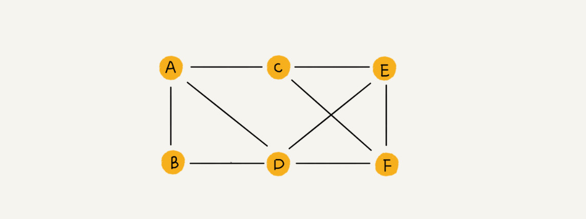

拿微信举例子吧。我们可以把每个用户看作一个顶点。如果两个用户之间互加好友，那就在两者之间建立一条边。所以，整个微信的好友关系就可以用一张图来表示。其中，每个用户有多少个好友，对应到图中，就叫作顶点的**度**（degree），就是跟顶点相连接的边的条数。

实际上，微博的社交关系跟微信还有点不一样，或者说更加复杂一点。微博允许单向关注，也就是说，用户A关注了用户B，但用户B可以不关注用户A。那我们如何用图来表示这种单向的社交关系呢？

我们可以把刚刚讲的图结构稍微改造一下，引入边的“方向”的概念。

如果用户A关注了用户B，我们就在图中画一条从A到B的带箭头的边，来表示边的方向。如果用户A和用户B互相关注了，那我们就画一条从A指向B的边，再画一条从B指向A的边。我们把这种边有方向的图叫作“有向图”。以此类推，我们把边没有方向的图就叫作“无向图”。


我们刚刚讲过，无向图中有“度”这个概念，表示一个顶点有多少条边。在有向图中，我们把度分为**入度**（In-degree）和**出度**（Out-degree）。

顶点的入度，表示有多少条边指向这个顶点；顶点的出度，表示有多少条边是以这个顶点为起点指向其他顶点。对应到微博的例子，入度就表示有多少粉丝，出度就表示关注了多少人。

前面讲到了微信、微博、无向图、有向图，现在我们再来看另一种社交软件：QQ。

QQ中的社交关系要更复杂的一点。不知道你有没有留意过QQ亲密度这样一个功能。QQ不仅记录了用户之间的好友关系，还记录了两个用户之间的亲密度，如果两个用户经常往来，那亲密度就比较高；如果不经常往来，亲密度就比较低。如何在图中记录这种好友关系的亲密度呢？

这里就要用到另一种图，**带权图**（weighted graph）。在带权图中，每条边都有一个权重（weight），我们可以通过这个权重来表示QQ好友间的亲密度。


### 邻接矩阵存储方法

图最直观的一种存储方法就是，**邻接矩阵**（Adjacency Matrix）。

邻接矩阵的底层依赖一个二维数组。对于无向图来说，如果顶点i与顶点j之间有边，我们就将A~ij~和A~ji~标记为1；对于有向图来说，如果顶点i到顶点j之间，有一条箭头从顶点i指向顶点j的边，那我们就将A~ij~标记为1。同理，如果有一条箭头从顶点j指向顶点i的边，我们就将A~ji~标记为1。对于带权图，数组中就存储相应的权重。


用邻接矩阵来表示一个图，虽然简单、直观，但是比较浪费存储空间。为什么这么说呢？

对于无向图来说，如果A~ij~等于1，那A~ji~也肯定等于1。实际上，我们只需要存储一个就可以了。也就是说，无向图的二维数组中，如果我们将其用对角线划分为上下两部分，那我们只需要利用上面或者下面这样一半的空间就足够了，另外一半白白浪费掉了。

还有，如果我们存储的是**稀疏图**（Sparse Matrix），也就是说，顶点很多，但每个顶点的边并不多，那邻接矩阵的存储方法就更加浪费空间了。比如微信有好几亿的用户，对应到图上就是好几亿的顶点。但是每个用户的好友并不会很多，一般也就三五百个而已。如果我们用邻接矩阵来存储，那绝大部分的存储空间都被浪费了。

但这也并不是说，邻接矩阵的存储方法就完全没有优点。首先，邻接矩阵的存储方式简单、直接，因为基于数组，所以在获取两个顶点的关系时，就非常高效。其次，用邻接矩阵存储图的另外一个好处是方便计算。这是因为，用邻接矩阵的方式存储图，可以将很多图的运算转换成矩阵之间的运算。比如求解最短路径问题时会提到一个[Floyd-Warshall算法](https://zh.wikipedia.org/wiki/Floyd-Warshall算法)，就是利用矩阵循环相乘若干次得到结果。

### 邻接表存储方法

针对上面邻接矩阵比较浪费内存空间的问题，我们来看另外一种图的存储方法，**邻接表**（Adjacency List）。

每个顶点对应一条链表，链表中存储的是与这个顶点相连接的其他顶点。另外我需要说明一下，图中画的是一个有向图的邻接表存储方式，每个顶点对应的链表里面，存储的是指向的顶点。对于无向图来说，也是类似的，不过，每个顶点的链表中存储的，是跟这个顶点有边相连的顶点。


邻接矩阵存储起来比较浪费空间，但是使用起来比较节省时间。相反，邻接表存储起来比较节省空间，但是使用起来就比较耗时间。

就像图中的例子，如果我们要确定，是否存在一条从顶点2到顶点4的边，那我们就要遍历顶点2对应的那条链表，看链表中是否存在顶点4。而且，我们前面也讲过，链表的存储方式对缓存不友好。所以，比起邻接矩阵的存储方式，在邻接表中查询两个顶点之间的关系就没那么高效了。

在散列表那几节里，我讲到，在基于链表法解决冲突的散列表中，如果链过长，为了提高查找效率，我们可以将链表换成其他更加高效的数据结构，比如平衡二叉查找树等。我们刚刚也讲到，邻接表长得很像散列。所以，我们也可以将邻接表同散列表一样进行“改进升级”。

我们可以将邻接表中的链表改成平衡二叉查找树。实际开发中，我们可以选择用红黑树。这样，我们就可以更加快速地查找两个顶点之间是否存在边了。当然，这里的二叉查找树可以换成其他动态数据结构，比如跳表、散列表等。除此之外，我们还可以将链表改成有序动态数组，可以通过二分查找的方法来快速定位两个顶点之间否是存在边。

### 练习

#### 如何存储微博社交网络中的好友关系？

微博是有向图。

数据结构是为算法服务的，所以具体选择哪种存储方法，与期望支持的操作有关系。针对微博用户关系，假设我们需要支持下面这样几个操作：

- 判断用户A是否关注了用户B；
- 判断用户A是否是用户B的粉丝；
- 用户A关注用户B；
- 用户A取消关注用户B；
- 根据用户名称的首字母排序，分页获取用户的粉丝列表；
- 根据用户名称的首字母排序，分页获取用户的关注列表。

关于如何存储一个图，前面我们讲到两种主要的存储方法，邻接矩阵和邻接表。因为社交网络是一张稀疏图，使用邻接矩阵存储比较浪费存储空间。所以，这里我们采用邻接表来存储。

不过，用一个邻接表来存储这种有向图是不够的。我们去查找某个用户关注了哪些用户非常容易，但是如果要想知道某个用户都被哪些用户关注了，也就是用户的粉丝列表，是非常困难的。

基于此，我们需要一个逆邻接表。邻接表中存储了用户的关注关系，逆邻接表中存储的是用户的被关注关系。对应到图上，邻接表中，每个顶点的链表中，存储的就是这个顶点指向的顶点，逆邻接表中，每个顶点的链表中，存储的是指向这个顶点的顶点。如果要查找某个用户关注了哪些用户，我们可以在邻接表中查找；如果要查找某个用户被哪些用户关注了，我们从逆邻接表中查找。


基础的邻接表不适合快速判断两个用户之间是否是关注与被关注的关系，所以我们选择改进版本，将邻接表中的链表改为支持快速查找的动态数据结构。选择哪种动态数据结构呢？红黑树、跳表、有序动态数组还是散列表呢？

因为我们需要按照用户名称的首字母排序，分页来获取用户的粉丝列表或者关注列表，用跳表这种结构再合适不过了。这是因为，跳表插入、删除、查找都非常高效，时间复杂度是O(logn)，空间复杂度上稍高，是O(n)。最重要的一点，跳表中存储的数据本来就是有序的了，分页获取粉丝列表或关注列表，就非常高效。

如果对于小规模的数据，比如社交网络中只有几万、几十万个用户，我们可以将整个社交关系存储在内存中，上面的解决思路是没有问题的。但是如果像微博那样有上亿的用户，数据规模太大，我们就无法全部存储在内存中了。这个时候该怎么办呢？

我们可以通过哈希算法等数据分片方式，将邻接表存储在不同的机器上。你可以看下面这幅图，我们在机器1上存储顶点1，2，3的邻接表，在机器2上，存储顶点4，5的邻接表。逆邻接表的处理方式也一样。当要查询顶点与顶点关系的时候，我们就利用同样的哈希算法，先定位顶点所在的机器，然后再在相应的机器上查找。


除此之外，我们还有另外一种解决思路，就是利用外部存储（比如硬盘），因为外部存储的存储空间要比内存会宽裕很多。

我用下面这张表来存储这样一个图。为了高效地支持前面定义的操作，我们可以在表上建立多个索引，比如第一列、第二列，给这两列都建立索引。


#### 那像微信这种无向图，应该怎么存储呢？

微信好友关系存储方式。无向图，也可以使用邻接表的方式存储每个人所对应的好友列表。为了支持快速查找，好友列表可以使用红黑树存储。

#### 关于图这种数据结构，你还能想到其他生活或者工作中的例子吗？

 互联网上网页之间通过超链接连接成一张有向图；城市乃至全国交通网络是一张加权图；人与人之间的人际关系够成一张图，著名的六度分割理论据说就是基于这个得到的。

### 什么是“搜索”算法？

图上的搜索算法，最直接的理解就是，在图中找出从一个顶点出发，到另一个顶点的路径。具体方法有很多，比如今天要讲的两种最简单、最“暴力”的深度优先、广度优先搜索，还有A*、IDA*等启发式搜索算法。

今天用邻接表来存储图。

我这里先给出图的代码实现。需要说明一下，深度优先搜索算法和广度优先搜索算法，既可以用在无向图，也可以用在有向图上。在今天的讲解中，都针对无向图来讲解。

```
public class Graph { // 无向图
  private int v; // 顶点的个数
  private LinkedList<Integer> adj[]; // 邻接表

  public Graph(int v) {
    this.v = v;
    adj = new LinkedList[v];
    for (int i=0; i<v; ++i) {
      adj[i] = new LinkedList<>();
    }
  }

  public void addEdge(int s, int t) { // 无向图一条边存两次
    adj[s].add(t);
    adj[t].add(s);
  }
}
```

### 广度优先搜索（BFS）

广度优先搜索（Breadth-First-Search），我们平常都把简称为BFS。直观地讲，它其实就是一种“地毯式”层层推进的搜索策略，即先查找离起始顶点最近的，然后是次近的，依次往外搜索。


尽管广度优先搜索的原理挺简单，但代码实现还是稍微有点复杂度。所以，我们重点讲一下它的代码实现。

这里面，bfs()函数就是基于之前定义的，图的广度优先搜索的代码实现。其中s表示起始顶点，t表示终止顶点。我们搜索一条从s到t的路径。实际上，这样求得的路径就是从s到t的最短路径。

```
public void bfs(int s, int t) {
  if (s == t) return;
  boolean[] visited = new boolean[v];
  visited[s]=true;
  Queue<Integer> queue = new LinkedList<>();
  queue.add(s);
  int[] prev = new int[v];
  for (int i = 0; i < v; ++i) {
    prev[i] = -1;
  }
  while (queue.size() != 0) {
    int w = queue.poll();
   for (int i = 0; i < adj[w].size(); ++i) {
      int q = adj[w].get(i);
      if (!visited[q]) {
        prev[q] = w;
        if (q == t) {
          print(prev, s, t);
          return;
        }
        visited[q] = true;
        queue.add(q);
      }
    }
  }
}


private void print(int[] prev, int s, int t) { // 递归打印s->t的路径
  if (prev[t] != -1 && t != s) {
    print(prev, s, prev[t]);
  }
  System.out.print(t + " ");
}
```

**visited**是用来记录已经被访问的顶点，用来避免顶点被重复访问。如果顶点q被访问，那相应的visited[q]会被设置为true。

**queue**是一个队列，用来存储已经被访问、但相连的顶点还没有被访问的顶点。因为广度优先搜索是逐层访问的，也就是说，我们只有把第k层的顶点都访问完成之后，才能访问第k+1层的顶点。当我们访问到第k层的顶点的时候，我们需要把第k层的顶点记录下来，稍后才能通过第k层的顶点来找第k+1层的顶点。所以，我们用这个队列来实现记录的功能。

**prev**用来记录搜索路径。当我们从顶点s开始，广度优先搜索到顶点t后，prev数组中存储的就是搜索的路径。不过，这个路径是反向存储的。prev[w]存储的是，顶点w是从哪个前驱顶点遍历过来的。比如，我们通过顶点2的邻接表访问到顶点3，那prev[3]就等于2。为了正向打印出路径，我们需要递归地来打印，你可以看下print()函数的实现方式。

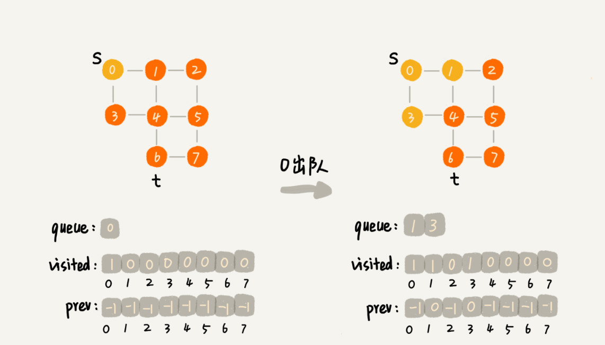


广度优先搜索的时间、空间复杂度是多少呢？

最坏情况下，终止顶点t离起始顶点s很远，需要遍历完整个图才能找到。这个时候，每个顶点都要进出一遍队列，每个边也都会被访问一次，所以，广度优先搜索的时间复杂度是O(V+E)，其中，V表示顶点的个数，E表示边的个数。当然，对于一个连通图来说，也就是说一个图中的所有顶点都是连通的，E肯定要大于等于V-1，所以，广度优先搜索的时间复杂度也可以简写为O(E)。

广度优先搜索的空间消耗主要在几个辅助变量visited数组、queue队列、prev数组上。这三个存储空间的大小都不会超过顶点的个数，所以空间复杂度是O(V)。

### 深度优先搜索（DFS）

深度优先搜索（Depth-First-Search），简称DFS。

搜索的起始顶点是s，终止顶点是t，我们希望在图中寻找一条从顶点s到顶点t的路径。如果映射到迷宫那个例子，s就是你起始所在的位置，t就是出口。

我用深度递归算法，把整个搜索的路径标记出来了。这里面实线箭头表示遍历，虚线箭头表示回退。从图中我们可以看出，深度优先搜索找出来的路径，并不是顶点s到顶点t的最短路径。


实际上，深度优先搜索用的是一种比较著名的算法思想，回溯思想。这种思想解决问题的过程，非常适合用递归来实现。

我把上面的过程用递归来翻译出来，就是下面这个样子。我们发现，深度优先搜索代码实现也用到了prev、visited变量以及print()函数，它们跟广度优先搜索代码实现里的作用是一样的。不过，深度优先搜索代码实现里，有个比较特殊的变量found，它的作用是，当我们已经找到终止顶点t之后，我们就不再递归地继续查找了。

```
boolean found = false; // 全局变量或者类成员变量

public void dfs(int s, int t) {
  found = false;
  boolean[] visited = new boolean[v];
  int[] prev = new int[v];
  for (int i = 0; i < v; ++i) {
    prev[i] = -1;
  }
  recurDfs(s, t, visited, prev);
  print(prev, s, t);
}

private void recurDfs(int w, int t, boolean[] visited, int[] prev) {
  if (found == true) return;
  visited[w] = true;
  if (w == t) {
    found = true;
    return;
  }
  for (int i = 0; i < adj[w].size(); ++i) {
    int q = adj[w].get(i);
    if (!visited[q]) {
      prev[q] = w;
      recurDfs(q, t, visited, prev);
    }
  }
}
```

深度度优先搜索的时、空间间复杂度是多少呢？

每条边最多会被访问两次，一次是遍历，一次是回退。所以，图上的深度优先搜索算法的时间复杂度是O(E)，E表示边的个数。

深度优先搜索算法的消耗内存主要是visited、prev数组和递归调用栈。visited、prev数组的大小跟顶点的个数V成正比，递归调用栈的最大深度不会超过顶点的个数，所以总的空间复杂度就是O(V)。

### 练习

#### 如何找出社交网络中某个用户的三度好友关系？

这个问题非常适合用图的广度优先搜索算法来解决，因为广度优先搜索是层层往外推进的。首先，遍历与起始顶点最近的一层顶点，也就是用户的一度好友，然后再遍历与用户距离的边数为2的顶点，也就是二度好友关系，以及与用户距离的边数为3的顶点，也就是三度好友关系。

我们只需要稍加改造一下广度优先搜索代码，用一个数组来记录每个顶点与起始顶点的距离，非常容易就可以找出三度好友关系。

#### 上题能否用深度优先搜索来解决呢？

可以。DFS递归时传多一个离初始节点的距离值，访问节点时，距离超过3的不再继续递归

#### 如何将迷宫抽象成一个图吗？或者换个说法，如何在计算机中存储一个迷宫？

 初始化两个顶点为迷宫起点和终点，从起点开始，遇到分叉点，为每个分支都新建一个节点，并和前一节点连接，递归每个分支直到终点

## 字符串匹配

### BF算法

BF算法中的BF是Brute Force的缩写，中文叫作暴力匹配算法，也叫朴素匹配算法。从名字可以看出，这种算法的字符串匹配方式很“暴力”，当然也就会比较简单、好懂，但相应的性能也不高。

先定义两个概念，方便后面讲解。它们分别是**主串**和**模式串**。

比方说，我们在字符串A中查找字符串B，那字符串A就是主串，字符串B就是模式串。我们把主串的长度记作n，模式串的长度记作m。因为我们是在主串中查找模式串，所以n>m。

作为最简单、最暴力的字符串匹配算法，BF算法的思想可以用一句话来概括，那就是，**我们在主串中，检查起始位置分别是0、1、2…n-m且长度为m的n-m+1个子串，看有没有跟模式串匹配的**。


从上面的算法思想和例子，我们可以看出，在极端情况下，比如主串是“aaaaa…aaaaa”（省略号表示有很多重复的字符a），模式串是“aaaaab”。我们每次都比对m个字符，要比对n-m+1次，所以，这种算法的最坏情况时间复杂度是O(n*m)。

尽管理论上，BF算法的时间复杂度很高，是O(n*m)，但在实际的开发中，它却是一个比较常用的字符串匹配算法。为什么这么说呢？原因有两点。

第一，实际的软件开发中，大部分情况下，模式串和主串的长度都不会太长。而且每次模式串与主串中的子串匹配的时候，当中途遇到不能匹配的字符的时候，就可以就停止了，不需要把m个字符都比对一下。所以，尽管理论上的最坏情况时间复杂度是O(n*m)，但是，统计意义上，大部分情况下，算法执行效率要比这个高很多。

第二，朴素字符串匹配算法思想简单，代码实现也非常简单。简单意味着不容易出错，如果有bug也容易暴露和修复。在工程中，在满足性能要求的前提下，简单是首选。这也是我们常说的KISS（Keep it Simple and Stupid）设计原则。

### RK算法

RK算法的全称叫Rabin-Karp算法，是由它的两位发明者Rabin和Karp的名字来命名的。这个算法理解起来也不是很难。我个人觉得，它其实就是刚刚讲的BF算法的升级版。

我在讲BF算法的时候讲过，如果模式串长度为m，主串长度为n，那在主串中，就会有n-m+1个长度为m的子串，我们只需要暴力地对比这n-m+1个子串与模式串，就可以找出主串与模式串匹配的子串。

但是，每次检查主串与子串是否匹配，需要依次比对每个字符，所以BF算法的时间复杂度就比较高，是O(n*m)。我们对朴素的字符串匹配算法稍加改造，引入哈希算法，时间复杂度立刻就会降低。

RK算法的思路是这样的：我们通过哈希算法对主串中的n-m+1个子串分别求哈希值，然后逐个与模式串的哈希值比较大小。如果某个子串的哈希值与模式串相等，那就说明对应的子串和模式串匹配了（这里先不考虑哈希冲突的问题，后面我们会讲到）。因为哈希值是一个数字，数字之间比较是否相等是非常快速的，所以模式串和子串比较的效率就提高了。


不过，通过哈希算法计算子串的哈希值的时候，我们需要遍历子串中的每个字符。尽管模式串与子串比较的效率提高了，但是，算法整体的效率并没有提高。有没有方法可以提高哈希算法计算子串哈希值的效率呢？

这就需要哈希算法设计的非常有技巧了。我们假设要匹配的字符串的字符集中只包含K个字符，我们可以用一个K进制数来表示一个子串，这个K进制数转化成十进制数，作为子串的哈希值。

比如要处理的字符串只包含a～z这26个小写字母，那我们就用二十六进制来表示一个字符串。我们把a～z这26个字符映射到0～25这26个数字，a就表示0，b就表示1，以此类推，z表示25。

在十进制的表示法中，一个数字的值是通过下面的方式计算出来的。对应到二十六进制，一个包含a到z这26个字符的字符串，计算哈希的时候，我们只需要把进位从10改成26就可以。


这个哈希算法你应该看懂了吧？现在，为了方便解释，在下面的讲解中，我假设字符串中只包含a～z这26个小写字符，我们用二十六进制来表示一个字符串，对应的哈希值就是二十六进制数转化成十进制的结果。

这种哈希算法有一个特点，在主串中，相邻两个子串的哈希值的计算公式有一定关系。

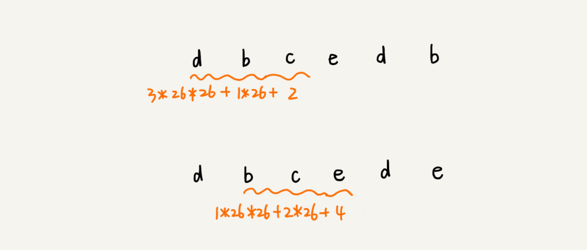

从这里例子中，我们很容易就能得出这样的规律：相邻两个子串s[i-1]和s[i]（i表示子串在主串中的起始位置，子串的长度都为m），对应的哈希值计算公式有交集，也就是说，我们可以使用s[i-1]的哈希值很快的计算出s[i]的哈希值。如果用公式表示的话，就是下面这个样子：

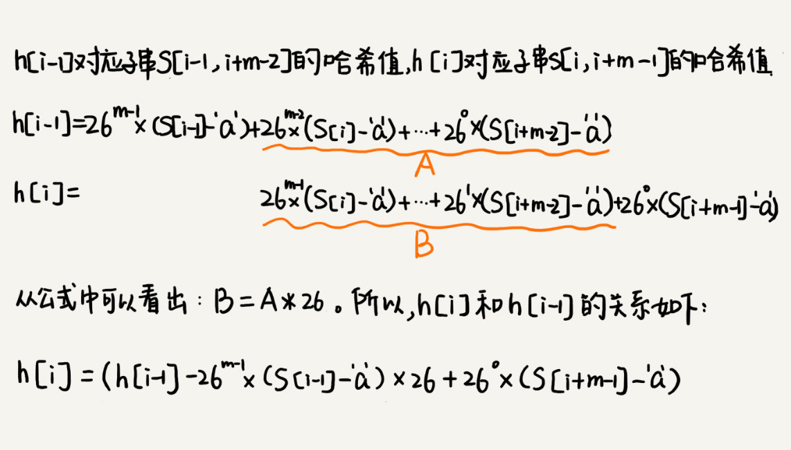

不过，这里有一个小细节需要注意，那就是26^(m-1)^这部分的计算，我们可以通过查表的方法来提高效率。我们事先计算好26^0^、26^1^、26^2^……26^(m-1)^，并且存储在一个长度为m的数组中，公式中的“次方”就对应数组的下标。当我们需要计算26的x次方的时候，就可以从数组的下标为x的位置取值，直接使用，省去了计算的时间。


我们开头的时候提过，RK算法的效率要比BF算法高，现在，我们就来分析一下，RK算法的时间复杂度到底是多少呢？

整个RK算法包含两部分，计算子串哈希值和模式串哈希值与子串哈希值之间的比较。第一部分，我们前面也分析了，可以通过设计特殊的哈希算法，只需要扫描一遍主串就能计算出所有子串的哈希值了，所以这部分的时间复杂度是O(n)。

模式串哈希值与每个子串哈希值之间的比较的时间复杂度是O(1)，总共需要比较n-m+1个子串的哈希值，所以，这部分的时间复杂度也是O(n)。所以，RK算法整体的时间复杂度就是O(n)。

这里还有一个问题就是，模式串很长，相应的主串中的子串也会很长，通过上面的哈希算法计算得到的哈希值就可能很大，如果超过了计算机中整型数据可以表示的范围，那该如何解决呢？

刚刚我们设计的哈希算法是没有散列冲突的，也就是说，一个字符串与一个二十六进制数一一对应，不同的字符串的哈希值肯定不一样。因为我们是基于进制来表示一个字符串的，你可以类比成十进制、十六进制来思考一下。实际上，我们为了能将哈希值落在整型数据范围内，可以牺牲一下，允许哈希冲突。这个时候哈希算法该如何设计呢？

哈希算法的设计方法有很多，我举一个例子说明一下。假设字符串中只包含a～z这26个英文字母，那我们每个字母对应一个数字，比如a对应1，b对应2，以此类推，z对应26。我们可以把字符串中每个字母对应的数字相加，最后得到的和作为哈希值。这种哈希算法产生的哈希值的数据范围就相对要小很多了。

不过，你也应该发现，这种哈希算法的哈希冲突概率也是挺高的。当然，我只是举了一个最简单的设计方法，还有很多更加优化的方法，比如将每一个字母从小到大对应一个素数，而不是1，2，3……这样的自然数，这样冲突的概率就会降低一些。

那现在新的问题来了。之前我们只需要比较一下模式串和子串的哈希值，如果两个值相等，那这个子串就一定可以匹配模式串。但是，当存在哈希冲突的时候，有可能存在这样的情况，子串和模式串的哈希值虽然是相同的，但是两者本身并不匹配。

实际上，解决方法很简单。当我们发现一个子串的哈希值跟模式串的哈希值相等的时候，我们只需要再对比一下子串和模式串本身就好了。当然，如果子串的哈希值与模式串的哈希值不相等，那对应的子串和模式串肯定也是不匹配的，就不需要比对子串和模式串本身了。

所以，哈希算法的冲突概率要相对控制得低一些，如果存在大量冲突，就会导致RK算法的时间复杂度退化，效率下降。极端情况下，如果存在大量的冲突，每次都要再对比子串和模式串本身，那时间复杂度就会退化成O(n*m)。但也不要太悲观，一般情况下，冲突不会很多，RK算法的效率还是比BF算法高的。

### 练习

#### 假设有下面这样一个二维字符串矩阵（图中的主串），借助今天讲的处理思路，如何在其中查找另一个二维字符串矩阵（图中的模式串）呢？

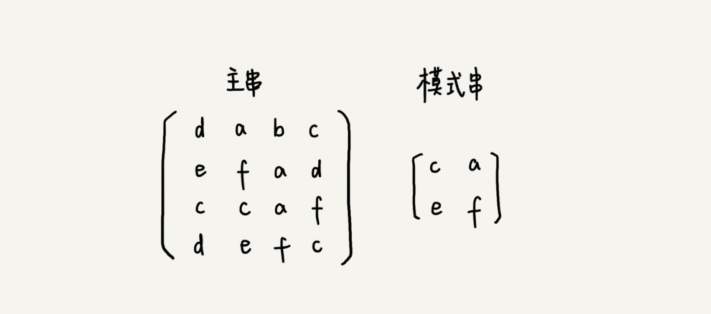

假设二维主串和模式串的维度分别是 m x n 和 i x j，横向在[0, m-i]，纵向在[0, n-j]取起始点，然后取同样的子串窗口对比，共有(m-i+1)*(n-j+1)个子串。

### BM算法的核心思想

我们把模式串和主串的匹配过程，看作模式串在主串中不停地往后滑动。当遇到不匹配的字符时，BF算法和RK算法的做法是，模式串往后滑动一位，然后从模式串的第一个字符开始重新匹配。我举个例子解释一下，你可以看我画的这幅图。

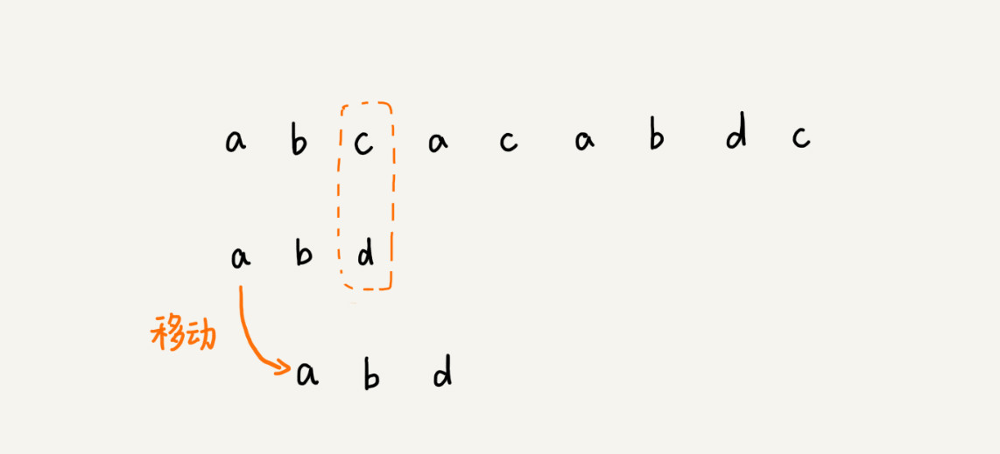

在这个例子里，主串中的c，在模式串中是不存在的，所以，模式串向后滑动的时候，只要c与模式串有重合，肯定无法匹配。所以，我们可以一次性把模式串往后多滑动几位，把模式串移动到c的后面。


今天要讲的BM算法，本质上其实就是在寻找这种规律。借助这种规律，在模式串与主串匹配的过程中，当模式串和主串某个字符不匹配的时候，能够跳过一些肯定不会匹配的情况，将模式串往后多滑动几位。

#### BM算法原理分析

BM算法包含两部分，分别是**坏字符规则**（bad character rule）和**好后缀规则**（good suffix shift）。

##### 1.坏字符规则

前面两节讲的算法，在匹配的过程中，我们都是按模式串的下标从小到大的顺序，依次与主串中的字符进行匹配的。这种匹配顺序比较符合我们的思维习惯，而BM算法的匹配顺序比较特别，它是按照模式串下标从大到小的顺序，倒着匹配的。


我们从模式串的末尾往前倒着匹配，当我们发现某个字符没法匹配的时候。我们把这个没有匹配的字符叫作**坏字符**（主串中的字符）。


我们拿坏字符c在模式串中查找，发现模式串中并不存在这个字符，也就是说，字符c与模式串中的任何字符都不可能匹配。这个时候，我们可以将模式串直接往后滑动三位，将模式串滑动到c后面的位置，再从模式串的末尾字符开始比较。


这个时候，我们发现，模式串中最后一个字符d，还是无法跟主串中的a匹配，这个时候，还能将模式串往后滑动三位吗？答案是不行的。因为这个时候，坏字符a在模式串中是存在的，模式串中下标是0的位置也是字符a。这种情况下，我们可以将模式串往后滑动两位，让两个a上下对齐，然后再从模式串的末尾字符开始，重新匹配。


第一次不匹配的时候，我们滑动了三位，第二次不匹配的时候，我们将模式串后移两位，那具体滑动多少位，到底有没有规律呢？

当发生不匹配的时候，我们把坏字符对应的模式串中的字符下标记作si。如果坏字符在模式串中存在，我们把这个坏字符在模式串中的下标记作xi。如果不存在，我们把xi记作-1。那模式串往后移动的位数就等于si-xi。（注意，我这里说的下标，都是字符在模式串的下标）。

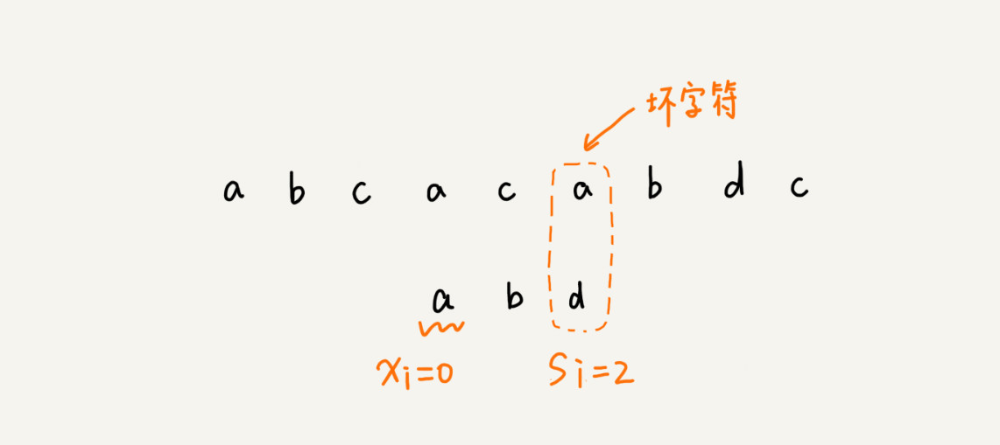

这里我要特别说明一点，如果坏字符在模式串里多处出现，那我们在计算xi的时候，选择最靠后的那个，因为这样不会让模式串滑动过多，导致本来可能匹配的情况被滑动略过。

利用坏字符规则，BM算法在最好情况下的时间复杂度非常低，是O(n/m)。比如，主串是aaabaaabaaabaaab，模式串是aaaa。每次比对，模式串都可以直接后移四位，所以，匹配具有类似特点的模式串和主串的时候，BM算法非常高效。

不过，单纯使用坏字符规则还是不够的。因为根据si-xi计算出来的移动位数，有可能是负数，比如主串是aaaaaaaaaaaaaaaa，模式串是baaa。不但不会向后滑动模式串，还有可能倒退。所以，BM算法还需要用到“好后缀规则”。

##### 2.好后缀规则

好后缀规则实际上跟坏字符规则的思路很类似。你看我下面这幅图。当模式串滑动到图中的位置的时候，模式串和主串有2个字符是匹配的，倒数第3个字符发生了不匹配的情况。

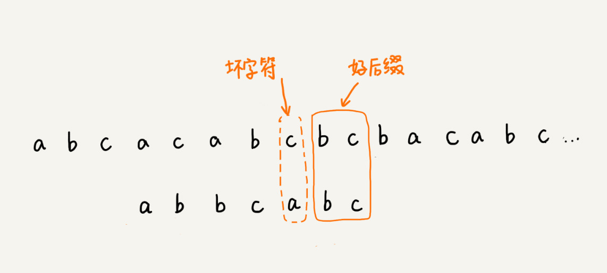

我们把已经匹配的bc叫作好后缀，记作{u}。我们拿它在模式串中查找，如果找到了另一个跟{u}相匹配的子串{u**}，*那我们就将模式串滑动到子串{u*}与主串中{u}对齐的位置。


如果在模式串中找不到另一个等于{u}的子串，我们就直接将模式串，滑动到主串中{u}的后面，因为之前的任何一次往后滑动，都没有匹配主串中{u}的情况。


不过，当模式串中不存在等于{u}的子串时，我们直接将模式串滑动到主串{u}的后面。这样做是否有点太过头呢？我们来看下面这个例子。这里面bc是好后缀，尽管在模式串中没有另外一个相匹配的子串{u*}，但是如果我们将模式串移动到好后缀的后面，如图所示，那就会错过模式串和主串可以匹配的情况。

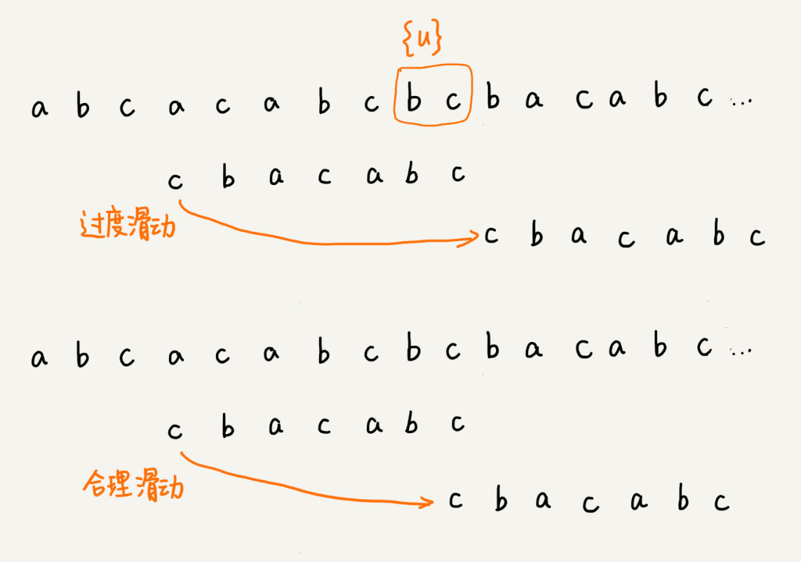

如果好后缀在模式串中不存在可匹配的子串，那在我们一步一步往后滑动模式串的过程中，只要主串中的{u}与模式串有重合，那肯定就无法完全匹配。但是当模式串滑动到前缀与主串中{u}的后缀有部分重合的时候，并且重合的部分相等的时候，就有可能会存在完全匹配的情况。


所以，针对这种情况，我们不仅要看好后缀在模式串中，是否有另一个匹配的子串，我们还要考察好后缀的后缀子串，是否存在跟模式串的前缀子串匹配的。

所谓某个字符串s的后缀子串，就是最后一个字符跟s对齐的子串，比如abc的后缀子串就包括c, bc。所谓前缀子串，就是起始字符跟s对齐的子串，比如abc的前缀子串有a，ab。我们从好后缀的后缀子串中，找一个最长的并且能跟模式串的前缀子串匹配的，假设是{v}，然后将模式串滑动到如图所示的位置。


坏字符和好后缀的基本原理都讲完了，我现在回答一下前面那个问题。当模式串和主串中的某个字符不匹配的时候，如何选择用好后缀规则还是坏字符规则，来计算模式串往后滑动的位数？

我们可以分别计算好后缀和坏字符往后滑动的位数，然后取两个数中最大的，作为模式串往后滑动的位数。这种处理方法还可以避免我们前面提到的，根据坏字符规则，计算得到的往后滑动的位数，有可能是负数的情况。

#### BM算法代码实现

“坏字符规则”本身不难理解。当遇到坏字符时，要计算往后移动的位数si-xi，其中xi的计算是重点，我们如何求得xi呢？或者说，如何查找坏字符在模式串中出现的位置呢？

如果我们拿坏字符，在模式串中顺序遍历查找，这样就会比较低效，势必影响这个算法的性能。有没有更加高效的方式呢？我们之前学的散列表，这里可以派上用场了。我们可以将模式串中的每个字符及其下标都存到散列表中。这样就可以快速找到坏字符在模式串的位置下标了。

关于这个散列表，我们只实现一种最简单的情况，假设字符串的字符集不是很大，每个字符长度是1字节，我们用大小为256的数组，来记录每个字符在模式串中出现的位置。数组的下标对应字符的ASCII码值，数组中存储这个字符在模式串中出现的位置。

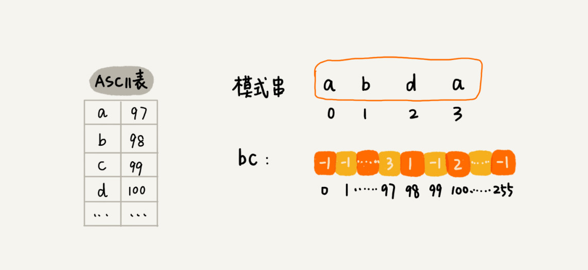

如果将上面的过程翻译成代码，就是下面这个样子。其中，变量b是模式串，m是模式串的长度，bc表示刚刚讲的散列表。

```
private static final int SIZE = 256; // 全局变量或成员变量
private void generateBC(char[] b, int m, int[] bc) {
  for (int i = 0; i < SIZE; ++i) {
    bc[i] = -1; // 初始化bc
  }
  for (int i = 0; i < m; ++i) {
    int ascii = (int)b[i]; // 计算b[i]的ASCII值
    bc[ascii] = i;
  }
}
```

掌握了坏字符规则之后，我们先把BM算法代码的大框架写好，先不考虑好后缀规则，仅用坏字符规则，并且不考虑si-xi计算得到的移动位数可能会出现负数的情况。

```
public int bm(char[] a, int n, char[] b, int m) {
  int[] bc = new int[SIZE]; // 记录模式串中每个字符最后出现的位置
  generateBC(b, m, bc); // 构建坏字符哈希表
  int i = 0; // i表示主串与模式串对齐的第一个字符
  while (i <= n - m) {
    int j;
    for (j = m - 1; j >= 0; --j) { // 模式串从后往前匹配
      if (a[i+j] != b[j]) break; // 坏字符对应模式串中的下标是j
    }
    if (j < 0) {
      return i; // 匹配成功，返回主串与模式串第一个匹配的字符的位置
    }
    // 这里等同于将模式串往后滑动j-bc[(int)a[i+j]]位
    i = i + (j - bc[(int)a[i+j]]); 
  }
  return -1;
}
```

代码里的注释已经很详细了，我就不再赘述了。不过，为了你方便理解，我画了一张图，将其中的一些关键变量标注在上面了，结合着图，代码应该更好理解。


至此，我们已经实现了包含坏字符规则的框架代码，只剩下往框架代码中填充好后缀规则了。现在，我们就来看看，如何实现好后缀规则。它的实现要比坏字符规则复杂一些。

好后缀的处理规则中最核心的内容：

- 在模式串中，查找跟好后缀匹配的另一个子串；
- 在好后缀的后缀子串中，查找最长的、能跟模式串前缀子串匹配的后缀子串；

在不考虑效率的情况下，这两个操作都可以用很“暴力”的匹配查找方式解决。但是，如果想要BM算法的效率很高，这部分就不能太低效。如何来做呢？

因为好后缀也是模式串本身的后缀子串，所以，我们可以在模式串和主串正式匹配之前，通过预处理模式串，预先计算好模式串的每个后缀子串，对应的另一个可匹配子串的位置。

我们先来看，**如何表示模式串中不同的后缀子串呢？**因为后缀子串的最后一个字符的位置是固定的，下标为m-1，我们只需要记录长度就可以了。通过长度，我们可以确定一个唯一的后缀子串。


现在，我们要**引入最关键的变量suffix数组**。suffix数组的下标k，表示后缀子串的长度，下标对应的数组值存储的是，在模式串中跟好后缀{u}相匹配的子串{u*}的起始下标值。这句话不好理解，我举一个例子。


但是，如果模式串中有多个（大于1个）子串跟后缀子串{u}匹配，那suffix数组中该存储哪一个子串的起始位置呢？为了避免模式串往后滑动得过头了，我们肯定要存储模式串中最靠后的那个子串的起始位置，也就是下标最大的那个子串的起始位置。不过，这样处理就足够了吗？

实际上，仅仅是选最靠后的子串片段来存储是不够的。我们再回忆一下好后缀规则。

我们不仅要在模式串中，查找跟好后缀匹配的另一个子串，还要在好后缀的后缀子串中，查找最长的能跟模式串前缀子串匹配的后缀子串。

如果我们只记录刚刚定义的suffix，实际上，只能处理规则的前半部分，也就是，在模式串中，查找跟好后缀匹配的另一个子串。所以，除了suffix数组之外，我们还需要另外一个boolean类型的prefix数组，来记录模式串的后缀子串是否能匹配模式串的前缀子串。


现在，我们来看下，**如何来计算并填充这两个数组的值**？这个计算过程非常巧妙。

我们拿下标从0到i的子串（i可以是0到m-2）与整个模式串，求公共后缀子串。如果公共后缀子串的长度是k，那我们就记录suffix[k]=j（j表示公共后缀子串的起始下标）。如果j等于0，也就是说，公共后缀子串也是模式串的前缀子串，我们就记录prefix[k]=true。


```
// b表示模式串，m表示长度，suffix，prefix数组事先申请好了
private void generateGS(char[] b, int m, int[] suffix, boolean[] prefix) {
  for (int i = 0; i < m; ++i) { // 初始化
    suffix[i] = -1;
    prefix[i] = false;
  }
  for (int i = 0; i < m - 1; ++i) { // b[0, i]
    int j = i;
    int k = 0; // 公共后缀子串长度
    while (j >= 0 && b[j] == b[m-1-k]) { // 与b[0, m-1]求公共后缀子串
      --j;
      ++k;
      suffix[k] = j+1; //j+1表示公共后缀子串在b[0, i]中的起始下标
    }
    i
    if (j == -1) prefix[k] = true; //如果公共后缀子串也是模式串的前缀子串
  }
}
```

有了这两个数组之后，我们现在来看，**在模式串跟主串匹配的过程中，遇到不能匹配的字符时，如何根据好后缀规则，计算模式串往后滑动的位数？**

假设好后缀的长度是k。我们先拿好后缀，在suffix数组中查找其匹配的子串。如果suffix[k]不等于-1（-1表示不存在匹配的子串），那我们就将模式串往后移动j-suffix[k]+1位（j表示坏字符对应的模式串中的字符下标）。如果suffix[k]等于-1，表示模式串中不存在另一个跟好后缀匹配的子串片段。我们可以用下面这条规则来处理。

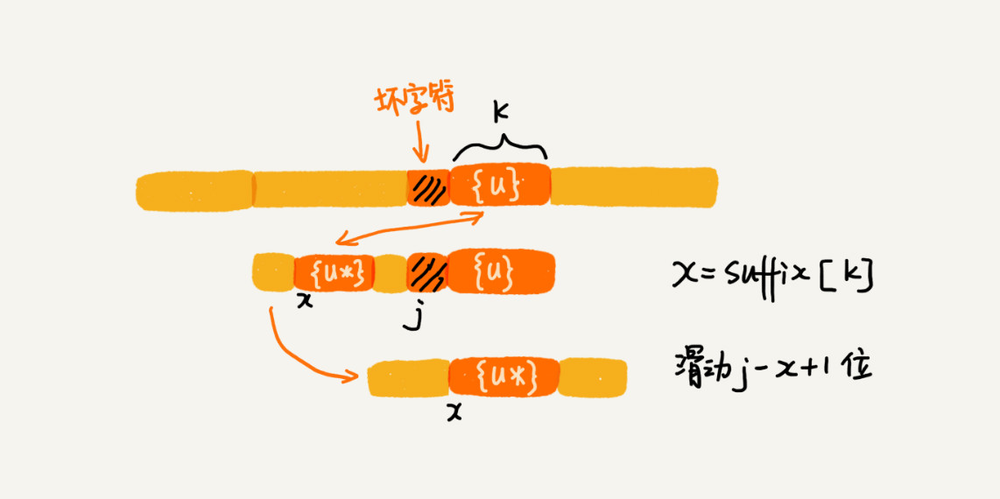

好后缀的后缀子串b[r, m-1]（其中，r取值从j+2到m-1）的长度k=m-r，如果prefix[k]等于true，表示长度为k的后缀子串，有可匹配的前缀子串，这样我们可以把模式串后移r位。


如果两条规则都没有找到可以匹配好后缀及其后缀子串的子串，我们就将整个模式串后移m位。


至此，好后缀规则的代码实现我们也讲完了。我们把好后缀规则加到前面的代码框架里，就可以得到BM算法的完整版代码实现。

```
// a,b表示主串和模式串；n，m表示主串和模式串的长度。
public int bm(char[] a, int n, char[] b, int m) {
  int[] bc = new int[SIZE]; // 记录模式串中每个字符最后出现的位置
  generateBC(b, m, bc); // 构建坏字符哈希表
  int[] suffix = new int[m];
  boolean[] prefix = new boolean[m];
  generateGS(b, m, suffix, prefix);
  int i = 0; // j表示主串与模式串匹配的第一个字符
  while (i <= n - m) {
    int j;
    for (j = m - 1; j >= 0; --j) { // 模式串从后往前匹配
      if (a[i+j] != b[j]) break; // 坏字符对应模式串中的下标是j
    }
    if (j < 0) {
      return i; // 匹配成功，返回主串与模式串第一个匹配的字符的位置
    }
    int x = j - bc[(int)a[i+j]];
    int y = 0;
    if (j < m-1) { // 如果有好后缀的话
      y = moveByGS(j, m, suffix, prefix);
    }
    i = i + Math.max(x, y);
  }
  return -1;
}

// j表示坏字符对应的模式串中的字符下标; m表示模式串长度
private int moveByGS(int j, int m, int[] suffix, boolean[] prefix) {
  int k = m - 1 - j; // 好后缀长度
  if (suffix[k] != -1) return j - suffix[k] +1;
  for (int r = j+2; r <= m-1; ++r) {
    if (prefix[m-r] == true) {
      return r;
    }
  }
  return m;
}
```

#### BM算法的性能分析及优化

我们先来分析BM算法的内存消耗。整个算法用到了额外的3个数组，其中bc数组的大小跟字符集大小有关，suffix数组和prefix数组的大小跟模式串长度m有关。

如果我们处理字符集很大的字符串匹配问题，bc数组对内存的消耗就会比较多。因为好后缀和坏字符规则是独立的，如果我们运行的环境对内存要求苛刻，可以只使用好后缀规则，不使用坏字符规则，这样就可以避免bc数组过多的内存消耗。不过，单纯使用好后缀规则的BM算法效率就会下降一些了。

对于执行效率来说，我们可以先从时间复杂度的角度来分析。

实际上，我前面讲的BM算法是个初级版本。为了让你能更容易理解，有些复杂的优化我没有讲。基于我目前讲的这个版本，在极端情况下，预处理计算suffix数组、prefix数组的性能会比较差。

比如模式串是aaaaaaa这种包含很多重复的字符的模式串，预处理的时间复杂度就是O(m^2)。当然，大部分情况下，时间复杂度不会这么差。关于如何优化这种极端情况下的时间复杂度退化，如果感兴趣，你可以自己研究一下。

实际上，BM算法的时间复杂度分析起来是非常复杂，这篇论文“[A new proof of the linearity of the Boyer-Moore string searching algorithm](http://dl.acm.org/citation.cfm?id=1382431.1382552)”证明了在最坏情况下，BM算法的比较次数上限是5n。这篇论文“[Tight bounds on the complexity of the Boyer-Moore string matching algorithm](http://dl.acm.org/citation.cfm?id=127830)”证明了在最坏情况下，BM算法的比较次数上限是3n。

### KMP算法基本原理

KMP算法是根据三位作者（D.E.Knuth，J.H.Morris和V.R.Pratt）的名字来命名的，算法的全称是Knuth Morris Pratt算法，简称为KMP算法。

KMP算法的核心思想，跟上一节讲的BM算法非常相近。我们假设主串是a，模式串是b。在模式串与主串匹配的过程中，当遇到不可匹配的字符的时候，我们希望找到一些规律，可以将模式串往后多滑动几位，跳过那些肯定不会匹配的情况。

还记得我们上一节讲到的好后缀和坏字符吗？这里我们可以类比一下，在模式串和主串匹配的过程中，把不能匹配的那个字符仍然叫作**坏字符**，把已经匹配的那段字符串叫作**好前缀**。


当遇到坏字符的时候，我们就要把模式串往后滑动，在滑动的过程中，只要模式串和好前缀有上下重合，前面几个字符的比较，就相当于拿好前缀的后缀子串，跟模式串的前缀子串在比较。这个比较的过程能否更高效了呢？可以不用一个字符一个字符地比较了吗？


KMP算法就是在试图寻找一种规律：在模式串和主串匹配的过程中，当遇到坏字符后，对于已经比对过的好前缀，能否找到一种规律，将模式串一次性滑动很多位？

我们只需要拿好前缀本身，在它的后缀子串中，查找最长的那个可以跟好前缀的前缀子串匹配的。假设最长的可匹配的那部分前缀子串是{v}，长度是k。我们把模式串一次性往后滑动j-k位，相当于，每次遇到坏字符的时候，我们就把j更新为k，i不变，然后继续比较。


为了表述起来方便，我把好前缀的所有后缀子串中，最长的可匹配前缀子串的那个后缀子串，叫作**最长可匹配后缀子串**；对应的前缀子串，叫作**最长可匹配前缀子串**。

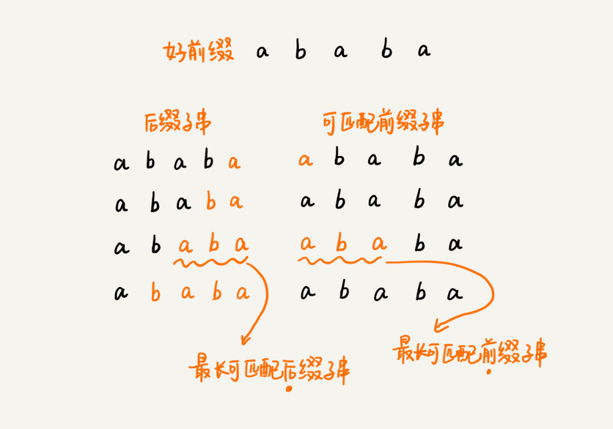

如何来求好前缀的最长可匹配前缀和后缀子串呢？这个问题其实不涉及主串，只需要通过模式串本身就能求解。所以，能不能事先预处理计算好，在模式串和主串匹配的过程中，直接拿过来就用呢？

类似BM算法中的bc、suffix、prefix数组，KMP算法也可以提前构建一个数组，用来存储模式串中每个前缀（这些前缀都有可能是好前缀）的最长可匹配前缀子串的结尾字符下标。我们把这个数组定义为**next数组**，很多书中还给这个数组起了一个名字，叫**失效函数**（failure function）。

数组的下标是每个前缀结尾字符下标，数组的值是这个前缀的最长可以匹配前缀子串的结尾字符下标。

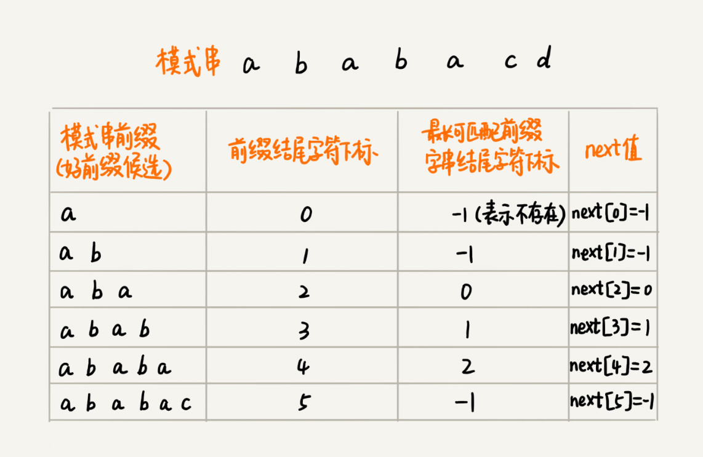

有了next数组，我们很容易就可以实现KMP算法了。我先假设next数组已经计算好了，先给出KMP算法的框架代码。

```
// a, b分别是主串和模式串；n, m分别是主串和模式串的长度。
public static int kmp(char[] a, int n, char[] b, int m) {
  int[] next = getNexts(b, m);
  int j = 0;
  for (int i = 0; i < n; ++i) {
    while (j > 0 && a[i] != b[j]) { // 一直找到a[i]和b[j]
      j = next[j - 1] + 1;
    }
    if (a[i] == b[j]) {
      ++j;
    }
    if (j == m) { // 找到匹配模式串的了
      return i - m + 1;
    }
  }
  return -1;
}
```

#### 失效函数计算方法

KMP算法的基本原理讲完了，我们现在来看最复杂的部分，也就是next数组是如何计算出来的？

当然，我们可以用非常笨的方法，比如要计算下面这个模式串b的next[4]，我们就把b[0, 4]的所有后缀子串，从长到短找出来，依次看看，是否能跟模式串的前缀子串匹配。很显然，这个方法也可以计算得到next数组，但是效率非常低。有没有更加高效的方法呢？


这里的处理非常有技巧，类似于动态规划。

我们按照下标从小到大，依次计算next数组的值。当我们要计算next[i]的时候，前面的next[0]，next[1]，……，next[i-1]应该已经计算出来了。利用已经计算出来的next值，我们是否可以快速推导出next[i]的值呢？

如果next[i-1]=k-1，也就是说，子串b[0, k-1]是b[0, i-1]的最长可匹配前缀子串。如果子串b[0, k-1]的下一个字符b[k]，与b[0, i-1]的下一个字符b[i]匹配，那子串b[0, k]就是b[0, i]的最长可匹配前缀子串。所以，next[i]等于k。但是，如果b[0, k-1]的下一字符b[k]跟b[0, i-1]的下一个字符b[i]不相等呢？这个时候就不能简单地通过next[i-1]得到next[i]了。这个时候该怎么办呢？


我们假设b[0, i]的最长可匹配后缀子串是b[r, i]。如果我们把最后一个字符去掉，那b[r, i-1]肯定是b[0, i-1]的可匹配后缀子串，但不一定是最长可匹配后缀子串。所以，既然b[0, i-1]最长可匹配后缀子串对应的模式串的前缀子串的下一个字符并不等于b[i]，那么我们就可以考察b[0, i-1]的次长可匹配后缀子串b[x, i-1]对应的可匹配前缀子串b[0, i-1-x]的下一个字符b[i-x]是否等于b[i]。如果等于，那b[x, i]就是b[0, i]的最长可匹配后缀v子串。


如何求得b[0, i-1]的次长可匹配后缀子串呢？次长可匹配后缀子串肯定被包含在最长可匹配后缀子串中，而最长可匹配后缀子串又对应最长可匹配前缀子串b[0, y]。于是，查找b[0, i-1]的次长可匹配后缀子串，这个问题就变成，查找b[0, y]的最长匹配后缀子串的问题了。


按照这个思路，我们可以考察完所有的b[0, i-1]的可匹配后缀子串b[y, i-1]，直到找到一个可匹配的后缀子串，它对应的前缀子串的下一个字符等于b[i]，那这个b[y, i]就是b[0, i]的最长可匹配后缀子串。

前面我已经给出KMP算法的框架代码了，现在我把这部分的代码也写出来了。这两部分代码合在一起，就是整个KMP算法的代码实现。

```
// b表示模式串，m表示模式串的长度
private static int[] getNexts(char[] b, int m) {
  int[] next = new int[m];
  next[0] = -1;
  int k = -1;
  for (int i = 1; i < m; ++i) {
    while (k != -1 && b[k + 1] != b[i]) {
      k = next[k];
    }
    if (b[k + 1] == b[i]) {
      ++k;
    }
    next[i] = k;
  }
  return next;
}
```

#### KMP算法复杂度分析

KMP算法的原理和实现我们就讲完了，我们现在来分析一下KMP算法的时间、空间复杂度是多少？

空间复杂度很容易分析，KMP算法只需要一个额外的next数组，数组的大小跟模式串相同。所以空间复杂度是O(m)，m表示模式串的长度。

KMP算法包含两部分，第一部分是构建next数组，第二部分才是借助next数组匹配。所以，关于时间复杂度，我们要分别从这两部分来分析。

我们先来分析第一部分的时间复杂度。

计算next数组的代码中，第一层for循环中i从1到m-1，也就是说，内部的代码被执行了m-1次。for循环内部代码有一个while循环，如果我们能知道每次for循环、while循环平均执行的次数，假设是k，那时间复杂度就是O(k*m)。但是，while循环执行的次数不怎么好统计，所以我们放弃这种分析方法。

我们可以找一些参照变量，i和k。i从1开始一直增加到m，而k并不是每次for循环都会增加，所以，k累积增加的值肯定小于m。而while循环里k=next[k]，实际上是在减小k的值，k累积都没有增加超过m，所以while循环里面k=next[k]总的执行次数也不可能超过m。因此，next数组计算的时间复杂度是O(m)。

我们再来分析第二部分的时间复杂度。分析的方法是类似的。

i从0循环增长到n-1，j的增长量不可能超过i，所以肯定小于n。而while循环中的那条语句j=next[j-1]+1，不会让j增长的，那有没有可能让j不变呢？也没有可能。因为next[j-1]的值肯定小于j-1，所以while循环中的这条语句实际上也是在让j的值减少。而j总共增长的量都不会超过n，那减少的量也不可能超过n，所以while循环中的这条语句总的执行次数也不会超过n，所以这部分的时间复杂度是O(n)。

所以，综合两部分的时间复杂度，KMP算法的时间复杂度就是O(m+n)。

## Trie树

### 什么是“Trie树”？

Trie树，也叫“字典树”。顾名思义，它是一个树形结构。它是一种专门处理字符串匹配的数据结构，用来解决在一组字符串集合中快速查找某个字符串的问题。

当然，这样一个问题可以有多种解决方法，比如散列表、红黑树，或者我们前面几节讲到的一些字符串匹配算法，但是，Trie树在这个问题的解决上，有它特有的优点。

我们有6个字符串，它们分别是：how，hi，her，hello，so，see。我们希望在里面多次查找某个字符串是否存在。如果每次查找，都是拿要查找的字符串跟这6个字符串依次进行字符串匹配，那效率就比较低，有没有更高效的方法呢？

这个时候，我们就可以先对这6个字符串做一下预处理，组织成Trie树的结构，之后每次查找，都是在Trie树中进行匹配查找。**Trie树的本质，就是利用字符串之间的公共前缀，将重复的前缀合并在一起**。最后构造出来的就是下面这个图中的样子。


其中，根节点不包含任何信息。每个节点表示一个字符串中的字符，从根节点到红色节点的一条路径表示一个字符串（红色节点并不都是叶子节点）。

构造过程的每一步，都相当于往Trie树中插入一个字符串。当所有字符串都插入完成之后，Trie树就构造好了。


当我们在Trie树中查找一个字符串的时候，比如查找字符串“her”，那我们将要查找的字符串分割成单个的字符h，e，r，然后从Trie树的根节点开始匹配。如图所示，绿色的路径就是在Trie树中匹配的路径。

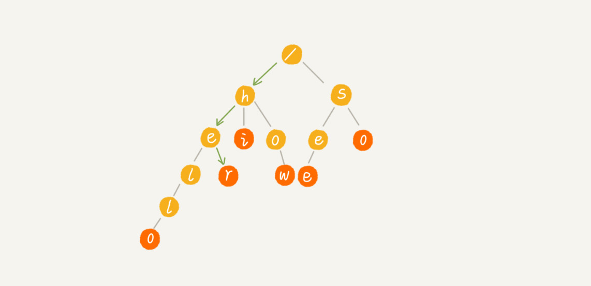

如果我们要查找的是字符串“he”呢？我们还用上面同样的方法，从根节点开始，沿着某条路径来匹配，如图所示，绿色的路径，是字符串“he”匹配的路径。但是，路径的最后一个节点“e”并不是红色的。也就是说，“he”是某个字符串的前缀子串，但并不能完全匹配任何字符串。

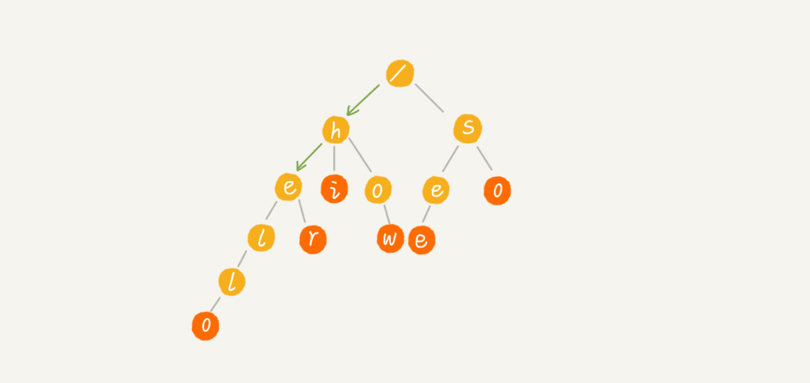

### 如何实现一棵Trie树？

Trie树主要有两个操作，**一个是将字符串集合构造成Trie树**。这个过程分解开来的话，就是一个将字符串插入到Trie树的过程。**另一个是在Trie树中查询一个字符串**。

了解了Trie树的两个主要操作之后，我们再来看下，**如何存储一个Trie树？**

从前面的图中，我们可以看出，Trie树是一个多叉树。我们知道，二叉树中，一个节点的左右子节点是通过两个指针来存储的。那对于多叉树来说，我们怎么存储一个节点的所有子节点的指针呢？

先介绍一种经典的存储方式，借助散列表的思想，我们通过一个下标与字符一一映射的数组，来存储子节点的指针。


假设我们的字符串中只有从a到z这26个小写字母，我们在数组中下标为0的位置，存储指向子节点a的指针，下标为1的位置存储指向子节点b的指针，以此类推，下标为25的位置，存储的是指向的子节点z的指针。如果某个字符的子节点不存在，我们就在对应的下标的位置存储null。

```
class TrieNode {
  char data;
  TrieNode children[26];
}
```

当我们在Trie树中查找字符串的时候，我们就可以通过字符的ASCII码减去“a”的ASCII码，迅速找到匹配的子节点的指针。比如，d的ASCII码减去a的ASCII码就是3，那子节点d的指针就存储在数组中下标为3的位置中。

```
public class Trie {
  private TrieNode root = new TrieNode('/'); // 存储无意义字符

  // 往Trie树中插入一个字符串
  public void insert(char[] text) {
    TrieNode p = root;
    for (int i = 0; i < text.length; ++i) {
      int index = text[i] - 'a';
      if (p.children[index] == null) {
        TrieNode newNode = new TrieNode(text[i]);
        p.children[index] = newNode;
      }
      p = p.children[index];
    }
    p.isEndingChar = true;
  }

  // 在Trie树中查找一个字符串
  public boolean find(char[] pattern) {
    TrieNode p = root;
    for (int i = 0; i < pattern.length; ++i) {
      int index = pattern[i] - 'a';
      if (p.children[index] == null) {
        return false; // 不存在pattern
      }
      p = p.children[index];
    }
    if (p.isEndingChar == false) return false; // 不能完全匹配，只是前缀
    else return true; // 找到pattern
  }

  public class TrieNode {
    public char data;
    public TrieNode[] children = new TrieNode[26];
    public boolean isEndingChar = false;
    public TrieNode(char data) {
      this.data = data;
    }
  }
}
```

**在Trie树中，查找某个字符串的时间复杂度是多少？**

如果要在一组字符串中，频繁地查询某些字符串，用Trie树会非常高效。构建Trie树的过程，需要扫描所有的字符串，时间复杂度是O(n)（n表示所有字符串的长度和）。但是一旦构建成功之后，后续的查询操作会非常高效。

每次查询时，如果要查询的字符串长度是k，那我们只需要比对大约k个节点，就能完成查询操作。跟原本那组字符串的长度和个数没有任何关系。所以说，构建好Trie树后，在其中查找字符串的时间复杂度是O(k)，k表示要查找的字符串的长度。

### Trie树真的很耗内存吗？

前面我们讲了Trie树的实现，也分析了时间复杂度。现在你应该知道，Trie树是一种非常独特的、高效的字符串匹配方法。但是，关于Trie树，你有没有听过这样一种说法：“Trie树是非常耗内存的，用的是一种空间换时间的思路”。这是什么原因呢？

刚刚我们在讲Trie树的实现的时候，讲到用数组来存储一个节点的子节点的指针。如果字符串中包含从a到z这26个字符，那每个节点都要存储一个长度为26的数组，并且每个数组存储一个8字节指针（或者是4字节，这个大小跟CPU、操作系统、编译器等有关）。而且，即便一个节点只有很少的子节点，远小于26个，比如3、4个，我们也要维护一个长度为26的数组。

我们前面讲过，Trie树的本质是避免重复存储一组字符串的相同前缀子串，但是现在每个字符（对应一个节点）的存储远远大于1个字节。按照我们上面举的例子，数组长度为26，每个元素是8字节，那每个节点就会额外需要26*8=208个字节。而且这还是只包含26个字符的情况。

如果字符串中不仅包含小写字母，还包含大写字母、数字、甚至是中文，那需要的存储空间就更多了。所以，也就是说，在某些情况下，Trie树不一定会节省存储空间。在重复的前缀并不多的情况下，Trie树不但不能节省内存，还有可能会浪费更多的内存。

当然，我们不可否认，Trie树尽管有可能很浪费内存，但是确实非常高效。那为了解决这个内存问题，我们是否有其他办法呢？

我们可以稍微牺牲一点查询的效率，将每个节点中的数组换成其他数据结构，来存储一个节点的子节点指针。用哪种数据结构呢？我们的选择其实有很多，比如有序数组、跳表、散列表、红黑树等。

假设我们用有序数组，数组中的指针按照所指向的子节点中的字符的大小顺序排列。查询的时候，我们可以通过二分查找的方法，快速查找到某个字符应该匹配的子节点的指针。但是，在往Trie树中插入一个字符串的时候，我们为了维护数组中数据的有序性，就会稍微慢了点。

替换成其他数据结构的思路是类似的，这里我就不一一分析了，你可以结合前面学过的内容，自己分析一下。

实际上，Trie树的变体有很多，都可以在一定程度上解决内存消耗的问题。比如，**缩点优化**，就是对只有一个子节点的节点，而且此节点不是一个串的结束节点，可以将此节点与子节点合并。这样可以节省空间，但却增加了编码难度。


### Trie树与散列表、红黑树的比较

实际上，字符串的匹配问题，笼统上讲，其实就是数据的查找问题。对于支持动态数据高效操作的数据结构，我们前面已经讲过好多了，比如散列表、红黑树、跳表等等。实际上，这些数据结构也可以实现在一组字符串中查找字符串的功能。我们选了两种数据结构，散列表和红黑树，跟Trie树比较一下，看看它们各自的优缺点和应用场景。

在刚刚讲的这个场景，在一组字符串中查找字符串，Trie树实际上表现得并不好。它对要处理的字符串有及其严苛的要求。

第一，字符串中包含的字符集不能太大。我们前面讲到，如果字符集太大，那存储空间可能就会浪费很多。即便可以优化，但也要付出牺牲查询、插入效率的代价。

第二，要求字符串的前缀重合比较多，不然空间消耗会变大很多。

第三，如果要用Trie树解决问题，那我们就要自己从零开始实现一个Trie树，还要保证没有bug，这个在工程上是将简单问题复杂化，除非必须，一般不建议这样做。

第四，我们知道，通过指针串起来的数据块是不连续的，而Trie树中用到了指针，所以，对缓存并不友好，性能上会打个折扣。

综合这几点，针对在一组字符串中查找字符串的问题，我们在工程中，更倾向于用散列表或者红黑树。因为这两种数据结构，我们都不需要自己去实现，直接利用编程语言中提供的现成类库就行了。

实际上，Trie树只是不适合精确匹配查找，这种问题更适合用散列表或者红黑树来解决。Trie树比较适合的是查找前缀匹配的字符串。

### 练习

#### 如何利用Trie树，实现搜索关键词的提示功能？

我们假设关键词库由用户的热门搜索关键词组成。我们将这个词库构建成一个Trie树。当用户输入其中某个单词的时候，把这个词作为一个前缀子串在Trie树中匹配。为了讲解方便，我们假设词库里只有hello、her、hi、how、so、see这6个关键词。当用户输入了字母h的时候，我们就把以h为前缀的hello、her、hi、how展示在搜索提示框内。当用户继续键入字母e的时候，我们就把以he为前缀的hello、her展示在搜索提示框内。这就是搜索关键词提示的最基本的算法原理。


实际上，搜索引擎的搜索关键词提示功能远非我讲的这么简单。如果再稍微深入一点，上面的解决办法遇到下面几个问题：

- 我刚讲的思路是针对英文的搜索关键词提示，对于更加复杂的中文来说，词库中的数据又该如何构建成Trie树呢？
- 如果词库中有很多关键词，在搜索提示的时候，用户输入关键词，作为前缀在Trie树中可以匹配的关键词也有很多，如何选择展示哪些内容呢？
- 像Google这样的搜索引擎，用户单词拼写错误的情况下，Google还是可以使用正确的拼写来做关键词提示，这个又是怎么做到的呢？

实际上，Trie树的这个应用可以扩展到更加广泛的一个应用上，就是自动输入补全，比如输入法自动补全功能、IDE代码编辑器自动补全功能、浏览器网址输入的自动补全功能等等。

#### Trie树应用场合对数据要求比较苛刻，比如字符串的字符集不能太大，前缀重合比较多等。如果现在给你一个很大的字符串集合，比如包含1万条记录，如何通过编程量化分析这组字符串集合是否比较适合用Trie树解决呢？也就是如何统计字符串的字符集大小，以及前缀重合的程度呢？

依次读取每个字符串的字符构建 Trie 树，用散列表来存储每一个节点。每一层树的所有散列表的元素用一个链表串联起来，
求某一长度的前缀重合，在对应树层级上遍历该层链表，求链表长度，除以字符集大小，值越小前缀重合率越高。

遍历所有树层级的链表，存入散列表，最后散列表包含元素的个数，就代表字符集的大小。

## AC自动机

### 基于单模式串和Trie树实现的敏感词过滤

字符串匹配算法，有BF算法、RK算法、BM算法、KMP算法，还有Trie树。前面四种算法都是单模式串匹配算法，只有Trie树是多模式串匹配算法。

单模式串匹配算法，是在一个模式串和一个主串之间进行匹配，也就是说，在一个主串中查找一个模式串。多模式串匹配算法，就是在多个模式串和一个主串之间做匹配，也就是说，在一个主串中查找多个模式串。

尽管，单模式串匹配算法也能完成多模式串的匹配工作。例如我们可以针对每个敏感词，通过单模式串匹配算法（比如KMP算法）与用户输入的文字内容进行匹配。但是，这样做的话，每个匹配过程都需要扫描一遍用户输入的内容。整个过程下来就要扫描很多遍用户输入的内容。如果敏感词很多，比如几千个，并且用户输入的内容很长，假如有上千个字符，那我们就需要扫描几千遍这样的输入内容。很显然，这种处理思路比较低效。

与单模式匹配算法相比，多模式匹配算法在这个问题的处理上就很高效了。它只需要扫描一遍主串，就能在主串中一次性查找多个模式串是否存在，从而大大提高匹配效率。我们知道，Trie树就是一种多模式串匹配算法。那如何用Trie树实现敏感词过滤功能呢？

我们可以对敏感词字典进行预处理，构建成Trie树结构。这个预处理的操作只需要做一次，如果敏感词字典动态更新了，比如删除、添加了一个敏感词，那我们只需要动态更新一下Trie树就可以了。

当用户输入一个文本内容后，我们把用户输入的内容作为主串，从第一个字符（假设是字符C）开始，在Trie树中匹配。当匹配到Trie树的叶子节点，或者中途遇到不匹配字符的时候，我们将主串的开始匹配位置后移一位，也就是从字符C的下一个字符开始，重新在Trie树中匹配。

基于Trie树的这种处理方法，有点类似单模式串匹配的BF算法。我们知道，单模式串匹配算法中，KMP算法对BF算法进行改进，引入了next数组，让匹配失败时，尽可能将模式串往后多滑动几位。借鉴单模式串的优化改进方法，能否对多模式串Trie树进行改进，进一步提高Trie树的效率呢？这就要用到AC自动机算法了。

### 经典的多模式串匹配算法：AC自动机

AC自动机算法，全称是Aho-Corasick算法。其实，Trie树跟AC自动机之间的关系，就像单串匹配中朴素的串匹配算法，跟KMP算法之间的关系一样，只不过前者针对的是多模式串而已。所以，**AC自动机实际上就是在Trie树之上，加了类似KMP的next数组，只不过此处的next数组是构建在树上罢了**。如果代码表示，就是下面这个样子：

```
public class AcNode {
  public char data; 
  public AcNode[] children = new AcNode[26]; // 字符集只包含a~z这26个字符
  public boolean isEndingChar = false; // 结尾字符为true
  public int length = -1; // 当isEndingChar=true时，记录模式串长度
  public AcNode fail; // 失败指针
  public AcNode(char data) {
    this.data = data;
  }
}
```

所以，AC自动机的构建，包含两个操作：

- 将多个模式串构建成Trie树；
- 在Trie树上构建失败指针（相当于KMP中的失效函数next数组）。

**构建好Trie树之后，如何在它之上构建失败指针？**

我用一个例子给你讲解。这里有4个模式串，分别是c，bc，bcd，abcd；主串是abcd。

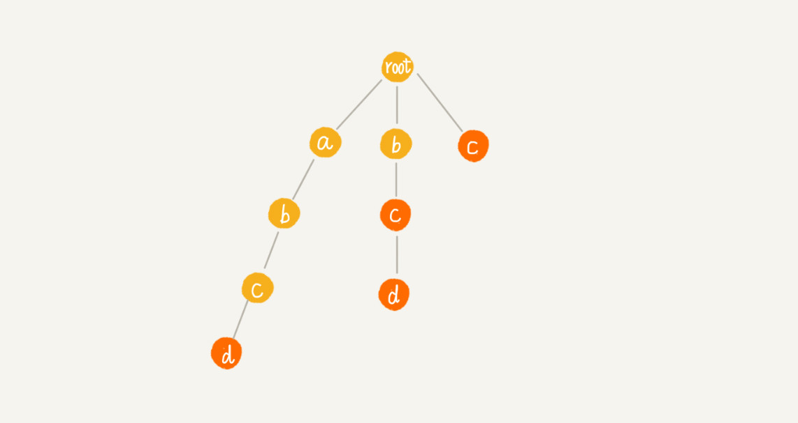

Trie树中的每一个节点都有一个失败指针，它的作用和构建过程，跟KMP算法中的next数组极其相似。所以**要想看懂这节内容，你要先理解KMP算法中next数组的构建过程**。

假设我们沿Trie树走到p节点，也就是下图中的紫色节点，那p的失败指针就是从root走到紫色节点形成的字符串abc，跟所有模式串前缀匹配的最长可匹配后缀子串，就是箭头指的bc模式串。

这里的最长可匹配后缀子串，我稍微解释一下。字符串abc的后缀子串有两个bc，c，我们拿它们与其他模式串匹配，如果某个后缀子串可以匹配某个模式串的前缀，那我们就把这个后缀子串叫作**可匹配后缀子串**。

我们从可匹配后缀子串中，找出最长的一个，就是刚刚讲到的最长可匹配后缀子串。我们将p节点的失败指针指向那个最长匹配后缀子串对应的模式串的前缀的最后一个节点，就是下图中箭头指向的节点。

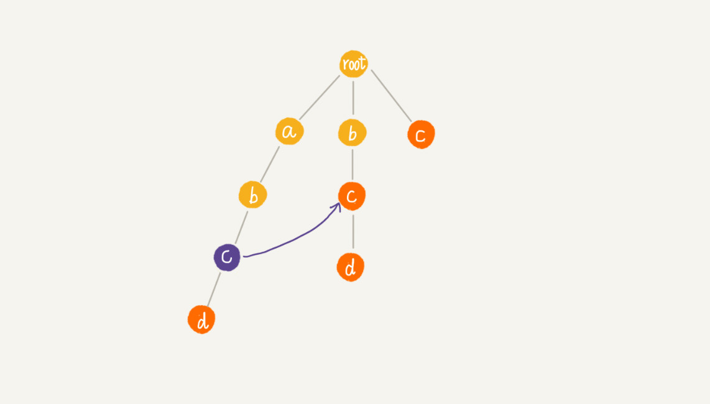

计算每个节点的失败指针这个过程看起来有些复杂。其实，如果我们把树中相同深度的节点放到同一层，那么某个节点的失败指针只有可能指向比他所在层更小的层数的节点。

我们可以像KMP算法那样，当我们要求某个节点的失败指针的时候，我们通过已经求得的、深度更小的那些节点的失败指针来推导。也就是说，我们可以逐层依次来求解每个节点的失败指针。所以，失败指针的构建过程，是一个按层遍历树的过程。

首先root的失败指针为NULL，也就是指向自己。**当我们已经求得某个节点p的失败指针之后，如何寻找它的子节点的失败指针呢？**

我们假设节点p的失败指针指向节点q，我们看节点p的子节点pc对应的字符，是否也可以在节点q的子节点中找到。如果找到了节点q的一个子节点qc，对应的字符跟节点pc对应的字符相同，则将节点pc的失败指针指向节点qc。

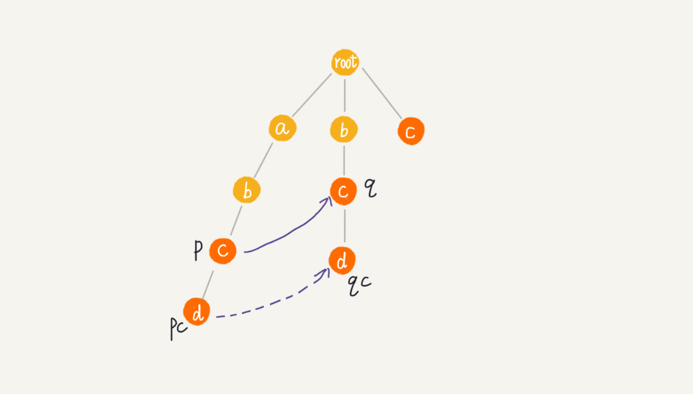

如果节点q中没有子节点的字符等于节点pc包含的字符，则令q=q->fail（fail表示失败指针，这里有没有很像KMP算法里求next的过程？），继续上面的查找，直到q是root为止，如果还没有找到相同字符的子节点，就让节点pc的失败指针指向root。

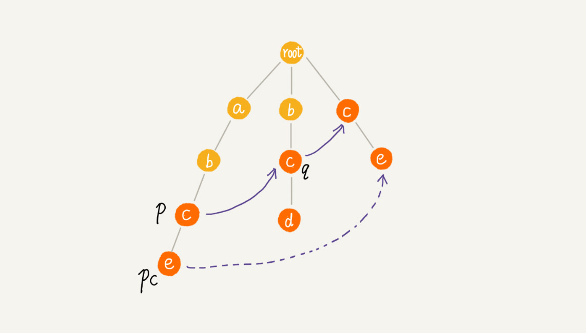

我将构建失败指针的代码贴在这里，你可以对照着讲解一块看下，应该更容易理解。这里面，构建Trie树的代码我并没有贴出来，你可以参看上一节的代码，自己实现。

```
public void buildFailurePointer() {
  Queue<AcNode> queue = new LinkedList<>();
  root.fail = null;
  queue.add(root);
  while (!queue.isEmpty()) {
    AcNode p = queue.remove();
    for (int i = 0; i < 26; ++i) {
      AcNode pc = p.children[i];
      if (pc == null) continue;
      if (p == root) {
        pc.fail = root;
      } else {
        AcNode q = p.fail;
        while (q != null) {
          AcNode qc = q.children[pc.data - 'a'];
          if (qc != null) {
            pc.fail = qc;
            break;
          }
          q = q.fail;
        }
        if (q == null) {
          pc.fail = root;
        }
      }
      queue.add(pc);
    }
  }
}
```

通过按层来计算每个节点的子节点的失效指针，刚刚举的那个例子，最后构建完成之后的AC自动机就是下面这个样子：


AC自动机到此就构建完成了。我们现在来看下，**如何在AC自动机上匹配主串？**

我们还是拿之前的例子来讲解。在匹配过程中，主串从i=0开始，AC自动机从指针p=root开始，假设模式串是b，主串是a。

- 如果p指向的节点有一个等于b[i]的子节点x，我们就更新p指向x，这个时候我们需要通过失败指针，检测一系列失败指针为结尾的路径是否是模式串。这一句不好理解，你可以结合代码看。处理完之后，我们将i加一，继续这两个过程；
- 如果p指向的节点没有等于b[i]的子节点，那失败指针就派上用场了，我们让p=p->fail，然后继续这2个过程。

关于匹配的这部分，文字描述不如代码看得清楚，所以我把代码贴了出来，非常简短，并且添加了详细的注释，你可以对照着看下。这段代码输出的就是，在主串中每个可以匹配的模式串出现的位置。

```
public void match(char[] text) { // text是主串
  int n = text.length;
  AcNode p = root;
  for (int i = 0; i < n; ++i) {
    int idx = text[i] - 'a';
    while (p.children[idx] == null && p != root) {
      p = p.fail; // 失败指针发挥作用的地方
    }
    p = p.children[idx];
    if (p == null) p = root; // 如果没有匹配的，从root开始重新匹配
    AcNode tmp = p;
    while (tmp != root) { // 打印出可以匹配的模式串
      if (tmp.isEndingChar == true) {
        int pos = i-tmp.length+1;
        System.out.println("匹配起始下标" + pos + "; 长度" + tmp.length);
      }
      tmp = tmp.fail;
    }
  }
}
```

这就是敏感词过滤的原型代码了。它可以找到所有敏感词出现的位置（在用户输入的文本中的起始下标）。你只需要稍加改造，再遍历一遍文本内容（主串），就可以将文本中的所有敏感词替换成“***”。

**AC自动机实现的敏感词过滤系统，是否比单模式串匹配方法更高效呢？**

首先，我们需要将敏感词构建成AC自动机，包括构建Trie树以及构建失败指针。

Trie树构建的时间复杂度是O(m*len)，其中len表示敏感词的平均长度，m表示敏感词的个数。那构建失败指针的时间复杂度是多少呢？我这里给出一个不是很紧确的上界。

假设Trie树中总的节点个数是k，每个节点构建失败指针的时候，（你可以看下代码）最耗时的环节是while循环中的q=q->fail，每运行一次这个语句，q指向节点的深度都会减少1，而树的高度最高也不会超过len，所以每个节点构建失败指针的时间复杂度是O(len)。整个失败指针的构建过程就是O(k*len)。

不过，AC自动机的构建过程都是预先处理好的，构建好之后，并不会频繁地更新，所以不会影响到敏感词过滤的运行效率。

**用AC自动机做匹配的时间复杂度是多少？**

跟刚刚构建失败指针的分析类似，for循环依次遍历主串中的每个字符，for循环内部最耗时的部分也是while循环，而这一部分的时间复杂度也是O(len)，所以总的匹配的时间复杂度就是O(n*len)。因为敏感词并不会很长，而且这个时间复杂度只是一个非常宽泛的上限，实际情况下，可能近似于O(n)，所以AC自动机做敏感词过滤，性能非常高。

从时间复杂度上看，AC自动机匹配的效率跟Trie树一样。实际上，因为失效指针可能大部分情况下都指向root节点，所以绝大部分情况下，在AC自动机上做匹配的效率要远高于刚刚计算出的比较宽泛的时间复杂度。只有在极端情况下，如图所示，AC自动机的性能才会退化的跟Trie树一样。


### 练习

#### 各个字符串匹配算法的特点和比较适合的应用场景吗？

一、单模式串匹配：

1. BF： 简单场景，主串和模式串都不太长, O(m*n)
2. KP：字符集范围不要太大且模式串不要太长， 否则hash值可能冲突，O(n)
3. naive-BM：模式串最好不要太长（因为预处理较重），比如IDE编辑器里的查找场景； 预处理O(m*m), 匹配O(n)， 实现较复杂，需要较多额外空间
4. KMP：适合所有场景，整体实现起来也比BM简单，O(n+m)，仅需一个next数组的O(n)额外空间
5. 另外查资料的时候还看到一种比BM/KMP更快，且实现+理解起来都更容易的的Sunday算法，有兴趣的可以看这里:
   http://www.inf.fh-flensburg.de/lang/algorithmen/pattern/sundayen.htm
   https://www.jianshu.com/p/2e6eb7386cd3


二、多模式串匹配：

1. naive-Trie: 适合多模式串公共前缀较多的匹配(O(n*k)) 或者 根据公共前缀进行查找(O(k))的场景，比如搜索框的自动补全提示.
2.  AC自动机: 适合大量文本中多模式串的精确匹配查找, 可以到O(n).

## 贪心算法

贪心算法有很多经典的应用，比如霍夫曼编码（Huffman Coding）、Prim和Kruskal最小生成树算法、还有Dijkstra单源最短路径算法。

### 如何理解“贪心算法”？

假设我们有一个可以容纳100kg物品的背包，可以装各种物品。我们有以下5种豆子，每种豆子的总量和总价值都各不相同。为了让背包中所装物品的总价值最大，我们如何选择在背包中装哪些豆子？每种豆子又该装多少呢？


实际上，这个问题很简单，我估计你一下子就能想出来，没错，我们只要先算一算每个物品的单价，按照单价由高到低依次来装就好了。单价从高到低排列，依次是：黑豆、绿豆、红豆、青豆、黄豆，所以，我们可以往背包里装20kg黑豆、30kg绿豆、50kg红豆。

这个问题的解决思路显而易见，它本质上借助的就是贪心算法。

**第一步，当我们看到这类问题的时候，首先要联想到贪心算法**：针对一组数据，我们定义了限制值和期望值，希望从中选出几个数据，在满足限制值的情况下，期望值最大。

**第二步，我们尝试看下这个问题是否可以用贪心算法解决**：每次选择当前情况下，在对限制值同等贡献量的情况下，对期望值贡献最大的数据。

**第三步，我们举几个例子看下贪心算法产生的结果是否是最优的**。大部分情况下，举几个例子验证一下就可以了。严格地证明贪心算法的正确性，是非常复杂的，需要涉及比较多的数学推理。而且，从实践的角度来说，大部分能用贪心算法解决的问题，贪心算法的正确性都是显而易见的，也不需要严格的数学推导证明。

实际上，用贪心算法解决问题的思路，并不总能给出最优解。

我来举一个例子。在一个有权图中，我们从顶点S开始，找一条到顶点T的最短路径（路径中边的权值和最小）。贪心算法的解决思路是，每次都选择一条跟当前顶点相连的权最小的边，直到找到顶点T。按照这种思路，我们求出的最短路径是S->A->E->T，路径长度是1+4+4=9。

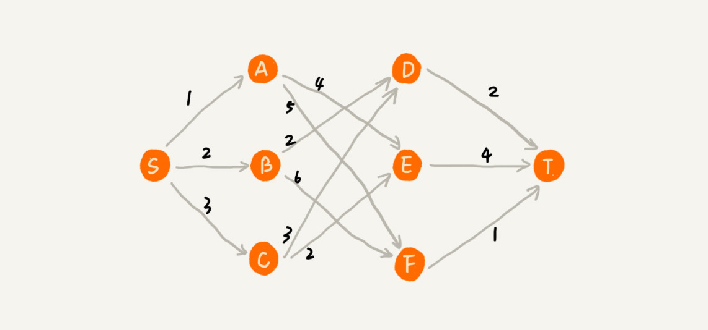

但是，这种贪心的选择方式，最终求的路径并不是最短路径，因为路径S->B->D->T才是最短路径，因为这条路径的长度是2+2+2=6。为什么贪心算法在这个问题上不工作了呢？

在这个问题上，贪心算法不工作的主要原因是，前面的选择，会影响后面的选择。如果我们第一步从顶点S走到顶点A，那接下来面对的顶点和边，跟第一步从顶点S走到顶点B，是完全不同的。所以，即便我们第一步选择最优的走法（边最短），但有可能因为这一步选择，导致后面每一步的选择都很糟糕，最终也就无缘全局最优解了。

### 贪心算法实战分析

#### 1.分糖果

我们有m个糖果和n个孩子。我们现在要把糖果分给这些孩子吃，但是糖果少，孩子多（m<n），所以糖果只能分配给一部分孩子。

每个糖果的大小不等，这m个糖果的大小分别是s1，s2，s3，……，sm。除此之外，每个孩子对糖果大小的需求也是不一样的，只有糖果的大小大于等于孩子的对糖果大小的需求的时候，孩子才得到满足。假设这n个孩子对糖果大小的需求分别是g1，g2，g3，……，gn。

如何分配糖果，能尽可能满足最多数量的孩子？

我们可以把这个问题抽象成，从n个孩子中，抽取一部分孩子分配糖果，让满足的孩子的个数（期望值）是最大的。这个问题的限制值就是糖果个数m。

我们现在来看看如何用贪心算法来解决。对于一个孩子来说，如果小的糖果可以满足，我们就没必要用更大的糖果，这样更大的就可以留给其他对糖果大小需求更大的孩子。另一方面，对糖果大小需求小的孩子更容易被满足，所以，我们可以从需求小的孩子开始分配糖果。因为满足一个需求大的孩子跟满足一个需求小的孩子，对我们期望值的贡献是一样的。

我们每次从剩下的孩子中，找出对糖果大小需求最小的，然后发给他剩下的糖果中能满足他的最小的糖果，这样得到的分配方案，也就是满足的孩子个数最多的方案。

#### 2.钱币找零

这个问题在我们的日常生活中更加普遍。假设我们有1元、2元、5元、10元、20元、50元、100元这些面额的纸币，它们的张数分别是c1、c2、c5、c10、c20、c50、c100。我们现在要用这些钱来支付K元，最少要用多少张纸币呢？

在生活中，我们肯定是先用面值最大的来支付，如果不够，就继续用更小一点面值的，以此类推，最后剩下的用1元来补齐。

在贡献相同期望值（纸币数目）的情况下，我们希望多贡献点金额，这样就可以让纸币数更少，这就是一种贪心算法的解决思路。

#### 3.区间覆盖

假设我们有n个区间，区间的起始端点和结束端点分别是[l1, r1]，[l2, r2]，[l3, r3]，……，[ln, rn]。我们从这n个区间中选出一部分区间，这部分区间满足两两不相交（端点相交的情况不算相交），最多能选出多少个区间呢？


这个问题的处理思路稍微不是那么好懂，不过，我建议你最好能弄懂，因为这个处理思想在很多贪心算法问题中都有用到，比如任务调度、教师排课等等问题。

这个问题的解决思路是这样的：我们假设这n个区间中最左端点是lmin，最右端点是rmax。这个问题就相当于，我们选择几个不相交的区间，从左到右将[lmin, rmax]覆盖上。我们按照起始端点从小到大的顺序对这n个区间排序。

我们每次选择的时候，左端点跟前面的已经覆盖的区间不重合的，右端点又尽量小的，这样可以让剩下的未覆盖区间尽可能的大，就可以放置更多的区间。这实际上就是一种贪心的选择方法。


### 练习

#### 如何用贪心算法实现霍夫曼编码？

假设我有一个包含1000个字符的文件，每个字符占1个byte（1byte=8bits），存储这1000个字符就一共需要8000bits，那有没有更加节省空间的存储方式呢？

假设我们通过统计分析发现，这1000个字符中只包含6种不同字符，假设它们分别是a、b、c、d、e、f。而3个二进制位（bit）就可以表示8个不同的字符，所以，为了尽量减少存储空间，每个字符我们用3个二进制位来表示。那存储这1000个字符只需要3000bits就可以了，比原来的存储方式节省了很多空间。不过，还有没有更加节省空间的存储方式呢？

```
a(000)、b(001)、c(010)、d(011)、e(100)、f(101)
```

霍夫曼编码就要登场了。霍夫曼编码是一种十分有效的编码方法，广泛用于数据压缩中，其压缩率通常在20%～90%之间。

霍夫曼编码不仅会考察文本中有多少个不同字符，还会考察每个字符出现的频率，根据频率的不同，选择不同长度的编码。霍夫曼编码试图用这种不等长的编码方法，来进一步增加压缩的效率。如何给不同频率的字符选择不同长度的编码呢？根据贪心的思想，我们可以把出现频率比较多的字符，用稍微短一些的编码；出现频率比较少的字符，用稍微长一些的编码。

对于等长的编码来说，我们解压缩起来很简单。比如刚才那个例子中，我们用3个bit表示一个字符。在解压缩的时候，我们每次从文本中读取3位二进制码，然后翻译成对应的字符。但是，霍夫曼编码是不等长的，每次应该读取1位还是2位、3位等等来解压缩呢？这个问题就导致霍夫曼编码解压缩起来比较复杂。为了避免解压缩过程中的歧义，霍夫曼编码要求各个字符的编码之间，不会出现某个编码是另一个编码前缀的情况。

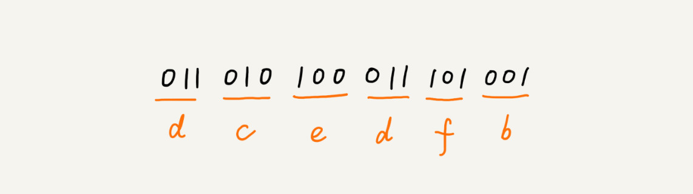

假设这6个字符出现的频率从高到低依次是a、b、c、d、e、f。我们把它们编码下面这个样子，任何一个字符的编码都不是另一个的前缀，在解压缩的时候，我们每次会读取尽可能长的可解压的二进制串，所以在解压缩的时候也不会歧义。经过这种编码压缩之后，这1000个字符只需要2100bits就可以了。


尽管霍夫曼编码的思想并不难理解，但是如何根据字符出现频率的不同，给不同的字符进行不同长度的编码呢？这里的处理稍微有些技巧。

我们把每个字符看作一个节点，并且辅带着把频率放到优先级队列中。我们从队列中取出频率最小的两个节点A、B，然后新建一个节点C，把频率设置为两个节点的频率之和，并把这个新节点C作为节点A、B的父节点。最后再把C节点放入到优先级队列中。重复这个过程，直到队列中没有数据。


现在，我们给每一条边加上画一个权值，指向左子节点的边我们统统标记为0，指向右子节点的边，我们统统标记为1，那从根节点到叶节点的路径就是叶节点对应字符的霍夫曼编码。


#### 在一个非负整数a中，我们希望从中移除k个数字，让剩下的数字值最小，如何选择移除哪k个数字呢？

由最高位开始，比较低一位数字，如高位大，移除，若高位小，则向右移一位继续比较两个数字，直到高位大于低位则移除，循环k次，如：
4556847594546移除5位-》455647594546-》45547594546-》4547594546-》4447594546-》444594546

#### 假设有n个人等待被服务，但是服务窗口只有一个，每个人需要被服务的时间长度是不同的，如何安排被服务的先后顺序，才能让这n个人总的等待时间最短？

由等待时间最短的开始服务

## 分治算法

### 如何理解分治算法？

分治算法（divide and conquer）的核心思想其实就是四个字，分而治之 ，也就是将原问题划分成n个规模较小，并且结构与原问题相似的子问题，递归地解决这些子问题，然后再合并其结果，就得到原问题的解。

这个定义看起来有点类似递归的定义。关于分治和递归的区别，**分治算法是一种处理问题的思想，递归是一种编程技巧**。实际上，分治算法一般都比较适合用递归来实现。分治算法的递归实现中，每一层递归都会涉及这样三个操作：

- 分解：将原问题分解成一系列子问题；
- 解决：递归地求解各个子问题，若子问题足够小，则直接求解；
- 合并：将子问题的结果合并成原问题。

分治算法能解决的问题，一般需要满足下面这几个条件：

- 原问题与分解成的小问题具有相同的模式；
- 原问题分解成的子问题可以独立求解，子问题之间没有相关性，这一点是分治算法跟动态规划的明显区别
- 具有分解终止条件，也就是说，当问题足够小时，可以直接求解；
- 可以将子问题合并成原问题，而这个合并操作的复杂度不能太高，否则就起不到减小算法总体复杂度的效果了。

### 分治算法应用举例分析

我们用有序度来表示一组数据的有序程度，用逆序度表示一组数据的无序程度。

假设我们有n个数据，我们期望数据从小到大排列，那完全有序的数据的有序度就是n(n-1)/2，逆序度等于0；相反，倒序排列的数据的有序度就是0，逆序度是n(n-1)/2。除了这两种极端情况外，我们通过计算有序对或者逆序对的个数，来表示数据的有序度或逆序度。


我现在的问题是，**如何编程求出一组数据的有序对个数或者逆序对个数呢**？因为有序对个数和逆序对个数的求解方式是类似的，所以你可以只思考逆序对个数的求解方法。

最笨的方法是，拿每个数字跟它后面的数字比较，看有几个比它小的。我们把比它小的数字个数记作k，通过这样的方式，把每个数字都考察一遍之后，然后对每个数字对应的k值求和，最后得到的总和就是逆序对个数。不过，这样操作的时间复杂度是O(n^2^)。那有没有更加高效的处理方法呢？

我们用分治算法来试试。我们套用分治的思想来求数组A的逆序对个数。我们可以将数组分成前后两半A1和A2，分别计算A1和A2的逆序对个数K1和K2，然后再计算A1与A2之间的逆序对个数K3。那数组A的逆序对个数就等于K1+K2+K3。

我们前面讲过，使用分治算法其中一个要求是，子问题合并的代价不能太大，否则就起不了降低时间复杂度的效果了。那回到这个问题，如何快速计算出两个子问题A1与A2之间的逆序对个数呢？这里就要借助归并排序算法了。

归并排序中有一个非常关键的操作，就是将两个有序的小数组，合并成一个有序的数组。实际上，在这个合并的过程中，我们就可以计算这两个小数组的逆序对个数了。每次合并操作，我们都计算逆序对个数，把这些计算出来的逆序对个数求和，就是这个数组的逆序对个数了。


```
private int num = 0; // 全局变量或者成员变量

public int count(int[] a, int n) {
  num = 0;
  mergeSortCounting(a, 0, n-1);
  return num;
}

private void mergeSortCounting(int[] a, int p, int r) {
  if (p >= r) return;
  int q = (p+r)/2;
  mergeSortCounting(a, p, q);
  mergeSortCounting(a, q+1, r);
  merge(a, p, q, r);
}

private void merge(int[] a, int p, int q, int r) {
  int i = p, j = q+1, k = 0;
  int[] tmp = new int[r-p+1];
  while (i<=q && j<=r) {
    if (a[i] <= a[j]) {
      tmp[k++] = a[i++];
    } else {
      num += (q-i+1); // 统计p-q之间，比a[j]大的元素个数
      tmp[k++] = a[j++];
    }
  }
  while (i <= q) { // 处理剩下的
    tmp[k++] = a[i++];
  }
  while (j <= r) { // 处理剩下的
    tmp[k++] = a[j++];
  }
  for (i = 0; i <= r-p; ++i) { // 从tmp拷贝回a
    a[p+i] = tmp[i];
  }
}
```

关于分治算法，我这还有两道比较经典的问题，你可以自己练习一下。

- 二维平面上有n个点，如何快速计算出两个距离最近的点对？

  分成两块, 单独求其中一块点对最小距离
  ,然后求这两块之间点对的最小距离, 通过一些排序和删除 

- 有两个n x n的矩阵A，B，如何快速求解两个矩阵的乘积C=A*B？

  v.斯特拉森提出了2*2分块矩阵的计算公式 ，从原来的8次乘法 ，缩减到了7次， 当n规模很大的时候 缩减效果就很明显 （7/8）^(logn)^

### 分治思想在海量数据处理中的应用

分治算法思想的应用是非常广泛的，并不仅限于指导编程和算法设计。它还经常用在海量数据处理的场景中。我们前面讲的数据结构和算法，大部分都是基于内存存储和单机处理。但是，如果要处理的数据量非常大，没法一次性放到内存中，这个时候，这些数据结构和算法就无法工作了。

比如，给10GB的订单文件按照金额排序这样一个需求，看似是一个简单的排序问题，但是因为数据量大，有10GB，而我们的机器的内存可能只有2、3GB这样子，无法一次性加载到内存，也就无法通过单纯地使用快排、归并等基础算法来解决了。

要解决这种数据量大到内存装不下的问题，我们就可以利用分治的思想。我们可以将海量的数据集合根据某种方法，划分为几个小的数据集合，每个小的数据集合单独加载到内存来解决，然后再将小数据集合合并成大数据集合。实际上，利用这种分治的处理思路，不仅仅能克服内存的限制，还能利用多线程或者多机处理，加快处理的速度。

比如刚刚举的那个例子，给10GB的订单排序，我们就可以先扫描一遍订单，根据订单的金额，将10GB的文件划分为几个金额区间。比如订单金额为1到100元的放到一个小文件，101到200之间的放到另一个文件，以此类推。这样每个小文件都可以单独加载到内存排序，最后将这些有序的小文件合并，就是最终有序的10GB订单数据了。

如果订单数据存储在类似GFS这样的分布式系统上，当10GB的订单被划分成多个小文件的时候，每个文件可以并行加载到多台机器上处理，最后再将结果合并在一起，这样并行处理的速度也加快了很多。不过，这里有一个点要注意，就是数据的存储与计算所在的机器是同一个或者在网络中靠的很近（比如一个局域网内，数据存取速度很快），否则就会因为数据访问的速度，导致整个处理过程不但不会变快，反而有可能变慢。

### 为什么说MapReduce的本质就是分治思想？

我们刚刚举的订单的例子，数据有10GB大小，可能给你的感受还不强烈。那如果我们要处理的数据是1T、10T、100T这样子的，那一台机器处理的效率肯定是非常低的。而对于谷歌搜索引擎来说，网页爬取、清洗、分析、分词、计算权重、倒排索引等等各个环节中，都会面对如此海量的数据（比如网页）。所以，利用集群并行处理显然是大势所趋。

一台机器过于低效，那我们就把任务拆分到多台机器上来处理。如果拆分之后的小任务之间互不干扰，独立计算，最后再将结果合并。这不就是分治思想吗？

实际上，MapReduce框架只是一个任务调度器，底层依赖GFS来存储数据，依赖Borg管理机器。它从GFS中拿数据，交给Borg中的机器执行，并且时刻监控机器执行的进度，一旦出现机器宕机、进度卡壳等，就重新从Borg中调度一台机器执行。

## 回溯算法

深度优先搜索算法利用的是回溯算法思想。这个算法思想非常简单，但是应用却非常广泛。它除了用来指导像深度优先搜索这种经典的算法设计之外，还可以用在很多实际的软件开发场景中，比如正则表达式匹配、编译原理中的语法分析等。

除此之外，很多经典的数学问题都可以用回溯算法解决，比如数独、八皇后、0-1背包、图的着色、旅行商问题、全排列等等。

### 如何理解“回溯算法”？

笼统地讲，回溯算法很多时候都应用在“搜索”这类问题上。不过这里说的搜索，并不是狭义的指我们前面讲过的图的搜索算法，而是在一组可能的解中，搜索满足期望的解。

回溯的处理思想，有点类似枚举搜索。我们枚举所有的解，找到满足期望的解。为了有规律地枚举所有可能的解，避免遗漏和重复，我们把问题求解的过程分为多个阶段。每个阶段，我们都会面对一个岔路口，我们先随意选一条路走，当发现这条路走不通的时候（不符合期望的解），就回退到上一个岔路口，另选一种走法继续走。

理论的东西还是过于抽象，老规矩，我还是举例说明一下。我举一个经典的回溯例子，那就是八皇后问题。

我们有一个8x8的棋盘，希望往里放8个棋子（皇后），每个棋子所在的行、列、对角线都不能有另一个棋子。你可以看我画的图，第一幅图是满足条件的一种方法，第二幅图是不满足条件的。八皇后问题就是期望找到所有满足这种要求的放棋子方式。


我们把这个问题划分成8个阶段，依次将8个棋子放到第一行、第二行、第三行……第八行。在放置的过程中，我们不停地检查当前的方法，是否满足要求。如果满足，则跳到下一行继续放置棋子；如果不满足，那就再换一种方法，继续尝试。

回溯算法非常适合用递归代码实现，所以，我把八皇后的算法翻译成代码。

```
int[] result = new int[8];//全局或成员变量,下标表示行,值表示queen存储在哪一列
public void cal8queens(int row) { // 调用方式：cal8queens(0);
  if (row == 8) { // 8个棋子都放置好了，打印结果
    printQueens(result);
    return; // 8行棋子都放好了，已经没法再往下递归了，所以就return
  }
  for (int column = 0; column < 8; ++column) { // 每一行都有8中放法
    if (isOk(row, column)) { // 有些放法不满足要求
      result[row] = column; // 第row行的棋子放到了column列
      cal8queens(row+1); // 考察下一行
    }
  }
}

private boolean isOk(int row, int column) {//判断row行column列放置是否合适
  int leftup = column - 1, rightup = column + 1;
  for (int i = row-1; i >= 0; --i) { // 逐行往上考察每一行
    if (result[i] == column) return false; // 第i行的column列有棋子吗？
    if (leftup >= 0) { // 考察左上对角线：第i行leftup列有棋子吗？
      if (result[i] == leftup) return false;
    }
    if (rightup < 8) { // 考察右上对角线：第i行rightup列有棋子吗？
      if (result[i] == rightup) return false;
    }
    --leftup; ++rightup;
  }
  return true;
}

private void printQueens(int[] result) { // 打印出一个二维矩阵
  for (int row = 0; row < 8; ++row) {
    for (int column = 0; column < 8; ++column) {
      if (result[row] == column) System.out.print("Q ");
      else System.out.print("* ");
    }
    System.out.println();
  }
  System.out.println();
}
```

### 两个回溯算法的经典应用

#### 1.背包

0-1背包是非常经典的算法问题，很多场景都可以抽象成这个问题模型。这个问题的经典解法是动态规划，不过还有一种简单但没有那么高效的解法，那就是今天讲的回溯算法。

0-1背包问题有很多变体，我这里介绍一种比较基础的。我们有一个背包，背包总的承载重量是Wkg。现在我们有n个物品，每个物品的重量不等，并且不可分割。我们现在期望选择几件物品，装载到背包中。在不超过背包所能装载重量的前提下，如何让背包中物品的总重量最大？

实际上，背包问题我们在贪心算法那一节，已经讲过一个了，不过那里讲的物品是可以分割的，我可以装某个物品的一部分到背包里面。今天讲的这个背包问题，物品是不可分割的，要么装要么不装，所以叫0-1背包问题。显然，这个问题已经无法通过贪心算法来解决了。我们现在来看看，用回溯算法如何来解决。

对于每个物品来说，都有两种选择，装进背包或者不装进背包。对于n个物品来说，总的装法就有2^n^种，去掉总重量超过Wkg的，从剩下的装法中选择总重量最接近Wkg的。不过，我们如何才能不重复地穷举出这2^n^种装法呢？

这里就可以用回溯的方法。我们可以把物品依次排列，整个问题就分解为了n个阶段，每个阶段对应一个物品怎么选择。先对第一个物品进行处理，选择装进去或者不装进去，然后再递归地处理剩下的物品。

这里还稍微用到了一点搜索剪枝的技巧，就是当发现已经选择的物品的重量超过Wkg之后，我们就停止继续探测剩下的物品。

```
public int maxW = Integer.MIN_VALUE; //存储背包中物品总重量的最大值
// cw表示当前已经装进去的物品的重量和；i表示考察到哪个物品了；
// w背包重量；items表示每个物品的重量；n表示物品个数
// 假设背包可承受重量100，物品个数10，物品重量存储在数组a中，那可以这样调用函数：
// f(0, 0, a, 10, 100)
public void f(int i, int cw, int[] items, int n, int w) {
  if (cw == w || i == n) { // cw==w表示装满了;i==n表示已经考察完所有的物品
    if (cw > maxW) maxW = cw;
    return;
  }
  f(i+1, cw, items, n, w);
  if (cw + items[i] <= w) {// 已经超过可以背包承受的重量的时候，就不要再装了
    f(i+1,cw + items[i], items, n, w);
  }
}
```

#### 2.正则表达式

看懂了0-1背包问题，我们再来看另外一个例子，正则表达式匹配。实际上，正则表达式里最重要的一种算法思想就是回溯。

正则表达式中，最重要的就是通配符，通配符结合在一起，可以表达非常丰富的语义。为了方便讲解，我假设正表达式中只包含“*”和“?”这两种通配符，并且对这两个通配符的语义稍微做些改变.

其中，“*”匹配任意多个（大于等于0个）任意字符，“?”匹配零个或者一个任意字符。基于以上背景假设，我们看下，如何用回溯算法，判断一个给定的文本，能否跟给定的正则表达式匹配？

我们依次考察正则表达式中的每个字符，当是非通配符时，我们就直接跟文本的字符进行匹配，如果相同，则继续往下处理；如果不同，则回溯。

如果遇到特殊字符的时候，我们就有多种处理方式了，也就是所谓的岔路口，比如“*”有多种匹配方案，可以匹配任意个文本串中的字符，我们就先随意的选择一种匹配方案，然后继续考察剩下的字符。如果中途发现无法继续匹配下去了，我们就回到这个岔路口，重新选择一种匹配方案，然后再继续匹配剩下的字符。

```
public class Pattern {
  private boolean matched = false;
  private char[] pattern; // 正则表达式
  private int plen; // 正则表达式长度

  public Pattern(char[] pattern, int plen) {
    this.pattern = pattern;
    this.plen = plen;
  }

  public boolean match(char[] text, int tlen) { // 文本串及长度
    matched = false;
    rmatch(0, 0, text, tlen);
    return matched;
  }

  private void rmatch(int ti, int pj, char[] text, int tlen) {
    if (matched) return; // 如果已经匹配了，就不要继续递归了
    if (pj == plen) { // 正则表达式到结尾了
      if (ti == tlen) matched = true; // 文本串也到结尾了
      return;
    }
    if (pattern[pj] == '*') { // *匹配任意个字符
      for (int k = 0; k <= tlen-ti; ++k) {
        rmatch(ti+k, pj+1, text, tlen);
      }
    } else if (pattern[pj] == '?') { // ?匹配0个或者1个字符
      rmatch(ti, pj+1, text, tlen);
      rmatch(ti+1, pj+1, text, tlen);
    } else if (ti < tlen && pattern[pj] == text[ti]) { // 纯字符匹配才行
      rmatch(ti+1, pj+1, text, tlen);
    }
  }
}
```

回溯算法的思想非常简单，大部分情况下，都是用来解决广义的搜索问题，也就是，从一组可能的解中，选择出一个满足要求的解。回溯算法非常适合用递归来实现，在实现的过程中，剪枝操作是提高回溯效率的一种技巧。利用剪枝，我们并不需要穷举搜索所有的情况，从而提高搜索效率。

### 练习

如果每个物品不仅重量不同，价值也不同。如何在不超过背包重量的情况下，让背包中的总价值最大？


## 动态规划

动态规划比较适合用来求解最优问题，比如求最大值、最小值等等。它可以非常显著地降低时间复杂度，提高代码的执行效率。

### 0-1背包问题

我在讲贪心算法、回溯算法的时候，多次讲到背包问题。今天，我们依旧拿这个问题来举例。

对于一组不同重量、不可分割的物品，我们需要选择一些装入背包，在满足背包最大重量限制的前提下，背包中物品总重量的最大值是多少呢？

关于这个问题，我们上一节讲了回溯的解决方法，也就是穷举搜索所有可能的装法，然后找出满足条件的最大值。不过，回溯算法的复杂度比较高，是指数级别的。那有没有什么规律，可以有效降低时间复杂度呢？我们一起来看看。

```
// 回溯算法实现。注意：我把输入的变量都定义成了成员变量。
private int maxW = Integer.MIN_VALUE; // 结果放到maxW中
private int[] weight = {2，2，4，6，3};  // 物品重量
private int n = 5; // 物品个数
private int w = 9; // 背包承受的最大重量
public void f(int i, int cw) { // 调用f(0, 0)
  if (cw == w || i == n) { // cw==w表示装满了，i==n表示物品都考察完了
    if (cw > maxW) maxW = cw;
    return;
  }
  f(i+1, cw); // 选择不装第i个物品
  if (cw + weight[i] <= w) {
    f(i+1,cw + weight[i]); // 选择装第i个物品
  }
}
```

规律是不是不好找？那我们就举个例子、画个图看看。我们假设背包的最大承载重量是9。我们有5个不同的物品，每个物品的重量分别是2，2，4，6，3。如果我们把这个例子的回溯求解过程，用递归树画出来，就是下面这个样子：


递归树中的每个节点表示一种状态，我们用（i, cw）来表示。其中，i表示将要决策第几个物品是否装入背包，cw表示当前背包中物品的总重量。比如，（2，2）表示我们将要决策第2个物品是否装入背包，在决策前，背包中物品的总重量是2。

从递归树中，你应该能会发现，有些子问题的求解是重复的，比如图中f(2, 2)和f(3,4)都被重复计算了两次。我们可以借助记录已经计算好的f(i, cw)，当再次计算到重复的f(i, cw)的时候，可以直接从备忘录中取出来用，就不用再递归计算了，这样就可以避免冗余计算。

```
private int maxW = Integer.MIN_VALUE; // 结果放到maxW中
private int[] weight = {2，2，4，6，3};  // 物品重量
private int n = 5; // 物品个数
private int w = 9; // 背包承受的最大重量
private boolean[][] mem = new boolean[5][10]; // 备忘录，默认值false
public void f(int i, int cw) { // 调用f(0, 0)
  if (cw == w || i == n) { // cw==w表示装满了，i==n表示物品都考察完了
    if (cw > maxW) maxW = cw;
    return;
  }
  if (mem[i][cw]) return; // 重复状态
  mem[i][cw] = true; // 记录(i, cw)这个状态
  f(i+1, cw); // 选择不装第i个物品
  if (cw + weight[i] <= w) {
    f(i+1,cw + weight[i]); // 选择装第i个物品
  }
}
```

这种解决方法非常好。实际上，它已经跟动态规划的执行效率基本上没有差别。但是，多一种方法就多一种解决思路，我们现在来看看动态规划是怎么做的。

我们把整个求解过程分为n个阶段，每个阶段会决策一个物品是否放到背包中。每个物品决策（放入或者不放入背包）完之后，背包中的物品的重量会有多种情况，也就是说，会达到多种不同的状态，对应到递归树中，就是有很多不同的节点。

我们把每一层重复的状态（节点）合并，只记录不同的状态，然后基于上一层的状态集合，来推导下一层的状态集合。我们可以通过合并每一层重复的状态，这样就保证每一层不同状态的个数都不会超过w个（w表示背包的承载重量），也就是例子中的9。于是，我们就成功避免了每层状态个数的指数级增长。

我们用一个二维数组states[n,w+1]，来记录每层可以达到的不同状态。

第0个（下标从0开始编号）物品的重量是2，要么装入背包，要么不装入背包，决策完之后，会对应背包的两种状态，背包中物品的总重量是0或者2。我们用states[0,0]=true和states[0,2]=true来表示这两种状态。

第1个物品的重量也是2，基于之前的背包状态，在这个物品决策完之后，不同的状态有3个，背包中物品总重量分别是0(0+0)，2(0+2 or 2+0)，4(2+2)。我们用states[1,0]=true，states[1,2]=true，states[1,4]=true来表示这三种状态。

以此类推，直到考察完所有的物品后，整个states状态数组就都计算好了。我把整个计算的过程画了出来，你可以看看。图中0表示false，1表示true。我们只需要在最后一层，找一个值为true的最接近w（这里是9）的值，就是背包中物品总重量的最大值。


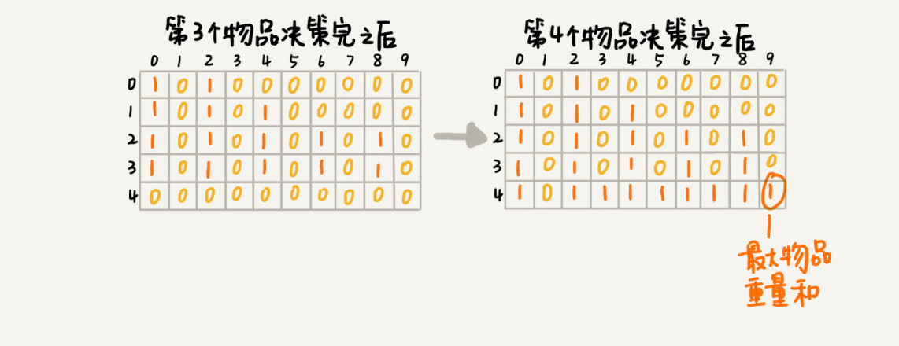

```
weight:物品重量，n:物品个数，w:背包可承载重量
public int knapsack(int[] weight, int n, int w) {
  boolean[][] states = new boolean[n][w+1]; // 默认值false
  states[0][0] = true;  // 第一行的数据要特殊处理，可以利用哨兵优化
  states[0][weight[0]] = true;
  for (int i = 1; i < n; ++i) { // 动态规划状态转移
    for (int j = 0; j <= w; ++j) {// 不把第i个物品放入背包
      if (states[i-1][j] == true) states[i][j] = states[i-1][j];
    }
    for (int j = 0; j <= w-weight[i]; ++j) {//把第i个物品放入背包
      if (states[i-1][j]==true) states[i][j+weight[i]] = true;
    }
  }
  for (int i = w; i >= 0; --i) { // 输出结果
    if (states[n-1][i] == true) return i;
  }
  return 0;
}
```

实际上，这就是一种用动态规划解决问题的思路。我们把问题分解为多个阶段，每个阶段对应一个决策。我们记录每一个阶段可达的状态集合（去掉重复的），然后通过当前阶段的状态集合，来推导下一个阶段的状态集合，动态地往前推进。这也是动态规划这个名字的由来。

前面我们讲到，用回溯算法解决这个问题的时间复杂度O(2^n^)，是指数级的。那动态规划解决方案的时间复杂度是多少呢？

这个代码的时间复杂度非常好分析，耗时最多的部分就是代码中的两层for循环，所以时间复杂度是O(n*w)。n表示物品个数，w表示背包可以承载的总重量。

尽管动态规划的执行效率比较高，但是就刚刚的代码实现来说，我们需要额外申请一个n乘以w+1的二维数组，对空间的消耗比较多。所以，有时候，我们会说，动态规划是一种空间换时间的解决思路。你可能要问了，有什么办法可以降低空间消耗吗？

实际上，我们只需要一个大小为w+1的一维数组就可以解决这个问题。动态规划状态转移的过程，都可以基于这个一维数组来操作。

```
public static int knapsack2(int[] items, int n, int w) {
  boolean[] states = new boolean[w+1]; // 默认值false
  states[0] = true;  // 第一行的数据要特殊处理，可以利用哨兵优化
  states[items[0]] = true;
  for (int i = 1; i < n; ++i) { // 动态规划
    for (int j = w-items[i]; j >= 0; --j) {//把第i个物品放入背包
      if (states[j]==true) states[j+items[i]] = true;
    }
  }
  for (int i = w; i >= 0; --i) { // 输出结果
    if (states[i] == true) return i;
  }
  return 0;
}
```

这里我特别强调一下代码中的第6行，j需要从大到小来处理。如果我们按照j从小到大处理的话，会出现for循环重复计算的问题。你可以自己想一想，这里我就不详细说了。

### 0-1背包问题升级版

我们继续升级难度。我改造了一下刚刚的背包问题。你看这个问题又该如何用动态规划解决？

我们刚刚讲的背包问题，只涉及背包重量和物品重量。我们现在引入物品价值这一变量。对于一组不同重量、不同价值、不可分割的物品，我们选择将某些物品装入背包，在满足背包最大重量限制的前提下，背包中可装入物品的总价值最大是多少呢？

这个问题依旧可以用回溯算法来解决。

```
private int maxV = Integer.MIN_VALUE; // 结果放到maxV中
private int[] items = {2，2，4，6，3};  // 物品的重量
private int[] value = {3，4，8，9，6}; // 物品的价值
private int n = 5; // 物品个数
private int w = 9; // 背包承受的最大重量
public void f(int i, int cw, int cv) { // 调用f(0, 0, 0)
  if (cw == w || i == n) { // cw==w表示装满了，i==n表示物品都考察完了
    if (cv > maxV) maxV = cv;
    return;
  }
  f(i+1, cw, cv); // 选择不装第i个物品
  if (cw + weight[i] <= w) {
    f(i+1,cw+weight[i], cv+value[i]); // 选择装第i个物品
  }
}
```

针对上面的代码，我们还是照例画出递归树。在递归树中，每个节点表示一个状态。现在我们需要3个变量（i, cw, cv）来表示一个状态。其中，i表示即将要决策第i个物品是否装入背包，cw表示当前背包中物品的总重量，cv表示当前背包中物品的总价值。


我们发现，在递归树中，有几个节点的i和cw是完全相同的，比如f(2,2,4)和f(2,2,3)。在背包中物品总重量一样的情况下，f(2,2,4)这种状态对应的物品总价值更大，我们可以舍弃f(2,2,3)这种状态，只需要沿着f(2,2,4)这条决策路线继续往下决策就可以。

也就是说，对于(i, cw)相同的不同状态，那我们只需要保留cv值最大的那个，继续递归处理，其他状态不予考虑。

思路说完了，但是代码如何实现呢？如果用回溯算法，这个问题就没法再用“备忘录”解决了。所以，我们就需要换一种思路，看看动态规划是不是更容易解决这个问题？

我们还是把整个求解过程分为n个阶段，每个阶段会决策一个物品是否放到背包中。每个阶段决策完之后，背包中的物品的总重量以及总价值，会有多种情况，也就是会达到多种不同的状态。

我们用一个二维数组states[n,w+1]，来记录每层可以达到的不同状态。不过这里数组存储的值不再是boolean类型的了，而是当前状态对应的最大总价值。我们把每一层中(i, cw)重复的状态（节点）合并，只记录cv值最大的那个状态，然后基于这些状态来推导下一层的状态。

我们把这个动态规划的过程翻译成代码，就是下面这个样子：

```
public static int knapsack3(int[] weight, int[] value, int n, int w) {
  int[][] states = new int[n][w+1];
  for (int i = 0; i < n; ++i) { // 初始化states
    for (int j = 0; j < w+1; ++j) {
      states[i][j] = -1;
    }
  }
  states[0][0] = 0;
  states[0][weight[0]] = value[0];
  for (int i = 1; i < n; ++i) { //动态规划，状态转移
    for (int j = 0; j <= w; ++j) { // 不选择第i个物品
      if (states[i-1][j] >= 0) states[i][j] = states[i-1][j];
    }
    for (int j = 0; j <= w-weight[i]; ++j) { // 选择第i个物品
      if (states[i-1][j] >= 0) {
        int v = states[i-1][j] + value[i];
        if (v > states[i][j+weight[i]]) {
          states[i][j+weight[i]] = v;
        }
      }
    }
  }
  // 找出最大值
  int maxvalue = -1;
  for (int j = 0; j <= w; ++j) {
    if (states[n-1][j] > maxvalue) maxvalue = states[n-1][j];
  }
  return maxvalue;
}
```

关于这个问题的时间、空间复杂度的分析，跟上一个例子大同小异，时间复杂度是O(n x w)，空间复杂度也是O(n*w)。跟上一个例子类似，空间复杂度也是可以优化的。

### 练习

#### 淘宝的“双十一”购物节有各种促销活动，比如“满200元减50元”。假设购物车中有n个（n>100）想买的商品，希望从里面选几个，在凑够满减条件的前提下，让选出来的商品价格总和最大程度地接近满减条件（200元）

对于这个问题，你当然可以利用回溯算法，穷举所有的排列组合，看大于等于200并且最接近200的组合是哪一个？但是，这样效率太低了点，时间复杂度非常高，是指数级的。

实际上，它跟第一个例子中讲的0-1背包问题很像，只不过是把“重量”换成了“价格”而已。购物车中有n个商品。我们针对每个商品都决策是否购买。每次决策之后，对应不同的状态集合。我们还是用一个二维数组states[n,x]，来记录每次决策之后所有可达的状态。不过，这里的x值是多少呢？

0-1背包问题中，我们找的是小于等于w的最大值，x就是背包的最大承载重量w+1。对于这个问题来说，我们要找的是大于等于200（满减条件）的值中最小的，所以就不能设置为200加1了。就这个实际的问题而言，如果要购买的物品的总价格超过200太多，比如1000，那这个羊毛“薅”得就没有太大意义了。所以，我们可以限定x值为1001。

不过，这个问题不仅要求大于等于200的总价格中的最小的，我们还要找出这个最小总价格对应都要购买哪些商品。实际上，我们可以利用states数组，倒推出这个被选择的商品序列。

```
// items商品价格，n商品个数, w表示满减条件，比如200
public static void double11advance(int[] items, int n, int w) {
  boolean[][] states = new boolean[n][3*w+1];//超过3倍就没有薅羊毛的价值了
  states[0][0] = true;  // 第一行的数据要特殊处理
  states[0][items[0]] = true;
  for (int i = 1; i < n; ++i) { // 动态规划
    for (int j = 0; j <= 3*w; ++j) {// 不购买第i个商品
      if (states[i-1][j] == true) states[i][j] = states[i-1][j];
    }
    for (int j = 0; j <= 3*w-items[i]; ++j) {//购买第i个商品
      if (states[i-1][j]==true) states[i][j+items[i]] = true;
    }
  }

  int j;
  for (j = w; j < 3*w+1; ++j) { 
    if (states[n-1][j] == true) break; // 输出结果大于等于w的最小值
  }
  if (j == -1) return; // 没有可行解
  for (int i = n-1; i >= 1; --i) { // i表示二维数组中的行，j表示列
    if(j-items[i] >= 0 && states[i-1][j-items[i]] == true) {
      System.out.print(items[i] + " "); // 购买这个商品
      j = j - items[i];
    } // else 没有购买这个商品，j不变。
  }
  if (j != 0) System.out.print(items[0]);
}
```

代码的前半部分跟0-1背包问题没有什么不同，我们着重看后半部分，看它是如何打印出选择购买哪些商品的。

状态(i, j)只有可能从(i-1, j)或者(i-1, j-value[i])两个状态推导过来。所以，我们就检查这两个状态是否是可达的，也就是states[i-1,j]或者states[i-1,j-value[i]]是否是true。

如果states[i-1,j]可达，就说明我们没有选择购买第i个商品，如果states[i-1,j-value[i]]可达，那就说明我们选择了购买第i个商品。我们从中选择一个可达的状态（如果两个都可达，就随意选择一个），然后，继续迭代地考察其他商品是否有选择购买。

#### “杨辉三角”我们现在对它进行一些改造。每个位置的数字可以随意填写，经过某个数字只能到达下面一层相邻的两个数字。假设你站在第一层，往下移动，我们把移动到最底层所经过的所有数字之和，定义为路径的长度。请你编程求出从最高层移动到最底层的最短路径长度。


```
int[][] matrix = {{5},{7,8},{2,3,4},{4,9,6,1},{2,7,9,4,5}};

public int yanghuiTriangle(int[][] matrix) {
	int[][] state = new int[matrix.length][matrix.length];
	state[0][0] = matrix[0][0];
	for (int i = 1; i < matrix.length; i++) {
		for (int j = 0; j < matrix[i].length; j++) {
			if (j == 0) state[i][j] = state[i - 1][j] + matrix[i][j];
			else if (j == matrix[i].length - 1) state[i][j] = state[i - 1][j - 1] + 
			matrix[i][j];
			else {
				int top1 = state[i - 1][j - 1];
				int top2 = state[i - 1][j];
				state[i][j] = Math.min(top1, top2) + matrix[i][j];
			}
		}
	}
	int minDis = Integer.MAX_VALUE;
	for (int i = 0; i < matrix[matrix.length - 1].length; i++) {
		int distance = state[matrix.length - 1][i];
		if (distance < minDis) minDis = distance;
	}
	return minDis;
}
```

### “一个模型三个特征”理论讲解

什么样的问题适合用动态规划来解决呢？换句话说，动态规划能解决的问题有什么规律可循呢？实际上，动态规划作为一个非常成熟的算法思想，很多人对此已经做了非常全面的总结。我把这部分理论总结为“一个模型三个特征”。

什么是“**一个模型**”？它指的是动态规划适合解决的问题的模型。我把这个模型定义为“**多阶段决策最优解模型**”。

我们一般是用动态规划来解决最优问题。而解决问题的过程，需要经历多个决策阶段。每个决策阶段都对应着一组状态。然后我们寻找一组决策序列，经过这组决策序列，能够产生最终期望求解的最优值。

什么是“**三个特征**”？它们分别是**最优子结构**、**无后效性**和**重复子问题**。

#### 1.最优子结构

最优子结构指的是，问题的最优解包含子问题的最优解。反过来说就是，我们可以通过子问题的最优解，推导出问题的最优解。如果我们把最优子结构，对应到我们前面定义的动态规划问题模型上，那我们也可以理解为，后面阶段的状态可以通过前面阶段的状态推导出来。

#### 2.无后效性

无后效性有两层含义，第一层含义是，在推导后面阶段的状态的时候，我们只关心前面阶段的状态值，不关心这个状态是怎么一步一步推导出来的。第二层含义是，某阶段状态一旦确定，就不受之后阶段的决策影响。无后效性是一个非常“宽松”的要求。只要满足前面提到的动态规划问题模型，其实基本上都会满足无后效性。

#### 3.重复子问题

这个概念比较好理解。那就是，不同的决策序列，到达某个相同的阶段时，可能会产生重复的状态。

### “一个模型三个特征”实例剖析

假设我们有一个n乘以n的矩阵w[n,n]。矩阵存储的都是正整数。棋子起始位置在左上角，终止位置在右下角。我们将棋子从左上角移动到右下角。每次只能向右或者向下移动一位。从左上角到右下角，会有很多不同的路径可以走。我们把每条路径经过的数字加起来看作路径的长度。那从左上角移动到右下角的最短路径长度是多少呢？


我们先看看，这个问题是否符合“一个模型”？

从(0, 0)走到(n-1, n-1)，总共要走2(n-1)步，也就对应着2*(n-1)个阶段。每个阶段都有向右走或者向下走两种决策，并且每个阶段都会对应一个状态集合。

我们把状态定义为min_dist(i, j)，其中i表示行，j表示列。min_dist表达式的值表示从(0, 0)到达(i, j)的最短路径长度。所以，这个问题是一个多阶段决策最优解问题，符合动态规划的模型。


我们再来看，这个问题是否符合“三个特征”？

我们可以用回溯算法来解决这个问题。如果你自己写一下代码，画一下递归树，就会发现，递归树中有重复的节点。重复的节点表示，从左上角到节点对应的位置，有多种路线，这也能说明这个问题中存在重复子问题。


如果我们走到(i, j)这个位置，我们只能通过(i-1, j)，(i, j-1)这两个位置移动过来，也就是说，我们想要计算(i, j)位置对应的状态，只需要关心(i-1, j)，(i, j-1)两个位置对应的状态，并不关心棋子是通过什么样的路线到达这两个位置的。而且，我们仅仅允许往下和往右移动，不允许后退，所以，前面阶段的状态确定之后，不会被后面阶段的决策所改变，所以，这个问题符合“无后效性”这一特征。

刚刚定义状态的时候，我们把从起始位置(0, 0)到(i, j)的最小路径，记作min_dist(i, j)。因为我们只能往右或往下移动，所以，我们只有可能从(i, j-1)或者(i-1, j)两个位置到达(i, j)。也就是说，到达(i, j)的最短路径要么经过(i, j-1)，要么经过(i-1, j)，而且到达(i, j)的最短路径肯定包含到达这两个位置的最短路径之一。换句话说就是，min_dist(i, j)可以通过min_dist(i, j-1)和min_dist(i-1, j)两个状态推导出来。这就说明，这个问题符合“最优子结构”。

```
min_dist(i, j) = w[i][j] + min(min_dist(i, j-1), min_dist(i-1, j))
```

### 两种动态规划解题思路总结

解决动态规划问题，一般有两种思路。我把它们分别叫作，状态转移表法和状态转移方程法。

其中，状态转移表法解题思路大致可以概括为，**回溯算法实现-定义状态-画递归树-找重复子问题-画状态转移表-根据递推关系填表-将填表过程翻译成代码**。状态转移方程法的大致思路可以概括为，**找最优子结构-写状态转移方程-将状态转移方程翻译成代码**。

#### 1.状态转移表法

一般能用动态规划解决的问题，都可以使用回溯算法的暴力搜索解决。所以，当我们拿到问题的时候，我们可以先用简单的回溯算法解决，然后定义状态，每个状态表示一个节点，然后对应画出递归树。从递归树中，我们很容易可以看出来，是否存在重复子问题，以及重复子问题是如何产生的。以此来寻找规律，看是否能用动态规划解决。

找到重复子问题之后，接下来，我们有两种处理思路，第一种是直接用**回溯加“备忘录”**的方法，来避免重复子问题。从执行效率上来讲，这跟动态规划的解决思路没有差别。第二种是使用动态规划的解决方法，**状态转移表法**。我们重点来看状态转移表法是如何工作的。

我们先画出一个状态表。状态表一般都是二维的，所以你可以把它想象成二维数组。其中，每个状态包含三个变量，行、列、数组值。我们根据决策的先后过程，从前往后，根据递推关系，分阶段填充状态表中的每个状态。最后，我们将这个递推填表的过程，翻译成代码，就是动态规划代码了。

尽管大部分状态表都是二维的，但是如果问题的状态比较复杂，需要很多变量来表示，那对应的状态表可能就是高维的，比如三维、四维。那这个时候，我们就不适合用状态转移表法来解决了。一方面是因为高维状态转移表不好画图表示，另一方面是因为人脑确实很不擅长思考高维的东西。

现在，我们来看一下，如何套用这个状态转移表法，来解决之前那个矩阵最短路径的问题？

从起点到终点，我们有很多种不同的走法。我们可以穷举所有走法，然后对比找出一个最短走法。不过如何才能无重复又不遗漏地穷举出所有走法呢？我们可以用回溯算法这个比较有规律的穷举算法。

回溯算法的代码实现如下所示。

```
private int minDist = Integer.MAX_VALUE; // 全局变量或者成员变量
// 调用方式：minDistBacktracing(0, 0, 0, w, n);
public void minDistBT(int i, int j, int dist, int[][] w, int n) {
  // 到达了n-1, n-1这个位置了，这里看着有点奇怪哈，你自己举个例子看下
  if (i == n && j == n) {
    if (dist < minDist) minDist = dist;
    return;
  }
  if (i < n) { // 往下走，更新i=i+1, j=j
    minDistBT(i + 1, j, dist+w[i][j], w, n);
  }
  if (j < n) { // 往右走，更新i=i, j=j+1
    minDistBT(i, j+1, dist+w[i][j], w, n);
  }
}
```

有了回溯代码之后，接下来，我们要画出递归树，以此来寻找重复子问题。在递归树中，一个状态（也就是一个节点）包含三个变量(i, j, dist)，其中i，j分别表示行和列，dist表示从起点到达(i, j)的路径长度。从图中，我们看出，尽管(i, j, dist)不存在重复的，但是(i, j)重复的有很多。对于(i, j)重复的节点，我们只需要选择dist最小的节点，继续递归求解，其他节点就可以舍弃了。


既然存在重复子问题，我们就可以尝试看下，是否可以用动态规划来解决呢？

我们画出一个二维状态表，表中的行、列表示棋子所在的位置，表中的数值表示从起点到这个位置的最短路径。我们按照决策过程，通过不断状态递推演进，将状态表填好。为了方便代码实现，我们按行来进行依次填充。

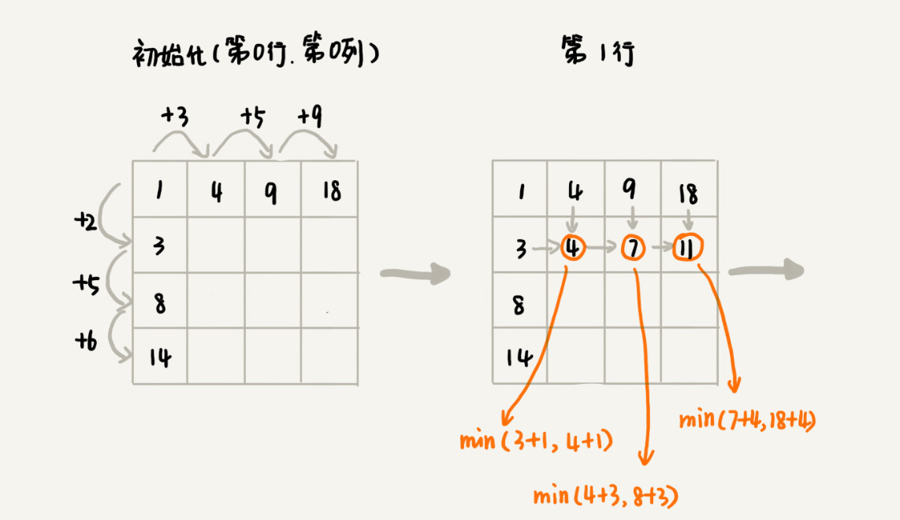


```
public int minDistDP(int[][] matrix, int n) {
  int[][] states = new int[n][n];
  int sum = 0;
  for (int j = 0; j < n; ++j) { // 初始化states的第一行数据
    sum += matrix[0][j];
    states[0][j] = sum;
  }
  sum = 0;
  for (int i = 0; i < n; ++i) { // 初始化states的第一列数据
    sum += matrix[i][0];
    states[i][0] = sum;
  }
  for (int i = 1; i < n; ++i) {
    for (int j = 1; j < n; ++j) {
      states[i][j] = 
            matrix[i][j] + Math.min(states[i][j-1], states[i-1][j]);
    }
  }
  return states[n-1][n-1];
}
```

#### 2.状态转移方程法

状态转移方程法有点类似递归的解题思路。我们需要分析，某个问题如何通过子问题来递归求解，也就是所谓的最优子结构。根据最优子结构，写出递归公式，也就是所谓的状态转移方程。有了状态转移方程，代码实现就非常简单了。一般情况下，我们有两种代码实现方法，一种是**递归加“备忘录”**，另一种是**迭代递推**。

我们还是拿刚才的例子来举例。最优子结构前面已经分析过了，你可以回过头去再看下。为了方便你查看，我把状态转移方程放到这里。

```
min_dist(i, j) = w[i][j] + min(min_dist(i, j-1), min_dist(i-1, j))
```

这里我强调一下，**状态转移方程是解决动态规划的关键。**如果我们能写出状态转移方程，那动态规划问题基本上就解决一大半了，而翻译成代码非常简单。但是很多动态规划问题的状态本身就不好定义，状态转移方程也就更不好想到。

下面我用递归加“备忘录”的方式，将状态转移方程翻译成来代码，你可以看看。对于另一种实现方式，跟状态转移表法的代码实现是一样的，只是思路不同。

```
private int[][] matrix = 
         {{1，3，5，9}, {2，1，3，4}，{5，2，6，7}，{6，8，4，3}};
private int n = 4;
private int[][] mem = new int[4][4];
public int minDist(int i, int j) { // 调用minDist(n-1, n-1);
  if (i == 0 && j == 0) return matrix[0][0];
  if (mem[i][j] > 0) return mem[i][j];
  int minLeft = Integer.MAX_VALUE;
  if (j-1 >= 0) {
    minLeft = minDist(i, j-1);
  }
  int minUp = Integer.MAX_VALUE;
  if (i-1 >= 0) {
    minUp = minDist(i-1, j);
  }
  
  int currMinDist = matrix[i][j] + Math.min(minLeft, minUp);
  mem[i][j] = currMinDist;
  return currMinDist;
}
```

两种动态规划解题思路到这里就讲完了。我要强调一点，不是每个问题都同时适合这两种解题思路。有的问题可能用第一种思路更清晰，而有的问题可能用第二种思路更清晰，所以，你要结合具体的题目来看，到底选择用哪种解题思路。

### 练习

#### 假设我们有几种不同币值的硬币v1，v2，……，vn（单位是元）。如果我们要支付w元，求最少需要多少个硬币。比如，我们有3种不同的硬币，1元、3元、5元，我们要支付9元，最少需要3个硬币（3个3元的硬币）。

可以看做爬阶梯问题，分别可以走1,3,5步，怎么最少走到9步，动态转移方程为f(9)=1+min(f(8),f(6),f(4))

### 动态规划实战：如何实现搜索引擎中的拼写纠错功能

#### 如何量化两个字符串的相似度？

**编辑距离**指的就是，将一个字符串转化成另一个字符串，需要的最少编辑操作次数（比如增加一个字符、删除一个字符、替换一个字符）。编辑距离越大，说明两个字符串的相似程度越小；相反，编辑距离就越小，说明两个字符串的相似程度越大。对于两个完全相同的字符串来说，编辑距离就是0。

根据所包含的编辑操作种类的不同，编辑距离有多种不同的计算方式，比较著名的有**莱文斯坦距离**（Levenshtein distance）和**最长公共子串长度**（Longest common substring length）。其中，莱文斯坦距离允许增加、删除、替换字符这三个编辑操作，最长公共子串长度只允许增加、删除字符这两个编辑操作。

而且，莱文斯坦距离和最长公共子串长度，从两个截然相反的角度，分析字符串的相似程度。莱文斯坦距离的大小，表示两个字符串差异的大小；而最长公共子串的大小，表示两个字符串相似程度的大小。

这里面，两个字符串mitcmu和mtacnu的莱文斯坦距离是3，最长公共子串长度是4。


#### 如何编程计算莱文斯坦距离？

这个问题是求把一个字符串变成另一个字符串，需要的最少编辑次数。整个求解过程，涉及多个决策阶段，我们需要依次考察一个字符串中的每个字符，跟另一个字符串中的字符是否匹配，匹配的话如何处理，不匹配的话又如何处理。所以，这个问题符合**多阶段决策最优解模型**。

我们前面讲了，贪心、回溯、动态规划可以解决的问题，都可以抽象成这样一个模型。要解决这个问题，我们可以先看一看，用最简单的回溯算法，该如何来解决。

回溯是一个递归处理的过程。如果a[i]与b[j]匹配，我们递归考察a[i+1]和b[j+1]。如果a[i]与b[j]不匹配，那我们有多种处理方式可选：

- 可以删除a[i]，然后递归考察a[i+1]和b[j]；
- 可以删除b[j]，然后递归考察a[i]和b[j+1]；
- 可以在a[i]前面添加一个跟b[j]相同的字符，然后递归考察a[i]和b[j+1];
- 可以在b[j]前面添加一个跟a[i]相同的字符，然后递归考察a[i+1]和b[j]；
- 可以将a[i]替换成b[j]，或者将b[j]替换成a[i]，然后递归考察a[i+1]和b[j+1]。

我们将上面的回溯算法的处理思路，翻译成代码，就是下面这个样子：

```
private char[] a = "mitcmu".toCharArray();
private char[] b = "mtacnu".toCharArray();
private int n = 6;
private int m = 6;
private int minDist = Integer.MAX_VALUE; // 存储结果
// 调用方式 lwstBT(0, 0, 0);
public lwstBT(int i, int j, int edist) {
  if (i == n || j == m) {
    if (i < n) edist += (n-i);
    if (j < m) edist += (m - j);
    if (edist < minDist) minDist = edist;
    return;
  }
  if (a[i] == b[j]) { // 两个字符匹配
    lwstBT(i+1, j+1, edist);
  } else { // 两个字符不匹配
    lwstBT(i + 1, j, edist + 1); // 删除a[i]或者b[j]前添加一个字符
    lwstBT(i, j + 1, edist + 1); // 删除b[j]或者a[i]前添加一个字符
    lwstBT(i + 1, j + 1, edist + 1); // 将a[i]和b[j]替换为相同字符
  }
}
```

根据回溯算法的代码实现，我们可以画出递归树，看是否存在重复子问题。如果存在重复子问题，那我们就可以考虑能否用动态规划来解决；如果不存在重复子问题，那回溯就是最好的解决方法。


在递归树中，每个节点代表一个状态，状态包含三个变量(i, j, edist)，其中，edist表示处理到a[i]和b[j]时，已经执行的编辑操作的次数。

在递归树中，(i, j)两个变量重复的节点很多，比如(3, 2)和(2, 3)。对于(i, j)相同的节点，我们只需要保留edist最小的，继续递归处理就可以了，剩下的节点都可以舍弃。所以，状态就从(i, j, edist)变成了(i, j, min_edist)，其中min_edist表示处理到a[i]和b[j]，已经执行的最少编辑次数。

看到这里，你有没有觉得，这个问题跟上两节讲的动态规划例子非常相似？不过，这个问题的状态转移方式，要比之前两节课中讲到的例子都要复杂很多。上一节我们讲的矩阵最短路径问题中，到达状态(i, j)只能通过(i-1, j)或(i, j-1)两个状态转移过来，而今天这个问题，状态(i, j)可能从(i-1, j)，(i, j-1)，(i-1, j-1)三个状态中的任意一个转移过来。

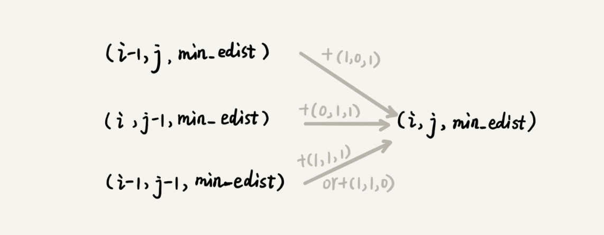

```
如果：a[i]!=b[j]，那么：min_edist(i, j)就等于：
min(min_edist(i-1,j)+1, min_edist(i,j-1)+1, min_edist(i-1,j-1)+1)

如果：a[i]==b[j]，那么：min_edist(i, j)就等于：
min(min_edist(i-1,j)+1, min_edist(i,j-1)+1，min_edist(i-1,j-1))

其中，min表示求三数中的最小值。     
```

了解了状态与状态之间的递推关系，我们画出一个二维的状态表，按行依次来填充状态表中的每个值。


```
public int lwstDP(char[] a, int n, char[] b, int m) {
  int[][] minDist = new int[n][m];
  for (int j = 0; j < m; ++j) { // 初始化第0行:a[0..0]与b[0..j]的编辑距离
    if (a[0] == b[j]) minDist[0][j] = j;
    else if (j != 0) minDist[0][j] = minDist[0][j-1]+1;
    else minDist[0][j] = 1;
  }
  for (int i = 0; i < n; ++i) { // 初始化第0列:a[0..i]与b[0..0]的编辑距离
    if (a[i] == b[0]) minDist[i][0] = i;
    else if (i != 0) minDist[i][0] = minDist[i-1][0]+1;
    else minDist[i][0] = 1;
  }
  for (int i = 1; i < n; ++i) { // 按行填表
    for (int j = 1; j < m; ++j) {
      if (a[i] == b[j]) minDist[i][j] = min(
          minDist[i-1][j]+1, minDist[i][j-1]+1, minDist[i-1][j-1]);
      else minDist[i][j] = min(
          minDist[i-1][j]+1, minDist[i][j-1]+1, minDist[i-1][j-1]+1);
    }
  }
  return minDist[n-1][m-1];
}

private int min(int x, int y, int z) {
  int minv = Integer.MAX_VALUE;
  if (x < minv) minv = x;
  if (y < minv) minv = y;
  if (z < minv) minv = z;
  return minv;
}
```

#### 如何编程计算最长公共子串长度？

最长公共子串作为编辑距离中的一种，只允许增加、删除字符两种编辑操作。从名字上，你可能觉得它看起来跟编辑距离没什么关系。实际上，从本质上来说，它表征的也是两个字符串之间的相似程度。

这个问题的解决思路，跟莱文斯坦距离的解决思路非常相似，也可以用动态规划解决。我刚刚已经详细讲解了莱文斯坦距离的动态规划解决思路，所以，针对这个问题，我直接定义状态，然后写状态转移方程。

每个状态还是包括三个变量(i, j, max_lcs)，max_lcs表示a[0…i]和b[0…j]的最长公共子串长度。那(i, j)这个状态都是由哪些状态转移过来的呢？

我们先来看回溯的处理思路。我们从a[0]和b[0]开始，依次考察两个字符串中的字符是否匹配。

- 如果a[i]与b[j]互相匹配，我们将最大公共子串长度加一，并且继续考察a[i+1]和b[j+1]。
- 如果a[i]与b[j]不匹配，最长公共子串长度不变，这个时候，有两个不同的决策路线：
- 删除a[i]，或者在b[j]前面加上一个字符a[i]，然后继续考察a[i+1]和b[j]；
- 删除b[j]，或者在a[i]前面加上一个字符b[j]，然后继续考察a[i]和b[j+1]。

反过来也就是说，如果我们要求a[0…i]和b[0…j]的最长公共长度max_lcs(i, j)，我们只有可能通过下面三个状态转移过来：

- (i-1, j-1, max_lcs)，其中max_lcs表示a[0…i-1]和b[0…j-1]的最长公共子串长度；
- (i-1, j, max_lcs)，其中max_lcs表示a[0…i-1]和b[0…j]的最长公共子串长度；
- (i, j-1, max_lcs)，其中max_lcs表示a[0…i]和b[0…j-1]的最长公共子串长度。

如果我们把这个转移过程，用状态转移方程写出来，就是下面这个样子：

```
如果：a[i]==b[j]，那么：max_lcs(i, j)就等于：
max(max_lcs(i-1,j-1)+1, max_lcs(i-1, j), max_lcs(i, j-1))；

如果：a[i]!=b[j]，那么：max_lcs(i, j)就等于：
max(max_lcs(i-1,j-1), max_lcs(i-1, j), max_lcs(i, j-1))；

其中max表示求三数中的最大值。
```

```
public int lcs(char[] a, int n, char[] b, int m) {
  int[][] maxlcs = new int[n][m];
  for (int j = 0; j < m; ++j) {//初始化第0行：a[0..0]与b[0..j]的maxlcs
    if (a[0] == b[j]) maxlcs[0][j] = 1;
    else if (j != 0) maxlcs[0][j] = maxlcs[0][j-1];
    else maxlcs[0][j] = 0;
  }
  for (int i = 0; i < n; ++i) {//初始化第0列：a[0..i]与b[0..0]的maxlcs
    if (a[i] == b[0]) maxlcs[i][0] = 1;
    else if (i != 0) maxlcs[i][0] = maxlcs[i-1][0];
    else maxlcs[i][0] = 0;
  }
  for (int i = 1; i < n; ++i) { // 填表
    for (int j = 1; j < m; ++j) {
      if (a[i] == b[j]) maxlcs[i][j] = max(
          maxlcs[i-1][j], maxlcs[i][j-1], maxlcs[i-1][j-1]+1);
      else maxlcs[i][j] = max(
          maxlcs[i-1][j], maxlcs[i][j-1], maxlcs[i-1][j-1]);
    }
  }
  return maxlcs[n-1][m-1];
}

private int max(int x, int y, int z) {
  int maxv = Integer.MIN_VALUE;
  if (x > maxv) maxv = x;
  if (y > maxv) maxv = y;
  if (z > maxv) maxv = z;
  return maxv;
}
```

当用户在搜索框内，输入一个拼写错误的单词时，我们就拿这个单词跟词库中的单词一一进行比较，计算编辑距离，将编辑距离最小的单词，作为纠正之后的单词，提示给用户。

这就是拼写纠错最基本的原理。不过，真正用于商用的搜索引擎，拼写纠错功能显然不会就这么简单。一方面，单纯利用编辑距离来纠错，效果并不一定好；另一方面，词库中的数据量可能很大，搜索引擎每天要支持海量的搜索，所以对纠错的性能要求很高。

针对纠错效果不好的问题，我们有很多种优化思路，我这里介绍几种。

- 我们并不仅仅取出编辑距离最小的那个单词，而是取出编辑距离最小的TOP 10，然后根据其他参数，决策选择哪个单词作为拼写纠错单词。比如使用搜索热门程度来决定哪个单词作为拼写纠错单词。
- 我们还可以用多种编辑距离计算方法，比如今天讲到的两种，然后分别编辑距离最小的TOP 10，然后求交集，用交集的结果，再继续优化处理。
- 我们还可以通过统计用户的搜索日志，得到最常被拼错的单词列表，以及对应的拼写正确的单词。搜索引擎在拼写纠错的时候，首先在这个最长被拼错单词列表中查找。如果一旦找到，直接返回对应的正确的单词。这样纠错的效果非常好。
- 我们还有更加高级一点的做法，引入个性化因素。针对每个用户，维护这个用户特有的搜索喜好，也就是常用的搜索关键词。当用户输入错误的单词的时候，我们首先在这个用户常用的搜索关键词中，计算编辑距离，查找编辑距离最小的单词。

针对纠错性能方面，我们也有相应的优化方式。我讲两种分治的优化思路。

- 如果纠错功能的TPS不高，我们可以部署多台机器，每台机器运行一个独立的纠错功能。当有一个纠错请求的时候，我们通过负载均衡，分配到其中一台机器，来计算编辑距离，得到纠错单词。
- 如果纠错系统的响应时间太长，也就是，每个纠错请求处理时间过长，我们可以将纠错的词库，分割到很多台机器。当有一个纠错请求的时候，我们就将这个拼写错误的单词，同时发送到这多台机器，让多台机器并行处理，分别得到编辑距离最小的单词，然后再比对合并，最终决定出一个最优的纠错单词。

### 练习

#### 我们有一个数字序列包含n个不同的数字，如何求出这个序列中的最长递增子序列长度？比如2, 9, 3, 6, 5, 1, 7这样一组数字序列，它的最长递增子序列就是2, 3, 5, 7，所以最长递增子序列的长度是4。

```
状态转移公式：maxLen[i] = max(maxLen[j]+(1 if j<i else 0)) for any j < i
python代码：
def maxOrderedSeq(seq):
	maxLen = [1] * len(seq) # 初始化为1

	for i in range(1, len(seq)): # i从1开始
		for j in range(i-1,-1,-1): # j从i-1到0
			if seq[j] <= seq[i]:
				maxLen[i] = maxLen[j] + 1
				break # 满足则退出
			if maxLen[i] == 1: # 比前面所有元素小
				maxLen[i] = maxLen[i-1]

	print(maxLen)

# usage
seq = [2, 9, 3, 6, 5, 1, 7]
maxOrderedSeq(seq)
```


## 四种算法思想贪心、分治、回溯和动态规划比较分析

如果我们将这四种算法思想分一下类，那贪心、回溯、动态规划可以归为一类，而分治单独可以作为一类，因为它跟其他三个都不大一样。为什么这么说呢？前三个算法解决问题的模型，都可以抽象成我们今天讲的那个多阶段决策最优解模型，而分治算法解决的问题尽管大部分也是最优解问题，但是，大部分都不能抽象成多阶段决策模型。

回溯算法是个“万金油”。基本上能用的动态规划、贪心解决的问题，我们都可以用回溯算法解决。回溯算法相当于穷举搜索。穷举所有的情况，然后对比得到最优解。不过，回溯算法的时间复杂度非常高，是指数级别的，只能用来解决小规模数据的问题。对于大规模数据的问题，用回溯算法解决的执行效率就很低了。

尽管动态规划比回溯算法高效，但是，并不是所有问题，都可以用动态规划来解决。能用动态规划解决的问题，需要满足三个特征，最优子结构、无后效性和重复子问题。在重复子问题这一点上，动态规划和分治算法的区分非常明显。分治算法要求分割成的子问题，不能有重复子问题，而动态规划正好相反，动态规划之所以高效，就是因为回溯算法实现中存在大量的重复子问题。

贪心算法实际上是动态规划算法的一种特殊情况。它解决问题起来更加高效，代码实现也更加简洁。不过，它可以解决的问题也更加有限。它能解决的问题需要满足三个条件，最优子结构、无后效性和贪心选择性（这里我们不怎么强调重复子问题）。

其中，最优子结构、无后效性跟动态规划中的无异。“贪心选择性”的意思是，通过局部最优的选择，能产生全局的最优选择。每一个阶段，我们都选择当前看起来最优的决策，所有阶段的决策完成之后，最终由这些局部最优解构成全局最优解。


## 拓扑排序

### 如何确定代码源文件的编译依赖关系？

编译器通过分析源文件或者程序员事先写好的编译配置文件（比如Makefile文件），来获取这种局部的依赖关系。**那编译器又该如何通过源文件两两之间的局部依赖关系，确定一个全局的编译顺序呢？**


### 算法解析

这个问题的解决思路与“图”这种数据结构的一个经典算法“拓扑排序算法”有关。

我们在穿衣服的时候都有一定的顺序，我们可以把这种顺序想成，衣服与衣服之间有一定的依赖关系。比如说，你必须先穿袜子才能穿鞋，先穿内裤才能穿秋裤。假设我们现在有八件衣服要穿，它们之间的两两依赖关系我们已经很清楚了，那如何安排一个穿衣序列，能够满足所有的两两之间的依赖关系？

这就是个拓扑排序问题。从这个例子中，你应该能想到，在很多时候，拓扑排序的序列并不是唯一的。你可以看我画的这幅图，我找到了好几种满足这些局部先后关系的穿衣序列。

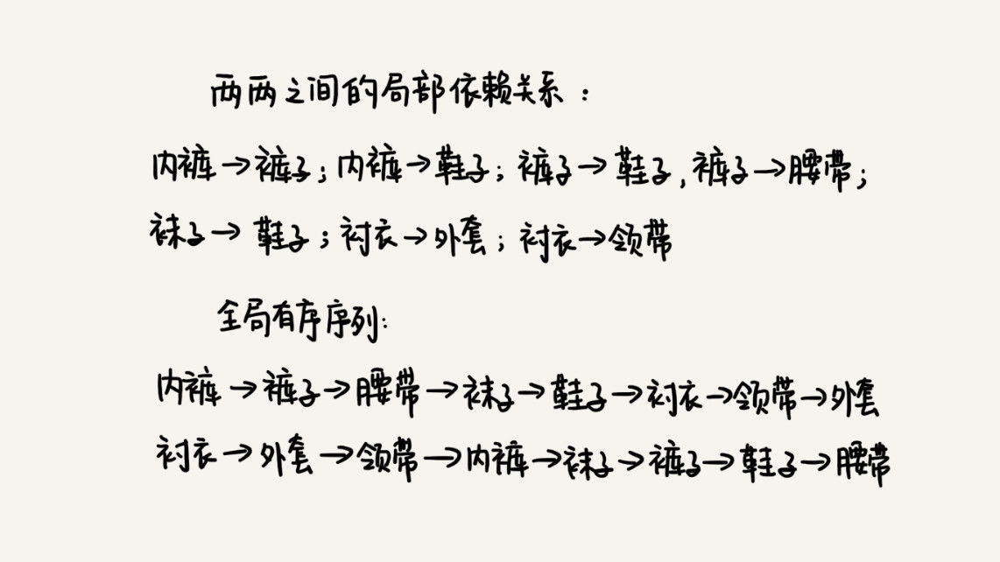

拓扑排序的原理非常简单，我们的重点应该放到拓扑排序的实现上面。

我们可以把源文件与源文件之间的依赖关系，抽象成一个有向图。每个源文件对应图中的一个顶点，源文件之间的依赖关系就是顶点之间的边。

如果a先于b执行，也就是说b依赖于a，那么就在顶点a和顶点b之间，构建一条从a指向b的边。而且，这个图不仅要是有向图，还要是一个有向无环图，也就是不能存在像a->b->c->a这样的循环依赖关系。因为图中一旦出现环，拓扑排序就无法工作了。实际上，拓扑排序本身就是基于有向无环图的一个算法。

```
public class Graph {
  private int v; // 顶点的个数
  private LinkedList<Integer> adj[]; // 邻接表

  public Graph(int v) {
    this.v = v;
    adj = new LinkedList[v];
    for (int i=0; i<v; ++i) {
      adj[i] = new LinkedList<>();
    }
  }

  public void addEdge(int s, int t) { // s先于t，边s->t
    adj[s].add(t);
  }
}
```

**如何在这个有向无环图上，实现拓扑排序**？

拓扑排序有两种实现方法，都不难理解。它们分别是**Kahn算法**和**DFS深度优先搜索算法**。

#### 1.Kahn算法

Kahn算法实际上用的是贪心算法思想，思路非常简单、好懂。

定义数据结构的时候，如果s需要先于t执行，那就添加一条s指向t的边。所以，如果某个顶点入度为0， 也就表示，没有任何顶点必须先于这个顶点执行，那么这个顶点就可以执行了。

我们先从图中，找出一个入度为0的顶点，将其输出到拓扑排序的结果序列中（对应代码中就是把它打印出来），并且把这个顶点从图中删除（也就是把这个顶点可达的顶点的入度都减1）。我们循环执行上面的过程，直到所有的顶点都被输出。最后输出的序列，就是满足局部依赖关系的拓扑排序。

```
public void topoSortByKahn() {
  int[] inDegree = new int[v]; // 统计每个顶点的入度
  for (int i = 0; i < v; ++i) {
    for (int j = 0; j < adj[i].size(); ++j) {
      int w = adj[i].get(j); // i->w
      inDegree[w]++;
    }
  }
  LinkedList<Integer> queue = new LinkedList<>();
  for (int i = 0; i < v; ++i) {
    if (inDegree[i] == 0) queue.add(i);
  }
  while (!queue.isEmpty()) {
    int i = queue.remove();
    System.out.print("->" + i);
    for (int j = 0; j < adj[i].size(); ++j) {
      int k = adj[i].get(j);
      inDegree[k]--;
      if (inDegree[k] == 0) queue.add(k);
    }
  }
}
```

### 2.DFS算法

拓扑排序也可以用深度优先搜索来实现。不过这里的名字要稍微改下，更加确切的说法应该是深度优先遍历，遍历图中的所有顶点，而非只是搜索一个顶点到另一个顶点的路径。

```
public void topoSortByDFS() {
  // 先构建逆邻接表，边s->t表示，s依赖于t，t先于s
  LinkedList<Integer> inverseAdj[] = new LinkedList[v];
  for (int i = 0; i < v; ++i) { // 申请空间
    inverseAdj[i] = new LinkedList<>();
  }
  for (int i = 0; i < v; ++i) { // 通过邻接表生成逆邻接表
    for (int j = 0; j < adj[i].size(); ++j) {
      int w = adj[i].get(j); // i->w
      inverseAdj[w].add(i); // w->i
    }
  }
  boolean[] visited = new boolean[v];
  for (int i = 0; i < v; ++i) { // 深度优先遍历图
    if (visited[i] == false) {
      visited[i] = true;
      dfs(i, inverseAdj, visited);
    }
  }
}

private void dfs(
    int vertex, LinkedList<Integer> inverseAdj[], boolean[] visited) {
  for (int i = 0; i < inverseAdj[vertex].size(); ++i) {
    int w = inverseAdj[vertex].get(i);
    if (visited[w] == true) continue;
    visited[w] = true;
    dfs(w, inverseAdj, visited);
  } // 先把vertex这个顶点可达的所有顶点都打印出来之后，再打印它自己
  System.out.print("->" + vertex);
}
```

这个算法包含两个关键部分。

第一部分是**通过邻接表构造逆邻接表**。邻接表中，边s->t表示s先于t执行，也就是t要依赖s。在逆邻接表中，边s->t表示s依赖于t，s后于t执行。为什么这么转化呢？这个跟我们这个算法的实现思想有关。

第二部分是这个算法的核心，也就是**递归处理每个顶点**。对于顶点vertex来说，我们先输出它可达的所有顶点，也就是说，先把它依赖的所有的顶点输出了，然后再输出自己。

**这两个算法的时间复杂度分别是多少呢？**

从Kahn代码中可以看出来，每个顶点被访问了一次，每个边也都被访问了一次，所以，Kahn算法的时间复杂度就是O(V+E)（V表示顶点个数，E表示边的个数）。

DFS算法的时间复杂度我们之前分析过。每个顶点被访问两次，每条边都被访问一次，所以时间复杂度也是O(V+E)。

注意，这里的图可能不是连通的，有可能是有好几个不连通的子图构成，所以，E并不一定大于V，两者的大小关系不确定。所以，在表示时间复杂度的时候，V、E都要考虑在内。

### 总结引申

拓扑排序应用非常广泛，解决的问题的模型也非常一致。凡是需要通过局部顺序来推导全局顺序的，一般都能用拓扑排序来解决。除此之外，拓扑排序还能检测图中环的存在。对于Kahn算法来说，如果最后输出出来的顶点个数，少于图中顶点个数，图中还有入度不是0的顶点，那就说明，图中存在环。

关于图中环的检测，在查找最终推荐人的时候，可能会因为脏数据，造成存在循环推荐，比如，用户A推荐了用户B，用户B推荐了用户C，用户C又推荐了用户A。如何避免这种脏数据导致的无限递归？

实际上，这就是环的检测问题。因为我们每次都只是查找一个用户的最终推荐人，所以，我们并不需要动用复杂的拓扑排序算法，而只需要记录已经访问过的用户ID，当用户ID第二次被访问的时候，就说明存在环，也就说明存在脏数据。

```
HashSet<Integer> hashTable = new HashSet<>(); // 保存已经访问过的actorId
long findRootReferrerId(long actorId) {
  if (hashTable.contains(actorId)) { // 存在环
    return;
  }
  hashTable.add(actorId);
  Long referrerId = 
       select referrer_id from [table] where actor_id = actorId;
  if (referrerId == null) return actorId;
  return findRootReferrerId(referrerId);
}
```

如果把这个问题改一下，我们想要知道，数据库中的所有用户之间的推荐关系了，有没有存在环的情况。这个问题，就需要用到拓扑排序算法了。我们把用户之间的推荐关系，从数据库中加载到内存中，然后构建成今天讲的这种有向图数据结构，再利用拓扑排序，就可以快速检测出是否存在环了。

### 练习

#### 我们用图表示依赖关系的时候，如果a先于b执行，我们就画一条从a到b的有向边；反过来，如果a先于b，我们画一条从b到a的有向边，表示b依赖a，那今天讲的Kahn算法和DFS算法还能否正确工作呢？如果不能，应该如何改造一下呢？

a先于b执行，也就说b依赖于a，b指向a，这样构建有向无环图时，要找到出度为0的顶点，然后删除

#### 两种拓扑排序算法的实现思路，Kahn算法和DFS深度优先搜索算法，如果换做BFS广度优先搜索算法，还可以实现吗？

BFS也能实现，因为遍历只是实现拓扑排序的一个“辅助手段”，本质上是帮助找到优先执行的顶点

## 最短路径

像Google地图、百度地图、高德地图这样的地图软件，如果想从家开车到公司，你只需要输入起始、结束地址，地图就会给你规划一条最优出行路线。这里的最优，有很多种定义，比如最短路线、最少用时路线、最少红绿灯路线等等。**地图软件的最优路线是如何计算出来的吗？底层依赖了什么算法呢？**

### 算法解析

我们刚提到的最优问题包含三个：最短路线、最少用时和最少红绿灯。我们先解决最简单的，最短路线。

我们之前也提到过，图这种数据结构的表达能力很强，显然，把地图抽象成图最合适不过了。我们把每个岔路口看作一个顶点，岔路口与岔路口之间的路看作一条边，路的长度就是边的权重。如果路是单行道，我们就在两个顶点之间画一条有向边；如果路是双行道，我们就在两个顶点之间画两条方向不同的边。这样，整个地图就被抽象成一个有向有权图。

于是，我们要求解的问题就转化为，在一个有向有权图中，求两个顶点间的最短路径。

```
public class Graph { // 有向有权图的邻接表表示
  private LinkedList<Edge> adj[]; // 邻接表
  private int v; // 顶点个数

  public Graph(int v) {
    this.v = v;
    this.adj = new LinkedList[v];
    for (int i = 0; i < v; ++i) {
      this.adj[i] = new LinkedList<>();
    }
  }

  public void addEdge(int s, int t, int w) { // 添加一条边
    this.adj[s].add(new Edge(s, t, w));
  }

  private class Edge {
    public int sid; // 边的起始顶点编号
    public int tid; // 边的终止顶点编号
    public int w; // 权重
    public Edge(int sid, int tid, int w) {
      this.sid = sid;
      this.tid = tid;
      this.w = w;
    }
  }
  // 下面这个类是为了dijkstra实现用的
  private class Vertex implements Comparable<Vertex> {
    public int id; // 顶点编号ID
    public int dist; // 从起始顶点到这个顶点的距离
    public Vertex(int id, int dist) {
      this.id = id;
      this.dist = dist;
    }
    @Override
    public int compareTo(Vertex o) { // 按照dist从小到大排序
      if (o.dist > this.dist) return -1;
      else return 1;
    }
  }
}
```

想要解决这个问题，有一个非常经典的算法，最短路径算法，更加准确地说，是**单源最短路径算法**（一个顶点到一个顶点）。提到最短路径算法，最出名的莫过于Dijkstra算法了。

```
public void dijkstra(int s, int t) { // 从顶点s到顶点t的最短路径
  int[] predecessor = new int[this.v]; // 用来还原最短路径
  Vertex[] vertexes = new Vertex[this.v]; // 记录起始顶点到这个顶点的距离
  for (int i = 0; i < v; ++i) { // 初始化dist为无穷大
    vertexes[i] = new Vertex(i, Integer.MAX_VALUE);
  }
  PriorityQueue<Vertex> queue = new PriorityQueue<>(); // 小顶堆
  boolean[] inQueue = new boolean[this.v]; // 标记是否进入过队列
  queue.add(vertexes[s]); // 先把起始顶点放到队列中
  vertexes[s].dist = 0;
  inqueue[s] = true;
  while (!queue.isEmpty()) {
    Vertex minVertex= queue.poll(); // 取dist最小的顶点
    if (minVertex.id == t) break; // 最短路径产生了
    for (int i = 0; i < adj[minVertex.id].size(); ++i) {
      Edge e = adj[minVertex.id].get(i); // 取出一条minVetex相连的边
      Vertex nextVertex = vertexes[e.tid]; // minVertex-->nextVertex
      //找到一条到nextVertex更短的路径
      if (minVertex.dist + e.w < nextVertex.dist) {
        nextVertex.dist = minVertex.dist + e.w; // 更新dist
        predecessor[nextVertex.id] = minVertex.id; //更新前驱顶点
        if (inqueue[nextVertex.id] == false) { // 如果没有在队列中
          queue.add(nextVertex); // 就把它放到队列中
          inqueue[nextVertex.id] = true;
        }
      }
    }
  }
  // 输出最短路径
  System.out.print(s);
  print(s, t, predecessor);
}

private void print(int s, int t, int[] predecessor) {
  if (s == t) return;
  print(s, predecessor[t], predecessor);
  System.out.print("->" + t);
}
```

我们用vertexes数组，记录从起始顶点到每个顶点的距离（dist）。起初，我们把所有顶点的dist都初始化为无穷大（也就是代码中的Integer.MAX_VALUE）。我们把起始顶点的dist值初始化为0，然后将其放到优先级队列中。

我们从优先级队列中取出dist最小的顶点minVertex，然后考察这个顶点可达的所有顶点（代码中的nextVertex）。如果minVertex的dist值加上minVertex与nextVertex之间边的权重w小于nextVertex当前的dist值，也就是说，存在另一条更短的路径，它经过minVertex到达nextVertex。那我们就把nextVertex的dist更新为minVertex的dist值加上w。然后，我们把nextVertex加入到优先级队列中。重复这个过程，直到找到终止顶点t或者队列为空。

以上就是Dijkstra算法的核心逻辑。除此之外，代码中还有两个额外的变量，predecessor数组和inqueue数组。

predecessor数组的作用是为了还原最短路径，它记录每个顶点的前驱顶点。最后，我们通过递归的方式，将这个路径打印出来。

inqueue数组是为了避免将一个顶点多次添加到优先级队列中。我们更新了某个顶点的dist值之后，如果这个顶点已经在优先级队列中了，就不要再将它重复添加进去了。


**Dijkstra算法的时间复杂度是多少？**

在刚刚的代码实现中，最复杂就是while循环嵌套for循环那部分代码了。while循环最多会执行V次（V表示顶点的个数），而内部的for循环的执行次数不确定，跟每个顶点的相邻边的个数有关，我们分别记作E0，E1，E2，……，E(V-1)。如果我们把这V个顶点的边都加起来，最大也不会超过图中所有边的个数E（E表示边的个数）。

for循环内部的代码涉及从优先级队列取数据、往优先级队列中添加数据、更新优先级队列中的数据，这样三个主要的操作。我们知道，优先级队列是用堆来实现的，堆中的这几个操作，时间复杂度都是O(logV)（堆中的元素个数不会超过顶点的个数V）。

所以，综合这两部分，再利用乘法原则，整个代码的时间复杂度就是O(E*logV)。

**如何计算最优出行路线**？

从理论上讲，用Dijkstra算法可以计算出两点之间的最短路径。但是，你有没有想过，对于一个超级大地图来说，岔路口、道路都非常多，对应到图这种数据结构上来说，就有非常多的顶点和边。如果为了计算两点之间的最短路径，在一个超级大图上动用Dijkstra算法，遍历所有的顶点和边，显然会非常耗时。那我们有没有什么优化的方法呢？

虽然地图很大，但是两点之间的最短路径或者说较好的出行路径，并不会很“发散”，只会出现在两点之间和两点附近的区块内。所以我们可以在整个大地图上，划出一个小的区块，这个小区块恰好可以覆盖住两个点，但又不会很大。我们只需要在这个小区块内部运行Dijkstra算法，这样就可以避免遍历整个大图，也就大大提高了执行效率。

不过你可能会说了，如果两点距离比较远，从北京海淀区某个地点，到上海黄浦区某个地点，那上面的这种处理方法，显然就不工作了，毕竟覆盖北京和上海的区块并不小。

对于这样两点之间距离较远的路线规划，我们可以把北京海淀区或者北京看作一个顶点，把上海黄浦区或者上海看作一个顶点，先规划大的出行路线。比如，如何从北京到上海，必须要经过某几个顶点，或者某几条干道，然后再细化每个阶段的小路线。

**再来看另外两个问题，最少时间和最少红绿灯。**

前面讲最短路径的时候，每条边的权重是路的长度。在计算最少时间的时候，算法还是不变，我们只需要把边的权重，从路的长度变成经过这段路所需要的时间。

每经过一条边，就要经过一个红绿灯。关于最少红绿灯的出行方案，实际上，我们只需要把每条边的权值改为1即可，算法还是不变，可以继续使用前面讲的Dijkstra算法。不过，边的权值为1，也就相当于无权图了，我们还可以使用之前讲过的广度优先搜索算法。因为我们前面讲过，广度优先搜索算法计算出来的两点之间的路径，就是两点的最短路径。

不过，这里给出的所有方案都非常粗糙，只是为了给你展示，如何结合实际的场景，灵活地应用算法，让算法为我们所用，真实的地图软件的路径规划，要比这个复杂很多。而且，比起Dijkstra算法，地图软件用的更多的是类似A*的启发式搜索算法，不过也是在Dijkstra算法上的优化罢了。

### 总结引申

实际上，最短路径算法还有很多，比如Bellford算法、Floyd算法等等。

Dijkstra这个算法的核心思想，就可以拿来解决下面这个看似完全不相关的问题。

我们有一个翻译系统，只能针对单个词来做翻译。如果要翻译一整个句子，我们需要将句子拆成一个一个的单词，再丢给翻译系统。针对每个单词，翻译系统会返回一组可选的翻译列表，并且针对每个翻译打一个分，表示这个翻译的可信程度。

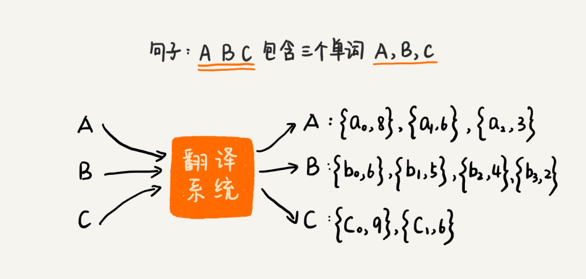

针对每个单词，我们从可选列表中，选择其中一个翻译，组合起来就是整个句子的翻译。每个单词的翻译的得分之和，就是整个句子的翻译得分。随意搭配单词的翻译，会得到一个句子的不同翻译。针对整个句子，我们希望计算出得分最高的前k个翻译结果，你会怎么编程来实现呢？

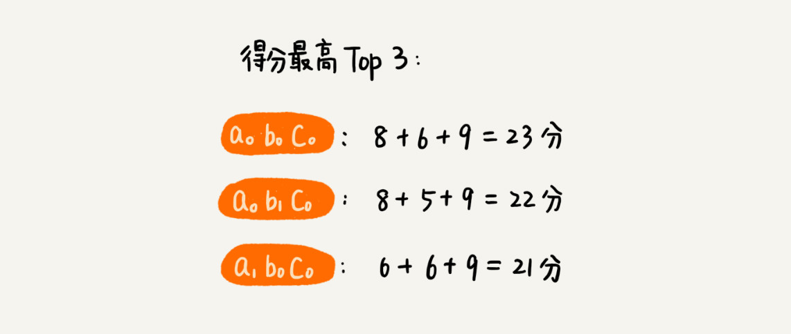

当然，最简单的办法还是借助回溯算法，穷举所有的排列组合情况，然后选出得分最高的前k个翻译结果。但是，这样做的时间复杂度会比较高，是O(m^n^)，其中，m表示平均每个单词的可选翻译个数，n表示一个句子中包含多少个单词。

实际上，这个问题可以借助Dijkstra算法的核心思想，非常高效地解决。每个单词的可选翻译是按照分数从大到小排列的，所以a{0}b{0}c{0}肯定是得分最高组合结果。我们把a{0}b{0}c{0}及得分作为一个对象，放入到优先级队列中。

我们每次从优先级队列中取出一个得分最高的组合，并基于这个组合进行扩展。扩展的策略是每个单词的翻译分别替换成下一个单词的翻译。比如a{0}b{0}c{0}扩展后，会得到三个组合，a{1}b{0}c{0}、a{0}b{1}c{0}、a{0}b{0}c{1}。我们把扩展之后的组合，加到优先级队列中。重复这个过程，直到获取到k个翻译组合或者队列为空。

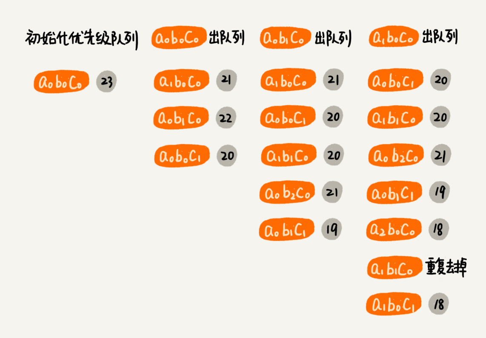

我们来看，这种实现思路的时间复杂度是多少？

假设句子包含n个单词，每个单词平均有m个可选的翻译，我们求得分最高的前k个组合结果。每次一个组合出队列，就对应着一个组合结果，我们希望得到k个，那就对应着k次出队操作。每次有一个组合出队列，就有n个组合入队列。优先级队列中出队和入队操作的时间复杂度都是O(logX)，X表示队列中的组合个数。所以，总的时间复杂度就是O(knlogX)。那X到底是多少呢？

k次出入队列，队列中的总数据不会超过kn，也就是说，出队、入队操作的时间复杂度是O(log(kn))。所以，总的时间复杂度就是O(knlog(kn))，比之前的指数级时间复杂度降低了很多。

### 练习

#### 在计算最短时间的出行路线中，如何获得通过某条路的时间呢？

获取通过某条路的时间：通过某条路的时间与①路长度②路况(是否平坦等)③拥堵情况④红绿灯个数等因素相关。获取这些因素后就可以建立一个回归模型(比如线性回归)来估算时间。其中①②④因素比较固定，容易获得。③是动态的，但也可以通过a.与交通部门合作获得路段拥堵情况；b.联合其他导航软件获得在该路段的在线人数；c.通过现在时间段正好在次路段的其他用户的真实情况等方式估算。

#### 今天讲的出行路线问题，我假设的是开车出行，那如果是公交出行呢？如果混合地铁、公交、步行，又该如何规划路线呢？

混合公交、地铁和步行时：地铁时刻表是固定的，容易估算。公交虽然没那么准时，大致时间是可以估计的，步行时间受路拥堵状况小，基本与道路长度成正比，也容易估算。总之，感觉公交、地铁、步行，时间估算会比开车更容易，也更准确些。

## 位图

网页爬虫是搜索引擎中的非常重要的系统，负责爬取几十亿、上百亿的网页。爬虫的工作原理是，通过解析已经爬取页面中的网页链接，然后再爬取这些链接对应的网页。而**同一个网页链接有可能被包含在多个页面中，这就会导致爬虫在爬取的过程中，重复爬取相同的网页。如果你是一名负责爬虫的工程师，你会如何避免这些重复的爬取呢？**

最容易想到的方法就是，我们记录已经爬取的网页链接（也就是URL），在爬取一个新的网页之前，我们拿它的链接，在已经爬取的网页链接列表中搜索。如果存在，那就说明这个网页已经被爬取过了；如果不存在，那就说明这个网页还没有被爬取过，可以继续去爬取。等爬取到这个网页之后，我们将这个网页的链接添加到已经爬取的网页链接列表了。

不过，我们该如何记录已经爬取的网页链接呢？需要用什么样的数据结构呢？

### 算法解析

这个问题要处理的对象是网页链接，也就是URL，需要支持的操作有两个，添加一个URL和查询一个URL。除了这两个功能性的要求之外，在非功能性方面，我们还要求这两个操作的执行效率要尽可能高。除此之外，因为我们处理的是上亿的网页链接，内存消耗会非常大，所以在存储效率上，我们要尽可能地高效。

显然，散列表、红黑树、跳表这些动态数据结构，都能支持快速地插入、查找数据，但是对内存消耗方面，是否可以接受呢？

我们拿散列表来举例。假设我们要爬取10亿个网页（像Google、百度这样的通用搜索引擎，爬取的网页可能会更多），为了判重，我们把这10亿网页链接存储在散列表中。你来估算下，大约需要多少内存？

假设一个URL的平均长度是64字节，那单纯存储这10亿个URL，需要大约60GB的内存空间。因为散列表必须维持较小的装载因子，才能保证不会出现过多的散列冲突，导致操作的性能下降。而且，用链表法解决冲突的散列表，还会存储链表指针。所以，如果将这10亿个URL构建成散列表，那需要的内存空间会远大于60GB，有可能会超过100GB。

当然，对于一个大型的搜索引擎来说，即便是100GB的内存要求，其实也不算太高，我们可以采用分治的思想，用多台机器（比如20台内存是8GB的机器）来存储这10亿网页链接。

对于爬虫的URL去重这个问题，刚刚讲到的分治加散列表的思路，已经是可以实实在在工作的了。不过，**作为一个有追求的工程师，我们应该考虑，在添加、查询数据的效率以及内存消耗方面，我们是否还有进一步的优化空间呢？**

你可能会说，散列表中添加、查找数据的时间复杂度已经是O(1)，还能有进一步优化的空间吗？实际上，我们前面也讲过，时间复杂度并不能完全代表代码的执行时间。大O时间复杂度表示法，会忽略掉常数、系数和低阶，并且统计的对象是语句的频度。不同的语句，执行时间也是不同的。时间复杂度只是表示执行时间随数据规模的变化趋势，并不能度量在特定的数据规模下，代码执行时间的多少。

如果时间复杂度中原来的系数是10，我们现在能够通过优化，将系数降为1，那在时间复杂度没有变化的情况下，执行效率就提高了10倍。对于实际的软件开发来说，10倍效率的提升，显然是一个非常值得的优化。

如果我们用基于链表的方法解决冲突问题，散列表中存储的是URL，那当查询的时候，通过哈希函数定位到某个链表之后，我们还需要依次比对每个链表中的URL。这个操作是比较耗时的，主要有两点原因。

一方面，链表中的结点在内存中不是连续存储的，所以不能一下子加载到CPU缓存中，没法很好地利用到CPU高速缓存，所以数据访问性能方面会打折扣。

另一方面，链表中的每个数据都是URL，而URL不是简单的数字，是平均长度为64字节的字符串。也就是说，我们要让待判重的URL，跟链表中的每个URL，做字符串匹配。显然，这样一个字符串匹配操作，比起单纯的数字比对，要慢很多。所以，基于这两点，执行效率方面肯定是有优化空间的。

对于内存消耗方面的优化，除了刚刚这种基于散列表的解决方案，貌似没有更好的法子了。实际上，如果要想内存方面有明显的节省，那就得换一种解决方案，也就是**布隆过滤器**（Bloom Filter）。

在讲布隆过滤器前，先讲一下另一种存储结构，**位图**（BitMap）。因为，布隆过滤器本身就是基于位图的，是对位图的一种改进。

**我们有1千万个整数，整数的范围在1到1亿之间。如何快速查找某个整数是否在这1千万个整数中呢？**

当然，这个问题还是可以用散列表来解决。不过，我们可以使用一种比较“特殊”的散列表，那就是位图。我们申请一个大小为1亿、数据类型为布尔类型（true或者false）的数组。我们将这1千万个整数作为数组下标，将对应的数组值设置成true。比如，整数5对应下标为5的数组值设置为true，也就是array[5]=true。

当我们查询某个整数K是否在这1千万个整数中的时候，我们只需要将对应的数组值array[K]取出来，看是否等于true。如果等于true，那说明1千万整数中包含这个整数K；相反，就表示不包含这个整数K。

不过，很多语言中提供的布尔类型，大小是1个字节的，并不能节省太多内存空间。实际上，表示true和false两个值，我们只需要用一个二进制位（bit）就可以了。**那如何通过编程语言，来表示一个二进制位呢？**

这里就要用到位运算了。我们可以借助编程语言中提供的数据类型，比如int、long、char等类型，通过位运算，用其中的某个位表示某个数字。

```
public class BitMap {
  private char[] bytes;
  private int nbits;
  
  public BitMap(int nbits) {
    this.nbits = nbits;
    this.bytes = new char[nbits/8+1];
  }

  public void set(int k) {
    if (k > nbits) return;
    int byteIndex = k / 8;
    int bitIndex = k % 8;
    bytes[byteIndex] |= (1 << bitIndex);
  }

  public boolean get(int k) {
    if (k > nbits) return false;
    int byteIndex = k / 8;
    int bitIndex = k % 8;
    return (bytes[byteIndex] & (1 << bitIndex)) != 0;
  }
}!
```

从刚刚位图结构的讲解中，你应该可以发现，位图通过数组下标来定位数据，所以，访问效率非常高。而且，每个数字用一个二进制位来表示，在数字范围不大的情况下，所需要的内存空间非常节省。

比如刚刚那个例子，如果用散列表存储这1千万的数据，数据是32位的整型数，也就是需要4个字节的存储空间，那总共至少需要40MB的存储空间。如果我们通过位图的话，数字范围在1到1亿之间，只需要1亿个二进制位，也就是12MB左右的存储空间就够了。

关于位图，我们就讲完了，是不是挺简单的？不过，这里我们有个假设，就是数字所在的范围不是很大。如果数字的范围很大，比如刚刚那个问题，数字范围不是1到1亿，而是1到10亿，那位图的大小就是10亿个二进制位，也就是120MB的大小，消耗的内存空间，不降反增。

这个时候，布隆过滤器就要出场了。布隆过滤器就是为了解决刚刚这个问题，对位图这种数据结构的一种改进。

还是刚刚那个例子，数据个数是1千万，数据的范围是1到10亿。布隆过滤器的做法是，我们仍然使用一个1亿个二进制大小的位图，然后通过哈希函数，对数字进行处理，让它落在这1到1亿范围内。比如我们把哈希函数设计成f(x)=x%n。其中，x表示数字，n表示位图的大小（1亿），也就是，对数字跟位图的大小进行取模求余。

不过，你肯定会说，哈希函数会存在冲突的问题啊，一亿零一和1两个数字，经过你刚刚那个取模求余的哈希函数处理之后，最后的结果都是1。这样我就无法区分，位图存储的是1还是一亿零一了。

为了降低这种冲突概率，当然我们可以设计一个复杂点、随机点的哈希函数。除此之外，还有其他方法吗？我们来看布隆过滤器的处理方法。既然一个哈希函数可能会存在冲突，那用多个哈希函数一块儿定位一个数据，是否能降低冲突的概率呢？我来具体解释一下，布隆过滤器是怎么做的。

我们使用K个哈希函数，对同一个数字进行求哈希值，那会得到K个不同的哈希值，我们分别记作X_{1}，X_{2}，X_{3}，…，X_{K}。我们把这K个数字作为位图中的下标，将对应的BitMap[X_{1}]，BitMap[X_{2}]，BitMap[X_{3}]，…，BitMap[X_{K}]都设置成true，也就是说，我们用K个二进制位，来表示一个数字的存在。

当我们要查询某个数字是否存在的时候，我们用同样的K个哈希函数，对这个数字求哈希值，分别得到Y_{1}，Y_{2}，Y_{3}，…，Y_{K}。我们看这K个哈希值，对应位图中的数值是否都为true，如果都是true，则说明，这个数字存在，如果有其中任意一个不为true，那就说明这个数字不存在。

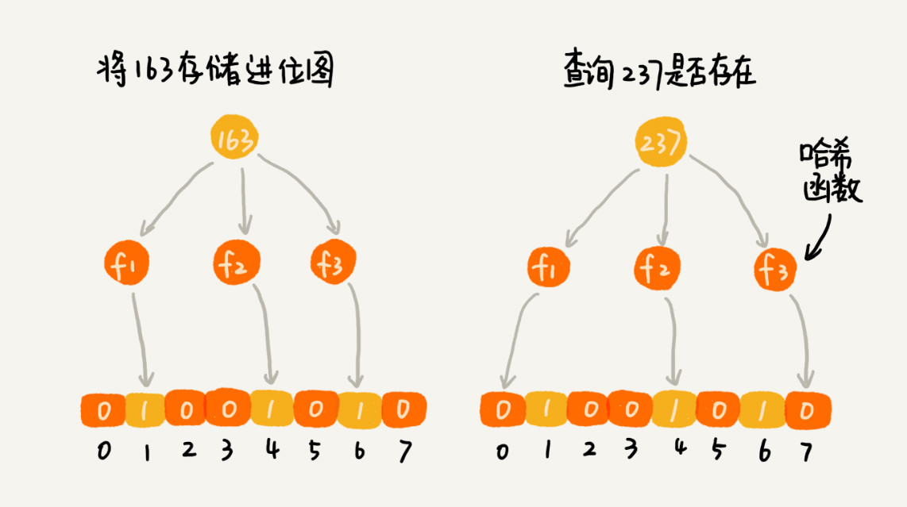

对于两个不同的数字来说，经过一个哈希函数处理之后，可能会产生相同的哈希值。但是经过K个哈希函数处理之后，K个哈希值都相同的概率就非常低了。尽管采用K个哈希函数之后，两个数字哈希冲突的概率降低了，但是，这种处理方式又带来了新的问题，那就是容易误判。我们看下面这个例子。


布隆过滤器的误判有一个特点，那就是，它只会对存在的情况有误判。如果某个数字经过布隆过滤器判断不存在，那说明这个数字真的不存在，不会发生误判；如果某个数字经过布隆过滤器判断存在，这个时候才会有可能误判，有可能并不存在。不过，只要我们调整哈希函数的个数、位图大小跟要存储数字的个数之间的比例，那就可以将这种误判的概率降到非常低。

尽管布隆过滤器会存在误判，但是，这并不影响它发挥大作用。很多场景对误判有一定的容忍度。比如我们今天要解决的爬虫判重这个问题，即便一个没有被爬取过的网页，被误判为已经被爬取，对于搜索引擎来说，也并不是什么大事情，是可以容忍的，毕竟网页太多了，搜索引擎也不可能100%都爬取到。

### 布隆过滤器与爬虫网页去重

我们用布隆过滤器来记录已经爬取过的网页链接，假设需要判重的网页有10亿，那我们可以用一个10倍大小的位图来存储，也就是100亿个二进制位，换算成字节，那就是大约1.2GB。之前我们用散列表判重，需要至少100GB的空间。相比来讲，布隆过滤器在存储空间的消耗上，降低了非常多。

那我们再来看下，利用布隆过滤器，在执行效率方面，是否比散列表更加高效呢？

布隆过滤器用多个哈希函数对同一个网页链接进行处理，CPU只需要将网页链接从内存中读取一次，进行多次哈希计算，理论上讲这组操作是CPU密集型的。而在散列表的处理方式中，需要读取散列冲突拉链的多个网页链接，分别跟待判重的网页链接，进行字符串匹配。这个操作涉及很多内存数据的读取，所以是内存密集型的。我们知道CPU计算可能是要比内存访问更快速的，所以，理论上讲，布隆过滤器的判重方式，更加快速。

### 总结引申

布隆过滤器非常适合这种不需要100%准确的、允许存在小概率误判的大规模判重场景。除了爬虫网页去重这个例子，还有比如统计一个大型网站的每天的UV数，也就是每天有多少用户访问了网站，我们就可以使用布隆过滤器，对重复访问的用户，进行去重。

我们前面讲到，布隆过滤器的误判率，主要跟哈希函数的个数、位图的大小有关。当我们往布隆过滤器中不停地加入数据之后，位图中不是true的位置就越来越少了，误判率就越来越高了。所以，对于无法事先知道要判重的数据个数的情况，我们需要支持自动扩容的功能。

当布隆过滤器中，数据个数与位图大小的比例超过某个阈值的时候，我们就重新申请一个新的位图。后面来的新数据，会被放置到新的位图中。但是，如果我们要判断某个数据是否在布隆过滤器中已经存在，我们就需要查看多个位图，相应的执行效率就降低了一些。

位图、布隆过滤器应用如此广泛，很多编程语言都已经实现了。比如Java中的BitSet类就是一个位图，Redis也提供了BitMap位图类，Google的Guava工具包提供了BloomFilter布隆过滤器的实现。

### 练习

#### 假设我们有1亿个整数，数据范围是从1到10亿，如何快速并且省内存地给这1亿个数据从小到大排序？

传统的做法：1亿个整数，存储需要400M空间，排序时间复杂度最优 N×log(N)

使用位图算法：数字范围是1到10亿，用位图存储125M就够了，然后将1亿个数字依次添加到位图中，然后再将位图按下标从小到大输出值为1的下标，排序就完成了，时间复杂度为 N

## B树

在工作中，为了加速数据库中数据的查找速度，我们常用的处理思路是，对表中数据创建索引。那你是否思考过，**数据库索引是如何实现的呢？底层使用的是什么数据结构和算法呢？**

### 算法解析

#### 1.解决问题的前提是定义清楚问题

如何定义清楚问题呢？除了对问题进行详细的调研，还有一个办法，那就是，通过**对一些模糊的需求进行假设，来限定要解决的问题的范围**。

所以，这里我们假设要解决的问题，只包含这样两个常用的需求：

- 根据某个值查找数据，比如select * from user where id=1234；
- 根据区间值来查找某些数据，比如select * from user where id > 1234 and id < 2345。

除了这些功能性需求之外，这种问题往往还会涉及一些非功能性需求，比如安全、性能、用户体验等等。限于专栏要讨论的主要是数据结构和算法，对于非功能性需求，我们着重考虑**性能方面**的需求。性能方面的需求，我们主要考察时间和空间两方面，也就是**执行效率和存储空间**。

在执行效率方面，我们希望通过索引，查询数据的效率尽可能的高；在存储空间方面，我们希望索引不要消耗太多的内存空间。

#### 2.尝试用学过的数据结构解决这个问题

支持快速查询、插入等操作的动态数据结构，我们已经学习过散列表、平衡二叉查找树、跳表。

我们先来看**散列表**。散列表的查询性能很好，时间复杂度是O(1)。但是，散列表不能支持按照区间快速查找数据。所以，散列表不能满足我们的需求。

我们再来看**平衡二叉查找树**。尽管平衡二叉查找树查询的性能也很高，时间复杂度是O(logn)。而且，对树进行中序遍历，我们还可以得到一个从小到大有序的数据序列，但这仍然不足以支持按照区间快速查找数据。

我们再来看**跳表**。跳表是在链表之上加上多层索引构成的。它支持快速地插入、查找、删除数据，对应的时间复杂度是O(logn)。并且，跳表也支持按照区间快速地查找数据。我们只需要定位到区间起点值对应在链表中的结点，然后从这个结点开始，顺序遍历链表，直到区间终点对应的结点为止，这期间遍历得到的数据就是满足区间值的数据。


这样看来，跳表是可以解决这个问题。实际上，数据库索引所用到的数据结构跟跳表非常相似，叫作B+树。不过，它是通过二叉查找树演化过来的，而非跳表。

#### 3.改造二叉查找树来解决这个问题

为了让二叉查找树支持按照区间来查找数据，我们可以对它进行这样的改造：树中的节点并不存储数据本身，而是只是作为索引。除此之外，我们把每个叶子节点串在一条链表上，链表中的数据是从小到大有序的。经过改造之后的二叉树，就像图中这样，看起来是不是很像跳表呢？


改造之后，如果我们要求某个区间的数据。我们只需要拿区间的起始值，在树中进行查找，当查找到某个叶子节点之后，我们再顺着链表往后遍历，直到链表中的结点数据值大于区间的终止值为止。所有遍历到的数据，就是符合区间值的所有数据。


但是，我们要为几千万、上亿的数据构建索引，如果将索引存储在内存中，尽管内存访问的速度非常快，查询的效率非常高，但是，占用的内存会非常多。

比如，我们给一亿个数据构建二叉查找树索引，那索引中会包含大约1亿个节点，每个节点假设占用16个字节，那就需要大约1GB的内存空间。给一张表建立索引，我们需要1GB的内存空间。如果我们要给10张表建立索引，那对内存的需求是无法满足的。如何解决这个索引占用太多内存的问题呢？

我们可以借助时间换空间的思路，把索引存储在硬盘中，而非内存中。我们都知道，硬盘是一个非常慢速的存储设备。通常内存的访问速度是纳秒级别的，而磁盘访问的速度是毫秒级别的。读取同样大小的数据，从磁盘中读取花费的时间，是从内存中读取所花费时间的上万倍，甚至几十万倍。

这种将索引存储在硬盘中的方案，尽管减少了内存消耗，但是在数据查找的过程中，需要读取磁盘中的索引，因此数据查询效率就相应降低很多。

二叉查找树，经过改造之后，支持区间查找的功能就实现了。不过，为了节省内存，如果把树存储在硬盘中，那么每个节点的读取（或者访问），都对应一次磁盘IO操作。树的高度就等于每次查询数据时磁盘IO操作的次数。

我们前面讲到，比起内存读写操作，磁盘IO操作非常耗时，所以我们优化的重点就是尽量减少磁盘IO操作，也就是，尽量降低树的高度。那如何降低树的高度呢？

我们来看下，如果我们把索引构建成m叉树，高度是不是比二叉树要小呢？如图所示，给16个数据构建二叉树索引，树的高度是4，查找一个数据，就需要4个磁盘IO操作（如果根节点存储在内存中，其他结点存储在磁盘中），如果对16个数据构建五叉树索引，那高度只有2，查找一个数据，对应只需要2次磁盘操作。如果m叉树中的m是100，那对一亿个数据构建索引，树的高度也只是3，最多只要3次磁盘IO就能获取到数据。磁盘IO变少了，查找数据的效率也就提高了。


如果我们将m叉树实现B+树索引，用代码实现出来，就是下面这个样子（假设我们给int类型的数据库字段添加索引，所以代码中的keywords是int类型的）：

```
/**
 * 这是B+树非叶子节点的定义。
 *
 * 假设keywords=[3, 5, 8, 10]
 * 4个键值将数据分为5个区间：(-INF,3), [3,5), [5,8), [8,10), [10,INF)
 * 5个区间分别对应：children[0]...children[4]
 *
 * m值是事先计算得到的，计算的依据是让所有信息的大小正好等于页的大小：
 * PAGE_SIZE = (m-1)*4[keywordss大小]+m*8[children大小]
 */
public class BPlusTreeNode {
  public static int m = 5; // 5叉树
  public int[] keywords = new int[m-1]; // 键值，用来划分数据区间
  public BPlusTreeNode[] children = new BPlusTreeNode[m];//保存子节点指针
}

/**
 * 这是B+树中叶子节点的定义。
 *
 * B+树中的叶子节点跟内部结点是不一样的,
 * 叶子节点存储的是值，而非区间。
 * 这个定义里，每个叶子节点存储3个数据行的键值及地址信息。
 *
 * k值是事先计算得到的，计算的依据是让所有信息的大小正好等于页的大小：
 * PAGE_SIZE = k*4[keyw..大小]+k*8[dataAd..大小]+8[prev大小]+8[next大小]
 */
public class BPlusTreeLeafNode {
  public static int k = 3;
  public int[] keywords = new int[k]; // 数据的键值
  public long[] dataAddress = new long[k]; // 数据地址

  public BPlusTreeLeafNode prev; // 这个结点在链表中的前驱结点
  public BPlusTreeLeafNode next; // 这个结点在链表中的后继结点
}
```

对于相同个数的数据构建m叉树索引，m叉树中的m越大，那树的高度就越小，那m叉树中的m是不是越大越好呢？到底多大才最合适呢？

不管是内存中的数据，还是磁盘中的数据，操作系统都是按页（一页大小通常是4KB，这个值可以通过getconfig PAGE_SIZE命令查看）来读取的，一次会读一页的数据。如果要读取的数据量超过一页的大小，就会触发多次IO操作。所以，我们在选择m大小的时候，要尽量让每个节点的大小等于一个页的大小。读取一个节点，只需要一次磁盘IO操作。


尽管索引可以提高数据库的查询效率，但是，作为一名开发工程师，你应该也知道，索引有利也有弊，它也会让写入数据的效率下降。这是为什么呢？

数据的写入过程，会涉及索引的更新，这是索引导致写入变慢的主要原因。

对于一个B+树来说，m值是根据页的大小事先计算好的，也就是说，每个节点最多只能有m个子节点。在往数据库中写入数据的过程中，这样就有可能使索引中某些节点的子节点个数超过m，这个节点的大小超过了一个页的大小，读取这样一个节点，就会导致多次磁盘IO操作。我们该如何解决这个问题呢？

实际上，处理思路并不复杂。我们只需要将这个节点分裂成两个节点。但是，节点分裂之后，其上层父节点的子节点个数就有可能超过m个。不过这也没关系，我们可以用同样的方法，将父节点也分裂成两个节点。这种级联反应会从下往上，一直影响到根节点。这个分裂过程，你可以结合着下面这个图一块看，会更容易理解（图中的B+树是一个三叉树。我们限定叶子节点中，数据的个数超过2个就分裂节点；非叶子节点中，子节点的个数超过3个就分裂节点）。


正是因为要时刻保证B+树索引是一个m叉树，所以，索引的存在会导致数据库写入的速度降低。实际上，不光写入数据会变慢，删除数据也会变慢。这是为什么呢？

我们在删除某个数据的时候，也要对应的更新索引节点。这个处理思路有点类似跳表中删除数据的处理思路。频繁的数据删除，就会导致某些结点中，子节点的个数变得非常少，长此以往，如果每个节点的子节点都比较少，势必会影响索引的效率。

我们可以设置一个阈值。在B+树中，这个阈值等于m/2。如果某个节点的子节点个数小于m/2，我们就将它跟相邻的兄弟节点合并。不过，合并之后结点的子节点个数有可能会超过m。针对这种情况，我们可以借助插入数据时候的处理方法，再分裂节点。

文字描述不是很直观，我举了一个删除操作的例子，你可以对比着看下（图中的B+树是一个五叉树。我们限定叶子节点中，数据的个数少于2个就合并节点；非叶子节点中，子节点的个数少于3个就合并节点。）。


数据库索引以及B+树的由来，到此就讲完了。你有没有发现，B+树的结构和操作，跟跳表非常类似。理论上讲，对跳表稍加改造，也可以替代B+树，作为数据库的索引实现的。

### 总结引申

总结一下B+树的特点：

- 每个节点中子节点的个数不能超过m，也不能小于m/2；
- 根节点的子节点个数可以不超过m/2，这是一个例外；
- m叉树只存储索引，并不真正存储数据，这个有点儿类似跳表；
- 通过链表将叶子节点串联在一起，这样可以方便按区间查找；
- 一般情况，根节点会被存储在内存中，其他节点存储在磁盘中。

除了B+树，你可能还听说过B树、B-树，我这里简单提一下。实际上，B-树就是B树，英文翻译都是B-Tree，这里的“-”并不是相对B+树中的“+”，而只是一个连接符。这个很容易误解，所以我强调下。

而B树实际上是低级版的B+树，或者说B+树是B树的改进版。B树跟B+树的不同点主要集中在这几个地方：

- B+树中的节点不存储数据，只是索引，而B树中的节点存储数据；
- B树中的叶子节点并不需要链表来串联。

也就是说，B树只是一个每个节点的子节点个数不能小于m/2的m叉树。

### 练习

#### B+树中，将叶子节点串起来的链表，是单链表还是双向链表？为什么？

链表是双向链表，用以支持前后遍历

#### 我们对平衡二叉查找树进行改造，将叶子节点串在链表中，就支持了按照区间来查找数据。散列表也经常跟链表一块使用，如果我们把散列表中的结点，也用链表串起来，能否支持按照区间查找数据呢？

可以支持区间查询。java中linkedHashMap就是链表+HashMap的组合，用于实现缓存的LRU算法比较方便，不过要支持区间查询需要在插入时维持链表的有序性，复杂度O(n).效率比跳表和b+tree差

## 搜索

魔兽世界、仙剑奇侠传这类MMRPG游戏，有一个非常重要的功能，那就是人物角色自动寻路。**当人物处于游戏地图中的某个位置的时候，我们用鼠标点击另外一个相对较远的位置，人物就会自动地绕过障碍物走过去。玩过这么多游戏，不知你是否思考过，这个功能是怎么实现的呢？**

### 算法解析

实际上，这是一个非常典型的搜索问题。人物的起点就是他当下所在的位置，终点就是鼠标点击的位置。我们需要在地图中，找一条从起点到终点的路径。这条路径要绕过地图中所有障碍物，并且看起来要是一种非常聪明的走法。所谓“聪明”，笼统地解释就是，走的路不能太绕。理论上讲，最短路径显然是最聪明的走法，是这个问题的最优解。

实际上，像出行路线规划、游戏寻路，这些真实软件开发中的问题，一般情况下，我们都不需要非得求最优解（也就是最短路径）。在权衡路线规划质量和执行效率的情况下，我们只需要寻求一个次优解就足够了。那**如何快速找出一条接近于最短路线的次优路线呢？**

这个快速的路径规划算法，就是我们今天要学习的**A\*算法**。实际上是对Dijkstra算法的优化和改造。

Dijkstra算法有点儿类似BFS算法，它每次找到跟起点最近的顶点，往外扩展。这种往外扩展的思路，其实有些盲目。为什么这么说呢？我举一个例子来给你解释一下。下面这个图对应一个真实的地图，每个顶点在地图中的位置，我们用一个二维坐标（x，y）来表示，其中，x表示横坐标，y表示纵坐标。

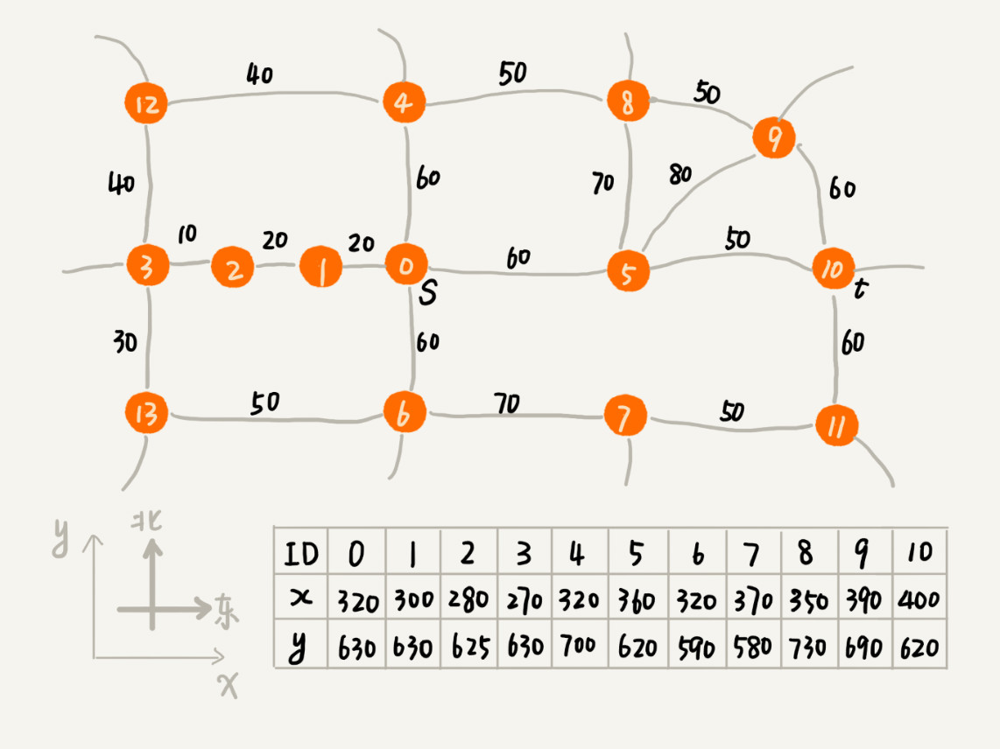

在Dijkstra算法的实现思路中，我们用一个优先级队列，来记录已经遍历到的顶点以及这个顶点与起点的路径长度。顶点与起点路径长度越小，就越先被从优先级队列中取出来扩展，从图中举的例子可以看出，尽管我们找的是从s到t的路线，但是最先被搜索到的顶点依次是1，2，3。通过肉眼来观察，这个搜索方向跟我们期望的路线方向（s到t是从西向东）是反着的，路线搜索的方向明显“跑偏”了。

之所以会“跑偏”，那是因为我们是按照顶点与起点的路径长度的大小，来安排出队列顺序的。与起点越近的顶点，就会越早出队列。我们并没有考虑到这个顶点到终点的距离，所以，在地图中，尽管1，2，3三个顶点离起始顶点最近，但离终点却越来越远。

如果我们综合更多的因素，把这个顶点到终点可能还要走多远，也考虑进去，综合来判断哪个顶点该先出队列，那是不是就可以避免“跑偏”呢？

当我们遍历到某个顶点的时候，从起点走到这个顶点的路径长度是确定的，我们记作g(i)（i表示顶点编号）。但是，从这个顶点到终点的路径长度，我们是未知的。虽然确切的值无法提前知道，但是我们可以用其他估计值来代替。

这里我们可以通过这个顶点跟终点之间的直线距离，也就是欧几里得距离，来近似地估计这个顶点跟终点的路径长度（注意：路径长度跟直线距离是两个概念）。我们把这个距离记作h(i)（i表示这个顶点的编号），专业的叫法是**启发函数**（heuristic function）。因为欧几里得距离的计算公式，会涉及比较耗时的开根号计算，所以，我们一般通过另外一个更加简单的距离计算公式，那就是**曼哈顿距离**（Manhattan distance）。曼哈顿距离是两点之间横纵坐标的距离之和。计算的过程只涉及加减法、符号位反转，所以比欧几里得距离更加高效。

```
int hManhattan(Vertex v1, Vertex v2) { // Vertex表示顶点，后面有定义
  return Math.abs(v1.x - v2.x) + Math.abs(v1.y - v2.y);
}
```

原来只是单纯地通过顶点与起点之间的路径长度g(i)，来判断谁先出队列，现在有了顶点到终点的路径长度估计值，我们通过两者之和f(i)=g(i)+h(i)，来判断哪个顶点该最先出队列。综合两部分，我们就能有效避免刚刚讲的“跑偏”。这里f(i)的专业叫法是**估价函数**（evaluation function）。

从刚刚的描述，我们可以发现，A*算法就是对Dijkstra算法的简单改造。

在A*算法的代码实现中，顶点Vertex类的定义，跟Dijkstra算法中的定义，稍微有点儿区别，多了x，y坐标，以及刚刚提到的f(i)值。图Graph类的定义跟Dijkstra算法中的定义一样。

```
private class Vertex {
  public int id; // 顶点编号ID
  public int dist; // 从起始顶点，到这个顶点的距离，也就是g(i)
  public int f; // 新增：f(i)=g(i)+h(i)
  public int x, y; // 新增：顶点在地图中的坐标（x, y）
  public Vertex(int id, int x, int y) {
    this.id = id;
    this.x = x;
    this.y = y;
    this.f = Integer.MAX_VALUE;
    this.dist = Integer.MAX_VALUE;
  }
}
// Graph类的成员变量，在构造函数中初始化
Vertex[] vertexes = new Vertex[this.v];
// 新增一个方法，添加顶点的坐标
public void addVetex(int id, int x, int y) {
  vertexes[id] = new Vertex(id, x, y)
}
```

A*算法的代码实现的主要逻辑是下面这段代码。它跟Dijkstra算法的代码实现，主要有3点区别：

- 优先级队列构建的方式不同。A*算法是根据f值（也就是刚刚讲到的f(i)=g(i)+h(i)）来构建优先级队列，而Dijkstra算法是根据dist值（也就是刚刚讲到的g(i)）来构建优先级队列；
- A*算法在更新顶点dist值的时候，会同步更新f值；
- 循环结束的条件也不一样。Dijkstra算法是在终点出队列的时候才结束，A*算法是一旦遍历到终点就结束。

```
public void astar(int s, int t) { // 从顶点s到顶点t的路径
  int[] predecessor = new int[this.v]; // 用来还原路径
  // 按照vertex的f值构建的小顶堆，而不是按照dist
  PriorityQueue queue = new PriorityQueue(this.v);
  boolean[] inqueue = new boolean[this.v]; // 标记是否进入过队列
  vertexes[s].dist = 0;
  vertexes[s].f = 0;
  queue.add(vertexes[s]);
  inqueue[s] = true;
  while (!queue.isEmpty()) {
    Vertex minVertex = queue.poll(); // 取堆顶元素并删除
    for (int i = 0; i < adj[minVertex.id].size(); ++i) {
      Edge e = adj[minVertex.id].get(i); // 取出一条minVetex相连的边
      Vertex nextVertex = vertexes[e.tid]; // minVertex-->nextVertex
      if (minVertex.dist + e.w < nextVertex.dist) { // 更新next的dist,f
        nextVertex.dist = minVertex.dist + e.w;
        nextVertex.f 
           = nextVertex.dist+hManhattan(nextVertex, vertexes[t]);
        predecessor[nextVertex.id] = minVertex.id;
        if (inqueue[nextVertex.id] == true) {
          queue.update(nextVertex);
        } else {
          queue.add(nextVertex);
          inqueue[nextVertex.id] = true;
        }
      }
      if (nextVertex.id == t) break; // 只要到达t就可以结束while了
    }
  }
  // 输出路径
  System.out.print(s);
  print(s, t, predecessor); // print函数请参看Dijkstra算法的实现
}
```

**尽管A\*算法可以更加快速的找到从起点到终点的路线，但是它并不能像Dijkstra算法那样，找到最短路线。这是为什么呢？**

要找出起点s到终点t的最短路径，最简单的方法是，通过回溯穷举所有从s到达t的不同路径，然后对比找出最短的那个。不过很显然，回溯算法的执行效率非常低，是指数级的。

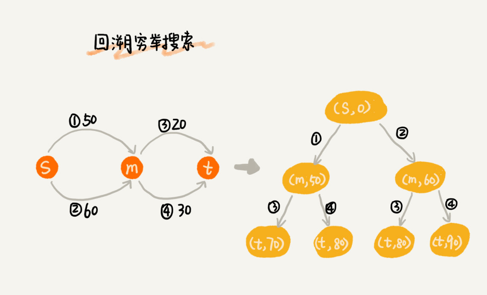

Dijkstra算法在此基础之上，利用动态规划的思想，对回溯搜索进行了剪枝，只保留起点到某个顶点的最短路径，继续往外扩展搜索。动态规划相较于回溯搜索，只是换了一个实现思路，但它实际上也考察到了所有从起点到终点的路线，所以才能得到最优解。

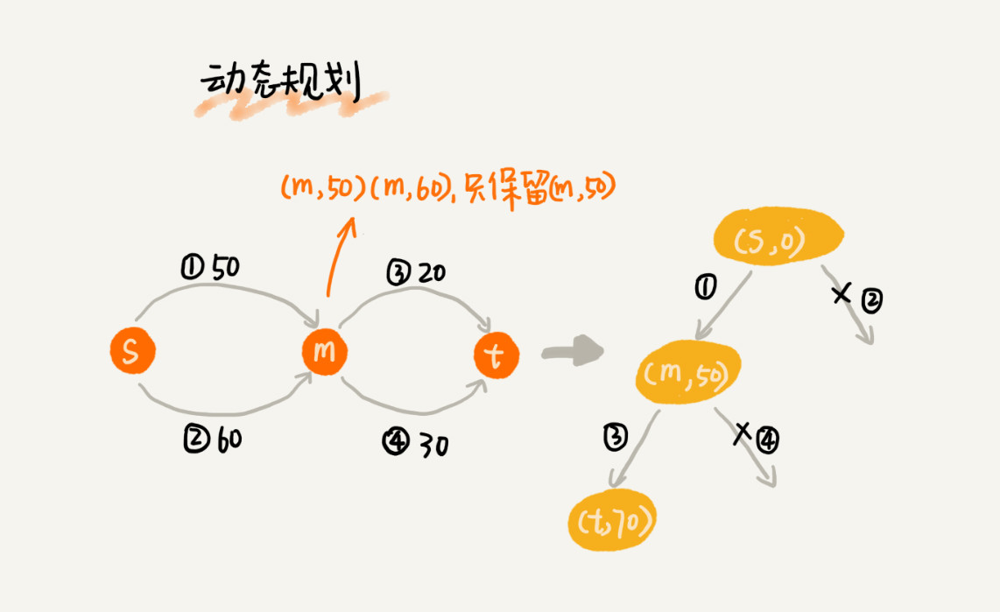

A*算法之所以不能像Dijkstra算法那样，找到最短路径，主要原因是两者的while循环结束条件不一样。

刚刚我们讲过，Dijkstra算法是在终点出队列的时候才结束，A算法是一旦遍历到终点就结束。对于Dijkstra算法来说，当终点出队列的时候，终点的dist值是优先级队列中所有顶点的最小值，即便再运行下去，终点的dist值也不会再被更新了。对于A*算法来说，一旦遍历到终点，我们就结束while循环，这个时候，终点的dist值未必是最小值。

A*算法利用贪心算法的思路，每次都找f值最小的顶点出队列，一旦搜索到终点就不在继续考察其他顶点和路线了。所以，它并没有考察所有的路线，也就不可能找出最短路径了。

**如何借助A\*算法解决今天的游戏寻路问题？**

要利用A*算法解决这个问题，我们只需要把地图，抽象成图就可以了。不过，游戏中的地图跟第44节中讲的我们平常用的地图是不一样的。因为游戏中的地图并不像我们现实生活中那样，存在规划非常清晰的道路，更多的是宽阔的荒野、草坪等。所以，我们没法利用44节中讲到的抽象方法，把岔路口抽象成顶点，把道路抽象成边。

实际上，我们可以换一种抽象的思路，把整个地图分割成一个一个的小方块。在某一个方块上的人物，只能往上下左右四个方向的方块上移动。我们可以把每个方块看作一个顶点。两个方块相邻，我们就在它们之间，连两条有向边，并且边的权值都是1。所以，这个问题就转化成了，在一个有向有权图中，找某个顶点到另一个顶点的路径问题。将地图抽象成边权值为1的有向图之后，我们就可以套用A*算法，来实现游戏中人物的自动寻路功能了。

### 总结引申

我们今天讲的A*算法属于一种**启发式搜索算法**（Heuristically Search Algorithm）。

实际上，启发式搜索算法并不仅仅只有A*算法，还有很多其他算法，比如IDA*算法、蚁群算法、遗传算法、模拟退火算法等。

启发式搜索算法利用估价函数，避免“跑偏”，贪心地朝着最有可能到达终点的方向前进。这种算法找出的路线，并不是最短路线。但是，实际的软件开发中的路线规划问题，我们往往并不需要非得找最短路线。所以，鉴于启发式搜索算法能很好地平衡路线质量和执行效率，它在实际的软件开发中的应用更加广泛。实际上，地图App中的出行路线规划问题，也可以利用启发式搜索算法来实现。

## 索引

MySQL底层依赖的是B+树这种数据结构。那**类似Redis这样的Key-Value数据库中的索引，又是怎么实现的呢？底层依赖的又是什么数据结构呢？**

### 为什么需要索引？

对于存储的需求，功能上无外乎增删改查。这其实并不复杂。但是，一旦存储的数据很多，那性能就成了这些系统要关注的重点，特别是在一些跟存储相关的基础系统（比如MySQL数据库、分布式文件系统等）、中间件（比如消息中间件RocketMQ等）中。

“如何节省存储空间、如何提高数据增删改查的执行效率”，这样的问题就成了设计的重点。而这些系统的实现，都离不开一个东西，那就是**索引**。不夸张地说，索引设计得好坏，直接决定了这些系统是否优秀。

索引这个概念，非常好理解。你可以类比书籍的目录来理解。如果没有目录，我们想要查找某个知识点的时候，就要一页一页翻。通过目录，我们就可以快速定位相关知识点的页数，查找的速度也会有质的提高。

### 索引的需求定义

索引的概念不难理解，我想你应该已经搞明白。接下来，我们就分析一下，在设计索引的过程中，需要考虑到的一些因素，换句话说就是，我们该如何定义清楚需求呢？对于系统设计需求，我们一般可以从**功能性需求**和**非功能性需求**两方面来分析。

#### 1.功能性需求

对于功能性需求需要考虑的点，我把它们大致概括成下面这几点。

**数据是格式化数据还是非格式化数据**？要构建索引的原始数据，类型有很多。我把它分为两类，一类是结构化数据，比如，MySQL中的数据；另一类是非结构化数据，比如搜索引擎中网页。对于非结构化数据，我们一般需要做预处理，提取出查询关键词，对关键词构建索引。

**数据是静态数据还是动态数据**？如果原始数据是一组静态数据，也就是说，不会有数据的增加、删除、更新操作，所以，我们在构建索引的时候，只需要考虑查询效率就可以了。这样，索引的构建就相对简单些。不过，大部分情况下，我们都是对动态数据构建索引，也就是说，我们不仅要考虑到索引的查询效率，在原始数据更新的同时，我们还需要动态地更新索引。支持动态数据集合的索引，设计起来相对也要更加复杂些。

**索引存储在内存还是硬盘**？如果索引存储在内存中，那查询的速度肯定要比存储在磁盘中的高。但是，如果原始数据量很大的情况下，对应的索引可能也会很大。这个时候，因为内存有限，我们可能就不得不将索引存储在磁盘中了。实际上，还有第三种情况，那就是一部分存储在内存，一部分存储在磁盘，这样就可以兼顾内存消耗和查询效率。

**单值查找还是区间查找**？所谓单值查找，也就是根据查询关键词等于某个值的数据。这种查询需求最常见。所谓区间查找，就是查找关键词处于某个区间值的所有数据。你可以类比MySQL数据库的查询需求，自己想象一下。实际上，不同的应用场景，查询的需求会多种多样。

**单关键词查找还是多关键词组合查找**？比如，搜索引擎中构建的索引，既要支持一个关键词的查找，比如“数据结构”，也要支持组合关键词查找，比如“数据结构 AND 算法”。对于单关键词的查找，索引构建起来相对简单些。对于多关键词查询来说，要分多种情况。像MySQL这种结构化数据的查询需求，我们可以实现针对多个关键词的组合，建立索引；对于像搜索引擎这样的非结构数据的查询需求，我们可以针对单个关键词构建索引，然后通过集合操作，比如求并集、求交集等，计算出多个关键词组合的查询结果。

#### 2.非功能性需求

**不管是存储在内存中还是磁盘中，索引对存储空间的消耗不能过大**。如果存储在内存中，索引对占用存储空间的限制就会非常苛刻。毕竟内存空间非常有限，一个中间件启动后就占用几个GB的内存，开发者显然是无法接受的。如果存储在硬盘中，那索引对占用存储空间的限制，稍微会放宽一些。但是，我们也不能掉以轻心。因为，有时候，索引对存储空间的消耗会超过原始数据。

**在考虑索引查询效率的同时，我们还要考虑索引的维护成本**。索引的目的是提高查询效率，但是，基于动态数据集合构建的索引，我们还要考虑到，索引的维护成本。因为在原始数据动态增删改的同时，我们也需要动态的更新索引。而索引的更新势必会影响到增删改操作的性能。

### 构建索引常用的数据结构有哪些？

实际上，常用来构建索引的数据结构，就是几种支持动态数据集合的数据结构。比如，散列表、红黑树、跳表、B+树。除此之外，位图、布隆过滤器可以作为辅助索引，有序数组可以用来对静态数据构建索引。

我们知道，**散列表**增删改查操作的性能非常好，时间复杂度是O(1)。一些键值数据库，比如Redis、Memcache，就是使用散列表来构建索引的。这类索引，一般都构建在内存中。

**红黑树**作为一种常用的平衡二叉查找树，数据插入、删除、查找的时间复杂度是O(logn)，也非常适合用来构建内存索引。Ext文件系统中，对磁盘块的索引，用的就是红黑树。

**B+树**比起红黑树来说，更加适合构建存储在磁盘中的索引。B+树是一个多叉树，所以，对相同个数的数据构建索引，B+树的高度要低于红黑树。当借助索引查询数据的时候，读取B+树索引，需要的磁盘IO次数非常更少。所以，大部分关系型数据库的索引，比如MySQL、Oracle，都是用B+树来实现的。

**跳表**也支持快速添加、删除、查找数据。而且，我们通过灵活调整索引结点个数和数据个数之间的比例，可以很好地平衡索引对内存的消耗及其查询效率。Redis中的有序集合，就是用跳表来构建的。

除了散列表、红黑树、B+树、跳表之外，位图和布隆过滤器这两个数据结构，也可以用于索引中，辅助存储在磁盘中的索引，加速数据查找的效率。

我们知道，**布隆过滤器**有一定的判错率。但是，我们可以规避它的短处，发挥它的长处。尽管对于判定存在的数据，有可能并不存在，但是对于判定不存在的数据，那肯定就不存在。而且，布隆过滤器还有一个更大的特点，那就是内存占用非常少。我们可以针对数据，构建一个布隆过滤器，并且存储在内存中。当要查询数据的时候，我们可以先通过布隆过滤器，判定是否存在。如果通过布隆过滤器判定数据不存在，那我们就没有必要读取磁盘中的索引了。对于数据不存在的情况，数据查询就更加快速了。

实际上，有序数组也可以被作为索引。如果数据是静态的，也就是不会有插入、删除、更新操作，那我们可以把数据的关键词（查询用的）抽取出来，组织成有序数组，然后利用二分查找算法来快速查找数据。

### 练习

#### 你知道基础系统、中间件、开源软件等系统中，有哪些用到了索引吗？这些系统的索引是如何实现的呢？

es中的单排索引其实用了trie树，对每个需要索引的key维护了一个trie树，用于定位到这个key在文件中的位置， 然后直接用有序列表直接去访问对应的documents ，区块链拿以太坊来说吧，存储用的leveldb，数据存储用的数据结构是帕特利夏树，是一种高级的trie树，很好的做了数据的压缩， 消息中间件像kafka这种，会去做持久化，每个partition都会有很多数据，会有大量数据存储在磁盘中，所以每个partition也会有个索引，方便去做快速访问

## 并行算法

算法的目的就是为了提高代码执行的效率。那**当算法无法再继续优化的情况下，我们该如何来进一步提高执行效率呢**？那就是并行计算。

### 并行排序

假设我们要给大小为8GB的数据进行排序，并且，我们机器的内存可以一次性容纳这么多数据。对于排序来说，最常用的就是时间复杂度为O(nlogn)的三种排序算法，归并排序、快速排序、堆排序。从理论上讲，这个排序问题，已经很难再从算法层面优化了。而利用并行的处理思想，我们可以很轻松地将这个给8GB数据排序问题的执行效率提高很多倍。具体的实现思路有下面两种。

**第一种是对归并排序并行化处理**。我们可以将这8GB的数据划分成16个小的数据集合，每个集合包含500MB的数据。我们用16个线程，并行地对这16个500MB的数据集合进行排序。这16个小集合分别排序完成之后，我们再将这16个有序集合合并。

**第二种是对快速排序并行化处理**。我们通过扫描一遍数据，找到数据所处的范围区间。我们把这个区间从小到大划分成16个小区间。我们将8GB的数据划分到对应的区间中。针对这16个小区间的数据，我们启动16个线程，并行地进行排序。等到16个线程都执行结束之后，得到的数据就是有序数据了。

对比这两种处理思路，它们利用的都是分治的思想，对数据进行分片，然后并行处理。它们的区别在于，第一种处理思路是，先随意地对数据分片，排序之后再合并。第二种处理思路是，先对数据按照大小划分区间，然后再排序，排完序就不需要再处理了。这个跟归并和快排的区别如出一辙。

如果要排序的数据规模不是8GB，而是1TB，那问题的重点就不是算法的执行效率了，而是数据的读取效率。因为1TB的数据肯定是存在硬盘中，无法一次性读取到内存中，这样在排序的过程中，就会有频繁地磁盘数据的读取和写入。如何减少磁盘的IO操作，减少磁盘数据读取和写入的总量，就变成了优化的重点。

### 并行查找

我们知道，散列表是一种非常适合快速查找的数据结构。

如果我们是给动态数据构建索引，在数据不断加入的时候，散列表的装载因子就会越来越大。为了保证散列表性能不下降，我们就需要对散列表进行动态扩容。对如此大的散列表进行动态扩容，一方面比较耗时，另一方面比较消耗内存。比如，我们给一个2GB大小的散列表进行扩容，扩展到原来的1.5倍，也就是3GB大小。这个时候，实际存储在散列表中的数据只有不到2GB，所以内存的利用率只有60%，有1GB的内存是空闲的。

实际上，我们可以将数据随机分割成k份（比如16份），每份中的数据只有原来的1/k，然后我们针对这k个小数据集合分别构建散列表。这样，散列表的维护成本就变低了。当某个小散列表的装载因子过大的时候，我们可以单独对这个散列表进行扩容，而其他散列表不需要进行扩容。

还是刚才那个例子，假设现在有2GB的数据，我们放到16个散列表中，每个散列表中的数据大约是150MB。当某个散列表需要扩容的时候，我们只需要额外增加150*0.5=75MB的内存（假设还是扩容到原来的1.5倍）。不管从扩容的执行效率还是内存的利用率上，这种多个小散列表的处理方法，都要比大散列表高效。

当我们要查找某个数据的时候，我们只需要通过16个线程，并行地在这16个散列表中查找数据。这样的查找性能，比起一个大散列表的做法，也并不会下降，反倒有可能提高。

当往散列表中添加数据的时候，我们可以选择将这个新数据放入装载因子最小的那个散列表中，这样也有助于减少散列冲突。

### 并行字符串匹配

我们前面学过，在文本中查找某个关键词这样一个功能，可以通过字符串匹配算法来实现。我们之前学过的字符串匹配算法有KMP、BM、RK、BF等。当在一个不是很长的文本中查找关键词的时候，这些字符串匹配算法中的任何一个，都可以表现得非常高效。但是，如果我们处理的是超级大的文本，那处理的时间可能就会变得很长，那有没有办法加快匹配速度呢？

我们可以把大的文本，分割成k个小文本。假设k是16，我们就启动16个线程，并行地在这16个小文本中查找关键词，这样整个查找的性能就提高了16倍。16倍效率的提升，从理论的角度来说并不多。但是，对于真实的软件开发来说，这显然是一个非常可观的优化。

不过，这里还有一个细节要处理，那就是原本包含在大文本中的关键词，被一分为二，分割到两个小文本中，这就会导致尽管大文本中包含这个关键词，但在这16个小文本中查找不到它。实际上，这个问题也不难解决，我们只需要针对这种特殊情况，做一些特殊处理就可以了。

我们假设关键词的长度是m。我们在每个小文本的结尾和开始各取m个字符串。前一个小文本的末尾m个字符和后一个小文本的开头m个字符，组成一个长度是2m的字符串。我们再拿关键词，在这个长度为2m的字符串中再重新查找一遍，就可以补上刚才的漏洞了。

### 并行搜索

前面我们学习过好几种搜索算法，它们分别是广度优先搜索、深度优先搜索、Dijkstra最短路径算法、A*启发式搜索算法。对于广度优先搜索算法，我们也可以将其改造成并行算法。

广度优先搜索是一种逐层搜索的搜索策略。基于当前这一层顶点，我们可以启动多个线程，并行地搜索下一层的顶点。在代码实现方面，原来广度优先搜索的代码实现，是通过一个队列来记录已经遍历到但还没有扩展的顶点。现在，经过改造之后的并行广度优先搜索算法，我们需要利用两个队列来完成扩展顶点的工作。

假设这两个队列分别是队列A和队列B。多线程并行处理队列A中的顶点，并将扩展得到的顶点存储在队列B中。等队列A中的顶点都扩展完成之后，队列A被清空，我们再并行地扩展队列B中的顶点，并将扩展出来的顶点存储在队列A。这样两个队列循环使用，就可以实现并行广度优先搜索算法。

### 练习

#### 假设我们有n个任务，为了提高执行的效率，我们希望能并行执行任务，但是各个任务之间又有一定的依赖关系，如何根据依赖关系找出可以并行执行的任务？

用一个有向图来存储任务之间的依赖关系，然后用拓扑排序的思想来执行任务，每次都找到入度为0的，放在队列里，启动线程池开始执行，队列里的任务并行执行完毕，再次调用拓扑排序找到入度为0的人，放入队列，直到所以任务跑完


## 算法实战（一）：剖析Redis常用数据类型对应的数据结构

### Redis数据库介绍

Redis是一种键值（Key-Value）数据库。相对于关系型数据库（比如MySQL），Redis也被叫作**非关系型数据库**。

像MySQL这样的关系型数据库，表的结构比较复杂，会包含很多字段，可以通过SQL语句，来实现非常复杂的查询需求。而Redis中只包含“键”和“值”两部分，只能通过“键”来查询“值”。正是因为这样简单的存储结构，也让Redis的读写效率非常高。

除此之外，Redis主要是作为内存数据库来使用，也就是说，数据是存储在内存中的。尽管它经常被用作内存数据库，但是，它也支持将数据存储在硬盘中。

Redis中，键的数据类型是字符串，但是为了丰富数据存储的方式，方便开发者使用，值的数据类型有很多，常用的数据类型有这样几种，它们分别是字符串、列表、字典、集合、有序集合。

### 列表（list）

我们先来看列表。列表这种数据类型支持存储一组数据。这种数据类型对应两种实现方法，一种是**压缩列表**（ziplist），另一种是双向循环链表。

当列表中存储的数据量比较小的时候，列表就可以采用压缩列表的方式实现。具体需要同时满足下面两个条件：

- 列表中保存的单个数据（有可能是字符串类型的）小于64字节；
- 列表中数据个数少于512个。

关于压缩列表，它并不是基础数据结构，而是Redis自己设计的一种数据存储结构。它有点儿类似数组，通过一片连续的内存空间，来存储数据。不过，它跟数组不同的一点是，它允许存储的数据大小不同。具体的存储结构也非常简单，你可以看我下面画的这幅图。


压缩列表中的“压缩”两个字该如何理解？

听到“压缩”两个字，直观的反应就是节省内存。之所以说这种存储结构节省内存，是相较于数组的存储思路而言的。我们知道，数组要求每个元素的大小相同，如果我们要存储不同长度的字符串，那我们就需要用最大长度的字符串大小作为元素的大小（假设是20个字节）。那当我们存储小于20个字节长度的字符串的时候，便会浪费部分存储空间。


压缩列表这种存储结构，一方面比较节省内存，另一方面可以支持不同类型数据的存储。而且，因为数据存储在一片连续的内存空间，通过键来获取值为列表类型的数据，读取的效率也非常高。

当列表中存储的数据量比较大的时候，也就是不能同时满足刚刚讲的两个条件的时候，列表就要通过双向循环链表来实现了。

Redis的这种双向链表的实现方式，非常值得借鉴。它额外定义一个list结构体，来组织链表的首、尾指针，还有长度等信息。这样，在使用的时候就会非常方便。

```
// 以下是C语言代码，因为Redis是用C语言实现的。
typedef struct listnode {
  struct listNode *prev;
  struct listNode *next;
  void *value;
} listNode;


typedef struct list {
  listNode *head;
  listNode *tail;
  unsigned long len;
  // ....省略其他定义
} list;
```

### 字典（hash）

字典类型用来存储一组数据对。每个数据对又包含键值两部分。字典类型也有两种实现方式。一种是我们刚刚讲到的**压缩列表**，另一种是**散列表**。

同样，只有当存储的数据量比较小的情况下，Redis才使用压缩列表来实现字典类型。具体需要满足两个条件：

- 字典中保存的键和值的大小都要小于64字节；
- 字典中键值对的个数要小于512个。

当不能同时满足上面两个条件的时候，Redis就使用散列表来实现字典类型。Redis使用MurmurHash2这种运行速度快、随机性好的哈希算法作为哈希函数。对于哈希冲突问题，Redis使用链表法来解决。除此之外，Redis还支持散列表的动态扩容、缩容。

当数据动态增加之后，散列表的装载因子会不停地变大。为了避免散列表性能的下降，当装载因子大于1的时候，Redis会触发扩容，将散列表扩大为原来大小的2倍左右（具体值需要计算才能得到，如果感兴趣，阅读[源码](https://github.com/antirez/redis/blob/unstable/src/dict.c)）。

当数据动态减少之后，为了节省内存，当装载因子小于0.1的时候，Redis就会触发缩容，缩小为字典中数据个数的大约2倍大小（这个值也是计算得到的，如果感兴趣，你也可以去阅读[源码](https://github.com/antirez/redis/blob/unstable/src/dict.c)）。

我们前面讲过，扩容缩容要做大量的数据搬移和哈希值的重新计算，所以比较耗时。针对这个问题，Redis使用渐进式扩容缩容策略，将数据的搬移分批进行，避免了大量数据一次性搬移导致的服务停顿。

### 集合（set）

集合这种数据类型用来存储一组不重复的数据。这种数据类型也有两种实现方法，一种是基于有序数组，另一种是基于散列表。

当要存储的数据，同时满足下面这样两个条件的时候，Redis就采用有序数组，来实现集合这种数据类型。

- 存储的数据都是整数；
- 存储的数据元素个数不超过512个。

当不能同时满足这两个条件的时候，Redis就使用散列表来存储集合中的数据。

### 有序集合（sortedset）

有序集合这种数据类型，它用来存储一组数据，并且每个数据会附带一个得分。通过得分的大小，我们将数据组织成跳表这样的数据结构，以支持快速地按照得分值、得分区间获取数据。

实际上，跟Redis的其他数据类型一样，有序集合也并不仅仅只有跳表这一种实现方式。当数据量比较小的时候，Redis会用压缩列表来实现有序集合。具体点说就是，使用压缩列表来实现有序集合的前提，有这样两个：

- 所有数据的大小都要小于64字节；
- 元素个数要小于128个。

### 数据结构持久化

尽管Redis经常会被用作内存数据库，但是，它也支持数据落盘，也就是将内存中的数据存储到硬盘中。这样，当机器断电的时候，存储在Redis中的数据也不会丢失。在机器重新启动之后，Redis只需要再将存储在硬盘中的数据，重新读取到内存，就可以继续工作了。

刚刚我们讲到，Redis的数据格式由“键”和“值”两部分组成。而“值”又支持很多数据类型，比如字符串、列表、字典、集合、有序集合。像字典、集合等类型，底层用到了散列表，散列表中有指针的概念，而指针指向的是内存中的存储地址。 那Redis是如何将这样一个跟具体内存地址有关的数据结构存储到磁盘中的呢？

实际上，Redis遇到的这个问题并不特殊，很多场景中都会遇到。我们把它叫作**数据结构的持久化问题**，或者**对象的持久化问题**。这里的“持久化”，你可以笼统地可以理解为“存储到磁盘”。

如何将数据结构持久化到硬盘？我们主要有两种解决思路。

第一种是清除原有的存储结构，只将数据存储到磁盘中。当我们需要从磁盘还原数据到内存的时候，再重新将数据组织成原来的数据结构。实际上，Redis采用的就是这种持久化思路。

不过，这种方式也有一定的弊端。那就是数据从硬盘还原到内存的过程，会耗用比较多的时间。比如，我们现在要将散列表中的数据存储到磁盘。当我们从磁盘中，取出数据重新构建散列表的时候，需要重新计算每个数据的哈希值。如果磁盘中存储的是几GB的数据，那重构数据结构的耗时就不可忽视了。

第二种方式是保留原来的存储格式，将数据按照原有的格式存储在磁盘中。我们拿散列表这样的数据结构来举例。我们可以将散列表的大小、每个数据被散列到的槽的编号等信息，都保存在磁盘中。有了这些信息，我们从磁盘中将数据还原到内存中的时候，就可以避免重新计算哈希值。

### 练习

#### 在数据量比较小的情况下，Redis中的很多数据类型，比如字典、有序集合等，都是通过多种数据结构来实现的，为什么会这样设计呢？用一种固定的数据结构来实现，不是更加简单吗？

Redis的数据结构由多种数据结构来实现，主要是出于时间和空间的考虑，当数据量小的时候通过数组下标访问最快、占用内存最小，而压缩列表只是数组的升级版；
因为数组需要占用连续的内存空间，所以当数据量大的时候，就需要使用链表了，同时为了保证速度又需要和数组结合，也就有了散列表。
对于数据的大小和多少采用哪种数据结构，相信Redis团队一定是根据大多数的开发场景而定的。

#### 我们讲到数据结构持久化有两种方法。对于二叉查找树这种数据结构，我们如何将它持久化到磁盘中呢？

普通树可以选择一个遍历方式，例如前序遍历，把树变成链表，把数据挨个保存，等需要取出来再按顺序把所有元素加到树里面。
二叉查找树本身底层就是使用数组，整个数组写进磁盘就完事了，取出来也是连续数组，完全不用保存树结构。

## 算法实战（二）：剖析搜索引擎背后的经典数据结构和算法

### 整体系统介绍

如何在一台机器上（假设这台机器的内存是8GB， 硬盘是100多GB），通过少量的代码，实现一个小型搜索引擎。不过，麻雀虽小，五脏俱全。跟大型搜索引擎相比，实现这样一个小型搜索引擎所用到的理论基础是相通的。

搜索引擎大致可以分为四个部分：**搜集**、**分析**、**索引**、**查询**。其中，搜集，就是我们常说的利用爬虫爬取网页。分析，主要负责网页内容抽取、分词，构建临时索引，计算PageRank值这几部分工作。索引，主要负责通过分析阶段得到的临时索引，构建倒排索引。查询，主要负责响应用户的请求，根据倒排索引获取相关网页，计算网页排名，返回查询结果给用户。

### 搜集

搜索引擎是如何爬取网页的呢？

搜索引擎把整个互联网看作数据结构中的有向图，把每个页面看作一个顶点。如果某个页面中包含另外一个页面的链接，那我们就在两个顶点之间连一条有向边。我们可以利用图的遍历搜索算法，来遍历整个互联网中的网页。

我们前面介绍过两种图的遍历方法，深度优先和广度优先。搜索引擎采用的是广度优先搜索策略。具体点讲的话，那就是，我们先找一些比较知名的网页（专业的叫法是权重比较高）的链接（比如新浪主页网址、腾讯主页网址等），作为种子网页链接，放入到队列中。爬虫按照广度优先的策略，不停地从队列中取出链接，然后取爬取对应的网页，解析出网页里包含的其他网页链接，再将解析出来的链接添加到队列中。

#### 1.待爬取网页链接文件：links.bin

在广度优先搜索爬取页面的过程中，爬虫会不停地解析页面链接，将其放到队列中。于是，队列中的链接就会越来越多，可能会多到内存放不下。所以，我们用一个存储在磁盘中的文件（links.bin）来作为广度优先搜索中的队列。爬虫从links.bin文件中，取出链接去爬取对应的页面。等爬取到网页之后，将解析出来的链接，直接存储到links.bin文件中。

这样用文件来存储网页链接的方式，还有其他好处。比如，支持断点续爬。也就是说，当机器断电之后，网页链接不会丢失；当机器重启之后，还可以从之前爬取到的位置继续爬取。

#### 2.网页判重文件：bloom_filter.bin

如何避免重复爬取相同的网页呢？使用布隆过滤器，我们就可以快速并且非常节省内存地实现网页的判重。

不过，还是刚刚那个问题，如果我们把布隆过滤器存储在内存中，那机器宕机重启之后，布隆过滤器就被清空了。这样就可能导致大量已经爬取的网页会被重复爬取。

这个问题该怎么解决呢？我们可以定期地（比如每隔半小时）将布隆过滤器持久化到磁盘中，存储在bloom_filter.bin文件中。这样，即便出现机器宕机，也只会丢失布隆过滤器中的部分数据。当机器重启之后，我们就可以重新读取磁盘中的bloom_filter.bin文件，将其恢复到内存中。

#### 3.原始网页存储文件：doc_raw.bin

爬取到网页之后，我们需要将其存储下来，以备后面离线分析、索引之用。那如何存储海量的原始网页数据呢？

如果我们把每个网页都存储为一个独立的文件，那磁盘中的文件就会非常多，数量可能会有几千万，甚至上亿。常用的文件系统显然不适合存储如此多的文件。所以，我们可以把多个网页存储在一个文件中。每个网页之间，通过一定的标识进行分隔，方便后续读取。具体的存储格式，如下图所示。其中，doc_id这个字段是网页的编号。

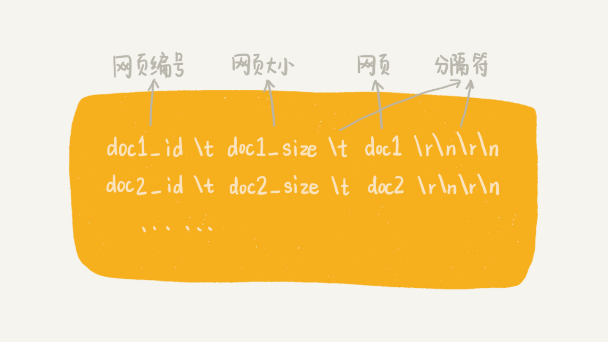

当然，这样的一个文件也不能太大，因为文件系统对文件的大小也有一定的限制。所以，我们可以设置每个文件的大小不能超过一定的值（比如1GB）。随着越来越多的网页被添加到文件中，文件的大小就会越来越大，当超过1GB的时候，我们就创建一个新的文件，用来存储新爬取的网页。

假设一台机器的硬盘大小是100GB左右，一个网页的平均大小是64KB。那在一台机器上，我们可以存储100万到200万左右的网页。假设我们的机器的带宽是10MB，那下载100GB的网页，大约需要10000秒。也就是说，爬取100多万的网页，也就是只需要花费几小时的时间。

#### 4.网页链接及其编号的对应文件：doc_id.bin

网页编号实际上就是给每个网页分配一个唯一的ID，方便我们后续对网页进行分析、索引。那如何给网页编号呢？

我们可以按照网页被爬取的先后顺序，从小到大依次编号。具体是这样做的：我们维护一个中心的计数器，每爬取到一个网页之后，就从计数器中拿一个号码，分配给这个网页，然后计数器加一。在存储网页的同时，我们将网页链接跟编号之间的对应关系，存储在另一个doc_id.bin文件中。

**爬虫在爬取网页的过程中，涉及的四个重要的文件，links.bin和bloom_filter.bin这两个文件是爬虫自身所用的。另外的两个（doc_raw.bin、doc_id.bin）是作为搜集阶段的成果，供后面的分析、索引、查询用的。**

### 分析

网页爬取下来之后，我们需要对网页进行离线分析。分析阶段主要包括两个步骤，第一个是抽取网页文本信息，第二个是分词并创建临时索引。我们逐一来讲解。

#### 1.抽取网页文本信息

网页是半结构化数据，里面夹杂着各种标签、JavaScript代码、CSS样式。对于搜索引擎来说，它只关心网页中的文本信息，也就是，网页显示在浏览器中时，能被用户肉眼看到的那部分信息。我们如何从半结构化的网页中，抽取出搜索引擎关系的文本信息呢？

我们之所以把网页叫作半结构化数据，是因为它本身是按照一定的规则来书写的。这个规则就是**HTML语法规范**。我们依靠HTML标签来抽取网页中的文本信息。这个抽取的过程，大体可以分为两步。

第一步是去掉JavaScript代码、CSS格式以及下拉框中的内容（因为下拉框在用户不操作的情况下，也是看不到的）。也就是style,script,option标签之间的内容。我们可以利用AC自动机这种多模式串匹配算法，在网页这个大字符串中，一次性查找这三个关键词。当找到某个关键词出现的位置之后，我们只需要依次往后遍历，直到对应结束标签为止。而这期间遍历到的字符串连带着标签就应该从网页中删除。

第二步是去掉所有HTML标签。这一步也是通过字符串匹配算法来实现的。过程跟第一步类似。

#### 2.分词并创建临时索引

经过上面的处理之后，我们就从网页中抽取出了我们关心的文本信息。接下来，我们要对文本信息进行分词，并且创建临时索引。

对于英文网页来说，分词非常简单。我们只需要通过空格、标点符号等分隔符，将每个单词分割开来就可以了。但是，对于中文来说，分词就复杂太多了。我这里介绍一种比较简单的思路，基于字典和规则的分词方法。

其中，字典也叫词库，里面包含大量常用的词语（我们可以直接从网上下载别人整理好的）。我们借助词库并采用最长匹配规则，来对文本进行分词。所谓最长匹配，也就是匹配尽可能长的词语。我举个例子解释一下。

比如要分词的文本是“中国人民解放了”，我们词库中有“中国”“中国人”“中国人民”“中国人民解放军”这几个词，那我们就取最长匹配，也就是“中国人民”划为一个词，而不是把“中国”、“中国人“划为一个词。具体到实现层面，我们可以将词库中的单词，构建成Trie树结构，然后拿网页文本在Trie树中匹配。

每个网页的文本信息在分词完成之后，我们都得到一组单词列表。我们把单词与网页之间的对应关系，写入到一个临时索引文件中（tmp_Index.bin），这个临时索引文件用来构建倒排索引文件。临时索引文件的格式如下：

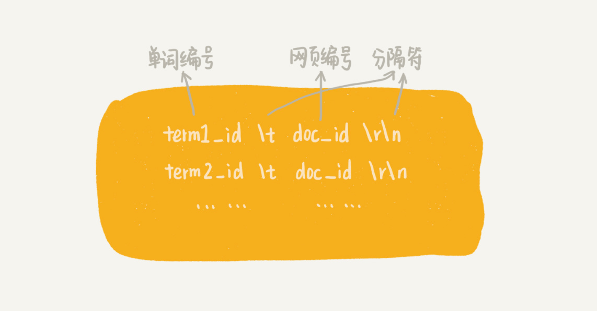

在临时索引文件中，我们存储的是单词编号，也就是图中的term_id，而非单词本身。这样做的目的主要是为了节省存储的空间。那这些单词的编号是怎么来的呢？

给单词编号的方式，跟给网页编号类似。我们维护一个计数器，每当从网页文本信息中分割出一个新的单词的时候，我们就从计数器中取一个编号，分配给它，然后计数器加一。

在这个过程中，我们还需要使用散列表，记录已经编过号的单词。在对网页文本信息分词的过程中，我们拿分割出来的单词，先到散列表中查找，如果找到，那就直接使用已有的编号；如果没有找到，我们再去计数器中拿号码，并且将这个新单词以及编号添加到散列表中。

当所有的网页处理（分词及写入临时索引）完成之后，我们再将这个单词跟编号之间的对应关系，写入到磁盘文件中，并命名为term_id.bin。

**经过分析阶段，我们得到了两个重要的文件。它们分别是临时索引文件（tmp_index.bin）和单词编号文件（term_id.bin）。**

### 索引

索引阶段主要负责将分析阶段产生的临时索引，构建成倒排索引。倒排索引（ Inverted index）中记录了每个单词以及包含它的网页列表。


在临时索引文件中，记录的是单词跟每个包含它的文档之间的对应关系。那如何通过临时索引文件，构建出倒排索引文件呢？

解决这个问题的方法有很多。考虑到临时索引文件很大，无法一次性加载到内存中，搜索引擎一般会选择使用**多路归并排序**的方法来实现。

我们先对临时索引文件，按照单词编号的大小进行排序。因为临时索引很大，所以一般基于内存的排序算法就没法处理这个问题了。我们可以用之前讲到的归并排序的处理思想，将其分割成多个小文件，先对每个小文件独立排序，最后再合并在一起。当然，实际的软件开发中，我们其实可以直接利用MapReduce来处理。

临时索引文件排序完成之后，相同的单词就被排列到了一起。我们只需要顺序地遍历排好序的临时索引文件，就能将每个单词对应的网页编号列表找出来，然后把它们存储在倒排索引文件中。具体的处理过程，我画成了一张图。

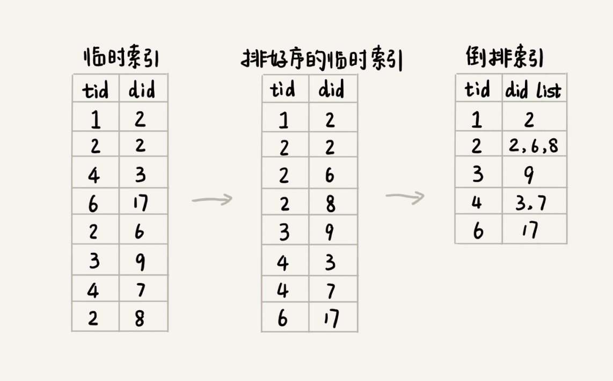

除了倒排文件之外，我们还需要一个文件，来记录每个单词编号在倒排索引文件中的偏移位置。我们把这个文件命名为term_offset.bin。这个文件的作用是，帮助我们快速地查找某个单词编号在倒排索引中存储的位置，进而快速地从倒排索引中读取单词编号对应的网页编号列表。


**经过索引阶段的处理，我们得到了两个有价值的文件，它们分别是倒排索引文件（index.bin）和记录单词编号在索引文件中的偏移位置的文件（term_offset.bin）。**

### 查询

前面三个阶段的处理，只是为了最后的查询做铺垫。因此，现在我们就要利用之前产生的几个文件，来实现最终的用户搜索功能。

- doc_id.bin：记录网页链接和编号之间的对应关系。
- term_id.bin：记录单词和编号之间的对应关系。
- index.bin：倒排索引文件，记录每个单词编号以及对应包含它的网页编号列表。
- term_offsert.bin：记录每个单词编号在倒排索引文件中的偏移位置。

这四个文件中，除了倒排索引文件（index.bin）比较大之外，其他的都比较小。为了方便快速查找数据，我们将其他三个文件都加载到内存中，并且组织成散列表这种数据结构。

当用户在搜索框中，输入某个查询文本的时候，我们先对用户输入的文本进行分词处理。假设分分词之后，我们得到k个单词。

我们拿这k个单词，去term_id.bin对应的散列表中，查找对应的单词编号。经过这个查询之后，我们得到了这k个单词对应的单词编号。

我们拿这k个单词编号，去term_offset.bin对应的散列表中，查找每个单词编号在倒排索引文件中的偏移位置。经过这个查询之后，我们得到了k个偏移位置。

我们拿这k个偏移位置，去倒排索引（index.bin）中，查找k个单词对应的包含它的网页编号列表。经过这一步查询之后，我们得到了k个网页编号列表。

我们针对这k个网页编号列表，统计每个网页编号出现的次数。具体到实现层面，我们可以借助散列表来进行统计。统计得到的结果，我们按照出现次数的多少，从小到大排序。出现次数越多，说明包含越多的用户查询单词（用户输入的搜索文本，经过分词之后的单词）。

经过这一系列查询，我们就得到了一组排好序的网页编号。我们拿着网页编号，去doc_id.bin文件中查找对应的网页链接，分页显示给用户就可以了。

### 总结引申

这只是一个搜索引擎设计的基本原理，有很多优化、细节并未涉及，比如计算网页权重的PageRank算法、计算查询结果排名的tf-idf模型等等。

在讲解的过程中，我们涉及的数据结构和算法有：图、散列表、Trie树、布隆过滤器、单模式字符串匹配算法、AC自动机、广度优先遍历、归并排序等。

### 练习

#### 图的遍历方法有两种，深度优先和广度优先。我们讲到，搜索引擎中的爬虫是通过广度优先策略来爬取网页的。搜索引擎为什么选择广度优先策略，而不是深度优先策略呢？

因为搜索引擎要优先爬取权重较高的页面，离种子网页越近，较大可能权重更高，广度优先更合适。

 爬取网页时，如果采用深度优先算法，很有可能导致，栈溢出的现象把，所以一般不用深度优先算法

#### 大部分搜索引擎在结果显示的时候，都支持摘要信息和网页快照。实际上，只需要对今天讲的设计思路，稍加改造，就可以支持这两项功能。你知道如何改造吗？

摘要信息：
增加 summary.bin 和 summary_offset.bin。

在抽取网页文本信息后，取出前 80-160 个字作为摘要，写入到 summary.bin，并将偏移位置写入到 summary_offset.bin。

summary.bin 格式：
doc_id \t summary_size \t summary \r\n\r\n

summary_offset.bin 格式：
doc_id \t offset \r\n

Google 搜索结果中显示的摘要是搜索词附近的文本。如果要实现这种效果，可以保存全部网页文本，构建搜索结果时，在网页文本中查找搜索词位置，截取搜索词附近文本。

网页快照：
可以把 doc_raw.bin 当作快照，增加 doc_raw_offset.bin 记录 doc_id 在 doc_raw.bin 中的偏移位置。

doc_raw_offset.bin 格式：
doc_id \t offset \r\n

## 算法实战（三）：剖析高性能队列Disruptor背后的数据结构和算法

Disruptor是一种内存消息队列。从功能上讲，它其实有点儿类似Kafka。不过，和Kafka不同的是，Disruptor是线程之间用于消息传递的队列。它在Apache Storm、Camel、Log4j 2等很多知名项目中都有广泛应用。

之所以如此受青睐，主要还是因为它的性能表现非常优秀。它比Java中另外一个非常常用的内存消息队列ArrayBlockingQueue（ABS）的性能，要高一个数量级，可以算得上是最快的内存消息队列了。它还因此获得过Oracle官方的Duke大奖。

**Disruptor是如何做到如此高性能的？其底层依赖了哪些数据结构和算法？**

### 基于循环队列的“生产者-消费者模型”

什么是内存消息队列？“生产者-消费者模型”，估计大部分人都知道。在这个模型中，“生产者”生产数据，并且将数据放到一个中心存储容器中。之后，“消费者”从中心存储容器中，取出数据消费。

这个模型非常简单、好理解，那你有没有思考过，这里面存储数据的中心存储容器，是用什么样的数据结构来实现的呢？

实际上，实现中心存储容器最常用的一种数据结构，就是队列。队列支持数据的先进先出。正是这个特性，使得数据被消费的顺序性可以得到保证，也就是说，早被生产的数据就会早被消费。

队列有两种实现思路。一种是基于链表实现的链式队列，另一种是基于数组实现的顺序队列。不同的需求背景下，我们会选择不同的实现方式。

如果我们要实现一个无界队列，也就是说，队列的大小事先不确定，理论上可以支持无限大。这种情况下，我们适合选用链表来实现队列。因为链表支持快速地动态扩容。如果我们要实现一个有界队列，也就是说，队列的大小事先确定，当队列中数据满了之后，生产者就需要等待。直到消费者消费了数据，队列有空闲位置的时候，生产者才能将数据放入。

实际上，相较于无界队列，有界队列的应用场景更加广泛。毕竟，我们的机器内存是有限的。而无界队列占用的内存数量是不可控的。对于实际的软件开发来说，这种不可控的因素，就会有潜在的风险。在某些极端情况下，无界队列就有可能因为内存持续增长，而导致OOM（Out of Memory）错误。

还有一种特殊的顺序队列，循环队列。非循环的顺序队列在添加、删除数据的工程中，会涉及数据的搬移操作，导致性能变差。而循环队列正好可以解决这个数据搬移的问题，所以，性能更加好。所以，大部分用到顺序队列的场景中，我们都选择用顺序队列中的循环队列。

实际上，**循环队列这种数据结构，就是内存消息队列的雏形。**借助循环队列，实现了一个最简单的“生产者-消费者模型”。对应的代码如下。

为了方便理解，对于生产者和消费者之间操作的同步，并没有用到线程相关的操作。而是采用了“当队列满了之后，生产者就轮训等待；当队列空了之后，消费者就轮训等待”这样的措施。

```
public class Queue {
  private Long[] data;
  private int size = 0, head = 0, tail = 0;
  public Queue(int size) {
    this.data = new Long[size];
    this.size = size;
  }

  public boolean add(Long element) {
    if ((tail + 1) % size == head) return false;
    data[tail] = element;
    tail = (tail + 1) % size;
    return true;
  }

  public Long poll() {
    if (head == tail) return null;
    long ret = data[head];
    head = (head + 1) % size;
    return ret;
  }
}

public class Producer {
  private Queue queue;
  public Producer(Queue queue) {
    this.queue = queue;
  }

  public void produce(Long data) throws InterruptedException {
    while (!queue.add(data)) {
      Thread.sleep(100);
    }
  }
}

public class Consumer {
  private Queue queue;
  public Consumer(Queue queue) {
    this.queue = queue;
  }

  public void comsume() throws InterruptedException {
    while (true) {
      Long data = queue.poll();
      if (data == null) {
        Thread.sleep(100);
      } else {
        // TODO:...消费数据的业务逻辑...
      }
    }
  }
}
```

### 基于加锁的并发“生产者-消费者模型”

实际上，刚刚的“生产者-消费者模型”实现代码，是不完善的。为什么这么说呢？

如果我们只有一个生产者往队列中写数据，一个消费者从队列中读取数据，那上面的代码是没有问题的。但是，如果有多个生产者在并发地往队列中写入数据，或者多个消费者并发地从队列中消费数据，那上面的代码就不能正确工作了。我来给你讲讲为什么。

在多个生产者或者多个消费者并发操作队列的情况下，刚刚的代码主要会有下面两个问题：

- 多个生产者写入的数据可能会互相覆盖；
- 多个消费者可能会读取重复的数据。

因为第一个问题和第二个问题产生的原理是类似的。所以，我着重讲解第一个问题是如何产生的以及该如何解决。

两个线程同时往队列中添加数据，也就相当于两个线程同时执行类Queue中的add()函数。我们假设队列的大小size是10，当前的tail指向下标7，head指向下标3，也就是说，队列中还有空闲空间。这个时候，线程1调用add()函数，往队列中添加一个值为12的数据；线程2调用add()函数，往队列中添加一个值为15的数据。在极端情况下，本来是往队列中添加了两个数据（12和15），最终可能只有一个数据添加成功，另一个数据会被覆盖。这是为什么呢？


队列Queue中的add()函数代码中摘录出来，贴在这里。

```
public boolean add(Long element) {
  if ((tail + 1) % size == head) return false;
  data[tail] = element;
  tail = (tail + 1) % size;
  return true;
}
```

从这段代码中，我们可以看到，第3行给data[tail]赋值，然后第4行才给tail的值加一。赋值和tail加一两个操作，并非原子操作。这就会导致这样的情况发生：当线程1和线程2同时执行add()函数的时候，线程1先执行完了第3行语句，将data[7]（tail等于7）的值设置为12。在线程1还未执行到第4行语句之前，也就是还未将tail加一之前，线程2执行了第3行语句，又将data[7]的值设置为15，也就是说，那线程2插入的数据覆盖了线程1插入的数据。原本应该插入两个数据（12和15）的，现在只插入了一个数据（15）。

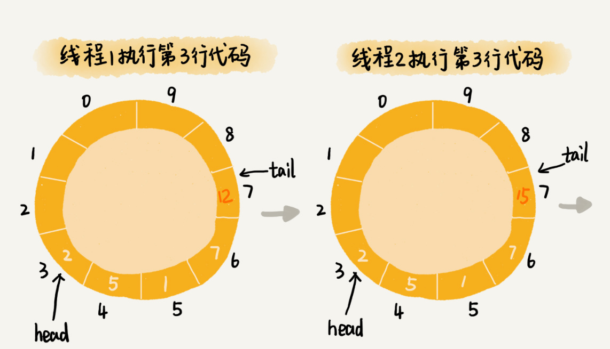

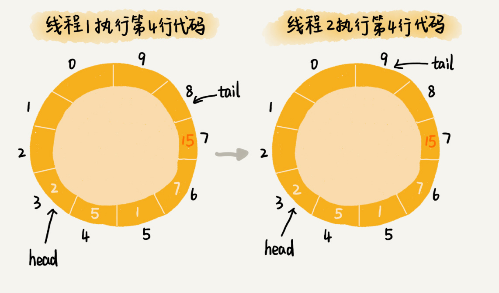

那如何解决这种线程并发往队列中添加数据时，导致的数据覆盖、运行不正确问题呢？

最简单的处理方法就是给这段代码加锁，同一时间只允许一个线程执行add()函数。这就相当于将这段代码的执行，由并行改成了串行，也就不存在我们刚刚说的问题了。

不过，天下没有免费的午餐，加锁将并行改成串行，必然导致多个生产者同时生产数据的时候，执行效率的下降。当然，我们可以继续优化代码，用CAS（compare and swap，比较并交换）操作等减少加锁的粒度，但是，这不是我们的重点。我们直接看Disruptor的处理方法。

### 基于无锁的并发“生产者-消费者模型”

尽管Disruptor的源码读起来很复杂，但是基本思想其实非常简单。实际上，它是换了一种队列和“生产者-消费者模型”的实现思路。

之前的实现思路中，队列只支持两个操作，添加数据和读取并移除数据，分别对应代码中的add()函数和poll()函数，而Disruptor采用了另一种实现思路。

对于生产者来说，它往队列中添加数据之前，先申请可用空闲存储单元，并且是批量地申请连续的n个（n≥1）存储单元。当申请到这组连续的存储单元之后，后续往队列中添加元素，就可以不用加锁了，因为这组存储单元是这个线程独享的。不过，从刚刚的描述中，我们可以看出，申请存储单元的过程是需要加锁的。

对于消费者来说，处理的过程跟生产者是类似的。它先去申请一批连续可读的存储单元（这个申请的过程也是需要加锁的），当申请到这批存储单元之后，后续的读取操作就可以不用加锁了。

不过，还有一个需要特别注意的地方，那就是，如果生产者A申请到了一组连续的存储单元，假设是下标为3到6的存储单元，生产者B紧跟着申请到了下标是7到9的存储单元，那在3到6没有完全写入数据之前，7到9的数据是无法读取的。这个也是Disruptor实现思路的一个弊端。

文字描述不好理解，我画了一个图，给你展示一下这个操作过程。

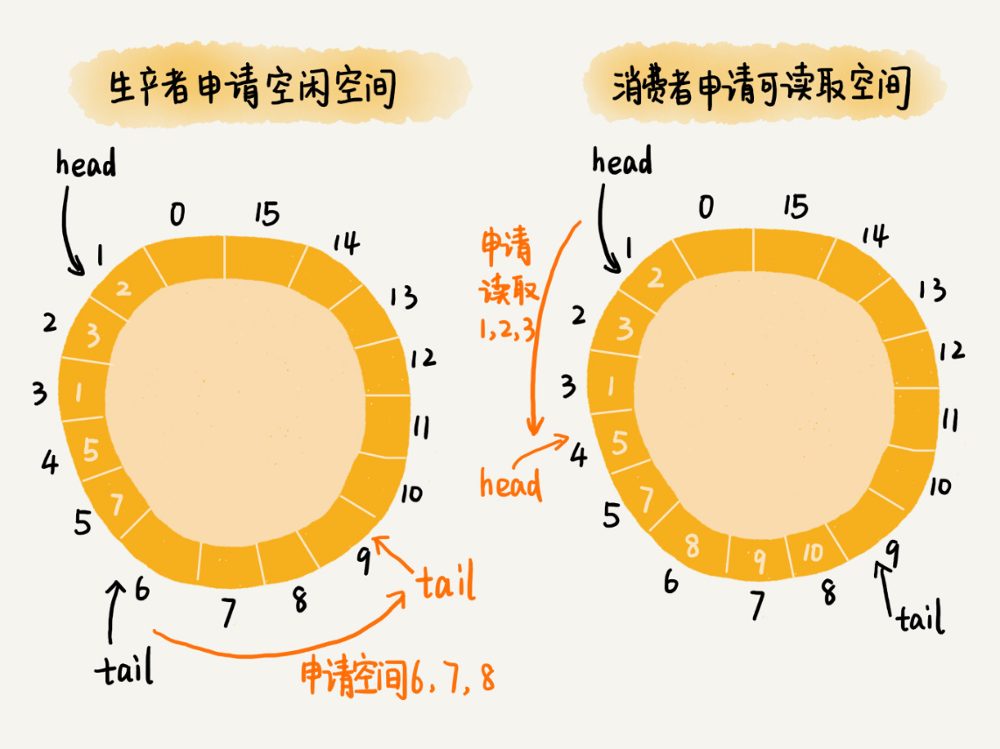

实际上，Disruptor采用的是RingBuffer和AvailableBuffer这两个结构，来实现我刚刚讲的功能。不过，因为我们主要聚焦在数据结构和算法上，所以我对这两种结构做了简化，但是基本思想是一致的。如果你对Disruptor感兴趣，可以去阅读一下它的[源码](https://github.com/LMAX-Exchange/disruptor)。

### 练习

#### 如何设计一个高性能、支持并发的、能够生成全局唯一ID的ID生成器呢？

雪花算法

## 算法实战（四）：剖析微服务接口鉴权限流背后的数据结构和算法

微服务是最近几年才兴起的概念。简单点讲，就是把复杂的大应用，解耦拆分成几个小的应用。这样做的好处有很多。比如，这样有利于团队组织架构的拆分，毕竟团队越大协作的难度越大；再比如，每个应用都可以独立运维，独立扩容，独立上线，各个应用之间互不影响。不用像原来那样，一个小功能上线，整个大应用都要重新发布。

不过，有利就有弊。大应用拆分成微服务之后，服务之间的调用关系变得更复杂，平台的整体复杂熵升高，出错的概率、debug问题的难度都高了好几个数量级。所以，为了解决这些问题，服务治理便成了微服务的一个技术重点。

所谓服务治理，简单点讲，就是管理微服务，保证平台整体正常、平稳地运行。服务治理涉及的内容比较多，比如鉴权、限流、降级、熔断、监控告警等等。这些服务治理功能的实现，底层依赖大量的数据结构和算法。

### 鉴权背景介绍

假设我们有一个微服务叫用户服务（User Service）。它提供很多用户相关的接口，比如获取用户信息、注册、登录等，给公司内部的其他应用使用。但是，并不是公司内部所有应用，都可以访问这个用户服务，也并不是每个有访问权限的应用，都可以访问用户服务的所有接口。

我举了一个例子给你讲解一下，你可以看我画的这幅图。这里面，只有A、B、C、D四个应用可以访问用户服务，并且，每个应用只能访问用户服务的部分接口。

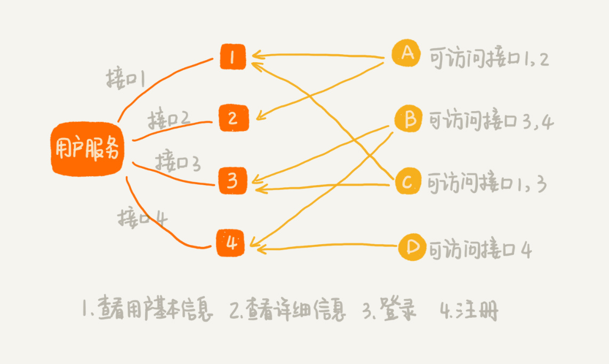

要实现接口鉴权功能，我们需要事先将应用对接口的访问权限规则设置好。当某个应用访问其中一个接口的时候，我们就可以拿应用的请求URL，在规则中进行匹配。如果匹配成功，就说明允许访问；如果没有可以匹配的规则，那就说明这个应用没有这个接口的访问权限，我们就拒绝服务。

### 如何实现快速鉴权？

接口的格式有很多，有类似Dubbo这样的RPC接口，也有类似Spring Cloud这样的HTTP接口。不同接口的鉴权实现方式是类似的，这里主要拿HTTP接口给你讲解。

鉴权的原理比较简单、好理解。那具体到实现层面，我们该用什么数据结构来存储规则呢？用户请求URL在规则中快速匹配，又该用什么样的算法呢？

实际上，不同的规则和匹配模式，对应的数据结构和匹配算法也是不一样的。

#### 1.如何实现精确匹配规则？

我们先来看最简单的一种匹配模式。只有当请求URL跟规则中配置的某个接口精确匹配时，这个请求才会被接受、处理。

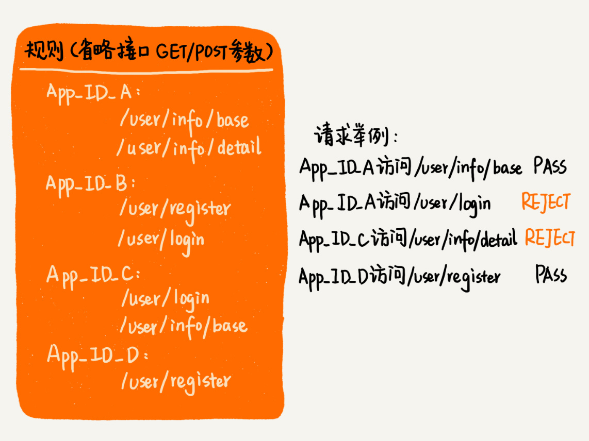

不同的应用对应不同的规则集合。我们可以采用散列表来存储这种对应关系。我这里着重讲下，每个应用对应的规则集合，该如何存储和匹配。

针对这种匹配模式，我们可以将每个应用对应的权限规则，存储在一个字符串数组中。当用户请求到来时，我们拿用户的请求URL，在这个字符串数组中逐一匹配，匹配的算法就是我们之前学过的字符串匹配算法（比如KMP、BM、BF等）。

规则不会经常变动，所以，为了加快匹配速度，我们可以按照字符串的大小给规则排序，把它组织成有序数组这种数据结构。当要查找某个URL能否匹配其中某条规则的时候，我们可以采用二分查找算法，在有序数组中进行匹配。

而二分查找算法的时间复杂度是O(logn)（n表示规则的个数），这比起时间复杂度是O(n)的顺序遍历快了很多。对于规则中接口长度比较长，并且鉴权功能调用量非常大的情况，这种优化方法带来的性能提升还是非常可观的 。

#### 2.如何实现前缀匹配规则？

我们再来看一种稍微复杂的匹配模式。只要某条规则可以匹配请求URL的前缀，我们就说这条规则能够跟这个请求URL匹配。同样，为了方便你理解这种匹配模式，我还是举一个例子说明一下。

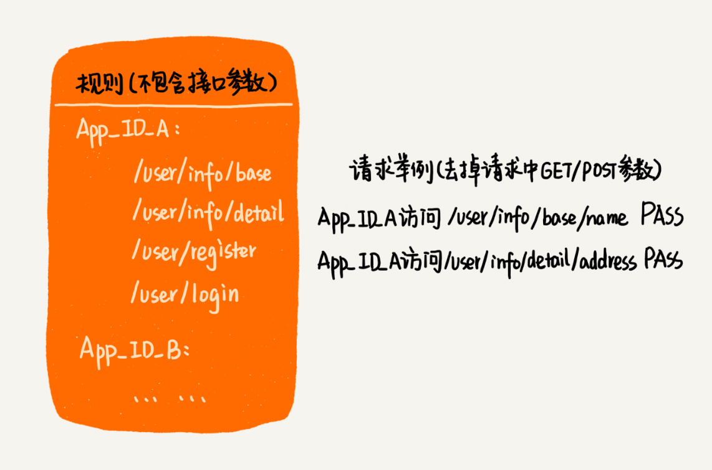

不同的应用对应不同的规则集合。我们采用散列表来存储这种对应关系。

Trie树非常适合用来做前缀匹配。所以，针对这个需求，我们可以将每个用户的规则集合，组织成Trie树这种数据结构。

不过，Trie树中的每个节点不是存储单个字符，而是存储接口被“/”分割之后的子目录（比如“/user/name”被分割为“user”“name”两个子目录）。因为规则并不会经常变动，所以，在Trie树中，我们可以把每个节点的子节点们，组织成有序数组这种数据结构。当在匹配的过程中，我们可以利用二分查找算法，决定从一个节点应该跳到哪一个子节点。

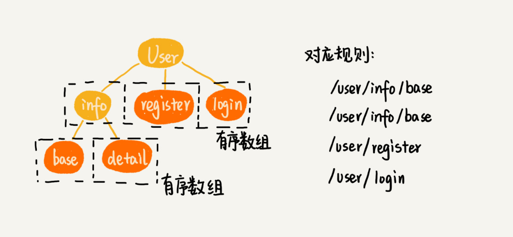

#### 3.如何实现模糊匹配规则？

如果我们的规则更加复杂，规则中包含通配符，比如“**”表示匹配任意多个子目录，“*”表示匹配任意一个子目录。只要用户请求URL可以跟某条规则模糊匹配，我们就说这条规则适用于这个请求。为了方便你理解，我举一个例子来解释一下。


不同的应用对应不同的规则集合。我们还是采用散列表来存储这种对应关系。这点我们刚才讲过了，这里不再重复说了。我们着重看下，每个用户对应的规则集合，该用什么数据结构来存储？针对这种包含通配符的模糊匹配，我们又该使用什么算法来实现呢？

我们采用回溯算法，拿请求URL跟每条规则逐一进行模糊匹配。

不过，这个解决思路的时间复杂度是非常高的。我们需要拿每一个规则，跟请求URL匹配一遍。那有没有办法可以继续优化一下呢？

实际上，我们可以结合实际情况，挖掘出这样一个隐形的条件，那就是，并不是每条规则都包含通配符，包含通配符的只是少数。于是，我们可以把不包含通配符的规则和包含通配符的规则分开处理。

我们把不包含通配符的规则，组织成有序数组或者Trie树（具体组织成什么结构，视具体的需求而定，是精确匹配，就组织成有序数组，是前缀匹配，就组织成Trie树），而这一部分匹配就会非常高效。剩下的是少数包含通配符的规则，我们只要把它们简单存储在一个数组中就可以了。尽管匹配起来会比较慢，但是毕竟这种规则比较少，所以这种方法也是可以接受的。

当接收到一个请求URL之后，我们可以先在不包含通配符的有序数组或者Trie树中查找。如果能够匹配，就不需要继续在通配符规则中匹配了；如果不能匹配，就继续在通配符规则中查找匹配。

### 限流背景介绍

讲完了鉴权的实现思路，我们再来看一下限流。

所谓限流，顾名思义，就是对接口调用的频率进行限制。比如每秒钟不能超过100次调用，超过之后，我们就拒绝服务。限流的原理听起来非常简单，但它在很多场景中，发挥着重要的作用。比如在秒杀、大促、双11、618等场景中，限流已经成为了保证系统平稳运行的一种标配的技术解决方案。

按照不同的限流粒度，限流可以分为很多种类型。比如给每个接口限制不同的访问频率，或者给所有接口限制总的访问频率，又或者更细粒度地限制某个应用对某个接口的访问频率等等。

不同粒度的限流功能的实现思路都差不多，所以，今天主要针对限制所有接口总的访问频率这样一个限流需求来讲解。

### 如何实现精准限流？

最简单的限流算法叫**固定时间窗口限流算法**。这种算法是如何工作的呢？首先我们需要选定一个时间起点，之后每当有接口请求到来，我们就将计数器加一。如果在当前时间窗口内，根据限流规则（比如每秒钟最大允许100次访问请求），出现累加访问次数超过限流值的情况时，我们就拒绝后续的访问请求。当进入下一个时间窗口之后，计数器就清零重新计数。

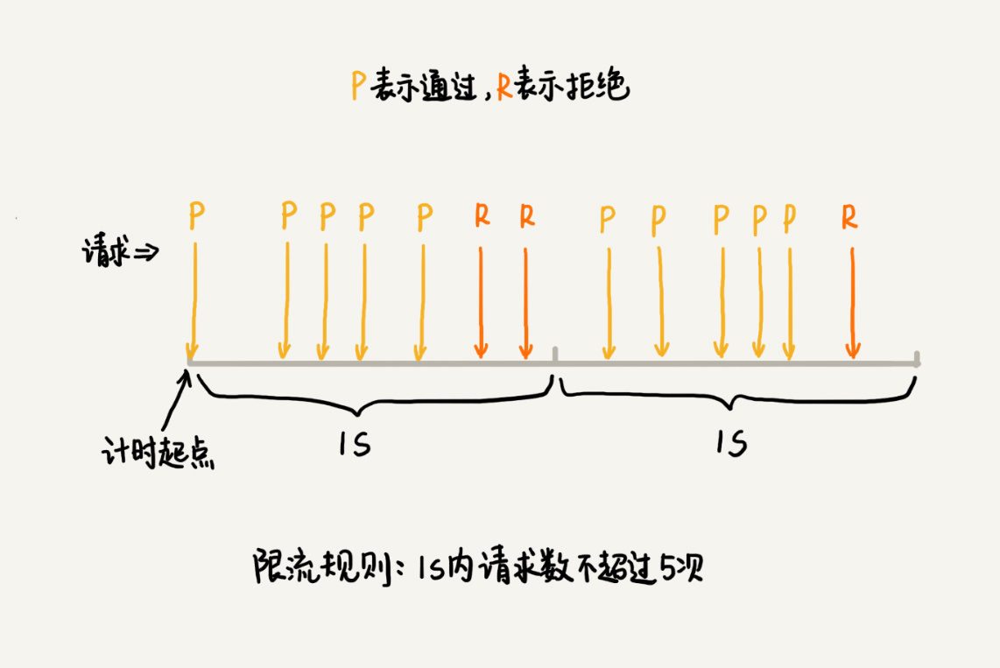

这种基于固定时间窗口的限流算法的缺点是，限流策略过于粗略，无法应对两个时间窗口临界时间内的突发流量。这是怎么回事呢？我举一个例子给你解释一下。

假设我们的限流规则是，每秒钟不能超过100次接口请求。第一个1s时间窗口内，100次接口请求都集中在最后10ms内。在第二个1s的时间窗口内，100次接口请求都集中在最开始的10ms内。虽然两个时间窗口内流量都符合限流要求（≤100个请求），但在两个时间窗口临界的20ms内，会集中有200次接口请求。固定时间窗口限流算法并不能对这种情况做限制，所以，集中在这20ms内的200次请求就有可能压垮系统。

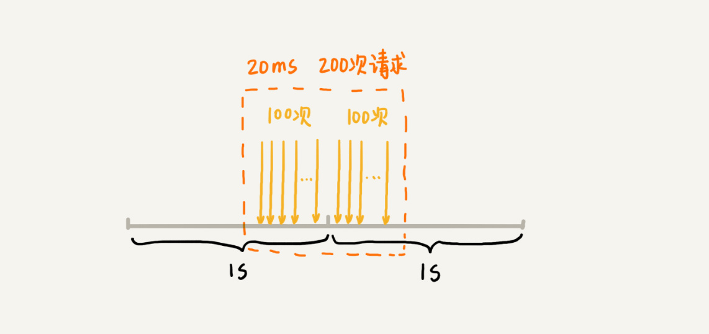

为了解决这个问题，我们可以对固定时间窗口限流算法稍加改造。我们可以限制任意时间窗口（比如1s）内，接口请求数都不能超过某个阈值（ 比如100次）。因此，相对于固定时间窗口限流算法，这个算法叫**滑动时间窗口限流算法**。

流量经过滑动时间窗口限流算法整形之后，可以保证任意一个1s的时间窗口内，都不会超过最大允许的限流值，从流量曲线上来看会更加平滑。那具体到实现层面，我们该如何来做呢？

我们假设限流的规则是，在任意1s内，接口的请求次数都不能大于K次。我们就维护一个大小为K+1的循环队列，用来记录1s内到来的请求。注意，这里循环队列的大小等于限流次数加一，因为循环队列存储数据时会浪费一个存储单元。

当有新的请求到来时，我们将与这个新请求的时间间隔超过1s的请求，从队列中删除。然后，我们再来看循环队列中是否有空闲位置。如果有，则把新请求存储在队列尾部（tail指针所指的位置）；如果没有，则说明这1秒内的请求次数已经超过了限流值K，所以这个请求被拒绝服务。

为了方便你理解，我举一个例子，给你解释一下。在这个例子中，我们假设限流的规则是，任意1s内，接口的请求次数都不能大于6次。

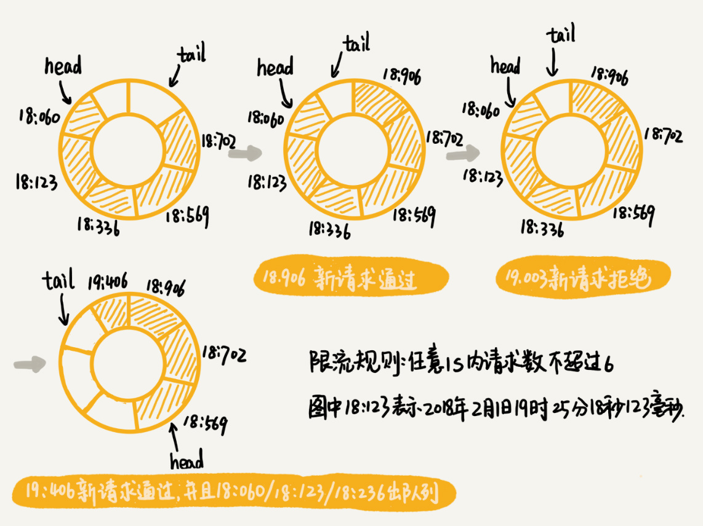

即便滑动时间窗口限流算法可以保证任意时间窗口内，接口请求次数都不会超过最大限流值，但是仍然不能防止，在细时间粒度上访问过于集中的问题。

比如我刚刚举的那个例子，第一个1s的时间窗口内，100次请求都集中在最后10ms中，也就是说，基于时间窗口的限流算法，不管是固定时间窗口还是滑动时间窗口，只能在选定的时间粒度上限流，对选定时间粒度内的更加细粒度的访问频率不做限制。

实际上，针对这个问题，还有很多更加平滑的限流算法，比如令牌桶算法、漏桶算法等。

## 算法实战（五）：如何用学过的数据结构和算法实现一个短网址系统

短网址服务你用过吗？如果我们在微博里发布一条带网址的信息，微博会把里面的网址转化成一个更短的网址。我们只要访问这个短网址，就相当于访问原始的网址。比如下面这两个网址，尽管长度不同，但是都可以跳转到我的一个GitHub开源项目里。其中，第二个网址就是通过新浪提供的短网址服务生成的。

```
原始网址：https://github.com/wangzheng0822/ratelimiter4j
短网址：http://t.cn/EtR9QEG
```

### 短网址服务整体介绍

刚刚我们讲了，短网址服务的一个核心功能，就是把原始的长网址转化成短网址。除了这个功能之外，短网址服务还有另外一个必不可少的功能。那就是，当用户点击短网址的时候，短网址服务会将浏览器重定向为原始网址。这个过程是如何实现的呢？


从图中我们可以看出，浏览器会先访问短网址服务，通过短网址获取到原始网址，再通过原始网址访问到页面。不过这部分功能并不是我们今天要讲的重点。我们重点来看，如何将长网址转化成短网址？

### 如何通过哈希算法生成短网址？

我们前面学过哈希算法。哈希算法可以将一个不管多长的字符串，转化成一个长度固定的哈希值。我们可以利用哈希算法，来生成短网址。

前面我们已经提过一些哈希算法了，比如MD5、SHA等。但是，实际上，我们并不需要这些复杂的哈希算法。在生成短网址这个问题上，毕竟，我们不需要考虑反向解密的难度，所以我们只需要关心哈希算法的计算速度和冲突概率。

能够满足这样要求的哈希算法有很多，其中比较著名并且应用广泛的一个哈希算法，那就是MurmurHash算法。尽管这个哈希算法在2008年才被发明出来，但现在它已经广泛应用到Redis、MemCache、Cassandra、HBase、Lucene等众多著名的软件中。

MurmurHash算法提供了两种长度的哈希值，一种是32bits，一种是128bits。为了让最终生成的短网址尽可能短，我们可以选择32bits的哈希值。对于开头那个GitHub网址，经过MurmurHash计算后，得到的哈希值就是181338494。我们再拼上短网址服务的域名，就变成了最终的短网址http://t.cn/181338494（其中，[http://t.cn](http://t.cn/) 是短网址服务的域名）。

#### 1.如何让短网址更短？

不过，你可能已经看出来了，通过MurmurHash算法得到的短网址还是很长啊，而且跟我们开头那个网址的格式好像也不一样。别着急，我们只需要稍微改变一个哈希值的表示方法，就可以轻松把短网址变得更短些。

我们可以将10进制的哈希值，转化成更高进制的哈希值，这样哈希值就变短了。我们知道，16进制中，我们用A～E，来表示10～15。在网址URL中，常用的合法字符有0～9、a～z、A～Z这样62个字符。为了让哈希值表示起来尽可能短，我们可以将10进制的哈希值转化成62进制。具体的计算过程，我写在这里了。最终用62进制表示的短网址就是[http://t.cn/cgSqq](http://t.cn/cgSqq。)。


#### 2.如何解决哈希冲突问题？

不过，我们前面讲过，哈希算法无法避免的一个问题，就是哈希冲突。尽管MurmurHash算法，冲突的概率非常低。但是，一旦冲突，就会导致两个原始网址被转化成同一个短网址。当用户访问短网址的时候，我们就无从判断，用户想要访问的是哪一个原始网址了。这个问题该如何解决呢？

一般情况下，我们会保存短网址跟原始网址之间的对应关系，以便后续用户在访问短网址的时候，可以根据对应关系，查找到原始网址。存储这种对应关系的方式有很多，比如我们自己设计存储系统或者利用现成的数据库。前面我们讲到的数据库有MySQL、Redis。我们就拿MySQL来举例。假设短网址与原始网址之间的对应关系，就存储在MySQL数据库中。

当有一个新的原始网址需要生成短网址的时候，我们先利用MurmurHash算法，生成短网址。然后，我们拿这个新生成的短网址，在MySQL数据库中查找。

如果没有找到相同的短网址，这也就表明，这个新生成的短网址没有冲突。于是我们就将这个短网址返回给用户（请求生成短网址的用户），然后将这个短网址与原始网址之间的对应关系，存储到MySQL数据库中。

如果我们在数据库中，找到了相同的短网址，那也并不一定说明就冲突了。我们从数据库中，将这个短网址对应的原始网址也取出来。如果数据库中的原始网址，跟我们现在正在处理的原始网址是一样的，这就说明已经有人请求过这个原始网址的短网址了。我们就可以拿这个短网址直接用。如果数据库中记录的原始网址，跟我们正在处理的原始网址不一样，那就说明哈希算法发生了冲突。不同的原始网址，经过计算，得到的短网址重复了。这个时候，我们该怎么办呢？

我们可以给原始网址拼接一串特殊字符，比如“[DUPLICATED]”，然后跟再重新计算哈希值，两次哈希计算都冲突的概率，显然是非常低的。假设出现非常极端的情况，又发生冲突了，我们可以再换一个拼接字符串，比如“[OHMYGOD]”，再计算哈希值。然后把计算得到的哈希值，跟原始网址拼接了特殊字符串之后的文本，一并存储在MySQL数据库中。

当用户访问短网址的时候，短网址服务先通过短网址，在数据库中查找到对应的原始网址。如果原始网址有拼接特殊字符（这个很容易通过字符串匹配算法找到），我们就先将特殊字符去掉，然后再将不包含特殊字符的原始网址返回给浏览器。

#### 3.如何优化哈希算法生成短网址的性能？

为了判断生成的短网址是否冲突，我们需要拿生成的短网址，在数据库中查找。如果数据库中存储的数据非常多，那查找起来就会非常慢，势必影响短网址服务的性能。那有没有什么优化的手段呢？

还记得我们之前讲的MySQL数据库索引吗？我们可以给短网址字段添加B+树索引。这样通过短网址查询原始网址的速度就提高了很多。实际上，在真实的软件开发中，我们还可以通过一个小技巧，来进一步提高速度。

在短网址生成的过程中，我们会跟数据库打两次交道，也就是会执行两条SQL语句。第一个SQL语句是通过短网址查询短网址与原始网址的对应关系，第二个SQL语句是将新生成的短网址和原始网址之间的对应关系存储到数据库。

我们知道，一般情况下，数据库和应用服务（只做计算不存储数据的业务逻辑部分）会部署在两个独立的服务器或者虚拟服务器上。那两条SQL语句的执行就需要两次网络通信。这种IO通信耗时以及SQL语句的执行，才是整个短网址服务的性能瓶颈所在。所以，为了提高性能，我们需要尽量减少SQL语句。那又该如何减少SQL语句呢？

我们可以给数据库中的短网址字段，添加一个唯一索引（不止是索引，还要求表中不能有重复的数据）。当有新的原始网址需要生成短网址的时候，我们并不会先拿生成的短网址，在数据库中查找判重，而是直接将生成的短网址与对应的原始网址，尝试存储到数据库中。如果数据库能够将数据正常写入，那说明并没有违反唯一索引，也就是说，这个新生成的短网址并没有冲突。

当然，如果数据库反馈违反唯一性索引异常，那我们还得重新执行刚刚讲过的“查询、写入”过程，SQL语句执行的次数不减反增。但是，在大部分情况下，我们把新生成的短网址和对应的原始网址，插入到数据库的时候，并不会出现冲突。所以，大部分情况下，我们只需要执行一条写入的SQL语句就可以了。所以，从整体上看，总的SQL语句执行次数会大大减少。

实际上，我们还有另外一个优化SQL语句次数的方法，那就是借助布隆过滤器。

我们把已经生成的短网址，构建成布隆过滤器。我们知道，布隆过滤器是比较节省内存的一种存储结构，长度是10亿的布隆过滤器，也只需要125MB左右的内存空间。

当有新的短网址生成的时候，我们先拿这个新生成的短网址，在布隆过滤器中查找。如果查找的结果是不存在，那就说明这个新生成的短网址并没有冲突。这个时候，我们只需要再执行写入短网址和对应原始网页的SQL语句就可以了。通过先查询布隆过滤器，总的SQL语句的执行次数减少了。

到此，利用哈希算法来生成短网址的思路，我就讲完了。实际上，这种解决思路已经完全满足需求了，我们已经可以直接用到真实的软件开发中。不过，我们还有另外一种短网址的生成算法，那就是利用自增的ID生成器来生成短网址。我们接下来就看一下，这种算法是如何工作的？对于哈希算法生成短网址来说，它又有什么优势和劣势？

### 如何通过ID生成器生成短网址？

我们可以维护一个ID自增生成器。它可以生成1、2、3…这样自增的整数ID。当短网址服务接收到一个原始网址转化成短网址的请求之后，它先从ID生成器中取一个号码，然后将其转化成62进制表示法，拼接到短网址服务的域名（比如http://t.cn/）后面，就形成了最终的短网址。最后，我们还是会把生成的短网址和对应的原始网址存储到数据库中。

#### 1.相同的原始网址可能会对应不同的短网址

每次新来一个原始网址，我们就生成一个新的短网址，这种做法就会导致两个相同的原始网址生成了不同的短网址。这个该如何处理呢？实际上，我们有两种处理思路。

第一种处理思路是**不做处理**。听起来有点无厘头，我稍微解释下你就明白了。实际上，相同的原始网址对应不同的短网址，这个用户是可以接受的。在大部分短网址的应用场景里，用户只关心短网址能否正确地跳转到原始网址。至于短网址长什么样子，他其实根本就不关心。所以，即便是同一个原始网址，两次生成的短网址不一样，也并不会影响到用户的使用。

第二种处理思路是**借助哈希算法生成短网址的处理思想，**当要给一个原始网址生成短网址的时候，我们要先拿原始网址在数据库中查找，看数据库中是否已经存在相同的原始网址了。如果数据库中存在，那我们就取出对应的短网址，直接返回给用户。

不过，这种处理思路有个问题，我们需要给数据库中的短网址和原始网址这两个字段，都添加索引。短网址上加索引是为了提高用户查询短网址对应的原始网页的速度，原始网址上加索引是为了加快刚刚讲的通过原始网址查询短网址的速度。这种解决思路虽然能满足“相同原始网址对应相同短网址”这样一个需求，但是是有代价的：一方面两个索引会占用更多的存储空间，另一方面索引还会导致插入、删除等操作性能的下降。

#### 2.如何实现高性能的ID生成器？

实现ID生成器的方法有很多，比如利用数据库自增字段。当然我们也可以自己维护一个计数器，不停地加一加一。但是，一个计数器来应对频繁的短网址生成请求，显然是有点吃力的（因为计数器必须保证生成的ID不重复，笼统概念上讲，就是需要加锁）。如何提高ID生成器的性能呢？关于这个问题，实际上，有很多解决思路。我这里给出两种思路。

第一种思路可以给ID生成器装多个前置发号器。我们批量地给每个前置发号器发送ID号码。当我们接受到短网址生成请求的时候，就选择一个前置发号器来取号码。这样通过多个前置发号器，明显提高了并发发号的能力。


第二种思路跟第一种差不多。不过，我们不再使用一个ID生成器和多个前置发号器这样的架构，而是，直接实现多个ID生成器同时服务。为了保证每个ID生成器生成的ID不重复。我们要求每个ID生成器按照一定的规则，来生成ID号码。比如，第一个ID生成器只能生成尾号为0的，第二个只能生成尾号为1的，以此类推。这样通过多个ID生成器同时工作，也提高了ID生成的效率。

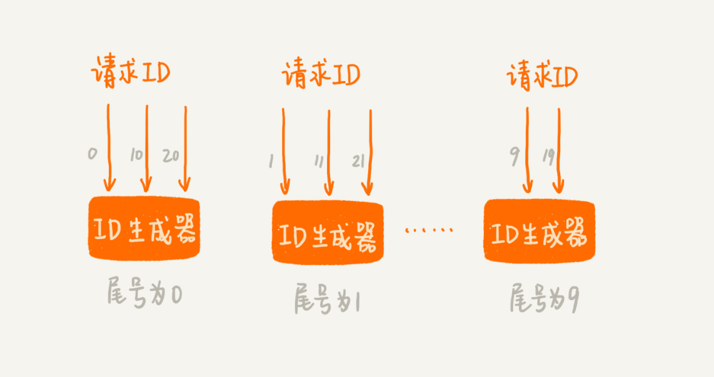


### 练习

#### 如果我们还要额外支持用户自定义短网址功能（http//t.cn/{用户自定部分}），我们又该如何改造刚刚的算法呢?

首先查询“用户自定义部分”是否与已经生成的短网址冲突，如果冲突，只能提示用户进行修改。如果不冲突，将“用户自定义部分”和对应的原始网址写入数据库即可。

#### 我们在讲通过ID生成器生成短网址这种实现思路的时候，讲到相同的原始网址可能会对应不同的短网址。针对这个问题，其中一个解决思路就是，不做处理。但是，如果每个请求都生成一个短网址，并且存储在数据库中，那这样会不会撑爆数据库呢？我们又该如何解决呢？

给原始网址加唯一索引。如果写入异常，说明原始网址已经存在，再根据原始网址查询一次，取出短网址返回给用户。